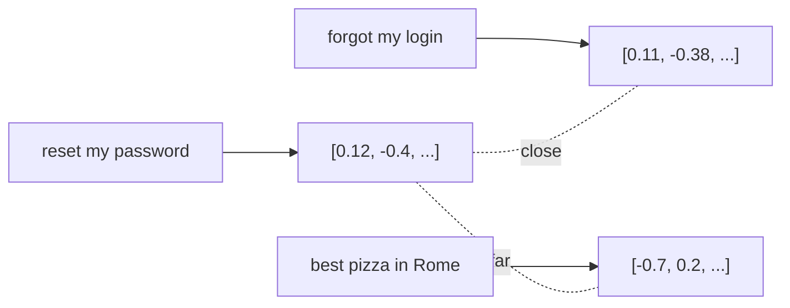

<LevelBadge level="intermediate" />

Un **embedding** trasforma un pezzo di testo in una lista di numeri (un **vettore**) che ne cattura il *significato*. Testi con significato simile ottengono vettori vicini tra loro — anche se non condividono alcuna parola. È questo il trucco dietro la **ricerca semantica** e il [RAG](/docs/foundations/rag).

## L'intuizione

Immagina ogni frase posizionata come un punto in un enorme spazio multidimensionale, disposto in modo che **i significati simili stiano vicini tra loro**. "Come reimposto la mia password?" finisce vicino a "Ho dimenticato il mio login", lontano da "la migliore pizza di Roma".

## Ricerca semantica vs per parole chiave

- **La ricerca per parole chiave** corrisponde alle parole letterali ("password" trova "password").
- **La ricerca semantica** corrisponde al *significato* — "non riesco ad accedere" trova il documento sul reset della password anche senza la parola "password".

I risultati migliori spesso **combinano** entrambe (ricerca ibrida).

## Come funziona una ricerca vettoriale

1. **Crea l'embedding** dei tuoi documenti (di solito suddivisi in **chunk**) e memorizza i vettori in un **database vettoriale**.
2. Al momento della query, **crea l'embedding della query**.
3. Trova i vettori **più vicini** (per similarità/distanza del coseno).
4. Restituisci quei chunk — tipicamente per darli in pasto al [RAG](/docs/foundations/rag).

## Note pratiche

- **Il chunking conta.** Troppo grandi = corrispondenze rumorose; troppo piccoli = contesto perso. Calibralo.
- **Usa un solo modello di embedding in modo coerente** — i vettori di modelli diversi non sono confrontabili.
- **Metadati + filtri** (data, fonte, tipo) rendono il recupero molto più preciso.
- Un database vettoriale non è sempre necessario — per corpora piccoli, una semplice ricerca in memoria va bene.

## Prossimi passi

- [Retrieval-Augmented Generation (RAG)](/docs/foundations/rag)
- [Fine-tuning vs Prompting vs RAG](/docs/foundations/finetune-vs-prompt-vs-rag)
- [Allucinazioni e come ridurle](/docs/foundations/hallucinations)
