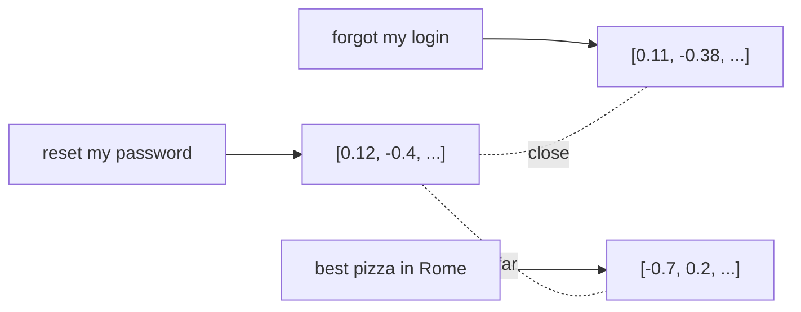

<LevelBadge level="intermediate" />

Un **embedding** trasforma un testo in un elenco di numeri (un **vettore**) che ne cattura il *significato*. Testi con significato simile ottengono vettori vicini fra loro — anche se non condividono alcuna parola. È il trucco dietro la **ricerca semantica** e la [RAG](/docs/foundations/rag).

<Callout type="objectives" items={[
  "Immaginare un embedding come un punto in uno spazio organizzato in modo che i significati simili stiano vicini",
  "Distinguere la ricerca per parole chiave da quella semantica — e capire perché di solito vince la ricerca ibrida",
  "Percorrere i quattro passi di una ricerca vettoriale, dal chunking alla ricerca del vicino più prossimo",
  "Evitare i tre errori che rovinano in silenzio la qualità del recupero: chunk di dimensione sbagliata, modelli di embedding mescolati e assenza di filtri sui metadati",
  "Decidere quando serve davvero un database vettoriale e quando no"
]} />

## L'intuizione

Immagina ogni frase collocata come un punto in un enorme spazio multidimensionale, disposto in modo che **i significati simili stiano vicini**. "Come reimposto la password?" finisce vicino a "Ho dimenticato il mio login", e lontano da "la migliore pizza a Roma".

```mermaid
flowchart LR
  T1[reset my password] --> V1["[0.12, -0.4, ...]"]
  T2[forgot my login] --> V2["[0.11, -0.38, ...]"]
  T3[best pizza in Rome] --> V3["[-0.7, 0.2, ...]"]
  V1 -. close .- V2
  V1 -. far .- V3
```

## Ricerca semantica vs per parole chiave

- La **ricerca per parole chiave** cerca corrispondenze con le parole letterali ("password" trova "password").
- La **ricerca semantica** cerca corrispondenze di *significato* — "non riesco ad accedere" trova il documento di reset della password anche senza la parola "password".

I risultati migliori spesso **combinano** le due (ricerca ibrida).

## Come funziona una ricerca vettoriale

<Steps items={[
  {
    "title": "Fai l'embedding dei documenti e salva i vettori",
    "body": "Prima dividi ogni documento in chunk, poi calcola l'embedding di ciascun chunk e salva i vettori in un database vettoriale. È il passo che fai una volta sola, in anticipo."
  },
  {
    "title": "Fai l'embedding della query",
    "body": "Al momento della query, passa la domanda dell'utente nello stesso modello di embedding, così finisce nello stesso spazio dei tuoi chunk."
  },
  {
    "title": "Trova i vettori più vicini",
    "body": "Confronta il vettore della query con quelli salvati tramite similarità del coseno o distanza, e tieni le corrispondenze più vicine."
  },
  {
    "title": "Restituisci quei chunk",
    "body": "Tipicamente per alimentare una RAG, dove il testo recuperato diventa contesto per la risposta del modello."
  }
]} />

## Note pratiche

- **Il chunking conta.** Troppo grandi = corrispondenze rumorose; troppo piccoli = contesto perso. Calibralo.
- **Usa un solo modello di embedding in modo coerente** — i vettori di modelli diversi non sono confrontabili.
- **Metadati + filtri** (data, fonte, tipo) rendono il recupero molto più preciso.
- Un database vettoriale non serve sempre — per corpus piccoli basta una semplice ricerca in memoria.

<Flashcards cards={[
  { "front": "Embedding", "back": "Un elenco di numeri (un vettore) che rappresenta il significato di un testo. Significati simili ottengono vettori vicini, anche quando i testi non condividono alcuna parola." },
  { "front": "Vettore", "back": "L'elenco di numeri prodotto da un embedding — un punto in un enorme spazio multidimensionale, organizzato in modo che la vicinanza significhi significato simile." },
  { "front": "Ricerca per parole chiave vs ricerca semantica", "back": "La ricerca per parole chiave cerca le parole letterali: \"password\" trova \"password\". La ricerca semantica cerca il significato: \"non riesco ad accedere\" trova il documento di reset della password senza la parola \"password\"." },
  { "front": "Ricerca ibrida", "back": "Combinare ricerca per parole chiave e ricerca semantica. I risultati migliori spesso arrivano da entrambe insieme, più che da una sola." },
  { "front": "Chunk", "back": "L'unità in cui un documento viene diviso prima dell'embedding. Troppo grande dà corrispondenze rumorose; troppo piccolo perde contesto. È un parametro da calibrare, non un valore predefinito da accettare." },
  { "front": "Database vettoriale", "back": "Dove vengono salvati i chunk con embedding, così da cercare i vettori più vicini al momento della query. Non sempre serve — per un corpus piccolo basta una semplice ricerca in memoria." },
  { "front": "Similarità / distanza del coseno", "back": "La misura usata per trovare i vettori più vicini al vettore della query — passo 3 di una ricerca vettoriale." },
  { "front": "Perché non si mescolano i modelli di embedding", "back": "I vettori di modelli diversi non sono confrontabili. Fai l'embedding di documenti e query con lo stesso modello, in modo coerente." },
  { "front": "Metadati + filtri", "back": "Attributi come data, fonte e tipo salvati accanto a ciascun vettore. Filtrare su di essi rende il recupero molto più preciso della sola similarità." }
]} />

<Quiz questions={[
  {
    "q": "Un utente cerca \"non riesco ad accedere\" e riceve il documento di reset della password, che non usa mai le parole \"accedere\". Cosa ha reso possibile il risultato?",
    "options": [
      "La ricerca per parole chiave che trova corrispondenze con le parole letterali",
      "La ricerca semantica che confronta il significato anziché le parole",
      "Un filtro sui metadati per tipo di documento",
      "Una dimensione di chunk maggiore"
    ],
    "answer": 1,
    "explain": "La ricerca per parole chiave cerca le parole letterali, quindi \"accedere\" non troverebbe un documento che non lo dice mai. La ricerca semantica confronta il significato: entrambi i testi hanno embedding vicini. I risultati migliori spesso combinano le due — ricerca ibrida."
  },
  {
    "q": "Rifai l'embedding dei documenti con un modello più recente ma lasci intatto il percorso delle query. Cosa si rompe?",
    "options": [
      "Niente — gli embedding sono un formato standard",
      "Solo il chunking, che va rifatto",
      "La qualità del recupero, perché i vettori di modelli diversi non sono confrontabili",
      "Solo i filtri sui metadati"
    ],
    "answer": 2,
    "explain": "I vettori di modelli diversi non sono confrontabili — vivono in spazi diversi. Documenti e query vanno trattati con lo stesso modello in modo coerente, il che significa rifare l'embedding di entrambi quando cambi modello."
  },
  {
    "q": "I chunk recuperati sono pertinenti per argomento ma continuano a mancare il dettaglio necessario alla risposta. Quale parametro è il primo sospettato?",
    "options": [
      "La dimensione del chunk — troppo piccola, quindi si è perso contesto",
      "Il fornitore del database vettoriale",
      "La similarità del coseno, che andrebbe sostituita con la corrispondenza per parole chiave",
      "Il numero di dimensioni dell'embedding"
    ],
    "answer": 0,
    "explain": "Il chunking è la leva: troppo grande dà corrispondenze rumorose, troppo piccolo perde il contesto circostante da cui dipendeva la risposta. Risultati pertinenti ma incompleti indicano chunk tagliati troppo fini."
  }
]} />

<Callout type="takeaways" items={[
  "Un embedding è il significato come punto nello spazio — la vicinanza indica significato simile, non parole condivise.",
  "La ricerca semantica trova ciò che la ricerca per parole chiave perde, ma di solito la ricerca ibrida batte entrambe.",
  "Quattro passi: embedding e salvataggio dei chunk, embedding della query, ricerca dei vettori più vicini, restituzione dei chunk.",
  "Un solo modello di embedding, usato in modo coerente su entrambi i lati. I vettori di modelli diversi non sono confrontabili.",
  "Dimensione dei chunk e filtri sui metadati fanno più per la qualità del recupero della scelta del database vettoriale.",
  "Per un corpus piccolo basta una semplice ricerca in memoria — un database vettoriale non è un requisito."
]} />

## Prossimi passi

- [Retrieval-Augmented Generation (RAG)](/docs/foundations/rag)
- [Fine-tuning vs Prompting vs RAG](/docs/foundations/finetune-vs-prompt-vs-rag)
- [Hallucinations & How to Reduce Them](/docs/foundations/hallucinations)
