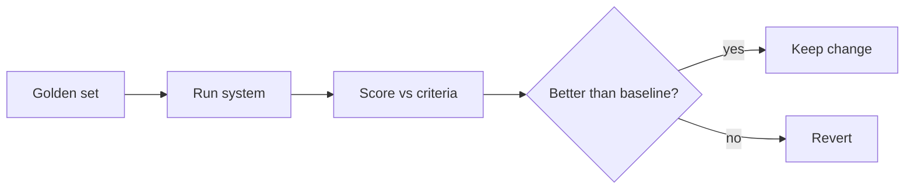

<LevelBadge level="advanced" />

Se rilasci qualcosa costruito sull'AI, gli **evals** sono il modo per sapere che funziona — e per sapere se una modifica l'ha migliorato, non peggiorato. Senza di essi voli alla cieca: una modifica al prompt che aiuta un caso può romperne in silenzio altri dieci.

## L'eval minimo indispensabile

Non serve un framework per iniziare:

1. **Raccogli un golden set.** 20–100 input reali con gli output *corretti* o *accettabili* (o criteri chiari). Copri i casi facili, quelli complicati e i casi limite che ti hanno colpito.
2. **Definisci cosa significa "buono"** per ogni task — corrispondenza esatta, contiene i fatti chiave, schema JSON valido, nessun numero allucinato, tono, ecc.
3. **Esegui e assegna un punteggio** alla tua configurazione attuale rispetto al set.
4. **Cambia una cosa** (prompt, modello, recupero), riesegui, **confronta**. Mantieni la modifica solo se il punteggio migliora.

## Scegliere le metriche

- **Controlli deterministici** dove possibile: schema valido? contiene il valore giusto? il codice supera i test? Sono economici e affidabili.
- **LLM come giudice** per la qualità sfumata (utilità, tono): fai valutare gli output a un modello rispetto a una rubrica. Utile ma **calibralo** — i giudici hanno bias (lunghezza, posizione). Convalida il giudice rispetto a valutazioni umane su un campione.
- **Revisione umana** per la fascia a maggiore rischio.

## Quando eseguirli

- **Prima/dopo qualsiasi modifica al prompt o al modello.**
- **In caso di migrazione del modello** — un nuovo modello può cambiare il comportamento ([Errori e migrazione](/docs/api/errors-and-rate-limits)).
- **In CI** per i sistemi in produzione, come gate.

:::tip Separa le fasi
Per il [RAG](/docs/foundations/rag) e gli [agenti](/docs/api/building-agents), valuta ogni fase (il recupero ha trovato il documento giusto? lo strumento è stato chiamato correttamente?) — non solo la risposta finale. Questo localizza i fallimenti.
:::

## Prossimi passi

- [Allucinazioni e come ridurle](/docs/foundations/hallucinations)
- [Costruire agenti sull'API](/docs/api/building-agents)
- [Scegliere un modello e un provider](/docs/foundations/choosing-a-model-provider)
