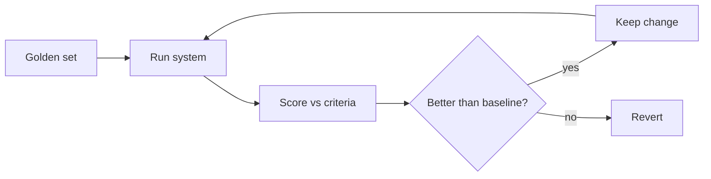

<LevelBadge level="advanced" />

<Callout type="objectives" items={[
  "Costruire la eval minima utile — un golden set di 20–100 input reali con criteri di superamento chiari",
  "Scegliere la metrica giusta per task: check deterministici, LLM-as-judge o revisione umana",
  "Far girare le eval come un gate — prima/dopo ogni modifica al prompt, cambio di modello, e in CI",
  "Punteggiare ogni stage (retrieval, chiamata tool, risposta finale), non solo l'ultimo, per localizzare le regressioni"
]} />

Se rilasci qualcosa costruito sull'AI, le **eval** sono il modo in cui sai che funziona — e il modo in cui sai che un cambiamento l'ha migliorato, non peggiorato. Senza vai alla cieca: un tweak del prompt che aiuta un caso può silenziosamente rompere altri dieci. Le eval trasformano l'iterazione "a naso" in un loop misurabile.

## La eval minima praticabile

Non ti serve un framework per iniziare. Tutto il loop sta in quattro passi:

<Steps items={[
  {title: "Colleziona un golden set", body: "20–100 input reali con gli output corretti o accettabili (o criteri chiari per cosa conta come pass). Copri i casi facili, quelli complicati e gli edge case che ti hanno già morso in produzione."},
  {title: "Definisci cosa vuol dire 'buono' per ogni task", body: "Match esatto? Contiene un fatto chiave specifico? JSON valido conforme al tuo schema? Nessun numero allucinato? Tono in linea col brand? Scrivi i criteri di pass — una riga per caso basta."},
  {title: "Fai girare e punteggia la baseline", body: "Fai girare il tuo setup attuale sul set e registra il punteggio. Questo ora è il numero da battere. Salvalo — il tuo io futuro ne avrà bisogno."},
  {title: "Cambia una cosa, ri-esegui, confronta", body: "Tweak del prompt, cambio modello, cambio retrieval — una variabile alla volta. Se il punteggio sale e niente regredisce, tieni il cambiamento. Altrimenti, revert. Questo è l'intero loop."}
]} />

```mermaid
flowchart LR
  G[Golden set] --> R[Run system]
  R --> S[Score vs criteria]
  S --> C{Better than baseline?}
  C -->|yes| K[Keep change]
  C -->|no| X[Revert]
  K --> R
```

## Scegliere le metriche

Non ogni domanda merita lo stesso test. Abbina la metrica al task:

| Tipo di task | Metrica | Costo | Affidabilità |
|---|---|---|---|
| Output strutturato (JSON, SQL) | Validazione dello schema, match esatto | Gratis | Alta |
| Generazione di codice | Fai girare i test che ha scritto | Basso | Alta |
| Estrazione (date, entità) | String contains / regex | Gratis | Alta |
| Classificazione | Accuracy, precision, recall | Gratis | Alta |
| Riassunti, draft, tono | LLM-as-judge con una rubrica | Moderato | Media — va calibrata |
| Scrittura ad alto rischio, sicurezza | Revisione umana su una fetta | Costoso | Massima |

Tre regole pratiche:

- **Check deterministici quando possibile.** Se la risposta è "JSON valido conforme a questo schema" o "il codice passa questi test", non chiederlo a un LLM — controllalo e basta.
- **LLM-as-judge per la qualità sfumata.** Utilità, tono, aderenza-alla-fonte. Economico, veloce, ma ha *bias* (lunghezza, posizione, self-preference). Valida il judge contro rating umani su un campione prima di fidarti dei suoi numeri.
- **Umani sulla fetta a rischio più alto.** Anche 10 casi gradati da umani per release batte 0.

<PromptCard title="Rubrica di partenza per LLM-as-judge">{`You are grading assistant responses against a source document.

For each response, output a JSON object with these fields:
- grounded: true if every factual claim is supported by the source, else false
- complete: true if the response answers all parts of the question, else false
- concise: true if the response contains no filler or repetition, else false
- overall_score: 1-5 (1 = unusable, 5 = ship it)
- reasoning: one sentence explaining the score

Do not consider length. Do not consider whether the response comes first or second.

<source>{{SOURCE}}</source>
<question>{{QUESTION}}</question>
<response>{{RESPONSE}}</response>

Return only the JSON, no preamble.`}</PromptCard>

## Quando farle girare

- **Prima/dopo ogni cambio di prompt o modello.** Senza eccezioni. Il punto del golden set è proprio intercettare il cambiamento che pensavi fosse sicuro.
- **Sulla migrazione di modello.** I nuovi modelli spostano il comportamento — a volte silenziosamente. Fai girare le eval prima di cambiare l'ID del modello. Vedi [Errori & Migrazione](/docs/api/errors-and-rate-limits).
- **In CI, per i sistemi in produzione.** Trasforma una eval verde in un merge gate. Le regressioni vengono intercettate prima che gli utenti le vedano.
- **Dopo ogni bug segnalato.** Aggiungi il caso fallito al golden set. Il set cresce insieme al sistema.

## Punteggia ogni stage, non solo la risposta finale

Per [RAG](/docs/foundations/rag) e [agenti](/docs/api/building-agents), un singolo punteggio "risposta finale" nasconde dove le cose si rompono. Punteggia ogni stage separatamente così le regressioni cadono in un solo posto:

| Stage | Cosa controllare |
|---|---|
| Retrieval | I top-k includevano il doc che contiene la risposta? |
| Selezione del tool | L'agente ha scelto il tool giusto per questo turno? |
| Argomenti del tool | Gli argomenti erano ben formati e corretti? |
| Risposta finale | Corrisponde ai criteri golden? |

Quando il punteggio del retrieval cala ma quello della risposta finale tiene, sai che è una regressione del retrieval — non un problema di prompt. Questo tipo di localizzazione è ciò che rende le eval davvero utili per il debug, non solo per il punteggio.

## Errori comuni

- **Gradare con lo stesso modello che ha generato la risposta.** Il bias di self-preference gonfia i punteggi. Usa un modello diverso — o meglio, una famiglia diversa — come judge.
- **Prompt di judge che rivelano la risposta "giusta".** Se il judge vede la risposta gold, troverà motivi per premiare chi le somiglia. Giudica sui criteri, non sulla somiglianza.
- **Golden set congelati al giorno uno.** Il set dovrebbe crescere ogni volta che la produzione ti sorprende. Un set stantio misura il passato.
- **Ottimizzare per la eval invece che per il task.** Se tuni i prompt su un set piccolo finché ogni caso passa, potresti aver fatto overfit. Tieni ~20% dei casi come slice di validazione che non guardi mai durante l'iterazione.

<Quiz title="Verifica te stesso" questions={[
  {q: "Qual è la eval minima praticabile?", options: ["Un modello fine-tuned sui tuoi dati", "Un golden set di 20–100 input reali con criteri di pass che puoi punteggiare", "Una dashboard che traccia latenza e costo"], answer: 1, explain: "20–100 input reali con una definizione chiara di 'buono' basta per iniziare. Non ti serve un framework — ti serve qualcosa che puoi punteggiare."},
  {q: "Quando dovresti preferire un check deterministico rispetto a LLM-as-judge?", options: ["Mai — i judge LLM sono più sfumati", "Quando il criterio di pass è oggettivo (schema valido, match esatto, test che passano)", "Solo quando non puoi permetterti un judge LLM"], answer: 1, explain: "Se puoi decidere pass/fail con codice, fallo — i check deterministici sono gratis, veloci e senza bias. Riserva LLM-as-judge per dimensioni di qualità genuinamente sfumate."},
  {q: "Per un agente RAG, perché punteggiare ogni stage separatamente?", options: ["Per soddisfare la compliance", "Così una regressione ti dice DOVE si è rotta (retrieval, tool o risposta finale)", "Per rendere la eval più lenta e più esaustiva"], answer: 1, explain: "Un singolo punteggio end-to-end nasconde quale stage è regredito. I punteggi per stage ti fanno localizzare i bug — retrieval calato ma final tiene? È una regressione del retrieval, non del prompt."},
  {q: "Qual è un red flag che hai fatto overfit al tuo set di eval?", options: ["Il tuo golden set non cambia mai e passa al 100%", "Usi un judge LLM", "Fai girare le eval in CI"], answer: 0, explain: "Un golden set congelato al 100% di pass rate di solito significa che hai tunato per memorizzarlo. Tieni uno slice di validazione holdout che non guardi mai durante l'iterazione, e fai crescere il set dai fallimenti reali in produzione."}
]} />

<Callout type="takeaways" items={[
  "20–100 input reali + criteri di pass + una variabile alla volta = un loop di eval funzionante.",
  "Deterministico > LLM-judge > umano — scegli la metrica più economica che il task consente.",
  "Punteggia ogni stage in una pipeline, non solo la risposta finale.",
  "Il golden set cresce con ogni bug segnalato. Un set stantio misura il passato."
]} />

## Prossimi passi

- [Valutare il tuo AI Agent](/docs/playbooks/evaluating-agents) — il playbook più profondo: trajectory scoring, calibrazione dell'LLM-judge, gate in CI
- [Allucinazioni e come ridurle](/docs/foundations/hallucinations)
- [Costruire agenti sull'API](/docs/api/building-agents)
- [Scegliere un modello e un provider](/docs/foundations/choosing-a-model-provider)
