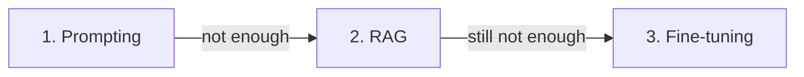

<LevelBadge level="intermediate" />

Quando il modello non fa ciò che vuoi, ci sono tre leve — e la gente ricorre per prima a quella costosa. Ecco l'ordine che funziona davvero.

## Prova in quest'ordine

### 1. Prompting — parti sempre da qui
Istruzioni più chiare, esempi, un ruolo, vincoli sull'output ([Basi del prompting](/docs/prompting/basics)). Risolve la **maggior parte** dei problemi, non costa nulla in più ed è immediato da iterare. La maggior parte dei "il modello è scarso su X" si rivela essere "il prompt era vago".

### 2. RAG — quando serve la *tua* conoscenza
Se la lacuna è **informazione mancante o aggiornata** (i tuoi documenti, i tuoi dati, fatti attuali), aggiungi il [RAG](/docs/foundations/rag). Mantiene la conoscenza aggiornabile e citabile senza toccare il modello.

### 3. Fine-tuning — ultima risorsa, per *comportamento/formato* su larga scala
Il fine-tuning addestra ulteriormente un modello sui tuoi esempi. Ricorrici solo quando prompting + RAG non riescono a ottenere **stile, formato o comportamento del task** coerenti e hai **molti esempi di alta qualità** e il volume per giustificarlo.

## La tabella decisionale

| Il tuo problema | Ricorri a |
|---|---|
| Output vaghi/sbagliati, formato errato | **Prompting** |
| Non conosce i tuoi dati / serve informazione attuale | **RAG** |
| Serve uno stile/comportamento molto specifico, in modo coerente, su larga scala | **Fine-tuning** |
| Deve compiere azioni | (Nessuno di questi — è [uso di strumenti/agenti](/docs/api/tool-use)) |

## Perché la gente sbaglia

Il fine-tuning *suona* come "insegnare al modello", quindi sembra la vera soluzione. Ma è l'opzione più lenta, più costosa e meno flessibile, **non aggiunge bene conoscenza fresca** (lo fa il RAG) ed è facile farlo male. Esaurisci prima prompting e RAG — di solito non ti servirà il passaggio 3.

:::tip Si combinano
Un sistema solido è spesso un buon **prompt** + **RAG** per la conoscenza, con il fine-tuning riservato a un'esigenza comportamentale ristretta. Non si escludono a vicenda.
:::

## Prossimi passi

- [Retrieval-Augmented Generation (RAG)](/docs/foundations/rag)
- [Basi del prompting](/docs/prompting/basics)
- [Valutare la qualità dell'AI (Evals)](/docs/foundations/evals)
