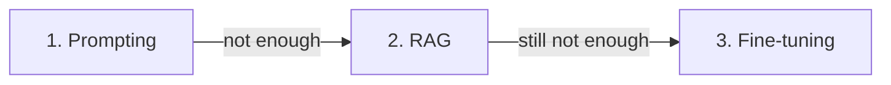

<LevelBadge level="intermediate" />

<Callout type="objectives" items={["Le tre leve che hai quando il modello non fa ciò che vuoi","L'ordine che funziona davvero — e perché il fine-tuning quasi mai è il passo 1","Quando il RAG è la soluzione giusta e quando è eccessivo","In cosa il fine-tuning è genuinamente bravo (e in cosa non lo è)","Come le tre si combinano in un sistema di produzione reale"]} />

Quando il modello non fa ciò che vuoi, ci sono tre leve — e la gente ricorre per prima a quella costosa. Ecco l'ordine che funziona davvero.

## Prova in quest'ordine

```mermaid
flowchart LR
  A[1. Prompting] -->|not enough| B[2. RAG]
  B -->|still not enough| C[3. Fine-tuning]
```

<Steps items={[{title: "1. Prompting — parti sempre da qui", body: "Istruzioni più chiare, esempi, un ruolo, vincoli sull'output (vedi /docs/prompting/basics). Risolve la maggior parte dei problemi, non costa nulla in più ed è immediato da iterare. La maggior parte dei 'il modello è scarso su X' si rivela essere 'il prompt era vago'."}, {title: "2. RAG — quando serve la TUA conoscenza", body: "Se la lacuna è informazione mancante o aggiornata (i tuoi documenti, i tuoi dati, fatti attuali), aggiungi il RAG (/docs/foundations/rag). Mantiene la conoscenza aggiornabile e citabile senza toccare il modello — sostituisci un documento e la prossima risposta lo riflette."}, {title: "3. Fine-tuning — ultima risorsa, per comportamento/formato su larga scala", body: "Il fine-tuning addestra ulteriormente un modello sui tuoi esempi. Ricorrici solo quando prompting + RAG non riescono a ottenere stile, formato o comportamento del task coerenti E hai molti esempi di alta qualità E il volume per giustificarlo."}]} />

## La tabella decisionale

| Il tuo problema | Ricorri a |
|---|---|
| Output vaghi/sbagliati, formato errato | **Prompting** |
| Non conosce i tuoi dati / serve informazione attuale | **RAG** |
| Serve uno stile/comportamento molto specifico, in modo coerente, su larga scala | **Fine-tuning** |
| Deve compiere azioni | (Nessuno di questi — è [uso di strumenti/agenti](/docs/api/tool-use)) |

<Flashcards title="Quale leva risolve quale problema" cards={[{front: "Sintomo: l'output è vago, con formato sbagliato o manca il punto del task.", back: "Sistema con PROMPTING. Aggiungi ruolo, vincoli, esempi e un formato target. Il più economico e veloce — nove volte su dieci è tutta la risposta."}, {front: "Sintomo: il modello non conosce i documenti della tua azienda, il listino prezzi attuale o le notizie della settimana scorsa.", back: "Sistema con RAG. Recupera i chunk rilevanti al momento della query e iniettali come contesto. La conoscenza resta aggiornabile e citabile — nessun riaddestramento necessario."}, {front: "Sintomo: hai bisogno di uno stile di casa molto coerente, di uno schema JSON, o di un comportamento di classificazione ristretto attraverso migliaia di chiamate, e il prompting continua a derivare.", back: "Considera il FINE-TUNING. Solo dopo che prompting + RAG falliscono, e solo con centinaia o migliaia di esempi di alta qualità più il volume di chiamate per ripagare il costo di training."}, {front: "Sintomo: il modello deve compiere azioni (inviare un'email, eseguire una query, chiamare un'API).", back: "Nessuna di queste tre — è TOOL USE / AGENTI. Vedi /docs/api/tool-use."}]} />

## Perché la gente sbaglia

Il fine-tuning *suona* come "insegnare al modello", quindi sembra la vera soluzione. Ma è l'opzione più lenta, più costosa e meno flessibile, **non aggiunge bene conoscenza fresca** (lo fa il RAG) ed è facile farlo male. Esaurisci prima prompting e RAG — di solito non ti servirà il passaggio 3.

<Callout type="warning" items={["Fare fine-tuning di un modello frontier sui tuoi dati NON aggiunge in modo affidabile nuovi fatti — cambia stile e comportamento. I fatti continuano ad allucinare.","Un modello fine-tuned è ancorato a quella versione base. Quando il vendor rilascia una base migliore, ri-addestri o resti bloccato.","Dati di training scadenti amplificano comportamenti scadenti — un dataset mediocre rende il modello peggiore, non migliore.","La maggior parte delle richieste 'ci serve il fine-tuning' sono in realtà 'il nostro prompt è 40 righe di regole ad-hoc' — refactora prima il prompt."]} />

:::tip Si combinano
Un sistema solido è spesso un buon **prompt** + **RAG** per la conoscenza, con il fine-tuning riservato a un'esigenza comportamentale ristretta. Non si escludono a vicenda.
:::

<PromptCard title="Un esempio concreto: 'il modello non riesce a rispondere alle domande sul nostro prodotto'">{`# Wrong first move: fine-tune on the product manual.
# Right first move: retrieve the relevant chapter and inject it.

# 1. PROMPTING (baseline)
System: "You are a support agent for Acme Widgets. Be concise, cite doc sections."
User:   "Does the Widget Pro support Bluetooth 5.3?"
# Fails — model has no idea what a Widget Pro is.

# 2. + RAG (usually enough)
System: "You are a support agent for Acme Widgets. Be concise, cite doc sections."
Context: [top-3 chunks from product manual retrieved by embedding search]
User:    "Does the Widget Pro support Bluetooth 5.3?"
# Works — model reads the retrieved specs and answers with a citation.

# 3. + Fine-tuning (only if house voice / format is still drifting after 1+2)
# Train on 500-2000 (prompt, ideal answer) pairs to lock in the style — NOT to teach facts.`}</PromptCard>

<Quiz title="Verifica" questions={[{q: "Il modello dà risposte vaghe, fuori formato al tuo task. Cosa provi per primo?", options: ["Fai fine-tuning su un batch di output ideali", "Aggiungi RAG così può recuperare contesto migliore", "Stringi il prompt — ruolo, vincoli, esempi, formato target", "Passa a un modello più grande"], answer: 2, explain: "Il prompting è il passo 1, sempre. La maggior parte dei 'il modello è scarso su X' si rivela essere 'il prompt era vago'. È gratis, immediato da iterare e risolve la maggior parte dei problemi."}, {q: "Il tuo modello non conosce il tuo wiki interno. Quale leva?", options: ["Prompting — scrivi un system prompt più lungo che descrive il wiki", "RAG — recupera la pagina del wiki rilevante al momento della query e iniettala", "Fine-tuning — addestra sul corpus del wiki così il modello lo 'conosce'", "Nessuna — cambia semplicemente modello"], answer: 1, explain: "Informazione mancante O aggiornata è esattamente ciò che il RAG risolve. Il fine-tuning è inaffidabile per aggiungere fatti ed è ancorato a un modello base. Il RAG mantiene la conoscenza aggiornabile e citabile — sostituisci la pagina wiki e la prossima risposta lo riflette."}, {q: "In cosa è REALMENTE bravo il fine-tuning?", options: ["Aggiungere nuova conoscenza fattuale al modello", "Fissare uno stile, un formato o un comportamento di task ristretto in modo coerente su larga scala, quando prompting + RAG non ci arrivano", "Rendere il modello più veloce", "Eliminare la necessità di un system prompt"], answer: 1, explain: "Il fine-tuning cambia stile e comportamento, non fatti. È lo strumento giusto di ultima risorsa per un'esigenza comportamentale ristretta e ad alto volume (es. produrre uno schema JSON rigido in un tono specifico attraverso milioni di chiamate). I fatti vanno nel RAG."}, {q: "Quale combinazione è la forma di un sistema di produzione maturo?", options: ["Fai fine-tuning di tutto e salta il prompting", "Prompt solido + RAG per la conoscenza, con il fine-tuning riservato a un'esigenza comportamentale ristretta — non si escludono a vicenda", "Solo uno dei tre — mescolarli causa conflitti", "Prompt + fine-tune, mai RAG"], answer: 1, explain: "Le tre leve si compongono. Un buon prompt imposta la cornice, il RAG fornisce la conoscenza fresca, e il fine-tuning (se usato) fissa un comportamento specifico su larga scala."}]} />

<Callout type="takeaways" items={["Tre leve quando il modello non fa ciò che vuoi: prompting, RAG, fine-tuning — in quest'ordine.","Il prompting risolve ~9 lamentele su 10 'il modello è scarso su X' a costo zero e con iterazione istantanea.","Il RAG è la soluzione giusta quando la lacuna è conoscenza mancante o fresca — il fine-tuning NON è affidabile per aggiungere fatti.","Il fine-tuning è ultima risorsa per stile/formato/comportamento coerente su larga scala, e richiede centinaia o migliaia di esempi di alta qualità più il volume di chiamate per giustificarlo.","In un sistema di produzione reale le tre si compongono: prompt solido + RAG + fine-tune ristretto."]} />

## Prossimi passi

- [Retrieval-Augmented Generation (RAG)](/docs/foundations/rag)
- [Basi del prompting](/docs/prompting/basics)
- [Valutare la qualità dell'AI (Evals)](/docs/foundations/evals)
