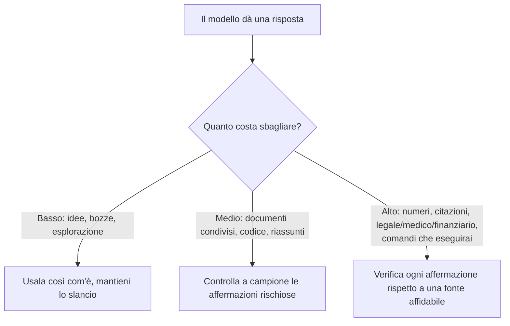

<LevelBadge level="intermediate" />

Un'**allucinazione** è quando un modello afferma qualcosa di falso con totale sicurezza. Non sta mentendo e non è guasto — è il rovescio della medaglia di come funzionano gli LLM: generano testo *plausibile*, e plausibile non è sempre vero (vedi [Cos'è un LLM?](/docs/foundations/what-is-an-llm)). Non puoi eliminarlo del tutto con un prompt, ma puoi ridurlo drasticamente e intercettare il resto.

## Perché succede

Il modello predice una continuazione probabile. Quando non "sa" qualcosa, la continuazione *dall'aspetto più probabile* è spesso una risposta sicura, ben formata — e sbagliata. Non c'è un segnale integrato di "non sono sicuro" a meno che tu non crei lo spazio per uno.

## Le zone ad alto rischio

Sii il più scettico possibile quando l'output riguarda:

- **Citazioni, virgolettati e riferimenti** — articoli inventati, URL falsi, citazioni attribuite male.
- **Numeri, date e statistiche specifici** — cifre plausibili ma inventate.
- **Fatti di nicchia o molto recenti** — al di là di ciò che il modello ha appreso in modo affidabile.
- **Dettagli di API e librerie** — metodi o parametri che non esistono.
- **Specifiche su persone e ambito legale/medico** — alta posta in gioco, facile sbagliare in modo sottile.

## Il kit di riduzione

Combinali — ciascuno aiuta:

1. **Ancoralo alle fonti.** Incolla il testo sorgente e di' *"rispondi solo dal testo qui sopra; se non c'è, dillo".* È l'idea centrale dietro il [RAG](/docs/foundations/rag).
2. **Dagli una via d'uscita.** Consenti esplicitamente *"Se non sei sicuro, di' 'Non lo so'"* — riduce drasticamente le ipotesi avanzate con sicurezza.
3. **Chiedi ragionamento e citazioni.** *"Cita la frase esatta che supporta ogni affermazione".* Le affermazioni non supportate diventano evidenti.
4. **Abbassa la creatività** per i task fattuali dove il modello espone un controllo della temperatura (vedi [Controlli di campionamento](/docs/foundations/sampling-controls)).
5. **Usa gli strumenti.** Per la matematica, dati attuali o ricerche, dai al modello una calcolatrice/ricerca/[strumento](/docs/api/tool-use) invece di fidarti del ricordo.
6. **Verifica incrociata.** Poni la stessa domanda in due modi, o fai criticare la prima risposta da un secondo passaggio.

## Un prompt anti-allucinazione da copiare e incollare

Gran parte del kit qui sopra si condensa in un unico wrapper riutilizzabile. Incolla la tua fonte dove indicato e poni la tua domanda: àncora la risposta, dà al modello una via d'uscita e impone le citazioni in un colpo solo:

```text
Rispondi SOLO a partire dalla FONTE qui sotto.
Regole:
- Se la risposta non è nella FONTE, rispondi esattamente: "Non indicato nella fonte."
- Dopo ogni affermazione, cita la frase esatta della FONTE che la supporta.
- Non aggiungere conoscenze esterne, stime o supposizioni.

FONTE:
"""
[incolla qui il documento, la trascrizione o i dati]
"""

DOMANDA: [la tua domanda]
```

Perché funziona: la via di fuga "Non indicato nella fonte" elimina la pressione a tirare a indovinare, e la regola di citare la frase rende impossibile nascondere qualsiasi affermazione non supportata. Togli il blocco FONTE quando vuoi davvero la conoscenza propria del modello — ma a quel punto la verifica torna a carico tuo.

## La mentalità che ti protegge davvero

:::warning Verifica ciò che conta — sempre
Nessun prompt rende l'output affidabile al 100%. Per qualsiasi cosa importante — un numero in un report, una citazione, un comando che eseguirai, un dettaglio medico/legale/finanziario — **verificalo rispetto a una fonte affidabile**. Tratta l'AI come una bozza rapida, non come autorità finale. Questo è il cuore dell'[Uso responsabile](/docs/security/responsible-use).
:::

Una regola semplice: **il costo di sbagliare determina la quantità di verifica.** Brainstorming? Fidati liberamente. Pubblicare una statistica? Verifica ogni volta.



## Prossimi passi

- [Retrieval-Augmented Generation (RAG)](/docs/foundations/rag)
- [Valutare la qualità dell'AI (Evals)](/docs/foundations/evals)
- [Uso responsabile, etica e verifica](/docs/security/responsible-use)
