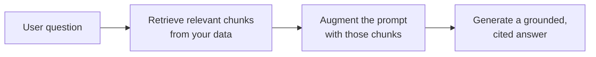

<LevelBadge level="intermediate" />

Il **RAG** fa rispondere un modello a domande sui **tuoi** dati — documenti, una base di conoscenza, un codebase — su cui non è mai stato addestrato. L'idea è semplice: **recupera** i pezzi rilevanti, **arricchisci** il prompt con essi, poi **genera** una risposta ancorata a quei pezzi.

## Il ciclo

1. **Indicizza** i tuoi dati: suddividili in chunk, [crea i loro embedding](/docs/foundations/embeddings), memorizzali in un indice vettoriale (e/o per parole chiave).
2. **Recupera** i chunk più rilevanti per la domanda.
3. **Arricchisci**: inserisci quei chunk nel prompt con un'istruzione come *"Rispondi solo dal contesto qui sotto; se non c'è, dillo".*
4. **Genera** — e idealmente **cita** da quale chunk proviene ciascuna affermazione.

## Perché il RAG invece del fine-tuning?

Il RAG mantiene la conoscenza **fresca** (aggiorni i dati, non il modello), fornisce **citazioni** ed è molto più economico del riaddestramento. Per la maggior parte delle esigenze "rispondi sui miei documenti", è il primo strumento giusto — vedi [Fine-tuning vs Prompting vs RAG](/docs/foundations/finetune-vs-prompt-vs-rag).

## Le modalità di fallimento (dove muore la qualità del RAG)

- **Recupero scadente = risposta scadente.** Se il chunk giusto non viene recuperato, il modello non può usarlo. La maggior parte dei problemi "il RAG sbaglia" sono problemi di *recupero*.
- **Chunking troppo grossolano/fine** — rovina la rilevanza ([embedding](/docs/foundations/embeddings)).
- **Nessuna istruzione di ancoraggio** — il modello mescola i fatti recuperati con le proprie ipotesi. Digli di rispondere *solo* dal contesto e di ammettere le lacune.
- **Inserire troppo** — i chunk irrilevanti diluiscono il segnale e costano [token](/docs/foundations/tokens-and-context). Recupera pochi chunk di alta qualità.
- **Nessuna citazione** — non puoi verificare, quindi non puoi fidarti.

:::tip Valuta il recupero separatamente
Misura "abbiamo recuperato il chunk giusto?" separatamente da "il modello ha risposto bene?". Localizza il problema in fretta. Vedi [Evals](/docs/foundations/evals).
:::

## Prossimi passi

- [Embedding e ricerca vettoriale](/docs/foundations/embeddings)
- [Fine-tuning vs Prompting vs RAG](/docs/foundations/finetune-vs-prompt-vs-rag)
- [Playbook di ricerca e sintesi](/docs/playbooks/research)
