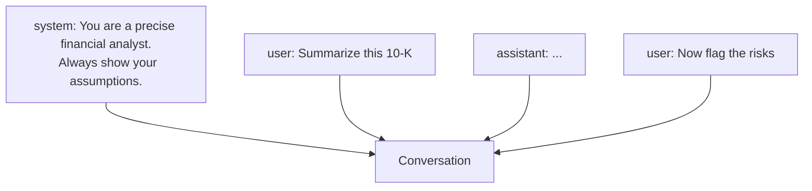

<LevelBadge level="beginner" />

Ogni conversazione con l'AI è costruita a partire da **messaggi**, e ogni messaggio ha un **ruolo**. Comprendere i tre ruoli spiega come orientare il modello — e perché alcune istruzioni attecchiscono mentre altre no.

<Callout type="objectives" items={[
  "I tre ruoli dei messaggi — system, user, assistant — e a cosa serve ciascuno",
  "Perché il system prompt è il punto a massima leva per impostare il comportamento",
  "La stessa idea si presenta in tre forme: istruzioni personalizzate, CLAUDE.md e il parametro system dell'API",
  "Come scrivere un system prompt che regge davvero lungo un'intera conversazione"
]} />

## I tre ruoli

- **System** — la configurazione di alto livello per l'intera conversazione: chi deve essere il modello, le regole, il formato. Impostato una volta, vale per tutto.
- **User** — sei tu: le tue domande e i tuoi input, turno per turno.
- **Assistant** — le risposte del modello. (Puoi anche *mettere parole in bocca all'assistant* come esempi — vedi [few-shot](/docs/prompting/few-shot).)

## Perché il system prompt è la tua leva più potente

Il messaggio system inquadra **tutto ciò che segue**. È dove imposti il ruolo del modello, gli standard, il tono e le regole ferree — e il modello gli dà molto peso. Se vuoi un comportamento coerente lungo un'intera conversazione (o app), mettilo qui, non sepolto in un turno user.

In pratica:
- **App di chat:** le [istruzioni personalizzate](/docs/claude-app/custom-instructions) del tuo account agiscono come un system prompt personale.
- **Claude Code:** [CLAUDE.md](/docs/claude-code/claude-md) svolge questo ruolo per il tuo progetto.
- **L'API:** il [parametro `system`](/docs/api/first-call).

Stessa idea, tre superfici.

## Scrivi un system prompt che regge

Un buon system prompt è costruito a livelli, non in un unico paragrafo fiume. Ogni livello risponde a una domanda diversa che il modello si sta silenziosamente ponendo:

<Steps items={[
  {title: "Chi sei?", body: "Dai al modello un ruolo concreto, non un aggettivo vago. \"Sei un analista finanziario preciso che dichiara sempre le sue assunzioni\" batte \"sii utile\"."},
  {title: "Quali sono le regole ferree?", body: "Elenca i punti non negoziabili — cosa fare sempre e cosa non fare mai. Sono i vincoli che non vuoi che un turno user successivo ammorbidisca per errore."},
  {title: "Che aspetto deve avere l'output?", body: "Specifica il formato fin dall'inizio: lunghezza, struttura, se mostrare il ragionamento, cosa fare in caso di dubbio. Le istruzioni sul formato vanno qui, non ri-incollate a ogni turno."},
  {title: "Tieni i turni user per il task", body: "Una volta che il system prompt porta il ruolo, le regole e il formato, ogni turno user deve contenere solo la richiesta effettiva. Non ridichiarare le regole — spreca token e invita conflitti."}
]} />

<PromptCard title="Scheletro riutilizzabile di system prompt">{`You are a [ROLE] — [one line on expertise and standards].

Always:
- [rule 1]
- [rule 2]

Never:
- [anti-rule 1]

Output format:
- [length / structure]
- If you are unsure or the input is missing, say so instead of guessing.`}</PromptCard>

## Consigli pratici

- **Sii specifico nel system prompt** riguardo a ruolo, regole e formato dell'output — è il punto a massima leva per farlo.
- **Mantieni i turni user focalizzati** sul task effettivo; non ri-incollare le regole a ogni turno.
- **Istruzioni in conflitto?** Un'istruzione user successiva ed esplicita può prevalere su una system vaga — sii coerente per evitare sorprese ([Risoluzione dei problemi](/docs/contribute/troubleshooting)).

## Prossimi passi

- [Basi del prompting](/docs/prompting/basics)
- [Istruzioni personalizzate e stili](/docs/claude-app/custom-instructions)
- [Token, contesto e memoria](/docs/foundations/tokens-and-context)
