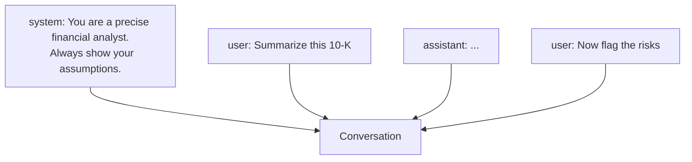

<LevelBadge level="beginner" />

Ogni conversazione con l'AI è costruita a partire da **messaggi**, e ogni messaggio ha un **ruolo**. Comprendere i tre ruoli spiega come orientare il modello — e perché alcune istruzioni attecchiscono mentre altre no.

## I tre ruoli

- **System** — la configurazione di alto livello per l'intera conversazione: chi deve essere il modello, le regole, il formato. Impostato una volta, vale per tutto.
- **User** — sei tu: le tue domande e i tuoi input, turno per turno.
- **Assistant** — le risposte del modello. (Puoi anche *mettere parole in bocca all'assistant* come esempi — vedi [few-shot](/docs/prompting/few-shot).)

## Perché il system prompt è la tua leva più potente

Il messaggio system inquadra **tutto ciò che segue**. È dove imposti il ruolo del modello, gli standard, il tono e le regole ferree — e il modello gli dà molto peso. Se vuoi un comportamento coerente lungo un'intera conversazione (o app), mettilo qui, non sepolto in un turno user.

In pratica:
- **App di chat:** le [istruzioni personalizzate](/docs/claude-app/custom-instructions) del tuo account agiscono come un system prompt personale.
- **Claude Code:** [CLAUDE.md](/docs/claude-code/claude-md) svolge questo ruolo per il tuo progetto.
- **L'API:** il [parametro `system`](/docs/api/first-call).

Stessa idea, tre superfici.

## Consigli pratici

- **Sii specifico nel system prompt** riguardo a ruolo, regole e formato dell'output — è il punto a massima leva per farlo.
- **Mantieni i turni user focalizzati** sul task effettivo; non ri-incollare le regole a ogni turno.
- **Istruzioni in conflitto?** Un'istruzione user successiva ed esplicita può prevalere su una system vaga — sii coerente per evitare sorprese ([Risoluzione dei problemi](/docs/contribute/troubleshooting)).

## Prossimi passi

- [Basi del prompting](/docs/prompting/basics)
- [Istruzioni personalizzate e stili](/docs/claude-app/custom-instructions)
- [Token, contesto e memoria](/docs/foundations/tokens-and-context)
