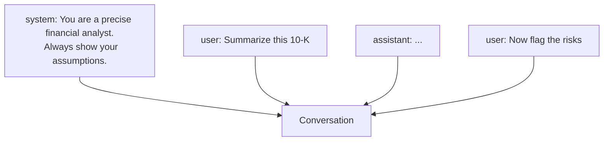

<LevelBadge level="beginner" />

<Callout type="objectives" items={["I tre ruoli su cui è costruita ogni conversazione con l'AI — e a cosa serve ciascuno", "Perché il system prompt è il punto a massima leva per orientare il comportamento", "Come la stessa idea si presenta nelle app di chat, in Claude Code e nell'API", "Una trappola comune: seppellire le regole in un turno user invece che nel messaggio system"]} />

Ogni conversazione con l'AI è costruita a partire da **messaggi**, e ogni messaggio ha un **ruolo**. Comprendere i tre ruoli spiega come orientare il modello — e perché alcune istruzioni attecchiscono mentre altre no.

## I tre ruoli

<Steps items={[{title: "system — il brief permanente", body: "Configurazione di alto livello per l'intera conversazione: chi deve essere il modello, le regole, il formato dell'output. Impostato una volta, vale per ogni turno che segue."}, {title: "user — il tuo turno, ogni volta", body: "Le tue domande e i tuoi input, un turno per volta. Tienili focalizzati sul task effettivo; non ri-incollare le regole permanenti a ogni turno."}, {title: "assistant — la risposta del modello", body: "Le risposte del modello. Puoi anche mettere parole in bocca all'assistant come esempi few-shot (vedi /docs/prompting/few-shot) — il modello li tratta come turni precedenti e continua in quello stile."}]} />

```mermaid
flowchart TD
  S["system: You are a precise financial analyst.
  Always show your assumptions."] --> C[Conversation]
  U1[user: Summarize this 10-K] --> C
  A1[assistant: ...] --> C
  U2[user: Now flag the risks] --> C
```

## Perché il system prompt è la tua leva più potente

Il messaggio system inquadra **tutto ciò che segue**. È dove imposti il ruolo del modello, gli standard, il tono e le regole ferree — e il modello gli dà molto peso. Se vuoi un comportamento coerente lungo un'intera conversazione (o app), mettilo qui, non sepolto in un turno user.

Stessa idea, tre superfici:

| Superficie | Cosa svolge il ruolo di system prompt |
|---|---|
| **App di chat** (Claude.ai, ChatGPT, Gemini) | Le [istruzioni personalizzate](/docs/claude-app/custom-instructions) del tuo account |
| **Claude Code** | [`CLAUDE.md`](/docs/claude-code/claude-md) alla radice del progetto |
| **L'API** | Il parametro `system` nella richiesta ([prima chiamata](/docs/api/first-call)) |

## Un before/after concreto

L'errore più comune è mettere le regole permanenti in ogni turno user invece che nel messaggio system. Guarda cosa cambia.

**Prima — regole ficcate in un turno user, ripetute ogni volta:**

<PromptCard title="Regole nel turno user (fragile)">{`user: You are a precise financial analyst. Always show your assumptions.
Never invent numbers. Now: summarize this 10-K.
[10-K text]`}</PromptCard>

**Dopo — regole sollevate nel messaggio system, i turni user restano puliti:**

<PromptCard title="Regole nel messaggio system (durevoli)">{`system: You are a precise financial analyst. Always show your assumptions.
Never invent numbers. Cite the section of the filing for each claim.

user: Summarize this 10-K.
[10-K text]

user: Now flag the risks.`}</PromptCard>

La versione "dopo" tiene il comportamento stabile lungo i turni, dimezza i token che rispedisci a ogni turno e rende l'app più facile da cambiare — modifichi il brief permanente in un solo posto.

## Mettere parole in bocca all'assistant

Una mossa sottoutilizzata: puoi anteporre un turno `assistant` come **esempio few-shot** o **primer di formato**, e il modello continuerà in quello stile. È così che template e rubriche vengono imposti senza un prompt enorme.

<PromptCard title="Primare l'assistant a seguire un formato">{`system: You are a code reviewer. Return only the sections below.

user: Review this pull request. [diff]

assistant: ## Summary
- 
## Risks
- 
## Suggested changes
-`}</PromptCard>

Il modello tratta il turno assistant che hai seminato come una risposta precedente e completa nella stessa forma.

## Errori comuni

<Callout type="tip" items={["Regole in ogni turno user — metti le regole permanenti una volta nel messaggio system; usa i turni user per il task effettivo.", "Contraddirsi lungo i turni — un'istruzione user successiva ed esplicita può prevalere su una system vaga. Sii coerente.", "Trattare il ruolo assistant come sola lettura — puoi seminarlo per primare formato, tono o un pattern few-shot.", "Sovraccaricare il system prompt con fatti che cambiano — metti i fatti volatili (documenti, dati, stato attuale) nel turno user o nel contesto di retrieval, non nel messaggio system."]} />

## Verifica

<Quiz title="Verifica" questions={[{q: "Dove dovrebbero vivere le regole permanenti come tono, formato e ruolo?", options: ["Ripetute in ogni turno user perché il modello non le dimentichi", "Nel messaggio system, impostate una sola volta", "Nella prima risposta dell'assistant", "Nella configurazione del modello, non nel prompt"], answer: 1, explain: "Il messaggio system inquadra tutta la conversazione. Impostare le regole una volta lì è più durevole, più economico e più facile da cambiare che ripeterle a ogni turno user."}, {q: "In Claude Code, quale file svolge lo stesso ruolo del parametro system dell'API?", options: ["package.json", "CLAUDE.md", "README.md", ".env"], answer: 1, explain: "CLAUDE.md alla radice del progetto è il brief permanente di Claude Code — l'equivalente di un system prompt per quel progetto."}, {q: "Puoi scrivere tu del testo in un turno assistant prima che il modello risponda?", options: ["No — il ruolo assistant è di sola lettura", "Sì — seminare un turno assistant prima formato o stile e il modello continua da lì", "Solo nell'API, mai nelle app di chat", "Solo se usi il fine-tuning"], answer: 1, explain: "Seminare un turno assistant è una tecnica comune per imporre un template o uno stile few-shot — il modello lo tratta come una risposta precedente."}, {q: "Un turno user ora dice qualcosa che contraddice il system prompt. Cosa tende ad accadere?", options: ["Il system prompt vince sempre", "Un'istruzione user successiva ed esplicita può prevalere su una system vaga — sii coerente per evitare sorprese", "Il modello rifiuta di rispondere", "Il modello fa la media dei due"], answer: 1, explain: "Il system prompt pesa molto, ma un'istruzione user chiara ed esplicita può prevalere su una vaga. La coerenza tra i ruoli conta."}]} />

<Callout type="takeaways" items={["Tre ruoli: system imposta il brief, user chiede a ogni turno, assistant risponde (o viene seminato).", "Il system prompt è la leva a massimo effetto — metti lì le regole permanenti, una sola volta.", "Le istruzioni personalizzate delle chat, CLAUDE.md e il campo `system` dell'API sono la stessa idea su tre superfici.", "I fatti volatili vanno nei turni user o nel retrieval, non nel messaggio system."]} />

## Prossimi passi

- [Basi del prompting](/docs/prompting/basics)
- [Istruzioni personalizzate e stili](/docs/claude-app/custom-instructions)
- [Token, contesto e memoria](/docs/foundations/tokens-and-context)
