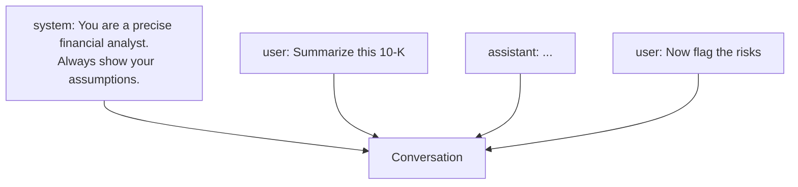

<LevelBadge level="beginner" />

<Callout type="objectives" items={["I tre ruoli da cui è costruita ogni conversazione con un'AI — e a cosa serve ciascuno", "Perché il system prompt è il punto con la leva più alta per orientare il comportamento", "Come la stessa idea si presenta nelle app di chat, in Claude Code e nell'API", "Una trappola comune: nascondere le regole in un turno utente invece che nel messaggio system"]} />

Ogni conversazione con un'AI è costruita da **messaggi**, e ogni messaggio ha un **ruolo**. Capire i tre ruoli spiega come orientare il modello — e perché alcune istruzioni attecchiscono e altre no.

## I tre ruoli

<Steps items={[{title: "system — il brief permanente", body: "Impostazione di primo livello per tutta la conversazione: chi deve essere il modello, le regole, il formato dell'output. Si imposta una volta e vale per ogni turno successivo."}, {title: "user — il tuo turno, ogni volta", body: "Le tue domande e i tuoi input, un turno alla volta. Tienili focalizzati sul task reale; non reincollare le regole permanenti a ogni turno."}, {title: "assistant — la risposta del modello", body: "Le risposte del modello. Puoi anche mettere parole in bocca all'assistant come esempi few-shot (vedi /docs/prompting/few-shot) — il modello li tratta come turni precedenti e continua in quello stile."}]} />

```mermaid
flowchart TD
  S["system: You are a precise financial analyst.
  Always show your assumptions."] --> C[Conversation]
  U1[user: Summarize this 10-K] --> C
  A1[assistant: ...] --> C
  U2[user: Now flag the risks] --> C
```

## Perché il system prompt è la tua leva più potente

Il messaggio system inquadra **tutto ciò che segue**. È dove imposti il ruolo del modello, gli standard, il tono e le regole ferree — e il modello gli dà molto peso. Se vuoi un comportamento coerente su tutta una conversazione (o app), mettilo qui, non nascosto in un turno utente.

Stessa idea, tre superfici:

| Superficie | Cosa svolge il ruolo di system prompt |
|---|---|
| **App di chat** (Claude.ai, ChatGPT, Gemini) | Le [istruzioni personalizzate](/docs/claude-app/custom-instructions) del tuo account |
| **Claude Code** | [`CLAUDE.md`](/docs/claude-code/claude-md) nella root del progetto |
| **L'API** | Il parametro `system` sulla richiesta ([prima chiamata](/docs/api/first-call), [System prompt](/docs/prompting/system-prompts)) |

## Un esempio prima/dopo

L'errore più comune è mettere le regole permanenti in ogni turno utente invece che nel messaggio system. Guarda cosa cambia.

**Prima — regole stipate in un turno utente, ripetute ogni volta:**

<PromptCard title="Regole nel turno utente (fragile)">{`user: You are a precise financial analyst. Always show your assumptions.
Never invent numbers. Now: summarize this 10-K.
[10-K text]`}</PromptCard>

**Dopo — regole promosse nel messaggio system, i turni utente restano puliti:**

<PromptCard title="Regole nel messaggio system (durevole)">{`system: You are a precise financial analyst. Always show your assumptions.
Never invent numbers. Cite the section of the filing for each claim.

user: Summarize this 10-K.
[10-K text]

user: Now flag the risks.`}</PromptCard>

La versione "dopo" mantiene il comportamento stabile tra i turni, dimezza i token che rispedisci a ogni turno e rende l'app più facile da modificare — modifichi il brief permanente in un solo posto.

## Scrivere tu stesso i turni assistant

Puoi scrivere tu i turni `assistant` — ma *dove* li metti conta, e le regole sono cambiate.

**I turni assistant completi, più indietro nella conversazione, sono un esempio [few-shot](/docs/prompting/few-shot).** Questo funziona ancora dappertutto, ed è il modo robusto per imporre un template: mostra una risposta finita nella forma che vuoi, poi fai la domanda vera.

<PromptCard title="Un turno d'esempio finito, poi la richiesta vera">{`system: You are a code reviewer. Answer with exactly these sections: Summary, Risks, Suggested changes.

user: Review this pull request. [example diff]

assistant: ## Summary
Renames the token helper and adds an expiry guard.

## Risks
- The guard uses < rather than <=, so a token expiring this second passes.

## Suggested changes
- Switch the comparison to <=.

user: Review this pull request. [the real diff]`}</PromptCard>

**Un turno assistant lasciato a metà proprio alla fine — un "prefill" — è ritirato sui modelli Claude attuali.** Era il trucco per forzare il JSON o saltare il preambolo; su Claude 4.6 e successivi, una richiesta il cui ultimo messaggio è un turno assistant prefillato restituisce un errore 400. Metti invece la regola di formato nel messaggio system, oppure vincolala con gli [structured output](/docs/api/structured-output).

<VerifyNote lastVerified="2026-09-30" source="https://platform.claude.com/docs/en/build-with-claude/prompt-engineering/claude-prompting-best-practices">
Il riferimento di Anthropic sul prompting afferma che le risposte prefillate sull'ultimo turno assistant non sono supportate a partire dai modelli Claude 4.6 e che tali richieste restituiscono un errore 400; i modelli precedenti le accettano ancora, e i messaggi assistant in altri punti della conversazione non sono interessati.
</VerifyNote>

## Errori comuni

<Callout type="tip" items={["Regole in ogni turno utente — metti le regole permanenti una volta sola nel messaggio system; usa i turni utente per il task reale.", "Contraddirsi tra i turni — un'istruzione utente successiva ed esplicita può prevalere su una system vaga. Sii coerente.", "Trattare il ruolo assistant come di sola lettura — puoi scrivere turni assistant completi come esempi few-shot. Solo, non lasciarne uno a metà alla fine: quello è un prefill, e su Claude 4.6+ è un 400.", "Sovraccaricare il system prompt di fatti che cambiano — metti i fatti volatili (documenti, dati, stato corrente) nel turno utente o nel contesto di retrieval, non nel messaggio system."]} />

## Verifica le tue conoscenze

<Quiz title="Verifica le tue conoscenze" questions={[{q: "Dove dovrebbero stare le regole permanenti come tono, formato e ruolo?", options: ["Ripetute in ogni turno utente, così il modello non le dimentica", "Nel messaggio system, impostate una volta sola", "Nella prima risposta dell'assistant", "Nella configurazione del modello, non nel prompt"], answer: 1, explain: "Il messaggio system inquadra l'intera conversazione. Impostare lì le regole una volta sola è più durevole, più economico e più facile da modificare che ripeterle in ogni turno utente."}, {q: "In Claude Code, quale file svolge lo stesso ruolo del parametro system dell'API?", options: ["package.json", "CLAUDE.md", "README.md", ".env"], answer: 1, explain: "CLAUDE.md nella root del progetto è il brief permanente di Claude Code — l'equivalente di un system prompt per quel progetto."}, {q: "Puoi scrivere tu stesso i turni assistant?", options: ["No — il ruolo assistant è di sola lettura", "Sì — i turni assistant completi più indietro nella conversazione funzionano come esempi few-shot, ma uno lasciato a metà proprio alla fine è un prefill e restituisce un 400 su Claude 4.6+", "Solo nelle app di chat, mai sull'API", "Solo se usi il fine-tuning"], answer: 1, explain: "Scrivere turni assistant finiti come esempi è standard e ancora supportato. Lasciare l'ultimo turno assistant a metà — un prefill — è ciò che i modelli Claude attuali rifiutano con un 400."}, {q: "Un turno utente dice ora qualcosa che contraddice il system prompt. Cosa tende a succedere?", options: ["Il system prompt vince sempre", "Un'istruzione utente successiva ed esplicita può prevalere su una system vaga — sii coerente per evitare sorprese", "Il modello rifiuta di rispondere", "Il modello fa la media delle due"], answer: 1, explain: "Il system prompt ha molto peso, ma un'istruzione utente chiara ed esplicita può prevalere su una vaga. La coerenza tra i ruoli conta."}]} />

<Callout type="takeaways" items={["Tre ruoli: system imposta il brief, user chiede turno per turno, assistant risponde — e puoi scrivere tu stesso turni assistant finiti come esempi.", "Il system prompt è la leva con il maggior effetto — metti lì le regole permanenti, una volta sola.", "Istruzioni personalizzate della chat, CLAUDE.md e il campo `system` dell'API sono la stessa idea su tre superfici.", "I fatti volatili appartengono ai turni utente o al retrieval, non al messaggio system.", "Non chiudere una richiesta su un turno assistant lasciato a metà: i prefill restituiscono un 400 su Claude 4.6 e successivi."]} />

## Prossimo

- [System prompt](/docs/prompting/system-prompts)
- [Basi del prompting](/docs/prompting/basics)
- [Istruzioni personalizzate e stili](/docs/claude-app/custom-instructions)
- [Token, contesto e memoria](/docs/foundations/tokens-and-context)
