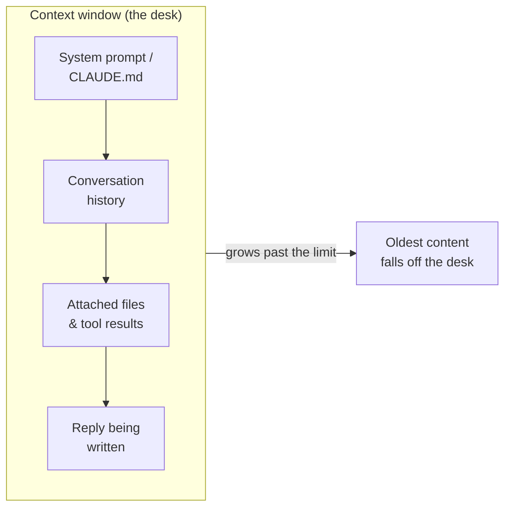

<LevelBadge level="beginner" />

Tre idee sbloccano un sacco di momenti "perché ha fatto così?": i **token**, la **finestra di contesto** e la **memoria**. Comprendile e smetterai di farti sorprendere dalla deriva, dalle dimenticanze e dalle bollette inattese.

<Callout
  type="objectives"
  items={[
    "Leggere il testo come fa un modello — in token, non in parole o caratteri",
    "Immaginare la finestra di contesto come una scrivania finita, e prevedere quando le cose ci cadono fuori",
    "Riconoscere il 'context rot' — perché i modelli possono perdere il centro di un input lungo",
    "Conoscere le quattro vere fonti di 'memoria' e come fornirla di proposito"
  ]}
/>

## Token: l'unità in cui pensano i modelli

I modelli non leggono caratteri o parole — leggono **token**, frammenti di testo lunghi all'incirca ¾ di una parola in inglese. "Unbelievable" potrebbe essere 3–4 token; le parole comuni sono un token ciascuna; uno spazio, una virgola o un pezzo di codice costano anch'essi token. Sia il tuo input *sia* l'output del modello vengono conteggiati, e i token sono esattamente l'unità in cui si misurano [prezzi e limiti](/docs/api/tokens-and-pricing).

Non devi contarli a mano, ma un'idea approssimativa aiuta: **~750 parole ≈ ~1.000 token**. Scrivi qualcosa e osserva:

<TokenEstimator />

:::tip Perché il rapporto cambia
L'inglese semplice si attesta vicino a ¾ di parola per token. Codice, JSON, scritture non latine, URL lunghi e parole rare si frammentano in *più* token — quindi un file di 500 righe o un paragrafo in cinese costa più di quanto suggerisca il conteggio delle parole. Quando una bolletta o un limite ti sorprende, di solito è per questo.
:::

## La finestra di contesto: la memoria di lavoro

La **finestra di contesto** è il numero massimo di token che il modello può considerare in una volta — *il tuo system prompt, l'intera conversazione fin lì, i file allegati e la risposta che sta scrivendo,* tutto insieme. Pensala come la scrivania del modello: grande, ma finita. Le dimensioni della finestra variano da modello a modello e continuano a crescere — vedi [Modelli e prezzi](/docs/whats-new/models-and-pricing) per i numeri attuali invece di memorizzarne uno.

Tutto ciò che il modello "sa" in quel momento vive su quella scrivania:

Quando una conversazione supera la finestra, il **contenuto più vecchio cade fuori**. Ecco perché una chat molto lunga può sembrare "dimenticarsi" come è iniziata, o allontanarsi dalla tua istruzione originale.

## Context rot: non è solo *pieno* contro *vuoto*

Un problema più sottile: anche quando tutto entra ancora, i modelli tendono a usare l'**inizio e la fine** di un input lungo in modo più affidabile rispetto al **centro**. Seppellisci l'unica frase che conta nel mezzo di un incollaggio di 50 pagine e potrebbe essere sottopesata — un fallimento spesso chiamato *"lost in the middle"* (perso nel mezzo).

<VerifyNote lastVerified="2026-06-29" source="https://arxiv.org/abs/2307.03172">L'effetto "lost in the middle" — l'uso degradato delle informazioni collocate a metà del contesto — è stato documentato da Liu et al. (2023). I modelli più recenti a contesto lungo lo gestiscono meglio, ma l'abitudine pratica qui sotto ripaga comunque.</VerifyNote>

<Steps
  items={[
    {title: "Apri con la richiesta", body: "Metti l'istruzione o la domanda vera per prima, prima di incollare un documento lungo — non sepolta dopo di esso."},
    {title: "Ribadisci alla fine", body: "Ripeti l'istruzione chiave in una riga dopo il contenuto lungo. La prima e l'ultima posizione sono le più forti."},
    {title: "Sfoltisci prima di incollare", body: "Elimina le sezioni irrilevanti. Meno rumore nel centro significa che il segnale rimasto ottiene più attenzione."},
    {title: "Dividi quando è enorme", body: "Per input molto grandi, riassumi o spezzetta invece di buttare dentro tutto — oppure apri una nuova chat per un nuovo sotto-task."}
  ]}
/>

Ecco la stessa richiesta, strutturata in modo che l'istruzione stia nelle posizioni forti:

<PromptCard title="Istruzione prima, ribadita alla fine">{`Task: Find every place this contract caps our liability, and quote the exact clause.

[... incolla qui l'intero contratto di 40 pagine ...]

Promemoria del task: elenca solo le clausole sul tetto di responsabilità, con citazioni esatte e numeri di sezione. Ignora tutto il resto.`}</PromptCard>

:::tip In Claude Code
Le sessioni di agente lunghe raggiungono lo stesso tetto. Claude Code lo gestisce di proposito — compattando la cronologia e lasciandoti governare cosa resta in vista. Vedi [Gestione del contesto](/docs/claude-code/context-management) e [Context Engineering](/docs/frontiers/context-engineering).
:::

## Memoria: non ce n'è, a meno che tu non la fornisca

Per impostazione predefinita, ogni conversazione è una **tabula rasa**. Il modello non ricorda la tua ultima chat. Tutto ciò che sembra memoria è una di quattro cose:

| Fonte | Cos'è | Come la controlli |
| --- | --- | --- |
| **Cronologia reinviata** | Le app di chat reinviano la conversazione a ogni turno, finché la finestra non si riempie | Aprendo nuove chat; mantenendo i thread focalizzati |
| **Funzionalità di memoria** | Alcune superfici di Claude trasportano fatti tra le chat | Impostazioni [Memoria tra le chat](/docs/claude-app/memory) |
| **File che fornisci** | Contesto persistente che alleghi di proposito | [Projects](/docs/claude-app/projects), [CLAUDE.md](/docs/claude-code/claude-md) |
| **Il tuo codice** | L'API è **stateless** — reinvii tu i messaggi precedenti | [Prima chiamata API](/docs/api/first-call) |

Il filo conduttore: *se vuoi che il modello ricordi qualcosa, devi continuare a metterglielo sulla scrivania.*

## Perché è importante

Quasi ogni problema del tipo "ha ignorato la mia istruzione precedente" o "ha perso il filo" risale a una di tre cose: la finestra si è riempita, una nuova sessione è partita da zero, oppure il dettaglio chiave stava nel centro morto di un incollaggio lungo. Sapendolo, strutturerai prompt e sessioni per tenere le cose importanti *in vista*.

## Mettiti alla prova

<Quiz
  questions={[
    {
      q: "All'incirca quanti token sono 750 parole di inglese semplice?",
      options: ["Circa 250", "Circa 1.000", "Circa 3.000", "Esattamente 750"],
      answer: 1,
      explain: "Una comoda regola empirica è ~750 parole ≈ ~1.000 token per l'inglese ordinario. Codice e scritture non latine vanno più in alto."
    },
    {
      q: "Una chat lunga inizia a 'dimenticare' come è cominciata. La causa più probabile è:",
      options: [
        "Il modello è rotto",
        "Il contenuto più vecchio è caduto fuori dalla finestra di contesto man mano che la conversazione cresceva",
        "Il modello ha imparato in modo permanente i tuoi messaggi precedenti",
        "I token sono stati rimborsati"
      ],
      answer: 1,
      explain: "La finestra di contesto è finita. Quando una conversazione la supera, i token più vecchi cadono fuori dalla 'scrivania' — così le istruzioni iniziali possono sparire dalla vista."
    },
    {
      q: "Devi incollare un documento enorme più un'istruzione chiave. Posizionamento migliore?",
      options: [
        "Istruzione solo nel centro esatto del documento",
        "Istruzione all'inizio E ribadita alla fine",
        "Nessuna istruzione — lascia indovinare al modello",
        "Istruzione in una chat separata che il modello non può vedere"
      ],
      answer: 1,
      explain: "I modelli usano l'inizio e la fine di un input lungo in modo più affidabile ('lost in the middle'). Apri con la richiesta e ribadiscila alla fine."
    }
  ]}
/>

## Termini chiave

<Flashcards
  title="Fissa il vocabolario"
  cards={[
    {front: "Token", back: "Il frammento di testo che un modello elabora davvero — circa ¾ di una parola inglese. Input e output vengono entrambi conteggiati, e il prezzo è per token."},
    {front: "Finestra di contesto", back: "Il massimo di token che un modello può considerare in una volta: system prompt + cronologia + file + la risposta, tutto insieme. Finita — il contenuto oltre il limite cade fuori."},
    {front: "Lost in the middle", back: "La tendenza a usare l'inizio e la fine di un input lungo in modo più affidabile del centro. Metti le istruzioni critiche nelle posizioni forti."},
    {front: "Statelessness", back: "L'API non ricorda nulla tra una chiamata e l'altra. Per continuare una conversazione reinvii tu stesso i messaggi precedenti."}
  ]}
/>

:::note Punti chiave
- I **token** sono l'unità sia del pensiero sia della fatturazione — ~1.000 ogni 750 parole inglesi, di più per codice e altre scritture.
- La **finestra di contesto** è una scrivania finita; le chat lunghe dimenticano perché il contenuto vecchio ci cade fuori.
- Anche all'interno della finestra, **apri con la tua istruzione e ribadiscila alla fine** — il centro viene sottoutilizzato.
- Non c'è **memoria per impostazione predefinita**. Forniscila di proposito con file, Projects, CLAUDE.md, o reinviando la cronologia.
:::

## Avanti

- [Cos'è un LLM?](/docs/foundations/what-is-an-llm)
- [Ruoli System, User e Assistant](/docs/foundations/roles)
- [Context Engineering](/docs/frontiers/context-engineering)
- [Token, contesto e prezzi (API)](/docs/api/tokens-and-pricing)
