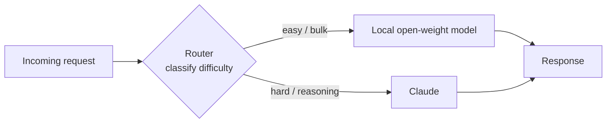

<LevelBadge level="advanced" />

L'inquadramento "modello di frontiera **oppure** modello locale" è una falsa scelta. I sistemi in produzione più economici, rispettosi della privacy e resilienti usano **entrambi** — un piccolo modello open-weight che gira localmente per il lavoro facile, ad alto volume o sensibile, e un modello di frontiera come Claude come **livello intelligente** che gestisce il ragionamento difficile. Questa pagina riguarda i *pattern* duraturi che collegano i due così che ciascuno faccia ciò in cui è migliore. I pattern sono neutrali rispetto al provider — Claude è semplicemente ottimo per il ruolo di "ragionamento" — e sopravvivono a qualsiasi nome di modello specifico.

<Callout type="objectives" items={[
  "Capire PERCHÉ un ibrido (frontiera + locale) batte ciascun modello da solo su costo, privacy e resilienza",
  "Imparare i cinque pattern ibridi duraturi: router/big-little, draft-then-refine, redazione della privacy, pre/post-processing di massa e fallback offline",
  "Per ogni pattern: sapere quando ricorrervi, il trade-off che accetti e uno schizzo concreto",
  "Progettare il tuo ibrido Claude+locale con un metodo ripetibile in quattro passi",
  "Sapere che questi pattern sono neutrali rispetto al provider — Claude si inserisce come 'livello intelligente', non come lock-in",
]} />

## Perché ibrido, non aut-aut

Un modello open-weight locale (vedi [Eseguire modelli localmente con Ollama](/docs/models/run-models-locally-ollama)) e un modello di frontiera sono bravi in cose *diverse*:

- **Il locale** è privato (i dati non lasciano mai la tua macchina), economico su scala (nessuna bolletta per token), a bassa latenza per i modelli piccoli e funziona offline. Ma ha un vero **divario di capacità** sui compiti di ragionamento più difficili, a lungo contesto e agentici.
- **Claude (frontiera)** guida proprio su quei compiti difficili, ma ogni chiamata costa token e invia dati a un'API cloud.

L'intuizione dietro ogni pattern qui sotto: **la maggior parte delle richieste è facile, e quelle difficili sono la minoranza.** Se un modello locale economico può gestire il grosso e riservi il modello di frontiera alla fetta davvero difficile, ottieni gran parte della qualità di frontiera a una frazione del costo — e puoi tenere i dati sensibili in locale. Il paper *Hybrid LLM* di Microsoft l'ha formalizzato: un router appreso che invia le query facili a un modello piccolo ha fatto **fino al 40% di chiamate in meno** al modello grande senza cali nella qualità delle risposte ([arXiv 2404.14618](https://arxiv.org/abs/2404.14618)). Il framework open-source [RouteLLM](https://github.com/lm-sys/RouteLLM) riporta risultati simili — qualità quasi-frontiera a circa **metà del costo** sui benchmark comuni instradando circa metà delle query al modello più economico.

> Scegli il tuo ibrido in base al **vincolo**, non all'hype. Se non sai ancora quale modello si adatta a quale compito, parti da [Scegliere un modello](/docs/models/choosing-a-model) — poi torna e decidi *dove sta il confine* tra locale e frontiera.

---

## Pattern 1 — Router / big-little

**L'idea.** Metti un sottile **classificatore** davanti a ogni richiesta. Guarda il compito e decide: facile/di massa → modello locale; ragionamento difficile → Claude. Preso in prestito dal design di CPU "big.LITTLE", dove un telefono esegue il lavoro in background su piccoli core efficienti e sveglia il core grande solo per il carico pesante.

**Quando usarlo.** Hai un flusso misto di richieste — molte banali, alcune davvero difficili — e vuoi pagare i prezzi di frontiera solo per quelle difficili. È l'ibrido da lavoro.

**Il trade-off.** Il router può *sbagliare*. Instrada male un compito difficile al modello locale e la qualità cala; instrada male uno facile a Claude e paghi troppo. Regoli una soglia per scambiare costo contro qualità, e dovresti **misurare** quella soglia sui tuoi dati con una piccola eval (vedi [Eval](/docs/power-user/evals)).

**Lo schizzo.** Il router può essere semplice come uno strato di regole (lunghezza, keyword, presenza di codice) o ricco come un piccolo modello classificatore. Un'opzione economica e trasparente è chiedere al modello **locale** stesso di classificare la difficoltà, poi smistare:

<PromptCard title="Prompt di classificazione del router (gira sul modello locale)">{`You are a request router. Classify the user request into exactly one tier.

Return ONLY a JSON object: {"tier": "...", "reason": "..."}

Tiers:
- "local"  → simple, mechanical, or high-volume: short rewrites, formatting,
             single-fact lookup, basic classification/extraction, boilerplate.
- "frontier" → hard reasoning, multi-step planning, long-context synthesis,
             ambiguous instructions, code that must be correct, anything where
             a wrong answer is costly.

Bias toward "local" when in doubt about a CHEAP, low-risk task,
and toward "frontier" when a mistake would be EXPENSIVE.

Request:
"""
{{REQUEST}}
"""`}</PromptCard>

L'output del router è una decisione di instradamento, non la risposta finale — tienilo minuscolo e veloce. Per un instradamento più ricco su molti strumenti o modelli, la stessa logica classifica-poi-smista si generalizza (e assomiglia a come i modelli scelgono tra i [tool](/docs/api/tool-use)).

---

## Pattern 2 — Draft-then-refine

**L'idea.** Il modello locale produce una **prima bozza economica**; Claude la **rifinisce, corregge o verifica**. Paghi token di frontiera per la rifinitura, non per la generazione da zero — e una buona bozza rende il lavoro di Claude più breve e affidabile.

**Quando usarlo.** Generazione aperta in cui una bozza grezza è molto più economica di una perfetta ma l'output finale deve essere di alta qualità: scrittura in forma lunga, codice, documenti strutturati, riassunti che devono essere esattamente corretti.

**Il trade-off.** Due chiamate al modello invece di una aggiungono latenza, e una *cattiva* bozza può ancorare il refiner verso i suoi errori. Il vantaggio emerge quando redigere è la parte costosa e la rifinitura è comparativamente economica — verifica sui tuoi dati che "bozza locale + rifinitura frontiera" batta davvero "la frontiera fa tutto" sul costo-per-output-accettabile.

**Lo schizzo.** Il modello locale redige → passa la bozza a Claude con un'istruzione mirata: *"Ecco una bozza. Correggi gli errori, stringi e verifica le affermazioni; restituisci la versione corretta."* È la stessa intuizione che alimenta lo **speculative decoding** a livello di token — un piccolo drafter propone, il modello grande verifica e tiene solo ciò che regge ([NVIDIA: speculative decoding](https://developer.nvidia.com/blog/an-introduction-to-speculative-decoding-for-reducing-latency-in-ai-inference/)). A livello di compito stai facendo la stessa cosa a mano: proposta economica, verifica costosa.

---

## Pattern 3 — Redazione della privacy

**L'idea.** Un modello locale (o tooling NLP locale) **rimuove i PII** dal testo *prima* che qualsiasi cosa sia inviata a un'API cloud. Claude ragiona sulla versione redatta; reinserisci i valori reali localmente al ritorno se serve.

**Quando usarlo.** Vuoi il ragionamento di frontiera ma gestisci dati regolamentati o sensibili (salute, finanza, record dei clienti) e i PII grezzi **non devono** lasciare il tuo ambiente. La redazione ti permette di usare il modello cloud sulla *forma* del problema senza esporre le persone dentro di esso.

**Il trade-off.** La redazione non è mai perfetta — un'entità mancata è una fuga di dati, e un'eccessiva redazione distrugge il contesto di cui il modello ha bisogno per rispondere bene. Tratta il redattore come un controllo di sicurezza: testa il suo recall, e tieni la mappatura di de-redazione rigorosamente in locale.

**Lo schizzo.** Esegui un detector/anonimizzatore locale sull'input, sostituendo le entità con placeholder (`[PERSON_1]`, `[EMAIL_1]`), invia il testo redatto a Claude, poi re-idrata i placeholder localmente. [Presidio](https://github.com/microsoft/presidio) open-source di Microsoft è il mattone comune qui — rileva e anonimizza PII e può usare un backend NLP innestabile, incluso un modello locale per un secondo passaggio sui casi difficili. Un dettaglio cruciale, spesso trascurato: reda **tutto** ciò che raggiunge il modello, inclusi i documenti recuperati e i risultati dei tool — non solo l'ultimo messaggio dell'utente.

---

## Pattern 4 — Pre/post-processing di massa

**L'idea.** Il modello locale gestisce il lavoro **ad alto volume e ripetitivo** — estrazione, classificazione, tagging, normalizzazione su migliaia di elementi — e Claude gestisce solo i **pochi casi difficili** che il modello locale segnala come a bassa confidenza.

**Quando usarlo.** Carichi di lavoro a pipeline: classificare 100k ticket di supporto, estrarre campi da una montagna di documenti, taggare un torrente di contenuti. Far passare ogni elemento attraverso un'API di frontiera sarebbe lento e costoso; la maggior parte degli elementi è facile.

**Il trade-off.** Ti serve un **segnale di confidenza / escalation** affidabile così che gli elementi giusti vengano scalati. Troppo zelante e paghi troppo; troppo timido e la qualità soffre sulla coda difficile. La confidenza auto-riportata dal modello locale è un punto di partenza, ma validala.

**Lo schizzo.** Il modello locale elabora l'intero batch e allega un punteggio di confidenza; gli elementi sotto una soglia (o che falliscono un controllo di schema/validazione) vengono scalati a Claude per la decisione difficile. È il Pattern 1 applicato a un batch invece che a una richiesta in tempo reale — la stessa economia "l'economico gestisce il grosso, la frontiera gestisce la coda" che le cascate sfruttano, spesso **40–70% di risparmio sui costi** con perdita di qualità minima sulla maggioranza facile.

---

## Pattern 5 — Fallback offline

**L'idea.** Il modello locale è la **rete di sicurezza**. Quando l'API cloud è giù, rate-limitata o irraggiungibile, le richieste ripiegano *sul* modello locale invece di fallire *del tutto*. Risposte degradate battono le pagine d'errore.

**Quando usarlo.** Tutto ciò in cui la disponibilità conta più della qualità sempre-migliore: strumenti interni che devono continuare a funzionare, funzionalità on-device, prodotti che non possono mostrare agli utenti un errore duro durante un'interruzione del provider.

**Il trade-off.** Le risposte di fallback sono **di qualità inferiore** per definizione — stai scambiando il tetto della frontiera per "funziona ancora". Rendi il degrado esplicito (etichettalo, restringi il set di funzionalità) invece di servire silenziosamente risposte più deboli come se fossero quelle vere.

**Lo schizzo.** Avvolgi le chiamate in una catena ordinata: prova Claude → su errore di disponibilità (timeout, 429/5xx), riprova con backoff → se fallisce ancora, instrada al modello locale. I gateway LLM come LiteLLM e OpenRouter implementano esattamente questo pattern di catena di fallback, incluso il caching dei prompt comuni così che una via offline possa comunque servire qualcosa di utile. Il principio duraturo: **tieni un modello locale caldo come ultima linea**, così un'interruzione degrada l'esperienza invece di romperla.

---

## Progetta il tuo ibrido Claude+locale

<Steps items={[
  {title: "Mappa la distribuzione delle tue richieste", body: "Campiona il traffico reale ed etichetta quale frazione è davvero difficile vs facile/di massa vs sensibile. La forma di questa distribuzione ti dice quale pattern ripaga — una lunga coda facile favorisce un router o il pre-processing di massa; una piccola fetta sensibile favorisce la redazione."},
  {title: "Scegli il pattern che corrisponde al vincolo", body: "Traffico misto in tempo reale → Pattern 1 (router). Generazione di alta qualità con budget → Pattern 2 (draft-then-refine). Dati regolamentati/sensibili → Pattern 3 (redazione). Volume a pipeline / batch → Pattern 4 (massa). La disponibilità è critica → Pattern 5 (fallback). Molti sistemi ne combinano due o tre."},
  {title: "Imposta il confine, poi misuralo", body: "Decidi dove il locale si ferma e Claude inizia (una soglia del router, un cutoff di confidenza, una policy di redazione). Esegui una piccola eval sui TUOI dati per dare numeri al compromesso costo-vs-qualità. Non fidarti di una classifica o del titolo di un vendor — misura sul tuo compito. Vedi la pagina Eval."},
  {title: "Aggiungi osservabilità e una valvola di sicurezza", body: "Logga ogni decisione di instradamento/escalation e il suo esito così da poter ri-regolare il confine man mano che modelli e traffico cambiano. Tieni un fallback esplicito (Pattern 5) così un'interruzione del provider degrada con grazia invece di rompersi."},
]} />

<VerifyNote lastVerified="2026-06-28" source="https://platform.claude.com/docs/en/about-claude/models/overview">
Nomi di modelli specifici, finestre di contesto, prezzi per token e rate limit cambiano di frequente e **non** sono ripetuti qui di proposito — sono la parte volatile. Prima di fissare una soglia di costo o qualità per un router o una cascata, controlla la lineup e i prezzi attuali dei modelli Claude alla fonte sopra, e i nomi attuali dei modelli locali nella <a href="https://ollama.com/library">libreria Ollama</a>. I pattern di questa pagina sono duraturi; i numeri esatti dietro il confine no.
</VerifyNote>

<Quiz title="Verifica te stesso" questions={[
  {q: "Qual è l'intuizione economica di fondo che fa funzionare ogni pattern ibrido?", options: ["I modelli locali sono sempre migliori dei modelli di frontiera", "La maggior parte delle richieste è facile; solo una minoranza necessita davvero del ragionamento di frontiera", "I modelli di frontiera sono più economici per token dei modelli locali"], answer: 1, explain: "Il grosso del traffico reale è facile. Se un modello locale economico gestisce la maggioranza facile e riservi il modello di frontiera alla minoranza difficile, ottieni gran parte della qualità a una frazione del costo. Quell'asimmetria è ciò che ogni pattern qui sfrutta."},
  {q: "Devi usare un modello di frontiera per ragionare sui record dei clienti, ma i PII grezzi non possono lasciare il tuo ambiente. Quale pattern si adatta?", options: ["Router / big-little", "Redazione della privacy", "Fallback offline"], answer: 1, explain: "La redazione della privacy rimuove i PII localmente prima che qualsiasi cosa raggiunga l'API cloud, così Claude ragiona su una versione redatta e i valori reali restano nel tuo ambiente. Il router decide DOVE inviare il lavoro; non rimuove i dati sensibili."},
  {q: "Qual è il rischio principale specifico del pattern router / big-little?", options: ["Può usare sempre e solo un modello", "Un compito instradato male costa qualità (difficile inviato al locale) o denaro (facile inviato alla frontiera)", "Richiede che l'API cloud sia online in ogni momento"], answer: 1, explain: "Il router è un classificatore e può sbagliare. Instradare male un compito difficile al modello debole danneggia la qualità; instradare male uno facile alla frontiera spreca denaro. Per questo regoli e misuri la soglia di instradamento sui tuoi dati."},
  {q: "Perché draft-then-refine a volte NON ne vale la pena?", options: ["Produce sempre qualità inferiore a una singola chiamata di frontiera", "Due chiamate aggiungono latenza, e una cattiva bozza locale può ancorare il refiner verso i suoi errori", "I modelli di frontiera non possono modificare testo che non hanno scritto"], answer: 1, explain: "Draft-then-refine vince solo quando redigere è la parte costosa e la rifinitura è economica. Due chiamate al modello aggiungono latenza, e una bozza debole può sviare il refiner — quindi verifica sui tuoi dati che bozza-locale + rifinitura-frontiera batta davvero la-frontiera-fa-tutto."},
]} />

<Flashcards title="I cinque pattern ibridi a colpo d'occhio" cards={[
  {front: "Router / big-little", back: "Classifica ogni richiesta, poi smista: facile/di massa → locale, ragionamento difficile → Claude. L'ibrido da lavoro. Trade-off: il router può instradare male — regola la soglia sui tuoi dati."},
  {front: "Draft-then-refine", back: "Il modello locale redige a poco prezzo; Claude rifinisce/verifica. Paghi token di frontiera per la rifinitura, non per la generazione. Trade-off: latenza extra, e una cattiva bozza può ancorare il refiner."},
  {front: "Redazione della privacy", back: "Un modello locale/strumento NLP rimuove i PII prima che qualsiasi cosa raggiunga l'API cloud; re-idrata in locale. Ti permette di usare il ragionamento di frontiera su dati sensibili. Trade-off: un'entità mancata è una fuga; reda anche i risultati dei tool e i documenti recuperati, non solo il messaggio dell'utente."},
  {front: "Pre/post-processing di massa", back: "Il locale gestisce estrazione/classificazione ad alto volume sull'intero batch; Claude gestisce solo le escalation a bassa confidenza. Pattern 1 applicato a un batch. Serve un segnale di confidenza/escalation affidabile."},
  {front: "Fallback offline", back: "Il modello locale è la rete di sicurezza: quando l'API cloud è giù o rate-limitata, ripiega SUL locale invece di fallire del tutto. Risposte degradate battono gli errori. Rendi il degrado esplicito."},
]} />

<Callout type="takeaways" items={[
  "Frontiera vs locale è una falsa scelta — i sistemi migliori usano entrambi, con Claude come 'livello intelligente' neutrale rispetto al provider per la minoranza difficile del lavoro",
  "Tutti e cinque i pattern cavalcano un'intuizione: la maggior parte delle richieste è facile ed economica; riserva la spesa di frontiera alla fetta davvero difficile",
  "Router/big-little è il cavallo da lavoro; draft-then-refine compra qualità con budget; la redazione sblocca i dati sensibili; il pre-processing di massa scala le pipeline; il fallback offline compra resilienza — e si compongono",
  "Ogni pattern ha un confine (una soglia, un cutoff di confidenza, una policy di redazione) — misuralo sui TUOI dati con una piccola eval, mai su una classifica",
  "Tieni i numeri volatili (nomi di modelli, prezzi, limiti) dietro un passo di verifica; i pattern sono duraturi, i dettagli no",
]} />

## Fonti e approfondimenti

- [Hybrid LLM: Cost-Efficient and Quality-Aware Query Routing (arXiv 2404.14618, ICLR 2024)](https://arxiv.org/abs/2404.14618)
- [RouteLLM — framework open-source per servire e valutare router LLM (GitHub, LMSYS)](https://github.com/lm-sys/RouteLLM)
- [RouteLLM: An Open-Source Framework for Cost-Effective LLM Routing (LMSYS blog)](https://www.lmsys.org/blog/2024-07-01-routellm/)
- [Microsoft Presidio — rileva, reda e anonimizza PII (GitHub)](https://github.com/microsoft/presidio)
- [Presidio PII masking with LiteLLM — tutorial](https://docs.litellm.ai/docs/tutorials/presidio_pii_masking)
- [An Introduction to Speculative Decoding (NVIDIA Technical Blog)](https://developer.nvidia.com/blog/an-introduction-to-speculative-decoding-for-reducing-latency-in-ai-inference/)
- [Model fallbacks — reliable AI with automatic failover (OpenRouter docs)](https://openrouter.ai/docs/guides/routing/model-fallbacks)
- [Anthropic — Panoramica dei modelli Claude](https://platform.claude.com/docs/en/about-claude/models/overview)
