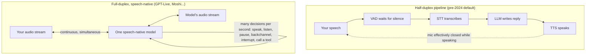

<LevelBadge level="beginner" />

Per un decennio, parlare con un computer significava fare a turno con un walkie-talkie che fingeva di essere una persona. L'**8 luglio 2026, OpenAI ha rilasciato GPT-Live** — un modello vocale che ascolta *mentre* parla — e l'era del walkie-talkie ha ufficialmente iniziato a finire. Questa pagina spiega cosa è davvero cambiato sotto il cofano, perché il vecchio stack vocale era condannato a sembrare robotico, e come giudicare tutto il panorama degli agenti vocali del 2026 senza l'hype.

<Callout type="objectives" items={[
  "Capire perché la classica pipeline STT → LLM → TTS sembrava sempre lenta — è fisica, non rifinitura",
  "Sapere cosa significa full-duplex: un unico modello speech-native che ascolta e parla simultaneamente",
  "Avere i fatti verificati su GPT-Live e il panorama vocale attuale (OpenAI, Google, ElevenLabs, Anthropic, modelli aperti)",
  "Sapere quando un agente vocale è genuinamente valido oggi — e cosa ancora si rompe",
]} />

<VerifyNote lastVerified="2026-07-13" source="https://openai.com/index/introducing-gpt-live/">
GPT-Live è stato lanciato giorni fa e i dettagli (livelli di modello, rollout, accesso API) si muovono in fretta. Nomi di prodotto, disponibilità e cifre di latenza su questa pagina sono deperibili — controlla la pagina di ciascun provider (linkata in Fonti) per la verità di oggi.
</VerifyNote>

## Il problema dei 200 millisecondi

Ecco il fatto che spiega tutto il resto su questa pagina: **gli umani si rispondono l'un l'altro in circa 0–200 millisecondi**. Uno studio cross-linguistico di riferimento su 10 lingue (Stivers et al., *PNAS* 2009) ha trovato che i divari di risposta si concentrano vicino a **0 ms** in ogni cultura testata — cominciamo abitualmente a rispondere *prima* che l'altra persona finisca, perché i nostri cervelli predicono la fine del suo turno.

Ora confronta il classico stack degli assistenti vocali. Era una **pipeline di tre modelli separati** incollati insieme:

1. **STT (speech-to-text)** trascrive il tuo audio in testo,
2. un **LLM** legge la trascrizione e scrive una risposta,
3. **TTS (text-to-speech)** ritrasforma la risposta in audio.

Ogni fase deve (perlopiù) finire prima che la successiva inizi, quindi i loro ritardi **si sommano**. Peggio, la pipeline non ha idea di quando hai smesso di parlare — l'audio non ha un pulsante "invia" — quindi gli ingegneri hanno appiccicato un timer di silenzio **VAD (voice activity detection)**: aspetta circa mezzo secondo o un secondo di silenzio, poi *indovina* che il turno è finito. Quel singolo espediente spiega entrambe le classiche modalità di fallimento: fermati a metà frase per pensare e il bot ti interrompe; finisci in modo netto e resta comunque lì ad aspettare il suo timer di silenzio. Somma tutto e ottieni 1–3 secondi di silenzio morto dove un umano si aspetta ~0–200 ms — **un ordine di grandezza troppo lento**, prima ancora che il modello abbia detto una parola.

E peggiora: la pipeline è **half-duplex**, come un walkie-talkie. Mentre il bot parla, non ascolta. Non puoi interrompere ("barge in") senza ingegneria speciale, il bot non può mai dire "mhmm" mentre *tu* parli, e qualsiasi sovrapposizione — la parte più umana della conversazione — è semplicemente impossibile per costruzione.

## Cosa significa davvero "full-duplex"

**Full-duplex** è un termine delle telecomunicazioni: entrambe le direzioni trasmettono *nello stesso momento* (una telefonata), contro **half-duplex**, dove si alternano (un walkie-talkie). Applicato alla voice-AI:

- **Il modello ascolta e parla simultaneamente.** Non c'è una macchina a stati "il tuo turno / il mio turno" — l'audio in ingresso arriva in streaming continuo mentre l'audio in uscita esce in streaming.
- **È speech-native.** Un unico modello consuma e produce audio direttamente, invece di tre modelli che si passano testo. Nessun passaggio di trascrizione, nessun passaggio di sintesi, nessuna latenza impilata — e nessuna perdita di informazione (tono, esitazione, ironia ed emozione sopravvivono, perché non sono mai stati appiattiti in testo).
- **Il turn-taking diventa un comportamento appreso, non un timer.** Secondo la descrizione di GPT-Live di OpenAI, il modello prende decisioni di interazione "molte volte al secondo": se parlare, continuare ad ascoltare, fare una pausa, dare conferma, interrompere o invocare uno strumento. L'espediente della rilevazione del silenzio scompare perché il modello *predice* le fini dei turni come fanno gli umani.
- **Backchannel e barge-in arrivano gratis.** Può mormorare "mhmm" mentre parli (un **backchannel**), fermarsi a metà frase nell'istante in cui tu ti inserisci (**barge-in**), o restare in silenzio mentre pensi — tutto impossibile o fatto di espedienti in una pipeline.

Pochi lo sanno: **il full-duplex non è stato inventato da OpenAI nel 2026.** Il laboratorio francese **Kyutai ha reso open-source Moshi nel 2024** — un modello vocale full-duplex con ~160 ms di latenza teorica / ~200 ms pratica che modella *due stream audio paralleli* (il tuo e il suo) e usa un "Inner Monologue" di token di testo allineati nel tempo per mantenere il suo parlato linguisticamente coerente. Puoi scaricare i pesi ed eseguirlo localmente oggi. Ciò che è cambiato questo mese è che il full-duplex è passato da demo di ricerca a **interfaccia predefinita per centinaia di milioni di utenti ChatGPT**.

## GPT-Live: cosa ha davvero rilasciato OpenAI

Verificato contro l'annuncio di OpenAI e la copertura del lancio (8 luglio 2026):

- **Due modelli: GPT-Live-1 e GPT-Live-1 mini.** Il mini sostituisce Advanced Voice Mode come default di ChatGPT Voice (incluso il piano gratuito); il più grande GPT-Live-1 è per i piani a pagamento. TechCrunch riporta che oltre **150 milioni di persone** usano già le funzioni vocali di ChatGPT.
- **Vera architettura full-duplex.** Elaborazione continua dell'input mentre genera l'output, con decisioni di parlare/ascoltare/pausa/interrompere/strumento prese molte volte al secondo. Fa backchannel ("mhmm", "sì"), gestisce scambi rapidi e — notevolmente — può **restare zitto** e assorbire semplicemente il contesto finché non viene chiamato in causa.
- **Delega a un modello di frontiera.** Per ricerca web, ragionamento più profondo o lavoro agentico, GPT-Live passa il compito al modello di frontiera di OpenAI (GPT-5.5 al lancio) **in background e continua a parlare con te** mentre il risultato torna. Il modello vocale è il front-end conversazionale; il pensiero pesante avviene altrove. Questo split "parlatore veloce + pensatore lento" è il pattern architetturale da tenere d'occhio.
- **Traduzione live** deriva dal design continuo ascolta-mentre-parli — il modello può rendere la tua frase in un'altra lingua quasi mentre la dici. (La copertura del lancio ha notato che la qualità dell'accento è ancora irregolare in alcune lingue.)
- **Nessuna API per sviluppatori al lancio.** GPT-Live è un prodotto ChatGPT per ora; OpenAI dice che l'accesso API sta arrivando e ha un modulo di iscrizione. Per chi costruisce, **gpt-realtime sulla Realtime API rimane l'attuale prodotto per sviluppatori** (vedi sotto).
- **Limiti noti al lancio:** nessun video/condivisione schermo nella sessione vocale, qualità irregolare al di fuori delle lingue principali, e OpenAI dice di monitorare gli effetti di dipendenza emotiva.

<VerifyNote lastVerified="2026-07-13" source="https://openai.com/index/introducing-gpt-live/">
La disponibilità per livello, l'esatto modello di frontiera dietro la delega e la tempistica dell'API sono le affermazioni che si muovono più in fretta qui — ricontrolla l'annuncio di OpenAI prima di ripeterle.
</VerifyNote>

## Il panorama vocale, verificato (luglio 2026)

| Attore | Cosa esiste | Full-duplex? | Note |
|---|---|---|---|
| **OpenAI — GPT-Live** | ChatGPT Voice (consumer) | **Sì** — speech-native | Delega i compiti difficili a un modello di frontiera a metà conversazione; nessuna API ancora |
| **OpenAI — Realtime API (gpt-realtime)** | API per sviluppatori, GA | Speech-to-speech, modello unico | Agenti vocali di produzione: chiamate telefoniche SIP, server MCP remoti, input immagine |
| **Google — Gemini Live API** | API per sviluppatori (AI Studio / Vertex, GA) | Native-audio, streaming | Barge-in, "proactive audio" (parla solo quando rilevante), dialogo affettivo, uso di strumenti + Google Search |
| **ElevenLabs — Agents** | Piattaforma di agenti (lanciata mar 2026) | Stack orchestrato con modello di turn-taking proprietario | TTS/STT + turn-taking + chiamate a strumenti; 70+ lingue; affermazioni di primo-turno sotto 500 ms; canali telefono/web/app |
| **Anthropic — Claude** | [Voice mode nelle app Claude](/docs/claude-app/voice-mode); push-to-talk `/voice` in Claude Code (mar 2026, multilingue fuori beta giu 2026) | **No** — a turni | Parla, ottieni risposte parlate con una trascrizione salvata. Nessun modello speech-native full-duplex annunciato alla data di verifica — non lasciare che nessuno ti dica il contrario |
| **Kyutai — Moshi** | Pesi aperti + codice (GitHub, Hugging Face) | **Sì** — la prova open-source | ~160–200 ms di latenza, audio a doppio stream, "Inner Monologue"; gira localmente |

Due conclusioni da quella tabella che gran parte della copertura manca: **(1)** "agente vocale" oggi significa due architetture diverse — modelli full-duplex genuinamente speech-native (GPT-Live, Moshi, native audio di Gemini) contro pipeline molto veloci e ben orchestrate con un modello di turn-taking appreso sopra (ElevenLabs Agents). Entrambe possono sembrare buone; solo la prima può sovrapporre il parlato. **(2)** L'opzione open-source è reale: Moshi dimostra che puoi eseguire il full-duplex sul tuo hardware, il che conta se il tuo caso d'uso non può inviare audio a un cloud (vedi [Scegliere un modello](/docs/models/choosing-a-model) per quel framework decisionale).

## Come scorre davvero una conversazione full-duplex

<Steps items={[
  {title: "L'audio arriva in streaming continuo", body: "Non c'è registra-poi-invia. L'audio del tuo microfono viene codificato in token frame dopo frame (il codec di Moshi usa frame da 80 ms) e alimentato al modello mentre arriva — anche mentre il modello è a metà frase."},
  {title: "Il modello prende micro-decisioni costantemente", body: "Molte volte al secondo sceglie: continua a parlare, fermati, resta in silenzio, lascia cadere un backchannel ('mhmm'), o inizia una risposta. Il turn-taking è una predizione che il modello ha appreso da conversazioni reali, non un timer di silenzio."},
  {title: "Tu interrompi; lui cede all'istante", body: "Il barge-in è nativo: il modello ti sente nel momento in cui inizi perché non ha mai smesso di ascoltare. Interrompe la propria frase, assorbe ciò che hai detto e si adatta — nessuna parola chiave 'stop' necessaria."},
  {title: "Le domande difficili vengono delegate, con delicatezza", body: "Chiedi qualcosa che richiede ricerca web o ragionamento reale e GPT-Live lo passa al modello di frontiera in background — mantenendo viva la conversazione ('fammi controllare... comunque—'). La risposta viene intrecciata di nuovo quando è pronta."},
  {title: "Il silenzio è una mossa valida", body: "Un modello full-duplex può deliberatamente non dire nulla — lasciandoti pensare ad alta voce senza dirottare il turno. I bot a pipeline letteralmente non potevano fare questo; il loro VAD trattava la tua pausa come un invito."},
]} />

## Quando gli agenti vocali sono ora validi — e cosa ancora si rompe

**Ora genuinamente validi:**

- **Assistenza clienti e workflow telefonici.** Turn-taking sotto il secondo più barge-in rimuovono i due maggiori fattori di lamentela. Il supporto SIP della Realtime API e ElevenLabs Agents puntano esattamente a questo.
- **Uso a mani libere e con gli occhi occupati.** Guida, cucina, lavoro sul campo, accessibilità — l'interazione finalmente sta al passo col parlato ([voice mode sulle app Claude](/docs/claude-app/voice-mode) copre già la versione cattura-e-trascrivi di questo).
- **Traduzione live e pratica linguistica.** L'ascolto-mentre-si-parla rende possibili per la prima volta l'interpretazione quasi simultanea e le esercitazioni di conversazione naturale.
- **La voce come front-end di un agente.** Il pattern di delega — chatta con un modello vocale veloce mentre un modello di frontiera lento fa il lavoro — è la scommessa dichiarata di OpenAI per gestire il "lavoro agentico di lunga durata" tramite voce.

**Ancora si rompono:**

- **Audio allucinato.** I modelli speech-native possono allucinare nel *suono*, non solo nei fatti: deriva verso la lingua sbagliata, nomi e numeri storpiati, o accenti sballati (la demo di traduzione del lancio di GPT-Live ha attirato esattamente questa critica). Non fidarti mai di un numero parlato che non hai confermato.
- **Ambienti rumorosi e crosstalk.** I microfoni sempre aperti sentono tutto — conversazioni laterali, TV, un secondo parlante. Il full-duplex rende il modello *più* esposto all'audio ambientale, non meno.
- **Sicurezza delle azioni in tempo reale.** Un modello che agisce a velocità di conversazione può agire su una frase male interpretata a velocità di conversazione. Qualsiasi agente vocale che tocca denaro, messaggi o cancellazioni ha bisogno di gate espliciti di conferma parlata e di una predisposizione verso default di sola lettura — le stesse regole di qualsiasi agente (vedi [Fondamenti](/docs/foundations)), ma con un canale di input a fedeltà inferiore.
- **Dipendenza emotiva.** Un sistema che fa backchannel, esita e non si stanca mai di te è ingegnerizzato per sembrare un amico. OpenAI stessa segnala di monitorare questo. Progetta (e usa) di conseguenza.

<PromptCard title="Scheletro di system prompt per un agente vocale (funziona su modelli speech-native e pipeline)">{`You are a voice assistant for {company}. You are SPEAKING, not writing.

Style:
- Short sentences. One idea per sentence. No lists, no markdown, no URLs read aloud.
- If the user interrupts, stop immediately and address what they said.
- If the user pauses mid-thought, stay silent. Do not fill silence.

Safety:
- Before ANY action that sends, buys, deletes, or changes something:
  say back exactly what you will do and wait for a clear spoken "yes".
- Repeat numbers, names, and addresses back for confirmation — always.
- If audio is unclear or noisy, say what you think you heard and ask.
- If asked for something outside {scope}, say so and offer a human handoff.`}</PromptCard>

<Quiz title="Mettiti alla prova" questions={[
  {q: "Perché il classico stack STT → LLM → TTS sembrava sempre lento?", options: ["I modelli erano troppo piccoli", "Tre fasi sequenziali più un timer di rilevazione del silenzio si sommano in 1–3 s di ritardo, contro i ~0–200 ms che gli umani si aspettano", "I microfoni aggiungono latenza", "Le voci TTS erano robotiche"], answer: 1, explain: "È strutturale: ogni fase aspetta la precedente, e un VAD aspetta il silenzio prima che qualcosa inizi. Gli umani rispondono entro ~0–200 ms (Stivers et al., PNAS 2009), quindi la pipeline era di un ordine di grandezza troppo lenta per progettazione."},
  {q: "Cosa può fare un modello full-duplex che una pipeline half-duplex non può, per costruzione?", options: ["Rispondere a domande fattuali", "Parlare più fluentemente", "Ascoltare mentre parla — abilitando barge-in, backchannel e parlato sovrapposto", "Usare strumenti"], answer: 2, explain: "L'half-duplex alterna i turni come un walkie-talkie: mentre il bot parla non ascolta. Ascoltare-e-parlare simultaneamente è la proprietà che definisce il full-duplex."},
  {q: "Come gestisce GPT-Live una domanda che richiede ricerca web o ragionamento profondo?", options: ["Rifiuta la voce per le domande difficili", "Mette in pausa la chiamata finché la risposta è pronta", "Risponde solo dalla memoria", "Delega a un modello di frontiera in background e mantiene la conversazione nel frattempo"], answer: 3, explain: "Lo split 'parlatore veloce + pensatore lento': il modello speech-native fa da front-end alla conversazione e passa il lavoro pesante a un modello di frontiera (GPT-5.5 al lancio), intrecciando di nuovo il risultato quando è pronto."},
  {q: "Quale di questi era vero PRIMA che GPT-Live fosse lanciato?", options: ["Un modello vocale full-duplex con ~200 ms di latenza era già open source (Moshi di Kyutai, 2024)", "Nessun modello poteva essere interrotto", "La voice-AI richiedeva una connessione internet per legge", "Claude aveva un modello speech-native full-duplex"], answer: 0, explain: "Moshi ha rilasciato pesi aperti nel 2024 con audio full-duplex a doppio stream e ~160–200 ms di latenza. Il significato di GPT-Live è rendere mainstream il full-duplex, non inventarlo. Le funzioni vocali di Claude rimangono a turni alla data di verifica."},
]} />

<Flashcards title="Vocabolario della voice-AI" cards={[
  {front: "Half-duplex", back: "Comunicazione che alterna le direzioni — stile walkie-talkie. La vecchia pipeline degli assistenti vocali: mentre il bot parla, non ascolta."},
  {front: "Full-duplex", back: "Entrambe le direzioni contemporaneamente, come una telefonata. Il modello ascolta e parla simultaneamente e decide molte volte al secondo se parlare, fare una pausa o cedere."},
  {front: "Modello speech-native", back: "Un unico modello che consuma e produce audio direttamente — nessuna fase STT/TTS, nessuna latenza impilata, e tono/emozione sopravvivono perché il parlato non è mai appiattito in testo."},
  {front: "Barge-in", back: "Interrompere l'agente a metà frase e farlo fermare e adattare all'istante. Nativo nel full-duplex; un espediente aggiunto nelle pipeline."},
  {front: "Backchannel", back: "Brevi segnali dell'ascoltatore — 'mhmm', 'sì', 'capito' — fatti mentre l'ALTRA parte parla. Impossibili nell'half-duplex per costruzione."},
  {front: "VAD / endpointing", back: "Voice activity detection: il timer di silenzio che le vecchie pipeline usavano per indovinare che avevi finito di parlare. Causa sia dei fallimenti ti-interrompo sia di quelli attesa-imbarazzante."},
  {front: "Latency stacking", back: "I ritardi della pipeline si sommano: attesa VAD + STT + LLM + TTS ≈ 1–3 s. Gli umani si aspettano ~0–200 ms — il divario che rendeva i bot robotici."},
  {front: "Delega (parlatore veloce / pensatore lento)", back: "Il pattern di GPT-Live: un modello speech-native veloce fa da front-end alla conversazione e passa ricerca/ragionamento a un modello di frontiera in background, mantenendo viva la chat nel frattempo."},
]} />

<Callout type="takeaways" items={[
  "Il vecchio stack non era mal costruito — era strutturalmente troppo lento: latenza impilata STT/LLM/TTS più un timer di silenzio, contro i ~0–200 ms che gli umani si aspettano",
  "Full-duplex = un unico modello speech-native che ascolta mentre parla; barge-in, backchannel e silenzio deliberato diventano comportamenti appresi, non espedienti",
  "GPT-Live (8 luglio 2026) rende mainstream il full-duplex in ChatGPT e apre la strada alla delega: modello vocale veloce davanti, ragionamento del modello di frontiera in background",
  "Il panorama si divide in due: full-duplex speech-native (GPT-Live, native audio di Gemini, Moshi — open source dal 2024) contro pipeline veloci orchestrate con turn-taking appreso (ElevenLabs Agents); la voce di Claude rimane a turni",
  "Gli agenti vocali sono ora validi per supporto, mani libere e traduzione — ma le allucinazioni audio, le stanze rumorose e la sicurezza delle azioni in tempo reale richiedono ancora gate di conferma",
]} />

## Prossimo

- [Il panorama dei modelli AI: scegliere un modello](/docs/models/choosing-a-model) — il framework decisionale, applicato a qualsiasi modalità
- [Parlare con Claude (Voice Mode)](/docs/claude-app/voice-mode) — cosa fanno oggi le funzioni vocali di Claude
- [Fondamenti](/docs/foundations) — token, contesto e le basi di sicurezza degli agenti che la voce eredita

## Fonti e approfondimenti

- [Introducing GPT-Live — OpenAI](https://openai.com/index/introducing-gpt-live/) — l'annuncio del lancio (8 luglio 2026)
- [OpenAI releases new voice models for more natural live conversations — TechCrunch](https://techcrunch.com/2026/07/08/openai-releases-new-voice-models-for-more-natural-live-conversations/) — copertura del lancio: livelli, 150 M utenti vocali, avvertenze sulla demo di traduzione
- [Introducing gpt-realtime and Realtime API updates for production voice agents — OpenAI](https://openai.com/index/introducing-gpt-realtime/) — l'attuale prodotto speech-to-speech per sviluppatori (GA)
- [Gemini Live API capabilities — Google AI for Developers](https://ai.google.dev/gemini-api/docs/live-api/capabilities) — native audio, barge-in, proactive audio, uso di strumenti
- [ElevenLabs Agents](https://elevenlabs.io/agents) — la piattaforma di agenti: modello di turn-taking, canali, lingue
- [Moshi: a speech-text foundation model for real-time dialogue — Kyutai (arXiv 2410.00037)](https://arxiv.org/abs/2410.00037) — l'architettura full-duplex aperta: doppi stream, Inner Monologue, 160 ms di latenza teorica
- [kyutai-labs/moshi — GitHub](https://github.com/kyutai-labs/moshi) — codice e pesi per eseguire il full-duplex localmente
- [Universals and cultural variation in turn-taking in conversation — Stivers et al., PNAS 2009](https://www.pnas.org/doi/10.1073/pnas.0903616106) — l'evidenza del divario di turno umano di ~0–200 ms
- [Claude Code rolls out a voice mode capability — TechCrunch](https://techcrunch.com/2026/03/03/claude-code-rolls-out-a-voice-mode-capability/) — lo stato dell'input vocale push-to-talk di Claude
