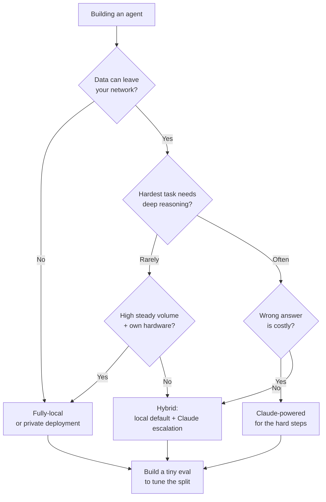

<LevelBadge level="intermediate" />

Stai costruendo un agente. Il primo vero bivio: gira su un modello a pesi aperti **completamente locale** (privato, gratuito da eseguire, tuo), su **Claude** (qualità di frontiera, ospitato), o su un **ibrido** di entrambi? Questa pagina è un framework decisionale — i fattori che lo decidono davvero, un chiaro flusso "se X → propendi per Y", e la realtà onesta che **di solito vince l'ibrido**: locale per il 90% facile/sensibile, Claude per il 10% difficile.

<Callout type="objectives" items={[
  "Nominare i fattori che decidono davvero locale vs Claude vs ibrido",
  "Percorrere un chiaro flusso decisionale 'se X → propendi per Y' per il tuo agente",
  "Capire perché un ibrido (default locale + escalation a Claude) spesso batte entrambi gli estremi",
  "Uscire con una piccola eval come spareggio — non una classifica",
]} />

<VerifyNote lastVerified="2026-06-28" source="https://artificialanalysis.ai/">
Le affermazioni durature qui — *un divario di capacità tra i migliori modelli a pesi aperti e quelli di frontiera esiste ma continua a restringersi*, e *routing/cascade (prima il modello economico, escalation sul difficile) risparmia costo mantenendo la qualità* — sono stabili. Ma i **numeri specifici** (quanto è grande il divario questo mese, quale modello aperto è in testa, i prezzi per-token di Claude, i token/sec esatti su un dato hardware) si muovono costantemente. Tratta qualsiasi cifra specifica come deperibile e controlla un tracker live come [Artificial Analysis](https://artificialanalysis.ai/) prima di scommetterci.
</VerifyNote>

## Le tre opzioni, in un respiro

- **Agente completamente locale** — un modello a pesi aperti (Llama, Qwen, Mistral, DeepSeek, ecc.) che gira sul tuo hardware tramite Ollama/LM Studio/vLLM. I dati non lasciano mai la tua macchina; nessun costo per-chiamata; funziona offline; limitato dal tuo hardware e dal tetto del modello. → [Agenti AI locali](/docs/models/local-ai-agents)
- **Agente alimentato da Claude** — chiama l'API di Claude. Ragionamento e uso di strumenti di frontiera, nessuna infrastruttura da babysittare, scala all'istante; ma i dati lasciano la tua rete, paghi per chiamata, e ti serve connettività.
- **Ibrido** — un modello locale gestisce il grosso routine/sensibile; i passi difficili o ad alto rischio escalano a Claude. Il pattern su cui converge la maggior parte degli agenti di produzione. → [Claude + Modelli locali](/docs/models/claude-plus-local-models)

## I fattori che lo decidono davvero

Fai passare il tuo agente attraverso questi. La maggior parte delle decisioni si risolve solo con i primi due o tre.

| Fattore | Propende **locale** quando… | Propende **Claude** quando… |
|---|---|---|
| **Sensibilità dei dati / privacy** | I dati sono regolamentati o non possono lasciare la tua rete | I dati sono non sensibili o hai un accordo sui dati conforme |
| **Difficoltà del compito e profondità di ragionamento** | I compiti sono ristretti, ben delimitati, ripetitivi | I compiti richiedono ragionamento multi-step profondo, lungo contesto, uso di strumenti complicato |
| **Esigenze di affidabilità** | Un retry o un umano vanno bene su un errore | Ogni passo deve essere giusto; i fallimenti sono costosi |
| **Latenza** | L'hardware locale risponde abbastanza in fretta | Preferisci pagare per la velocità che provisionare GPU |
| **Costo al tuo volume** | Volume alto e costante — l'hardware fisso si ammortizza | Volume basso/a picchi — pay-per-call batte le GPU inattive |
| **Requisito offline** | Deve girare air-gapped / senza connettività | Sempre-online va bene |
| **Hardware che hai** | Possiedi GPU capaci / memoria unificata | Non le hai, e non le vuoi comprare/affittare |
| **Budget di babysitting** | Puoi ottimizzarlo, quantizzarlo, valutarlo, mantenerlo | Vuoi che "funzioni e basta" senza ops |

**I due che di solito lo decidono:** se i dati *non possono* lasciare la tua rete, quello da solo ti spinge verso il locale (o un deployment privato) a prescindere da tutto il resto. Se possono, allora la **difficoltà del compito** è il prossimo fattore di svolta — il lavoro facile è economico da fare localmente; il ragionamento difficile è dove il [divario di frontiera](/docs/models/choosing-a-model) morde ancora.

<Callout type="info" items={[
  "Il divario di capacità pesi-aperti vs frontiera è reale ma si restringe in fretta — i migliori modelli aperti sono eccellenti su compiti di routine e molti compiti di coding, e ancora inseguono la maggioranza sul lavoro agentico, a lungo orizzonte e di ragionamento profondo più difficile.",
  "Quell'asimmetria è esattamente ciò che rende potente l'ibrido: manda la maggioranza facile/sensibile in locale, riserva Claude per la fetta che ha genuinamente bisogno di ragionamento di frontiera.",
]} />

## Il flusso decisionale

<Steps items={[
  {title: "I dati possono lasciare la tua rete?", body: "Se NO → locale (o un deployment privato/VPC) è la tua baseline. La privacy è un vincolo rigido, non una preferenza — domina gli altri fattori. Se SÌ → continua lungo il flusso."},
  {title: "Quanto è difficile la cosa più difficile che il tuo agente deve fare?", body: "Se ogni compito è ristretto e ripetitivo → un buon modello locale probabilmente supera l'asticella; propendi per il locale. Se alcuni passi richiedono ragionamento profondo, lungo contesto, o orchestrazione multi-strumento delicata → propendi per Claude almeno per quei passi."},
  {title: "Quanto è costosa una risposta sbagliata?", body: "Se un errore significa solo un retry o un'occhiata umana → le tolleranze locali vanno bene. Se un singolo passo cattivo è costoso o non sicuro → favorisci l'affidabilità di Claude dove conta."},
  {title: "Qual è il tuo volume e hardware?", body: "Volume alto e costante su hardware che già possiedi → il locale si ammortizza splendidamente. Volume basso o a picchi, nessuna GPU → il pay-per-call di Claude evita ferro inattivo."},
  {title: "Vuoi davvero gestire infrastruttura?", body: "Disposto a quantizzare, servire, monitorare e ri-valutare modelli → locale/ibrido è valido. Vuoi zero ops → Claude, o un ibrido dove la parte locale è semplicissima."},
  {title: "Default all'ibrido, poi dimostra che non ti serve", body: "Modello locale come worker predefinito; Claude come percorso di escalation per la fetta difficile/ad alto rischio. Inizia qui a meno che il passo 1 non forzi il puro-locale o il compito sia uniformemente difficile (allora puro-Claude)."},
]} />

## Perché l'ibrido spesso vince

La maggior parte dei carichi di lavoro reali è **sbilanciata**: una grande maggioranza di richieste è facile e/o sensibile, e una piccola minoranza è genuinamente difficile. Un ibrido sfrutta quella forma direttamente.

- **Il locale gestisce il 90% facile/sensibile** — veloce, gratuito al margine, privato, capace di offline. Il grosso del tuo traffico non tocca mai un'API.
- **Claude gestisce il 10% difficile** — il ragionamento multi-step, i casi limite ambigui, i passi dove essere giusti conta. Paghi prezzi di frontiera solo sulla fetta che ha bisogno di qualità di frontiera.

Questo è il pattern **cascade / routing**: prova prima il modello economico (locale); escala a Claude quando un segnale di qualità dice che la risposta locale non è abbastanza buona, o instrada in anticipo con un classificatore di difficoltà/sensibilità. È un modo ben consolidato per tenere la maggior parte della qualità pagando una frazione del costo di tutto-frontiera — e funge anche da confine di privacy, dato che i casi sensibili possono essere fissati a "solo locale".

<PromptCard title="Auto-verifica prima di impegnarti su un estremo">{`Answer for YOUR agent:
1. Must any data stay on my machine?            (yes -> local baseline)
2. What % of tasks are genuinely HARD?          (high -> Claude leans heavier)
3. What's a wrong answer cost me?               (high -> Claude on those steps)
4. My volume + hardware?                        (high+own GPU -> local amortizes)
5. Can I babysit infra?                         (no -> Claude or simple hybrid)

If answers conflict -> you've just described a HYBRID.
Now build the tiny eval below and let DATA pick the split.`}</PromptCard>

L'avvertenza onesta: l'ibrido ha **più parti in movimento** — due percorsi di modello, un router, e un segnale di qualità da mantenere. Se il tuo agente è uniformemente semplice *o* uniformemente difficile, una configurazione a modello singolo è più semplice e probabilmente giusta. Ricorri all'ibrido quando il tuo carico di lavoro è genuinamente sbilanciato.

<Flashcards title="Vocabolario della guida alla decisione" cards={[
  {front: "Agente completamente locale", back: "Agente alimentato da un modello a pesi aperti sul tuo hardware. Privato, nessun costo per-chiamata, capace di offline; limitato dal tuo hardware e dal tetto del modello."},
  {front: "Agente alimentato da Claude", back: "Agente che chiama l'API di Claude. Ragionamento e uso di strumenti di frontiera, nessuna infrastruttura, scala all'istante; i dati lasciano la tua rete e paghi per chiamata."},
  {front: "Ibrido (cascade / routing)", back: "Il modello locale gestisce la maggioranza facile/sensibile; Claude gestisce la minoranza difficile/ad alto rischio. Prova-prima-l'economico-poi-escala, o instrada per difficoltà/sensibilità in anticipo."},
  {front: "Il fattore decisivo, di solito", back: "Prima la sensibilità dei dati (possono lasciare la rete?), poi la difficoltà del compito (quanto è difficile il passo più difficile?). Il resto sono spareggi."},
  {front: "Il divario di capacità", back: "I migliori modelli a pesi aperti inseguono i modelli di frontiera principalmente sui compiti di ragionamento/agentici più difficili. Reale ma in restringimento — che è esattamente perché l'ibrido è così efficace."},
]} />

<Quiz title="Mettiti alla prova" questions={[
  {q: "Il tuo agente elabora dati che legalmente non possono lasciare la tua rete. Cosa implica questo per primo?", options: ["Usa Claude — è di qualità più alta", "Un deployment completamente locale o privato è la baseline, a prescindere dagli altri fattori", "Scegli quello più economico per token"], answer: 1, explain: "La privacy è un vincolo rigido. Se i dati non possono lasciare la rete, quello domina la decisione — locale (o un deployment privato/VPC) è la tua baseline prima di pesare qualsiasi altra cosa."},
  {q: "Perché un agente ibrido spesso vince per un carico di lavoro tipico e sbilanciato?", options: ["I modelli di frontiera sono sempre più economici su scala", "Il locale gestisce la maggioranza facile/sensibile a buon mercato e privatamente; Claude è riservato per la minoranza difficile che ha bisogno di ragionamento di frontiera", "Elimina la necessità di qualsiasi valutazione"], answer: 1, explain: "La maggior parte dei carichi di lavoro è sbilanciata. Instradare il 90% facile/sensibile a un modello locale e il 10% difficile a Claude tiene la maggior parte della qualità a una frazione del costo di tutto-frontiera — e fissa i casi sensibili al locale."},
  {q: "Quando una configurazione a modello singolo (puro-locale O puro-Claude) è la scelta migliore rispetto all'ibrido?", options: ["Sempre — l'ibrido non vale mai la pena", "Quando il carico di lavoro è uniformemente semplice o uniformemente difficile, così il router extra e il macchinario del segnale di qualità non si ripagano", "Solo quando non hai GPU"], answer: 1, explain: "L'ibrido aggiunge parti in movimento (due percorsi, un router, un segnale di qualità). Se i tuoi compiti sono tutti facili o tutti difficili, un modello è più semplice e di solito giusto. L'ibrido si ripaga quando il carico di lavoro è genuinamente sbilanciato."},
]} />

## Poi fai l'unica cosa che lo risolve: testalo

Ogni fattore sopra restringe il campo; **una piccola eval sceglie il vincitore.** Non scegliere a naso o su una classifica pubblica.

- Raccogli **10–50 casi reali** dal tuo carico di lavoro effettivo, con risposte note-corrette (includi i tuoi casi più difficili e più sensibili).
- Esegui la tua shortlist — un modello locale candidato, Claude, e (se rilevante) un router ibrido — sugli stessi casi.
- Valuta la qualità, poi pesa **costo e latenza al tuo volume reale**. Un guadagno di qualità del 2% che costa 10× può non valerne la pena; un guadagno del 2% sul passo che deve essere giusto potrebbe essere non negoziabile.
- Per un ibrido, l'eval ti dice anche **dove tracciare la linea** — cosa viene escalato a Claude e cosa resta locale.

Conserva l'eval. Quando esce un nuovo modello a pesi aperti o i prezzi cambiano, rieseguirla trasforma una migrazione angosciante in un controllo di cinque minuti. → [Eval](/docs/power-user/evals)

<Callout type="takeaways" items={[
  "Decidi nell'ordine: prima la sensibilità dei dati (possono lasciare la rete?), poi la difficoltà del compito (quanto è difficile il passo più difficile?). Il resto — latenza, volume, hardware, budget di babysitting — sono spareggi.",
  "Il puro-locale vince su privacy, offline e costo a volume alto e costante; Claude vince sul ragionamento più difficile, l'affidabilità e la scala zero-ops.",
  "L'ibrido di solito vince per carichi sbilanciati: locale per il 90% facile/sensibile, Claude per il 10% difficile — cascade/instrada e paga prezzi di frontiera solo dove si guadagnano.",
  "Il divario pesi-aperti è reale ma in restringimento — che è esattamente ciò che rende l'ibrido così efficace oggi.",
  "Non decidere a naso: costruisci una piccola eval sui TUOI dati, pesa costo e latenza al TUO volume, e conservala per la prossima release di modello.",
]} />

## Fonti e approfondimenti

- [Artificial Analysis](https://artificialanalysis.ai/) — confronti indipendenti e frequentemente aggiornati di capacità/prezzo/velocità tra modelli aperti e di frontiera (il posto dove ricontrollare le specifiche deperibili).
- [Anthropic — Panoramica dei modelli](https://docs.anthropic.com/en/docs/about-claude/models) — l'attuale lineup di Claude, contesto e capacità.
- [Anthropic — Prezzi API](https://www.anthropic.com/pricing) — costi per-token attuali per dimensionare i tuoi conti a volume.
- [Ollama](https://ollama.com/) · [LM Studio](https://lmstudio.ai/) — esegui modelli a pesi aperti localmente per il percorso locale/ibrido.
- [Meta — Llama](https://www.llama.com/) · [Mistral — Modelli](https://docs.mistral.ai/getting-started/models/) — famiglie a pesi aperti comunemente usate negli agenti locali.

## Prossimo

- Costruisci il lato locale → [Agenti AI locali](/docs/models/local-ai-agents)
- Cabla l'ibrido → [Claude + Modelli locali](/docs/models/claude-plus-local-models)
- Inquadra la scelta in modo ampio → [Scegliere un modello](/docs/models/choosing-a-model)
- Rendi la decisione misurabile → [Eval](/docs/power-user/evals)
