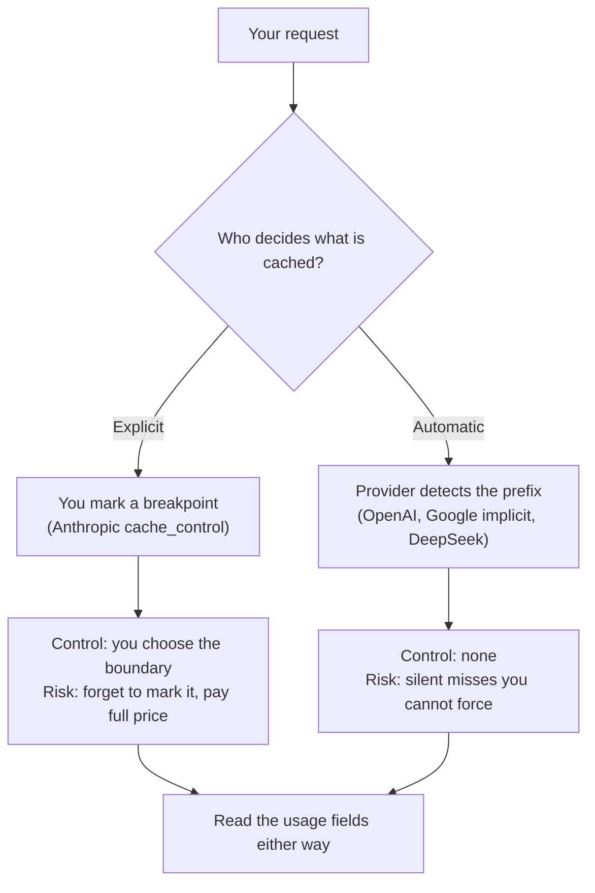

<LevelBadge level="advanced" />

<VerifyNote lastVerified="2026-09-26" source="https://platform.claude.com/docs/en/build-with-claude/prompt-caching">
Ogni numero di questa pagina è una tariffa o una soglia pubblicata che i provider cambiano secondo i propri tempi — e i prezzi del caching di Gemini di Google hanno un aumento già programmato per il 2027-01-01. Ricontrolla la documentazione di ciascun provider prima di fare un budget: [Anthropic](https://platform.claude.com/docs/en/build-with-claude/prompt-caching) · [OpenAI](https://developers.openai.com/api/docs/guides/prompt-caching) · [Google](https://ai.google.dev/gemini-api/docs/caching) · [DeepSeek](https://api-docs.deepseek.com/guides/kv_cache).
</VerifyNote>

Il prompt caching è la leva di costo più grande in un'applicazione LLM in produzione — abitualmente un taglio superiore al 90% sul lato input. Ce l'hanno ormai tutti i principali provider. Il che rende facile dare per scontato che sia la stessa funzione ovunque, e non lo è.

Il meccanismo è identico: il provider riutilizza il **prefisso** già elaborato del tuo prompt invece di rileggerlo. Ciò che cambia è chi decide, quanto vive la cache, quanto deve essere lungo un prefisso per qualificarsi e — quella che fa male — **se paghi un sovrapprezzo per scriverla**. Un carico di lavoro tarato su un provider può silenziosamente smettere di usare la cache, oppure costare *di più* che non usarla affatto, sul provider successivo.

<Callout type="objectives" items={[
  "Distinguere i due modelli di controllo — breakpoint espliciti contro rilevamento automatico del prefisso — e cosa ti costa ciascuno",
  "Leggere la tabella tra provider: prefisso minimo, TTL, sconto in lettura, sovrapprezzo in scrittura e il campo di usage che dimostra un hit",
  "Applicare la regola portabile del punto di pareggio: quanti riutilizzi dentro il TTL prima che la cache convenga",
  "Evitare le cinque trappole che uccidono silenziosamente una cache quando porti un carico di lavoro da un provider all'altro",
  "Verificare un hit rate reale su qualsiasi provider a partire dall'usage della risposta, non dalla documentazione",
]} />

Se lavori solo su Claude, leggi prima [Prompt Caching & Cost Optimization](/docs/api/prompt-caching) — insegna il meccanismo `cache_control` in profondità. Questa pagina è il livello di portabilità che ci sta sopra.

## I due modelli di controllo

Tutto in questo ambito ricade in uno di due design, e il design decide la tua modalità di fallimento.



**Esplicito** (Anthropic): attacchi un marcatore all'ultimo blocco stabile. Niente viene messo in cache finché non lo chiedi. Ottieni il controllo esatto del confine e puoi piazzarne diversi. Ti porti anche il bug: un prompt senza breakpoint paga il prezzo pieno per sempre, e nulla ti avvisa.

**Automatico** (OpenAI, caching implicito di Google, DeepSeek): il provider calcola l'hash del tuo prefisso e riutilizza ciò che può. Niente da configurare, e niente da sistemare quando manca il bersaglio. La tua unica leva è il *layout* del prompt — contenuto stabile per primo — più, su OpenAI, un suggerimento di routing.

:::tip La leva che resta in entrambi i modelli
L'ordine del prefisso è l'unico controllo che funziona ovunque. **Contenuto stabile prima, contenuto volatile dopo.** Sui sistemi espliciti decide dove può stare il tuo breakpoint; su quelli automatici è l'*unica* cosa che controlli.
:::

## La tabella tra provider

<VerifyNote lastVerified="2026-09-26" source="https://developers.openai.com/api/docs/guides/prompt-caching">
I rapporti di lettura qui sotto sono multipli del prezzo base di input di ciascun provider, non dollari assoluti — è questo che li rende confrontabili. I prezzi assoluti stanno su [Modelli e prezzi](/docs/whats-new/models-and-pricing) e sulla pagina prezzi di ogni provider.
</VerifyNote>

| | Anthropic (Claude) | OpenAI | Google (Gemini) | DeepSeek |
|---|---|---|---|---|
| **Controllo** | `cache_control` esplicito, fino a 4 breakpoint | Automatico, per corrispondenza di prefisso | Implicito di default; disponibili anche oggetti cache espliciti | Automatico, su disco |
| **Prefisso minimo** | 512 token su Fable 5.1 / Mythos 5.1 / Opus 5.5 / Opus 5 / Fable 5 / Mythos 5; 1.024 su Sonnet 5 e Opus 4.8; 2.048–4.096 sui modelli più vecchi | 1.024 token su GPT-5.6 e successivi; prima di quello varia in base alle impostazioni della richiesta | 4.096 token su Gemini 3.5–3.8 Flash e 3.1 Pro Preview; 2.048 su Gemini 2.5 Flash / Pro | Non pubblicato come conteggio di token — le unità di cache cadono ai confini di richiesta, sui prefissi comuni rilevati e a intervalli fissi di token |
| **TTL** | 5 minuti di default; 1 ora opzionale | 30 minuti di default su GPT-5.6+ tramite `prompt_cache_options.ttl`; i modelli precedenti usano `prompt_cache_retention` — in memoria (tipicamente 5–10 min) oppure 24h | Nessun default fisso pubblicato per il caching implicito | Eliminazione automatica «entro poche ore o pochi giorni» quando non è più usata |
| **Lettura dalla cache** | 0,1× input base; 0,05× su Opus 5.5; 0,025× su Fable 5.1 / Mythos 5.1 | 0,1× input base | Pubblicata come tariffa separata di input in cache (0,1× la tariffa standard su Gemini 3.8 Flash fino al 2026-12-31) | Tariffa separata di input per cache-hit, all'incirca 1/30 della tariffa di miss su `deepseek-v4-pro` |
| **Sovrapprezzo di scrittura** | 1,25× input base per il livello a 5 minuti; 2× per il livello a 1 ora | 1,25× input base su GPT-5.6+ | Nessuno per il caching implicito; il caching esplicito fattura lo **storage** a 0,50 $ per milione di token all'ora su Gemini 3.8 Flash fino al 2026-12-31 | Nessuno pubblicato |
| **Prova di un hit** | `cache_read_input_tokens` e `cache_creation_input_tokens` in `usage` | Conteggio dei token in cache in `usage` | `usage.total_cached_tokens` | `prompt_cache_hit_tokens` e `prompt_cache_miss_tokens` |
| **Contabilizzazione / suggerimento di routing** | Posizionamento del breakpoint | `prompt_cache_key` — contabilizzazione separata della cache su GPT-5.6+, routing della cache prima di quello | — | — |

Per i modelli aperti self-hosted la stessa idea esiste un livello più in basso come **prefix caching** nel motore di serving: vLLM e SGLang riutilizzano i blocchi della KV-cache per un prefisso condiviso. Non c'è un prezzo per token, quindi non c'è un pareggio da calcolare — il costo è VRAM, e il guadagno è latenza di prefill, non la bolletta. vLLM lo espone come `enable_prefix_caching`; sul motore V1 è attivo di default, quindi su una build attuale è più probabile che tu lo stia *disattivando* piuttosto che attivando. Vedi [Eseguire i modelli in locale con Ollama](/docs/models/run-models-locally-ollama) e [Uno stack AI locale e privato](/docs/models/private-local-ai-stack).

## La regola del punto di pareggio

Ecco la parte che la documentazione dei provider lascia come esercizio. La cache non è gratis sui sistemi espliciti, e da GPT-5.6 non lo è più nemmeno su OpenAI. Un sovrapprezzo di scrittura significa che **un prefisso che riutilizzi una sola volta può costarti più che non metterlo in cache.**

Sia `P` quanto costerebbe il prefisso alla tariffa base di input, `w` il moltiplicatore di scrittura, `r` il moltiplicatore di lettura e `N` il numero di chiamate che condividono il prefisso **dentro una finestra di TTL**.

```text
Without caching:  N · P
With caching:     w · P  +  (N − 1) · r · P

Caching wins when:   w + (N − 1) · r  <  N
Which solves to:     N  >  (w − r) / (1 − r)
```

Sostituisci i moltiplicatori pubblicati:

| Livello | w | r | N di pareggio | Riutilizzi necessari |
|---|---|---|---|---|
| Anthropic 5 minuti, Opus 5.5 | 1,25 | 0,05 | 1,26 | **2 chiamate** |
| Anthropic 5 minuti, livello di lettura standard | 1,25 | 0,1 | 1,28 | **2 chiamate** |
| Anthropic 1 ora | 2 | 0,1 | 2,11 | **3 chiamate** |
| OpenAI GPT-5.6+ | 1,25 | 0,1 | 1,28 | **2 chiamate** |
| Automatico, nessun sovrapprezzo di scrittura | 1 | 0,1 | 0 | **1 chiamata** — mai una perdita |

Quindi la regola pratica è breve: **due hit dentro il TTL e sei in guadagno; portali a tre prima di comprare il livello da 1 ora.** Sotto quella soglia, mettere in cache un prefisso è una piccola perdita silenziosa.

<Callout type="tip" items={[
  "N conta le chiamate dentro una finestra di TTL, non le chiamate al giorno. Un prefisso riutilizzato 1.000 volte al giorno a raffiche distanti 20 minuti ripaga la scrittura a ogni raffica.",
  "Il livello da 1 ora non è un upgrade automatico. Raddoppia il sovrapprezzo di scrittura per comprare una finestra 12 volte più lunga — conviene solo quando il tuo traffico è davvero rado."
]} />

### Esempio svolto: un prefisso da 50k token, 1.000 chiamate al giorno

Su Claude Opus 5.5 — input base 4 $/MTok, scrittura a 5 minuti 5 $/MTok, lettura 0,20 $/MTok, tutto dalla tabella prezzi di Anthropic:

<Steps items={[
  {title: "Nessuna cache", body: "50.000 token x 1.000 chiamate = 50M token di input. A 4 $/MTok fanno 200 $/giorno, tutti i giorni, per contenuto che non è mai cambiato."},
  {title: "Traffico distribuito uniformemente — una scrittura", body: "1.000 chiamate al giorno sono una chiamata ogni ~86 secondi, comodamente dentro il TTL di 5 minuti, quindi la cache non scade mai. Una scrittura (50k a 5 $/MTok = 0,25 $) più 999 letture (49,95M a 0,20 $/MTok = 9,99 $) fanno circa 10,24 $/giorno — un taglio del 95%."},
  {title: "Traffico a raffiche — 100 scritture", body: "Le stesse 1.000 chiamate, che arrivano in 100 raffiche con intervalli superiori a 5 minuti. Ora paghi 100 scritture (5M a 5 $/MTok = 25 $) più 900 letture (45M a 0,20 $/MTok = 9 $) — circa 34 $/giorno. Sempre un taglio dell'83%, ma 3,3 volte la bolletta del traffico uniforme."},
  {title: "Decidere sul livello da 1 ora", body: "Con 100 raffiche al giorno distanti in media ~14 minuti, una finestra da 1 ora fa collassare la maggior parte di quelle 100 scritture in una manciata. Il sovrapprezzo di scrittura raddoppia, quindi confronta la riga delle scritture del passo 3 con il numero ridotto di scritture prima di cambiare."}
]} />

Il punto didattico è il passo 3 contro il passo 2: **lo stesso volume di chiamate, lo stesso prefisso e una differenza di 3,3 volte nella bolletta, decisa interamente dal pattern di arrivo rispetto al TTL.** Il pattern di arrivo è la variabile che nessuno mette nel foglio di calcolo.

## Cinque trappole quando porti un carico di lavoro

<Callout type="warning" items={[
  "Divario di TTL: un job che gira ogni 10 minuti fa hit sul default di 30 minuti di OpenAI e manca sul default di 5 minuti di Anthropic. Stesso codice, stesso prompt, hit rate zero.",
  "Divario di soglia: un system prompt da 2.500 token va in cache su Claude Opus 5.5 (minimo 512 token) e su GPT-5.6 (1.024) ma non su Gemini 3.8 Flash (4.096). Fallisce in silenzio — nessun errore, solo una bolletta a prezzo pieno.",
  "Divario di invalidatori: ogni provider invalida quando il prefisso cambia, ma i trigger non ovvi sono diversi. Su Anthropic invalidano le modifiche alle definizioni dei tool, a tool_choice o (a seconda del modello) alle impostazioni di thinking ed effort. Su OpenAI invalidano le modifiche al modello, alle definizioni dei tool, agli schemi, al reasoning effort, alla verbosity o alla compattazione del contesto.",
  "Divario di sovrapprezzo di scrittura: portare un prefisso a basso riutilizzo da un provider automatico a uno esplicito può renderlo più costoso del non usare la cache. Applica la regola del pareggio qui sopra prima di piazzare un breakpoint.",
  "Divario di osservabilità: i nomi dei campi di usage non condividono alcuna convenzione. Qualsiasi dashboard che legge i campi di cache di un provider ha bisogno di un adattatore per provider, altrimenti dopo una migrazione il tuo hit rate risulta zero."
]} />

L'unico meccanismo specifico di Anthropic senza equivalenti altrove: la cache viene cercata su una **finestra di lookback di 20 blocchi** per breakpoint. Una conversazione che cresce di continuo può superare quella finestra e smettere di fare hit anche se il prefisso non è cambiato — vedi [L'economia del prompt caching](/docs/frontiers/prompt-caching-economics) per le regole di invalidazione complete.

## Verificalo, non darlo per scontato

La documentazione descrive le intenzioni; `usage` descrive ciò che ti è stato fatturato. Controlla l'hit rate reale su ogni provider su cui giri.

<PromptCard title="Verificare l'hit rate della cache di un carico di lavoro">{`Audit prompt caching for this codebase.

1. List every place we call an LLM API, with the provider and model.
2. For each call site, identify the prefix that is stable across calls
   and anything volatile that appears BEFORE it (timestamps, user IDs,
   reordered tool lists, freshly serialized JSON with unstable key order).
3. Report the token length of each stable prefix and compare it to that
   provider's minimum cacheable length. Flag any prefix below it.
4. Estimate the typical gap between consecutive calls sharing each prefix
   and compare it to that provider's cache TTL. Flag any gap that exceeds it.
5. Show me where we read the cache fields back from the response usage.
   If we never read them, say so plainly — that is the finding.

Do not change any code. Give me a table of call site, provider, prefix
tokens, minimum, typical gap, TTL, and the fields we read.`}</PromptCard>

Due firme di guasto che vale la pena nominare, perché su una dashboard sembrano identiche e hanno soluzioni opposte:

- **Token in cache sempre a zero** su richieste ripetute che dovrebbero condividere un prefisso → un valore volatile sta prima del tuo contenuto stabile, oppure il prefisso è sotto il minimo. Confronta i byte del prompt *renderizzato* tra due chiamate.
- **Token in cache diversi da zero ma la bolletta non si muove** → il prefisso va in cache ma è corto rispetto al tuo suffisso volatile. La cache funziona; non è lì che vanno i tuoi soldi. Guarda invece i token di output e [perché gli agenti bruciano token](/docs/models/why-agents-burn-tokens).

<Flashcards title="Fissa i termini" cards={[
  {front: "Caching esplicito contro automatico", back: "Esplicito (Anthropic): piazzi un breakpoint, niente va in cache finché non lo fai. Automatico (OpenAI, Gemini implicito, DeepSeek): il provider fa la corrispondenza di prefisso per te, e non puoi forzare un hit."},
  {front: "Sovrapprezzo di scrittura", back: "Il sovrapprezzo sulla chiamata che popola la cache — 1,25x l'input base sul livello a 5 minuti di Anthropic e su OpenAI GPT-5.6+, 2x sul livello a 1 ora di Anthropic. È il motivo per cui un prefisso riutilizzato una sola volta può costare di più in cache che senza."},
  {front: "N di pareggio", back: "(w - r) / (1 - r), dove w è il moltiplicatore di scrittura e r quello di lettura. Due riutilizzi dentro il TTL per i livelli a 5 minuti, tre per il livello a 1 ora di Anthropic."},
  {front: "Finestra di TTL", back: "Quanto sopravvive una voce non usata. Anthropic 5 minuti (1 ora opzionale); OpenAI 30 minuti di default su GPT-5.6+, con un'opzione di retention a 24h sui modelli precedenti. N si conta dentro una finestra, non per giorno."},
  {front: "Fatturazione dello storage", back: "Esclusiva del caching esplicito di Gemini: paghi per tenere la cache per token-ora (0,50 $ per milione di token all'ora su Gemini 3.8 Flash fino al 2026-12-31), in aggiunta alla tariffa di input in cache. Il caching implicito non ha costi di storage."},
  {front: "Prefix caching (self-hosted)", back: "Lo stesso riutilizzo un livello più in basso, in vLLM o SGLang, sui blocchi della KV-cache. Nessun prezzo per token, quindi nessun pareggio — paghi in VRAM e guadagni in latenza di prefill."}
]} />

<Quiz title="Mettiti alla prova" questions={[
  {q: "Un prefisso verrà riutilizzato esattamente due volte dentro la finestra. Quale livello è la scelta sbagliata?", options: ["Il livello a 5 minuti di Anthropic", "Il livello a 1 ora di Anthropic", "Un provider automatico senza sovrapprezzo di scrittura"], answer: 1, explain: "Il sovrapprezzo di scrittura 2x del livello a 1 ora richiede N > 2,11, quindi tre riutilizzi. A esattamente due, è una piccola perdita. Il livello a 5 minuti pareggia a 1,28 e il provider automatico non perde mai."},
  {q: "Un system prompt da 2.500 token andava bene in cache su Claude e ha smesso di farlo dopo il passaggio a Gemini 3.8 Flash. Causa più probabile?", options: ["Gemini non supporta il caching", "Il prefisso è sotto il minimo di 4.096 token di Gemini", "Il TTL della cache è scaduto a metà richiesta"], answer: 1, explain: "Gemini 3.8 Flash richiede 4.096 token di input per essere idoneo alla cache; Claude Opus 5.5 ne richiede 512. Un prefisso da 2.500 token supera un'asticella e non l'altra, senza alcun errore — solo una bolletta a prezzo pieno."},
  {q: "Stesso prompt, stesse 1.000 chiamate al giorno. Perché la bolletta dovrebbe triplicare?", options: ["È cambiato il modello", "Sono cresciuti i token di output", "Le chiamate sono arrivate in raffiche più distanti del TTL, ripagando la scrittura ogni volta"], answer: 2, explain: "L'N di pareggio conta i riutilizzi dentro una finestra di TTL. Raffiche più distanti del TTL lasciano scadere la voce, così ogni raffica ripaga il sovrapprezzo di scrittura — l'esempio svolto qui sopra passa da circa 10 $ a circa 34 $ al giorno esattamente per questo."},
  {q: "I token in cache risultano diversi da zero, ma la bolletta non si è quasi mossa. Cosa ti dice?", options: ["La cache è rotta", "Il prefisso va in cache, ma è piccolo rispetto alla parte volatile della tua spesa", "Ti serve il livello da 1 ora"], answer: 1, explain: "Token in cache diversi da zero dimostrano che la cache funziona. Se i risparmi sono piccoli, il prefisso stabile semplicemente non è dove stanno i soldi — guarda invece i token di output e il suffisso volatile."}
]} />

<Callout type="takeaways" items={[
  "Due design, due modalità di fallimento: il caching esplicito fallisce perché non viene mai marcato; quello automatico fallisce in silenzio e non puoi forzare un hit.",
  "La cache non è automaticamente gratis. Con un sovrapprezzo di scrittura ti servono N > (w - r) / (1 - r) riutilizzi dentro un TTL — due chiamate per i livelli a 5 minuti, tre per il livello a 1 ora di Anthropic.",
  "È il pattern di arrivo rispetto al TTL, non il volume di chiamate, a decidere la bolletta: le stesse 1.000 chiamate giornaliere costano circa 10 $ distribuite uniformemente e circa 34 $ a raffiche su Opus 5.5.",
  "La lunghezza minima del prefisso va da 512 a 4.096 token tra i provider — un prompt che va in cache su Claude può smettere silenziosamente di farlo su Gemini Flash.",
  "Dimostra l'hit rate a partire dall'usage della risposta su ogni provider; i nomi dei campi non condividono alcuna convenzione, quindi una dashboard ha bisogno di un adattatore per provider.",
  "Contenuto stabile prima, contenuto volatile dopo. È l'unica leva che funziona su ogni provider, incluso il prefix caching self-hosted.",
]} />

## Fonti e approfondimenti

- [Anthropic: prompt caching](https://platform.claude.com/docs/en/build-with-claude/prompt-caching) — lunghezze minime per modello, il limite di 4 breakpoint, i livelli a 5 minuti e 1 ora, i moltiplicatori di scrittura/lettura, la gerarchia di invalidazione e la finestra di lookback di 20 blocchi.
- [OpenAI: prompt caching](https://developers.openai.com/api/docs/guides/prompt-caching) — attivo di default, il minimo di 1.024 token su GPT-5.6+, `prompt_cache_options.ttl`, `prompt_cache_retention`, `prompt_cache_key` e le tariffe 1,25x in scrittura / 0,1x in lettura.
- [Google: context caching di Gemini](https://ai.google.dev/gemini-api/docs/caching) e [prezzi dell'API Gemini](https://ai.google.dev/gemini-api/docs/pricing) — caching implicito attivo di default dalla 2.5 in poi, i minimi di token per modello, `usage.total_cached_tokens` e le tariffe di input in cache più storage con l'aumento del 2027-01-01.
- [DeepSeek: context caching su disco](https://api-docs.deepseek.com/guides/kv_cache) e [prezzi DeepSeek](https://api-docs.deepseek.com/quick_start/pricing) — automatico per tutti gli utenti, dove cadono le unità di cache, la finestra di eliminazione e la suddivisione dei token hit/miss nella risposta.
- [vLLM: automatic prefix caching](https://docs.vllm.ai/en/latest/features/automatic_prefix_caching/) — cosa accelera e cosa non accelera il prefix caching quando ospiti tu il modello.
- Pagine compagne di AILmanac: [Prompt Caching & Cost Optimization](/docs/api/prompt-caching) · [L'economia del prompt caching](/docs/frontiers/prompt-caching-economics) · [Quanto costa davvero l'AI tra i provider](/docs/models/what-ai-costs-across-providers)

## Avanti

- [Quanto costa davvero l'AI tra i provider](/docs/models/what-ai-costs-across-providers) — trasforma questi moltiplicatori in una stima del carico di lavoro che puoi difendere
- [Perché gli agenti AI bruciano token (e come limitare la bolletta)](/docs/models/why-agents-burn-tokens) — l'altra metà della bolletta, quella che la cache non tocca
- [Portare i prompt da un modello all'altro](/docs/models/porting-prompts-across-models) — cos'altro si rompe quando lo stesso prompt cambia provider
