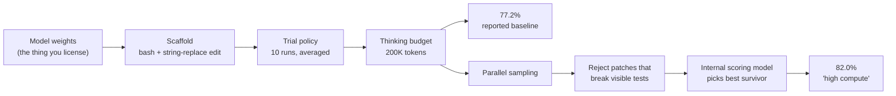

<LevelBadge level="intermediate" />

AILmanac cita numeri da benchmark su decine di pagine sui modelli. Lo fanno anche ogni post di lancio, ogni tabella di confronto e ogni thread "abbiamo battuto la frontiera". Quasi nessuno di loro ti dice le tre cose che decidono cosa significa un numero: **quale scaffold l'ha prodotto, su quanti tentativi è mediato, e se il modello aveva già letto le risposte.**

Quelle tre non sono pignolerie. In un esempio pubblicato più sotto, gli stessi pesi del modello segnano **77,2% e 82,0%** sugli identici 500 problemi — il divario di 4,8 punti è interamente harness. In un altro, modelli di frontiera che risolvono **oltre il 70%** di un benchmark di coding risolvono **circa il 23%** di uno più difficile costruito sullo stesso tipo di compito. Nessuno dei due divari è una bugia. Entrambi sono invisibili se leggi solo il titolo.

Questa pagina è il manuale per leggere il numero invece del titolo.

<Callout type="objectives" items={[
  "Sapere cosa misura letteralmente un punteggio SWE-bench — e cosa ha verificato 'Verified'",
  "Separare il modello dallo scaffold, usando la nota metodologica di un vendor stesso come prova",
  "Riconoscere lo sconto da contaminazione: perché un benchmark più difficile costruito su codice mai visto taglia i punteggi di decine di punti",
  "Leggere i numeri 'high compute' e 'best-of-n' per quello che sono: un prodotto diverso, a un prezzo diverso",
  "Applicare una checklist di sei domande a qualunque affermazione su un benchmark in meno di due minuti",
  "Sapere quando un benchmark è saturo e ha smesso di dirti qualcosa"
]} />

<VerifyNote lastVerified="2026-10-05" source="https://www.swebench.com/original.html">
I fatti sulla costruzione dei benchmark vengono dalle pagine dei manutentori stessi: [SWE-bench](https://www.swebench.com/original.html) (2.294 istanze, 12 repository Python) e [SWE-bench Verified](https://www.swebench.com/verified.html) (500 istanze, costruito con OpenAI). La metodologia su scaffold e test-time compute è citata dall'[annuncio di Claude Sonnet 4.5 di Anthropic](https://www.anthropic.com/news/claude-sonnet-4-5) — quel modello è ormai superato, ma la nota è citata qui come **artefatto metodologico**, non come punteggio attuale; vedi [Modelli e prezzi](/docs/whats-new/models-and-pricing) per quello che è attuale. Le cifre di SWE-bench Pro vengono dall'[annuncio di Scale](https://scale.com/blog/swe-bench-pro) e dal [paper di SWE-Bench Pro](https://arxiv.org/abs/2509.16941), e sono **numeri al lancio per i modelli testati allora** — vedi la [classifica live](https://labs.scale.com/leaderboard/swe_bench_pro) per le posizioni attuali. Il post di OpenAI [*Why we no longer evaluate SWE-bench Verified*](https://openai.com/index/why-we-no-longer-evaluate-swe-bench-verified/) blocca il fetch automatico; è citato qui solo per il titolo e la posizione dichiarata.
</VerifyNote>

## Cosa misura letteralmente un punteggio SWE-bench

Parti dai meccanismi, perché i meccanismi sono l'avvertenza.

SWE-bench è stato costruito scandagliando pull request e issue di **12 repository Python popolari**, producendo **2.294 istanze di compito**. Ogni istanza consegna al modello una descrizione di issue e uno snapshot del repository. Il modello scrive una patch. La patch viene valutata eseguendo i test che **fallivano prima della correzione reale e passavano dopo** — l'insieme "Fail-to-Pass".

Quindi un punteggio SWE-bench è questa frase e nient'altro:

> *Dato il testo di una issue e un repository, il sistema ha prodotto un diff che fa passare dal rosso al verde un insieme specifico di test nascosti.*

Nota tutto quello che quella frase **non** afferma. Non che la patch sia quella che un manutentore avrebbe fatto il merge. Non che sia leggibile, minimale o sicura. Non che eviti di rompere qualcosa che nessun test copre. Non che un umano avrebbe accettato la pull request. Il benchmark è un *oracolo basato su suite di test*, e le suite di test sono una specifica incompleta della correttezza — che è lo stesso motivo per cui il [reward hacking negli agenti di coding](/docs/frontiers/reward-hacking-in-coding-agents) è un problema vivo e non teorico.

### Cosa ha verificato davvero "Verified"

**SWE-bench Verified** è un sottoinsieme di 500 istanze dell'originale, creato in collaborazione con OpenAI. Annotatori umani hanno rivisto ogni istanza per confermare tre cose: la descrizione del problema è chiara, la patch di test è corretta, e il compito è risolvibile con le informazioni date.

Leggi quell'elenco con attenzione. Verified ha corretto **i difetti del benchmark stesso** — issue sottospecificate, grader rotti, compiti impossibili. È una garanzia di pulizia, non una garanzia di difficoltà e non una garanzia di realismo. "Verified" nel nome fa sentire alle persone "validato come misura di abilità ingegneristica". Significa "abbiamo verificato che queste 500 domande siano rispondibili e valutate correttamente".

<Callout type="key">
**Verified = le domande sono eque. Non: le domande sono difficili, rappresentative o mai viste.** Quelle sono tre proprietà separate, e le prossime due sezioni riguardano quelle che Verified non ha mai rivendicato.
</Callout>

## La tassa dello scaffold: il numero è un punteggio di sistema, non di modello

Questa è la cosa più utile di questa pagina, e la prova è una nota metodologica di un vendor stesso.

Quando Anthropic ha pubblicato Claude Sonnet 4.5, la nota metodologica affermava che tutti i risultati di Claude usavano **"un semplice scaffold con due strumenti — bash e modifica di file tramite sostituzioni di stringhe."** La cifra di punta su SWE-bench Verified, **77,2%**, è stata prodotta con **nessun test-time compute, mediata su 10 tentativi, con un budget di thinking di 200K, sull'intero set di 500 problemi.**

Lo stesso post riportava un secondo numero: **82,0%**, sotto "high compute". Quella configurazione campiona tentativi multipli in parallelo, scarta le patch che rompono i test di regressione visibili (rejection sampling), poi usa un modello di scoring interno per scegliere il miglior sopravvissuto.

Stessi pesi. Stessi 500 problemi. **+4,8 punti dal solo harness.**

Ne seguono quattro conseguenze, e si generalizzano ben oltre questo singolo esempio.

**1. Una riga di classifica è un agente, non un modello.** Due sottomissioni degli stessi pesi con scaffold diversi sono sistemi diversi. Quando una tabella di confronto mette il Modello A al 74% accanto al Modello B al 71%, e le righe vengono da harness diversi, la tabella ha misurato gli harness almeno quanto i modelli. [Le CLI degli agenti di coding a confronto](/docs/models/coding-agent-clis-compared) esiste perché l'harness è una variabile di prima classe.

**2. I numeri "high compute" sono un prodotto diverso a un prezzo diverso.** Best-of-n con un verificatore sono n esecuzioni di inferenza più un passaggio di scoring. Se la cifra di punta di un vendor è quella high-compute, il prezzo che pagheresti per riprodurla è circa n volte quello ovvio. Chiedi sempre a quale numero corrisponde la pagina dei prezzi. [Perché gli agenti bruciano token](/docs/models/why-agents-burn-tokens) è il lato costi della stessa aritmetica.

**3. Il rejection sampling ha bisogno di un segnale che potresti non avere.** "Scarta le patch che rompono i test di regressione visibili" funziona su SWE-bench perché ogni istanza porta con sé una suite di test. Sulla tua codebase, quel passaggio vale solo quanto valgono i tuoi test. Un punteggio high-compute è in parte una misura della *copertura dei test del benchmark*, trapiantata nell'agente come filtro.

**4. La politica di media è portante.** "Mediato su 10 tentativi" è una scelta onesta che costa punti — le esecuzioni agentiche hanno alta varianza, e una singola esecuzione best-of-10 leggerebbe più alta. Un paper che riporta una sola esecuzione e un paper che riporta una media su 10 tentativi non sono confrontabili, e la differenza raramente è nel titolo.

<Callout type="warning">
Quando un punteggio non dichiara lo scaffold, il numero di tentativi e la convenzione pass@k, non è una misurazione riproducibile — è marketing con la virgola. Vale quando il numero fa bella figura a Claude tanto quanto quando la fa a qualunque altra cosa.
</Callout>

## Lo sconto da contaminazione

La seconda variabile invisibile: se il modello ha visto le risposte.

SWE-bench è stato assemblato dalla cronologia pubblica di GitHub. La cronologia pubblica di GitHub è dati di addestramento. Per qualunque benchmark costruito così, non c'è modo pulito di dimostrare che un modello stia risolvendo il compito invece di ricordare la correzione già fatta. La posizione di OpenAI è ormai esplicita in un post intitolato [*Why we no longer evaluate SWE-bench Verified*](https://openai.com/index/why-we-no-longer-evaluate-swe-bench-verified/).

**SWE-Bench Pro** è la risposta strutturale. Scale ha costruito **1.865 compiti su 41 repository mantenuti attivamente**, deliberatamente selezionati così che la sovrapposizione con i set di addestramento sia improbabile per costruzione:

| Sottoinsieme | Repo | Come si resiste alla contaminazione |
| --- | --- | --- |
| Pubblico | 11 | Licenze copyleft forti (famiglia GPL) — legalmente scomode su cui addestrare |
| Held-out | 12 | Pubblicati come benchmark, trattenuti dal rilascio aperto |
| Commerciale | 18 | Codebase private sotto accordi di partnership; mai pubbliche |

I compiti sono anche più difficili di proposito: problemi che richiedono a ingegneri professionisti **da ore a giorni**, tipicamente su più file.

Il risultato al lancio è il numero che vale ricordare. I modelli migliori, con **oltre il 70%** su SWE-bench Verified, si sono fermati attorno al **23%** sul set pubblico di SWE-bench Pro — e *ancora più in basso* sul sottoinsieme commerciale, dove il codice dimostrabilmente non era mai stato pubblico:

| Modello (come testato al lancio) | SWE-bench Pro, pubblico | SWE-bench Pro, commerciale |
| --- | --- | --- |
| OpenAI GPT-5 | 23,3% | 14,9% |
| Claude Opus 4.1 | 23,1% | 17,8% |

Quei modelli sono superati da tempo — il punto non è la riga, è la **forma**. Stessa famiglia di compito, stesso meccanismo di valutazione, due scelte di design cambiate (codice mai visto, orizzonte più lungo), e il numero crolla di decine di punti. Il calo da pubblico a commerciale dentro lo *stesso* benchmark è il segnale di contaminazione più pulito pubblicato, perché tiene la difficoltà del compito grosso modo fissa e varia solo se il codice poteva essere stato usato per l'addestramento.

<Callout type="tip">
**L'abitudine portabile:** quando due benchmark misurano "la stessa cosa" e discordano di 40 punti, il disaccordo è l'informazione. Chiediti quale scelta di design differisce — dati mai visti, orizzonte più lungo, grader più severo — e dai per scontato che la *tua* codebase assomigli a quella più difficile. Il tuo repository è privato, di lunga vita e poco testato; assomiglia al sottoinsieme commerciale molto più che a una famosa issue di Django del 2021.
</Callout>

## Saturazione: quando un benchmark smette di portare informazione

Un benchmark dove i leader si ammassano sul novanta e qualcosa ha smesso di separarli. Il divario residuo è dominato dal rumore del grader, dalle differenze di scaffold e dalla manciata di istanze con specifiche ambigue.

La spia utile è una **variante più difficile accoppiata**. Nella tabella di lancio di [Ember-1](/docs/models/ember-1-reasoning-token-efficiency), gli stessi modelli che segnano 80-93% su SWE-bench Verified segnano **6,7-21,3%** su SWE-Interact, che richiede di fare domande all'utente a metà compito. Una di quelle due colonne sta ancora misurando qualcosa. Quando vedi un titolo con un novanta e qualcosa, la tua prima mossa è trovare il numero accoppiato che non è un novanta e qualcosa — è lì che sta il divario di capacità vivo, ed è lo stesso fenomeno che [il divario capacità-affidabilità](/docs/frontiers/the-capability-reliability-gap) descrive dal lato del deployment.

### E sulle classifiche di preferenza umana

Le classifiche in stile arena hanno il problema speculare. Il voto umano a coppie premia in modo affidabile le risposte **più lunghe e più formattate**, indipendentemente dal fatto che siano più corrette. È per questo che LMArena pubblica una vista separata **con controllo dello stile**, che corregge statisticamente per lunghezza della risposta e struttura markdown. Se citi una posizione in arena, cita da quale vista viene — i due ordinamenti non sono gli stessi, e quello non corretto misura in parte la verbosità.

## Sei domande, due minuti

<Steps items={[
  {
    title: "Quale benchmark, e quale variante?",
    body: "SWE-bench, Verified, Lite, Multimodal, Multilingual e Pro sono dataset diversi con dimensioni e difficoltà diverse. Un numero senza variante è illeggibile. 'SWE-bench 74%' potrebbe significare quattro cose incompatibili."
  },
  {
    title: "Quale scaffold l'ha prodotto?",
    body: "Quali strumenti, quanti turni, quale budget di thinking, c'era retrieval? Se il post non lo dice, il numero non è riproducibile. La dichiarazione di Anthropic sui due strumenti bash-più-sostituzione-di-stringhe è lo standard a cui tenere tutti — Anthropic compresa."
  },
  {
    title: "Una sola esecuzione o una media — e pass@1 o best-of-n?",
    body: "Le valutazioni agentiche hanno alta varianza. Una media su 10 tentativi e una singola esecuzione fortunata differiscono di diversi punti sullo stesso sistema. 'High compute', 'best-of-n', 'con verificatore' e 'test-time compute parallelo' significano tutti: questo costa n volte più di quanto pensi."
  },
  {
    title: "Le risposte potrebbero essere nei dati di addestramento?",
    body: "Costruito dalla cronologia pubblica di GitHub prima del cutoff del modello? Dai per scontato un richiamo parziale. Preferisci benchmark con sottoinsiemi held-out o privati, e pesa più di tutto il punteggio sul sottoinsieme privato — è il proxy più vicino al tuo repository mai visto."
  },
  {
    title: "Chi l'ha eseguito?",
    body: "Eseguito dal vendor su benchmark scelti dal vendor è un segnale legittimo e debole. Cerca lo stesso modello su una classifica indipendente con un harness fisso. Dove i numeri del vendor e quelli indipendenti discordano, il delta è di solito scaffold."
  },
  {
    title: "È saturo, e qual è il numero difficile accoppiato?",
    body: "Se i primi cinque stanno entro tre punti vicino al tetto, la classifica è rumore. Trova la variante accoppiata più difficile — interattiva, a orizzonte lungo, su repository privati — e leggi quella colonna invece."
  }
]} />

## Interroga un post di lancio

Incolla la sezione benchmark di un vendor e fai fare al modello il passo 2 per te. Il punto non è il riassunto; è l'elenco di ciò che è **esplicitamente mancante**.

<PromptCard title="Audit di un'affermazione su un benchmark">
{`You are auditing a benchmark claim for reproducibility. Here is the benchmark section of a model launch post:

<launch_post>
[PASTE THE BENCHMARK SECTION AND ALL FOOTNOTES]
</launch_post>

For each benchmark number reported, produce a row with:
- benchmark name and exact variant (e.g. SWE-bench Verified, 500 instances)
- the score, and whether it is pass@1, best-of-n, or an average of k trials
- the scaffold: tools available, turn limit, thinking/reasoning budget, retrieval
- whether any test-time-compute technique was used (parallel sampling, rejection
  sampling against visible tests, a verifier or scoring model)
- who ran the eval: the vendor, or an independent party with a fixed harness

Then output two lists:
1. NOT STATED — every field above that the post does not disclose.
2. COMPARABILITY RISKS — specific reasons a reader could not place these numbers
   next to another vendor's numbers for the same benchmark.

Do not estimate or infer missing values. If the post does not say it, it goes in
list 1. Quote the footnote text you relied on for each field you did fill in.`}
</PromptCard>

Esegui lo stesso prompt sui post di due vendor per lo stesso benchmark e i rischi di comparabilità di solito ti scrivono da soli la riga di avvertenze della tabella di confronto.

## Errori comuni

| Errore | Perché inganna | Cosa fare invece |
| --- | --- | --- |
| Trattare una riga di classifica come un punteggio di modello | È un modello **più** scaffold, politica di tentativi e budget di calcolo | Confronta righe solo dentro un harness fisso, oppure confronta onestamente sistemi interi |
| Mettere il numero high-compute del vendor A accanto al pass@1 del vendor B | Uno è n esecuzioni di inferenza con un verificatore; l'altro è una sola esecuzione | Allinea la convenzione di calcolo, oppure etichetta l'asimmetria |
| Leggere "Verified" come "validato come realistico" | Ha verificato che le domande siano rispondibili e valutate correttamente | Usalo come dataset pulito, non come prova di abilità nel mondo reale |
| Citare un punteggio vicino al tetto come prova di un vantaggio | I benchmark saturi classificano rumore | Cita la variante accoppiata più difficile |
| Dare per scontato che un benchmark da GitHub pubblico non sia contaminato | I dati precedono il cutoff e sono nel crawl | Preferisci sottoinsiemi held-out o privati; pesali più di tutto |
| Estrapolare un punteggio di benchmark al tuo repository | Il tuo codice è privato, di lunga vita e testato poco | Costruisci una piccola valutazione sui tuoi compiti — vedi [Valutare il tuo agente AI](/docs/playbooks/evaluating-agents) |
| Citare una posizione in arena senza la vista | Il voto a coppie non corretto premia in parte lunghezza e formattazione | Di' se è la classifica con controllo dello stile |

L'ultima riga è quella che conta più di tutte in pratica. Un benchmark pubblicato risponde a "questo modello è bravo su questo benchmark". La domanda che hai davvero è "questo modello è bravo sul mio lavoro", e l'unico strumento per quella è una valutazione sui tuoi compiti. [Le valutazioni](/docs/power-user/evals) spiega come costruirne una; venti dei tuoi ticket reali, valutati con una rubrica scritta da te, battono ogni classifica di questa pagina per la tua decisione.

<Quiz questions={[
  {
    q: "Un vendor riporta 82,0% su SWE-bench Verified sotto 'high compute', descritto come campionamento parallelo, scarto delle patch che rompono i test di regressione visibili, poi un modello di scoring interno che sceglie il miglior sopravvissuto. Il loro numero con scaffold semplice sugli stessi 500 problemi è 77,2%. Cosa misura il divario di 4,8 punti?",
    options: [
      "Una versione migliore dei pesi del modello",
      "L'harness: esecuzioni di inferenza aggiuntive più un verificatore, non un cambiamento nel modello",
      "Rumore di misurazione tra due esecuzioni",
      "La differenza tra SWE-bench e SWE-bench Verified"
    ],
    answer: 1,
    explain: "Stessi pesi, stessi 500 problemi. Il divario è interamente test-time compute — n tentativi paralleli, rejection sampling contro i test visibili, e un modello di scoring per selezionare. È un prodotto diverso a circa n volte il costo, e dipende da un segnale di test che il tuo repository potrebbe non avere."
  },
  {
    q: "Su SWE-bench Pro al lancio, Claude Opus 4.1 ha risolto il 23,1% del sottoinsieme pubblico ma il 17,8% di quello commerciale — codebase private che non sono mai state pubbliche. Perché il calo da pubblico a commerciale è il più informativo dei due numeri?",
    options: [
      "I compiti commerciali sono molto più lunghi, quindi il calo misura la lunghezza di contesto",
      "Tiene il design del compito grosso modo fisso e varia principalmente se il codice poteva essere nei dati di addestramento",
      "Il sottoinsieme commerciale usa un grader più severo di quello pubblico",
      "I repository privati hanno copertura di test peggiore, quindi la valutazione è più dura"
    ],
    answer: 1,
    explain: "Entrambi i sottoinsiemi sono lo stesso benchmark, stessa costruzione, stessa valutazione. La cosa principale che cambia è se il repository potesse plausibilmente essere stato raccolto nei dati di addestramento — ed è questo a rendere il divario il segnale di contaminazione più pulito pubblicato, e il punteggio commerciale il proxy migliore per il tuo repository privato."
  },
  {
    q: "Cosa ha garantito davvero l'annotazione umana alla base di SWE-bench Verified?",
    options: [
      "Che i 500 compiti siano rappresentativi del lavoro ingegneristico reale in produzione",
      "Che i 500 compiti siano più difficili del resto di SWE-bench",
      "Che le descrizioni dei problemi siano chiare, le patch di test corrette, e i compiti risolvibili con le informazioni date",
      "Che nessuno dei 500 compiti appaia nei dati di addestramento di qualche modello"
    ],
    answer: 2,
    explain: "Verified ha corretto i difetti del benchmark stesso — issue sottospecificate, grader errati, compiti irrisolvibili. È una garanzia di pulizia. Non dice nulla su difficoltà, realismo o contaminazione, e tutte e tre sono proprietà separate."
  }
]} />

<Flashcards cards={[
  { front: "SWE-bench, in una riga", back: "2.294 istanze di compito raccolte da pull request e issue di 12 repository Python popolari. Al modello vengono dati una issue e uno snapshot del repository; la sua patch è valutata in base al passaggio dal rosso al verde dei test 'Fail-to-Pass'." },
  { front: "Cosa ha verificato SWE-bench Verified", back: "500 istanze dall'originale, riviste con OpenAI da annotatori umani per confermare che la descrizione del problema sia chiara, la patch di test corretta e il compito risolvibile. Una garanzia di pulizia — non di difficoltà, realismo o assenza di contaminazione." },
  { front: "La tassa dello scaffold", back: "Una riga di classifica è un modello PIÙ il suo harness. La metodologia pubblicata da Anthropic mostra gli stessi pesi al 77,2% (scaffold semplice a due strumenti, media su 10 tentativi, nessun test-time compute) e all'82,0% ('high compute': campionamento parallelo, scarto contro i test visibili, modello di scoring interno) sugli identici 500 problemi." },
  { front: "Quanto costa davvero 'high compute' / best-of-n", back: "n esecuzioni di inferenza più un passaggio di verifica. Se il numero di punta è quello high-compute, riprodurlo costa circa n volte il prezzo ovvio — e il passo di scarto ha bisogno di un segnale di test che la tua codebase potrebbe non avere." },
  { front: "SWE-bench Pro", back: "1.865 compiti su 41 repository mantenuti attivamente, divisi in 11 pubblici (copyleft forte) / 12 held-out / 18 commerciali sotto accordi di partnership. I compiti richiedono a ingegneri professionisti da ore a giorni e di solito coprono più file. Costruito perché la sovrapposizione con i set di addestramento sia improbabile per costruzione." },
  { front: "Lo sconto da contaminazione", back: "Al lancio, i modelli sopra il 70% su SWE-bench Verified segnavano circa il 23% sul set pubblico di SWE-bench Pro e meno su quello commerciale (GPT-5 23,3% → 14,9%; Opus 4.1 23,1% → 17,8%). Il calo da pubblico a commerciale dentro lo stesso benchmark è il segnale di contaminazione più pulito pubblicato." },
  { front: "Saturazione di un benchmark — la spia", back: "Leader ammassati vicino al tetto entro pochi punti significa che la classifica è rumore. Trova la variante accoppiata più difficile: i modelli all'80-93% su SWE-bench Verified segnano 6,7-21,3% su SWE-Interact. La colonna non satura è quella che porta ancora informazione." },
  { front: "Controllo dello stile in arena", back: "Il voto umano a coppie premia risposte più lunghe e più formattate indipendentemente dalla correttezza, quindi LMArena pubblica una classifica con controllo dello stile che corregge per lunghezza e markdown. Dichiara sempre da quale vista viene una posizione citata." },
  { front: "Le sei domande", back: "Quale variante? Quale scaffold? Una sola esecuzione o mediata, pass@1 o best-of-n? Le risposte potrebbero essere nei dati di addestramento? Chi l'ha eseguito? È saturo — e qual è il numero difficile accoppiato?" }
]} />

<Callout type="takeaways" items={[
  "Un punteggio di benchmark è un punteggio di sistema. Modello + scaffold + politica di tentativi + budget di calcolo. Il divario pubblicato tra 77,2% e 82,0% sugli stessi problemi è la prova.",
  "'Verified' significa che le domande sono eque, non che siano difficili, realistiche o mai viste. Tre proprietà separate, una parola rassicurante.",
  "I benchmark da GitHub pubblico non possono dimostrare che il modello non stia ricordando. Pesa più di tutto i sottoinsiemi held-out e privati — sono il proxy più vicino al tuo repository.",
  "Un disaccordo di 40 punti tra due benchmark che misurano 'la stessa cosa' è l'informazione, non un errore. Trova la scelta di design che differisce.",
  "I punteggi vicini al tetto classificano rumore. Leggi sempre la variante accoppiata più difficile.",
  "Nessun benchmark pubblicato risponde alla tua domanda vera. Venti dei tuoi ticket con una rubrica battono ogni classifica qui."
]} />

## Avanti

- [Valutare il tuo agente AI](/docs/playbooks/evaluating-agents) — il playbook per costruire la valutazione che risponde davvero alla tua domanda, dato che nessun benchmark pubblico lo farà
- [Il modello è stato depotenziato? Come capirlo davvero](/docs/models/is-the-model-nerfed) — la stessa disciplina di misurazione puntata sull'altra domanda ricorrente, con un protocollo a design accoppiato che puoi eseguire
- [Le CLI degli agenti di coding a confronto](/docs/models/coding-agent-clis-compared) — l'harness come variabile di prima classe, che è esattamente ciò che dice la tassa dello scaffold

## Fonti e approfondimenti

- [SWE-bench](https://www.swebench.com/original.html) — la costruzione (2.294 istanze, 12 repository Python) e il meccanismo di valutazione Fail-to-Pass
- [SWE-bench Verified](https://www.swebench.com/verified.html) — il sottoinsieme di 500 istanze costruito con OpenAI, ed esattamente cosa ha verificato l'annotazione umana
- [Introducing Claude Sonnet 4.5 — Anthropic](https://www.anthropic.com/news/claude-sonnet-4-5) — la nota metodologica citata qui: scaffold a due strumenti, media su 10 tentativi, budget di thinking di 200K, e cosa aggiunge "high compute"
- [SWE-Bench Pro: Can AI Agents Solve Long-Horizon Software Engineering Tasks? — arXiv 2509.16941](https://arxiv.org/abs/2509.16941) — 1.865 compiti, 41 repository, la divisione pubblico / held-out / commerciale
- [SWE-Bench Pro: Raising the Bar for Agentic Coding — Scale](https://scale.com/blog/swe-bench-pro) — la strategia anti-contaminazione (copyleft più codice commerciale privato) e i risultati pubblico-vs-commerciale al lancio
- [SWE-Bench Pro leaderboard — Scale](https://labs.scale.com/leaderboard/swe_bench_pro) — le posizioni attuali, per quando i numeri al lancio qui sopra saranno storia
- [Why we no longer evaluate SWE-bench Verified — OpenAI](https://openai.com/index/why-we-no-longer-evaluate-swe-bench-verified/) — citato per la posizione dichiarata; la pagina blocca il recupero automatico
- [LMArena leaderboard](https://lmarena.ai/leaderboard) — confronta la vista predefinita e quella con controllo dello stile degli stessi modelli
- Correlati: [Valutazioni](/docs/power-user/evals) · [Reward hacking negli agenti di coding](/docs/frontiers/reward-hacking-in-coding-agents) · [Il divario capacità-affidabilità](/docs/frontiers/the-capability-reliability-gap) · [Perché gli agenti bruciano token](/docs/models/why-agents-burn-tokens)
