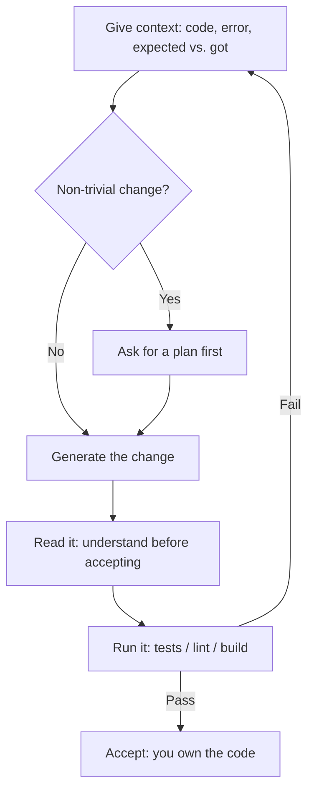

<LevelBadge level="all" />

<Callout type="objectives" items={["Sapere in cosa la programmazione con l'AI è davvero forte — spiegare, generare, rifattorizzare, fare debug, tradurre, revisionare", "Eseguire il ciclo d'oro: contesto in ingresso, piano, generazione, lettura, esecuzione — e reinserire i fallimenti come nuovo contesto", "Usare prompt che valgono il loro peso invece di frasi vaghe da una riga", "Interiorizzare le due regole inderogabili: verifica eseguendo, e non incollare mai segreti"]} />

Che tu stia imparando a programmare o spedendo software in produzione, l'AI cambia il ciclo di lavoro. Chi vince la tratta come un collega veloce e competente — e **verifica tutto ciò che produce**.

## In cosa eccelle

- **Spiegare** codice o errori sconosciuti in linguaggio semplice.
- **Generare** boilerplate, test e prime bozze di funzioni.
- **Rifattorizzare** per maggiore chiarezza, e **fare debug** ragionando su uno stack trace.
- **Tradurre** tra linguaggi/framework.
- **Revisionare** un diff alla ricerca di bug e cattivi odori.

Per codebase reali, fallo *dentro* il tuo repository con [Claude Code](/docs/claude-code/what-is-claude-code), che può leggere file, eseguire test e modificare con la tua approvazione.

## Il ciclo d'oro

1. **Dai contesto** — il codice rilevante, l'errore, ciò che ti aspettavi rispetto a ciò che hai ottenuto. Input vago, output vago.
2. **Chiedi un piano** per le modifiche non banali prima di apportarle ([Modalità Piano](/docs/claude-code/plan-mode)).
3. **Genera** la modifica.
4. **Leggila** — capiscila prima di accettarla. Il codice è tuo.
5. **Eseguila** — test/lint/build. *Non fidarti mai di un "funziona" senza averlo eseguito.*

Il passaggio che separa i buoni risultati da quelli cattivi è la freccia che torna in cima: quando un test fallisce, non correggi alla cieca — reinserisci l'errore come nuovo contesto.

## Prompt che valgono il loro peso

<PromptCard title="Spiega il codice + individua i casi limite">{`Explain what this function does and any edge cases it mishandles: {code}`}</PromptCard>

<PromptCard title="Genera i test">{`Write tests for {function}. Cover the happy path and the edge cases. {code}`}</PromptCard>

<PromptCard title="Debug a partire da uno stack trace">{`This throws {error}. Here's the code and stack trace. Find the root cause and propose a minimal fix. {context}`}</PromptCard>

## Regole inderogabili

:::warning Verifica e proteggi i tuoi segreti
- **Esegui e revisiona** il codice generato — può essere sottilmente sbagliato o inventare API che non esistono.
- **Non incollare mai segreti/chiavi** in un prompt ([Privacy](/docs/foundations/privacy)).
- Per la programmazione agentica/automatizzata, blinda i [permessi](/docs/claude-code/permissions) e leggi [Mettere in sicurezza gli agenti](/docs/security/securing-agents).
:::

<Quiz title="Mettiti alla prova" questions={[{q: "Nel ciclo d'oro, cosa separa di più i buoni risultati dell'AI-coding da quelli cattivi?", options: ["Usare sempre il modello più grande disponibile", "La freccia che torna in cima: reinserire l'output di un test fallito come nuovo contesto invece di correggere alla cieca", "Accettare la prima generazione per risparmiare tempo"], answer: 1, explain: "Il ciclo è il metodo. Quando un test fallisce non tiri a indovinare una correzione — restituisci il fallimento come nuovo contesto, così il tentativo successivo è ancorato a ciò che è andato storto davvero."}, {q: "Perché leggere il codice generato prima di accettarlo?", options: ["È la lettura ad avviare il test runner", "Può essere sottilmente sbagliato o inventare API che non esistono — e in ogni caso il codice è tuo", "L'SDK si rifiuta di eseguire codice che non hai aperto"], answer: 1, explain: "L'output dell'AI sembra sicuro di sé anche quando è sbagliato, e ogni tanto chiama funzioni che non esistono. Leggerlo è il modo per accorgersene prima del rilascio — e la responsabilità del codice è tua a prescindere da chi l'ha scritto."}, {q: "Quale di questi non deve mai finire in un prompt?", options: ["Il messaggio di errore e lo stack trace", "Segreti o chiavi API", "Ciò che ti aspettavi rispetto a ciò che è successo davvero"], answer: 1, explain: "Errori, stack trace e atteso-vs-ottenuto sono esattamente il contesto che migliora i risultati. Segreti e chiavi sono l'unica cosa da tenere fuori: se li incolli, li hai già divulgati."}]} />

<Callout type="takeaways" items={["Tratta l'AI come un collega veloce e competente — poi verifica tutto ciò che produce eseguendolo davvero", "Contesto in ingresso, qualità in uscita: dai il codice, l'errore e l'atteso-vs-ottenuto, mai una richiesta vaga", "Chiedi un piano prima delle modifiche non banali, così revisioni l'approccio prima che il codice cambi", "Leggi il codice generato prima di accettarlo — può essere sottilmente sbagliato o inventare API che non esistono", "Non incollare mai segreti o chiavi in un prompt, e blinda i permessi prima di lasciare che un agent programmi da solo"]} />

## Avanti

- [Cos'è Claude Code](/docs/claude-code/what-is-claude-code)
- [Personalizzare Claude Code per un repository reale](/docs/walkthroughs/customize-claude-code)
- [La tua prima chiamata API](/docs/api/first-call)
