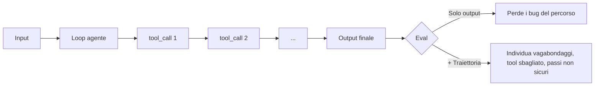

<LevelBadge level="advanced" />

<VerifyNote lastVerified="2026-07-24" source="https://platform.claude.com/docs/en/test-and-evaluate/develop-tests">
La guida di Anthropic sulle valutazioni è la fonte di verità per la metodologia (criteri SMART, exact-match, Likert/binario giudicati da LLM). La valutazione della traiettoria degli agenti è una disciplina emergente — tratta i nomi dei framework come illustrativi e verifica le API su ciascuna documentazione del vendor.
</VerifyNote>

<Callout type="objectives" items={["Capire perché le eval degli agenti sono diverse da quelle dei prompt — conta la traiettoria, non solo la risposta finale", "Costruire un golden set di 20–100 casi reali con criteri di superamento chiari", "Valutare quattro strati: correttezza delle chiamate a tool, qualità della traiettoria, successo del task, drift in produzione", "Usare LLM-as-judge in sicurezza: prima il rubric, calibrazione sugli umani, spot-check dei verdetti", "Spedire una eval che gira in CI e blocca una modifica cattiva prima che arrivi agli utenti"]} />

Una **eval di agente** risponde a una domanda più difficile di "il prompt ha restituito le parole giuste?". Chiede: *un modello in loop ha scelto i tool giusti, nell'ordine giusto, con gli argomenti giusti, è arrivato all'outcome giusto — restando nei limiti di budget e sicurezza?*

Salta questo passaggio e spedirai un agente "utile" che regredisce in silenzio ogni volta che ritocchi il system prompt.

## Perché gli agenti hanno bisogno di eval dedicate

Una eval single-prompt valuta un input → un output. Un agente produce una **traiettoria**: una catena di ragionamento, tool call, osservazioni intermedie e revisioni su molti turni. Due modalità di fallimento rendono la cosa difficile:

- **Risposta giusta, percorso sbagliato.** L'agente inciampa nell'output corretto dopo loop inutili, azioni non sicure o fortuna. Le eval che guardano solo la risposta finale segnano pass; la produzione no.
- **Risposta sbagliata, percorso plausibile.** Ogni passo sembra ragionevole preso da solo, ma l'agente ha usato male un tool, ignorato un vincolo o allucinato un fatto intermedio. Devi guardare la trace, non solo la risposta.



## I quattro strati dell'eval

Ordinali dal più economico al più costoso, così una modifica cattiva fallisce presto senza aspettare grader costosi.

<Steps items={[
  {title: "Strato 1 — Correttezza delle chiamate a tool (deterministico)", body: "Per ogni passo atteso, verifica che il nome del tool corrisponda, che i parametri richiesti siano presenti e che i tipi validino. Puro codice, millisecondi, nessun modello. Cattura 'ha chiamato search quando doveva chiamare write_file' prima che parta qualsiasi altra cosa."},
  {title: "Strato 2 — Qualità della traiettoria (rubric + LLM-judge)", body: "Valuta l'intera trace: l'agente ha seguito un percorso sensato, o ha vagato, fatto loop, o fatto backtrack? Numero di passi vs. minimo necessario, chiamate ridondanti, retry dopo errori dei tool, se si è fermato quando aveva finito. Qui usa un giudice LLM con un rubric esplicito."},
  {title: "Strato 3 — Successo del task (end-to-end)", body: "L'obiettivo è stato raggiunto? Deterministico dove possibile (schema valido, file scritto, test che passa), giudicato da LLM dove è fuzzy (riassunto fedele, risposta utile). Questo è il tuo numero di prima pagina."},
  {title: "Strato 4 — Drift in produzione & sicurezza", body: "In produzione, campiona trace reali e rivalutane una fetta. Osserva intervention rate (quanto spesso un umano ha dovuto intervenire), refusal rate e cost per successful task. Quando questi si spostano, il tuo modello, i tool o gli input sono cambiati sotto di te."}
]} />

## Metriche che predicono il valore

Non ogni metrica merita di stare nella dashboard. Queste cinque guidano le decisioni di ship nel 2026:

| Metrica | Cosa misura | Perché conta |
|---|---|---|
| **Task success rate** | % di casi del golden set che l'agente completa correttamente | Il titolo. Tutto il resto è diagnostica. |
| **Cost per successful task** | $ / caso passato (token in + out, costi tool) | Il successo a 10× il costo è una regressione. |
| **Latenza (p50 / p95)** | Wall-clock per task, coda inclusa | Il p95 è ciò che gli utenti reali percepiscono — le medie mentono. |
| **Tool-call accuracy** | % di chiamate a tool attese con nome + args corretti | Predice la qualità della traiettoria; economico da calcolare. |
| **Intervention rate** | % di task che in prod hanno richiesto un takeover umano | Il numero dell'autonomia. In salita = fiducia in calo. |

Segnile insieme — una che si muove senza le altre è di solito un segnale anticipatore, non rumore.

## Costruire il golden set

<Steps items={[
  {title: "Estrai input reali", body: "Prendi 20–100 task dall'uso reale (log, ticket di supporto, richieste utente). Copri il percorso facile frequente, il centro spinoso e i casi limite che ti hanno già morso."},
  {title: "Scrivi i criteri di superamento per caso", body: "Per ciascuno: cosa vuol dire 'fatto'? Output atteso esatto, fatti richiesti, JSON schema valido, file che devono esistere, o un rubric per i casi fuzzy. Se non riesci a scrivere il criterio, il caso è inutilizzabile — taglialo o chiariscilo."},
  {title: "Annota la traiettoria ideale", body: "Per un sottoinsieme, abbozza la sequenza di tool che un buon agente farebbe. Questo è ciò contro cui verifica lo Strato 1."},
  {title: "Congelalo, versiona", body: "Committa il set nel repo. Non modificare mai un caso in place — aggiungi la v2 accanto alla v1 così lo storico dei punteggi resta comparabile."},
  {title: "Fallo crescere dai fallimenti", body: "Ogni bug in produzione diventa un nuovo caso di eval prima di essere risolto. È così che il set resta predittivo invece di decadere."}
]} />

## LLM-as-judge — economico, veloce, ma calibralo

Valutare a mano output fuzzy non scala. Un modello capace che legge contro un rubric esplicito sì — la stessa [guida alla metodologia di eval](https://platform.claude.com/docs/en/test-and-evaluate/develop-tests) di Anthropic raccomanda questo pattern per tono, fedeltà, utilità e sicurezza.

I giudici hanno bias ben documentati: preferiscono le risposte più lunghe, la prima opzione mostrata e gli output che riecheggiano la loro stessa formulazione. Tre abitudini li mantengono onesti:

- **Rubric, non sensazioni.** "Vota l'utilità 1–5" è inutile. Ancora ogni punto della scala a comportamenti osservabili.
- **Calibra su un campione etichettato da umani.** Fai valutare a umani 30–50 casi; misura l'accordo giudice-umano (mira a Cohen's κ ≥ 0.6). Se disaccorda, stringi il rubric.
- **Usa un modello diverso come giudice.** Valutare con lo stesso modello che ha prodotto l'output introduce bias in entrambe le direzioni.
- **Spot-check dei verdetti settimanale.** Leggi 10 punteggi del giudice a caso e le loro motivazioni. È il modo più economico di individuare il drift.

<PromptCard title="Template rubric LLM-as-judge">{`You are grading an AI assistant's response against a rubric. Be strict. Cite exact evidence from the response.

<task>{task}</task>
<response>{response}</response>

Rubric (rate 1–5 per dimension):
- Task completion: 1 = ignored task; 3 = partial; 5 = fully done, no gaps.
- Faithfulness: 1 = contains false claims; 3 = mostly grounded, one soft claim; 5 = every claim traceable to input/tools.
- Efficiency: 1 = wandered/looped; 3 = extra steps; 5 = minimum viable path.

Output JSON only:
{"task_completion": N, "faithfulness": N, "efficiency": N, "evidence": "<quote>", "verdict": "pass"|"fail"}`}</PromptCard>

<PromptCard title="Prompt di review della traiettoria (Strato 2)">{`You are auditing an AI agent's tool-call trajectory. The goal was: {goal}
Expected minimum steps: {n_min}

<trajectory>
{list of tool_name(args) -> result, in order}
</trajectory>

Answer in JSON:
{"steps_taken": N, "wasted_steps": N, "wrong_tool_calls": [<indices>], "unsafe_actions": [<indices>], "verdict": "pass"|"fail", "reason": "<one sentence>"}`}</PromptCard>

<PromptCard title="Generatore di casi avversariali (fai crescere il set)">{`Generate 5 new eval cases that are likely to break an agent whose current failures cluster around: {failure_pattern}.

For each case give: input, expected output OR pass criterion, ideal tool sequence, and why this case is hard.

Return YAML.`}</PromptCard>

## Gate in CI: blocca la modifica cattiva prima che sia spedita

L'eval ripaga solo quando blocca le regressioni automaticamente. Cablala in CI come check su ogni cambio di prompt / modello / tool:

```python
# tests/eval_gate.py — runs on every PR
import json, sys
from anthropic import Anthropic
from my_agent import run_agent

client = Anthropic()
golden = json.load(open("evals/golden.v3.json"))

results = []
for case in golden:
    trace = run_agent(case["input"])
    layer1 = tool_calls_match(trace, case["expected_tools"])   # deterministic
    layer3 = judge(client, case, trace.final_output)           # LLM rubric
    results.append({"id": case["id"], "layer1": layer1, "layer3": layer3["verdict"]})

pass_rate = sum(r["layer3"] == "pass" for r in results) / len(results)
tool_acc  = sum(r["layer1"] for r in results) / len(results)

# Gates — tighten over time
assert pass_rate >= 0.85, f"Task success dropped to {pass_rate:.0%}"
assert tool_acc  >= 0.90, f"Tool-call accuracy dropped to {tool_acc:.0%}"
print(f"PASS: task={pass_rate:.0%} tools={tool_acc:.0%}")
```

Conserva i punteggi per run così puoi tracciare il trend. Un calo di 3+ punti tra merge è una regressione reale, non rumore.

<Callout type="warning" title="Anti-pattern che rendono le eval poco efficaci" items={["Giudicare solo la risposta finale — perde ogni bug di traiettoria. Valuta anche gli Strati 1 e 2.", "Golden set statico — se non cresce con ogni fallimento in prod smette di predire la prod. Metti a budget del tempo mensile.", "Stesso modello per agente e giudice — bias in entrambe le direzioni. Ruota su un modello diverso per la valutazione.", "Nessun costo o latenza nel gate — un tweak al prompt che aggiunge 8 tool call può 'passare' l'eval mentre decuplica la bolletta.", "Punteggio a sensazioni — 'sembra meglio' non è una metrica. Se non puoi fare il diff tra due numeri, non puoi spedire con fiducia."]} />

<Callout type="takeaways" items={["Gli agenti producono traiettorie, non risposte — valuta il percorso, non solo l'esito", "Ordina dal più economico: correttezza chiamate a tool → qualità traiettoria → successo del task → drift in produzione", "Le cinque metriche che spediscono le decisioni: task success rate, cost per success, latenza p50/p95, tool-call accuracy, intervention rate", "LLM-as-judge scala, ma solo con un rubric esplicito, un modello diverso e calibrazione contro etichette umane", "Un golden set che non cresce dai fallimenti in prod smette di predire la prod — fallo crescere ogni mese", "Cabla l'eval in CI come hard gate — il check che intercetta una regressione prima degli utenti"]} />

## Verifica te stesso

<Quiz title="Verifica te stesso" questions={[
  {
    q: "Perché gli agenti hanno bisogno di eval di traiettoria, non solo di eval sulla risposta finale?",
    options: [
      "Le eval sulla risposta finale sono troppo lente da eseguire in CI",
      "Un agente può arrivare alla risposta giusta attraverso vagabondaggi o passi non sicuri (risposta giusta, percorso sbagliato) — e produrre un percorso plausibile verso una risposta sbagliata",
      "Le eval di traiettoria sono le uniche che supportano LLM-as-judge",
      "Le eval sulla risposta finale funzionano solo per task di classificazione"
    ],
    answer: 1,
    explain: "Due modalità di fallimento si nascondono al punteggio sul solo output: risposta giusta con percorso cattivo (marcata pass, regredirà in prod) e risposta sbagliata con percorso plausibile (fallisce in silenzio). Devi valutare la traiettoria oltre all'esito."
  },
  {
    q: "Stai stratificando le tue eval. Quale ordine è dal più economico al più costoso ed è corretto?",
    options: [
      "Task success giudicato da LLM → check deterministici sulle tool call → drift in produzione → rubric di traiettoria",
      "Correttezza deterministica delle tool call → qualità della traiettoria (LLM-judge) → successo del task → drift in produzione",
      "Drift in produzione → successo del task → rubric di traiettoria → check sulle tool call",
      "Rubric di traiettoria → successo del task → check sulle tool call → drift in produzione"
    ],
    answer: 1,
    explain: "Lo Strato 1 (check deterministici sulle tool call) gira in millisecondi senza modello, quindi blocca subito le modifiche cattive. Poi gli strati di traiettoria e successo del task giudicati da LLM, poi il monitoraggio del drift in produzione."
  },
  {
    q: "Quale coppia di abitudini rende davvero LLM-as-judge affidabile nel tempo?",
    options: [
      "Valutare con lo stesso modello dell'agente e riscrivere il rubric a ogni run",
      "Usare un rubric con ancoraggi osservabili e calibrare il giudice contro un campione etichettato da umani",
      "Preferire prompt basati sulle sensazioni per non essere troppo specifici e non fare mai spot-check dei verdetti",
      "Usare sempre il modello più grande disponibile come giudice, nessuna calibrazione necessaria"
    ],
    answer: 1,
    explain: "I rubric ancorati tolgono al giudice la libertà di inventare criteri, e la calibrazione umana (Cohen's κ ≥ 0.6 è un target comune) prova che il giudice concorda con la tua ground truth. Usare un modello diverso e fare spot-check settimanali completano il quadro."
  },
  {
    q: "Il tuo gate in CI passa il task success rate ma latenza e cost per task sono raddoppiati. Qual è la scelta giusta?",
    options: [
      "Spediscilo — il task success è la metrica di prima pagina",
      "Fai fallire il gate: le cinque metriche di ship si muovono insieme, e un cambio 2× di cost/latency è una regressione anche se il pass rate tiene",
      "Rilancia l'eval — i numeri devono essere rumore",
      "Allarga la soglia del pass rate per giustificare lo ship"
    ],
    answer: 1,
    explain: "Le cinque metriche spediscono le decisioni insieme. Un tweak al prompt che tiene il pass rate stabile mentre raddoppia cost o latency è esattamente il fallimento per cui il gate esiste — bolletta e UX degradate colpiscono gli utenti quanto un calo di accuracy."
  }
]} />

<Flashcards cards={[
  {front: "Traiettoria (nelle eval di agente)", back: "L'intera catena ordinata di tool call, argomenti, osservazioni e passi di ragionamento che un agente compie in un task — la cosa che valuti oltre all'output finale."},
  {front: "Golden set", back: "Una collezione congelata e versionata di 20–100 task reali con criteri di superamento espliciti (e, per un sottoinsieme, traiettorie ideali) contro cui ogni cambio di prompt/modello/tool viene valutato."},
  {front: "Tool-call accuracy", back: "% di invocazioni di tool attese in cui il nome corrisponde e i parametri richiesti validano. Deterministica, economica e forte indicatore anticipatore della qualità della traiettoria."},
  {front: "LLM-as-judge", back: "Pattern di valutazione in cui un modello (diverso) capace valuta gli output contro un rubric esplicito. Veloce e scalabile, ma va calibrato contro etichette umane per essere affidabile."},
  {front: "Intervention rate", back: "% di task in produzione che hanno richiesto un takeover umano. Intervention rate in salita = autonomia in calo, anche quando i punteggi offline sembrano a posto."},
  {front: "Cost per successful task", back: "Costo totale token + tool diviso per il numero di task che l'agente ha completato correttamente. Cattura le regressioni in cui 'funziona ancora' nasconde '10× più costoso'."},
  {front: "Gate di eval in CI", back: "Un check automatico su ogni PR che esegue il golden set e fa hard-fail della build sotto le soglie (es. pass rate < 85%, tool accuracy < 90%). Blocca regressioni silenziose prima del merge."}
]} />

## Prossimi passi

- [Costruire agenti sull'API](/docs/api/building-agents) · [Evals (fondamenta)](/docs/foundations/evals)
- [Mettere in sicurezza agenti & tool](/docs/security/securing-agents) · [Allucinazioni e come ridurle](/docs/foundations/hallucinations)
- [Headless & Agent SDK](/docs/claude-code/headless-and-agent-sdk) · [Managed Agents](/docs/api/managed-agents)
