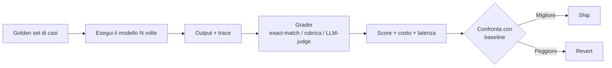

<LevelBadge level="intermediate" />

<VerifyNote lastVerified="2026-07-25" source="https://platform.claude.com/docs/en/test-and-evaluate/develop-tests">
La metodologia (progettazione di prompt/agenti test-driven, criteri SMART, rubrica exact-match vs. LLM-graded) segue la guida ufficiale "Develop tests" di Anthropic. I concetti qui esposti sono agnostici rispetto al modello e si applicano allo stesso modo a OpenAI, Gemini e modelli open-weight.
</VerifyNote>

<Callout type="objectives" items={[
  "Capire cos'è davvero un'eval — un test ripetibile che valuta l'output del modello rispetto a una rubrica fissa",
  "Sapere quando un vibe check basta e quando serve per forza un'eval",
  "Riconoscere i quattro tipi di eval che userai davvero e quando ognuno si applica",
  "Costruire un'eval minima utile — 20 casi, una rubrica, uno script — in un pomeriggio",
  "Evitare le sei trappole che fanno mentire le eval"
]} />

Se prendi una sola abitudine da questo sito, prendi questa. Prompt-craft, scelta del modello, tool wiring — nulla di tutto ciò compone finché non riesci a *misurare* se una modifica ha migliorato o peggiorato il sistema. Quando ci riesci, ogni decisione futura — scegliere Sonnet 5 o Fable 5, aggiungere uno strumento, stringere un system prompt, alzare il budget di thinking — diventa una verifica di cinque minuti invece di una settimana di discussioni.

Le eval sono il modo in cui sostituisci "sembra più intelligente" con un numero che resiste al disaccordo.

## Cos'è davvero un'eval

Un'**eval** è tre cose messe insieme:

1. Un **insieme fisso di input** — di solito da 20 a qualche centinaio di casi presi dall'uso reale.
2. Una **rubrica o ground truth** — per ogni caso, com'è fatto "corretto"?
3. Un **loop di scoring** — uno script che esegue il modello su ogni caso, confronta l'output con la rubrica e riporta pass/fail (o un punteggio graduato) più costo e latenza.

Tutto il resto — dashboard, LLM judge, gate in CI — è impalcatura opzionale attorno a quel nucleo.

Riesegui quel loop a ogni modifica. È tutto il gioco.

## Quando un vibe check basta — e quando no

Non ogni prompt ha bisogno di un'eval. Usa il giudizio.

| Situazione | Vibe check OK | Costruisci un'eval |
|---|---|---|
| Script una tantum per te stesso | Sì | — |
| Un prompt che condividerai con cinque colleghi | Sì (leggero) | Se l'affidabilità conta |
| Qualsiasi cosa rivolta agli utenti, a qualsiasi scala | — | Sì |
| Qualsiasi cosa gira non presidiata (agenti, batch job) | — | Sì |
| Qualsiasi decisione di cambiare modello o provider | — | Sì (o stai tirando a indovinare) |
| Qualsiasi cosa dove una risposta sbagliata ha un costo (soldi, sicurezza, legale) | — | Sì (non negoziabile) |

Regola pratica: **la prima volta che ti sorprendi a dire "la nuova versione mi *sembra* migliore?", fermati e costruisci l'eval.** Le prossime dieci modifiche la ripagheranno.

## I quattro tipi di eval che userai

<Steps items={[
  {title: "Controlli exact-match / strutturali", body: "L'output deve essere uguale a una stringa specifica, matchare una regex, essere JSON valido o corrispondere a uno schema. Economico, veloce, non ambiguo. Usa per classificazione, estrazione, codice che deve compilare, chiamate a tool, structured output."},
  {title: "Rubric grading (umano o LLM judge)", body: "L'output viene valutato rispetto a una rubrica esplicita — 'la sintesi è fedele alla fonte? Y/N', 'il tono è appropriato? 1–5 con ancoraggi'. Usa per scrittura, sintesi, spiegazioni, ovunque la qualità sia sfumata."},
  {title: "Confronto reference-based", body: "Confronta con una risposta nota come buona usando similarità semantica, BLEU/ROUGE o un LLM a cui chiedi 'A trasmette la stessa informazione di B?'. Usa per traduzione, parafrasi, risposte retrieval-augmented."},
  {title: "Eval di traiettoria / processo", body: "Per gli agenti: ha chiamato gli strumenti giusti in un ordine sensato, senza girare a vuoto o fare passi non sicuri? Valuta la trace, non solo la risposta finale. Vedi il playbook specifico per agenti per la meccanica."}
]} />

I sistemi reali mescolano tutti — un controllo di schema JSON fa da gate a un rubric grade, che fa da gate a un check di traiettoria end-to-end. I layer economici falliscono presto; i layer costosi girano solo quando quelli economici passano.

## Costruisci la tua eval minima utile

Puoi avere un'eval funzionante in un pomeriggio. Salta prima tutto il resto di questa lista.

<Steps items={[
  {title: "Prendi 20 input reali", body: "Da log, ticket di supporto o dal tuo uso. Copri il percorso facile comune, il centro insidioso e due o tre casi che ti hanno già scottato. Venti bastano per rilevare una regressione reale; le centinaia sono per dopo."},
  {title: "Scrivi criteri di pass per caso", body: "Una frase: 'l'output deve includere il numero d'ordine del cliente e uno stato del rimborso tra pending/approved/denied' — o 'l'output deve essere JSON valido secondo lo schema X'. Se non riesci a scriverli, il caso non è testabile — taglia o chiarisci."},
  {title: "Scrivi uno script da 50 righe", body: "Per ogni caso: manda l'input al modello, cattura output e conteggi token, esegui il grader, registra pass/fail più costo. Un CSV di risultati va bene — non ti serve una UI."},
  {title: "Stabilisci una baseline", body: "Esegui il prompt di oggi sull'insieme. Registra il punteggio. Quella è la tua asticella. Ogni modifica futura viene misurata contro di essa."},
  {title: "Gate un workflow su di essa", body: "Collega lo script alla CI o a un check di pre-deploy. Qualsiasi modifica che abbassa il punteggio fa fallire la build. Ora l'eval si difende da sola — nessuno deve ricordarsi di eseguirla."}
]} />

Ecco fatto. Tutto quello che viene dopo — LLM judge, calibrazione, dashboard, cost tracking, slicing per metrica — è ammortizzato su un'eval che esiste già e blocca già le modifiche cattive.

## Le sei trappole che fanno mentire le eval

<PromptCard title="Trappola 1 — Il golden set è finto">
Casi inventati dal team, non campionati dall'uso reale. L'eval passa; gli utenti incappano in input che l'eval non ha mai visto.

**Fix:** Estrai casi dai log reali. Ogni bug di produzione diventa un nuovo caso *prima* di fixarlo.
</PromptCard>

<PromptCard title="Trappola 2 — La rubrica è a sensazione">
"Valuta la qualità 1–5" senza ancoraggi. Due grader — umani o LLM — non sono d'accordo in modo netto, e il punteggio balla ad ogni riesecuzione.

**Fix:** Ancora ogni punto della scala a un comportamento osservabile. "5 = ogni affermazione tracciabile alla fonte; 3 = un'affermazione non supportata; 1 = tre o più affermazioni non supportate."
</PromptCard>

<PromptCard title="Trappola 3 — Il LLM judge non è calibrato">
Ti fidi di un modello per valutare perché è economico. I judge hanno bias noti: preferiscono risposte più lunghe, le prime opzioni e gli output che riecheggiano il loro stesso fraseggio.

**Fix:** Fai etichettare a mano 30–50 casi. Misura l'accordo judge-vs-umano (kappa di Cohen almeno 0.6). Randomizza l'ordine delle opzioni. Spot-check dei verdetti ogni settimana.
</PromptCard>

<PromptCard title="Trappola 4 — L'eval fa overfit">
Continui a modificare il prompt finché il punteggio non arriva al massimo — sugli stessi 20 casi. La prod crolla.

**Fix:** Dividi in dev set e holdout set. Non guardare mai i punteggi sull'holdout mentre iteri. Fai crescere il set dai fallimenti reali, non da variazioni sintetiche.
</PromptCard>

<PromptCard title="Trappola 5 — Un solo numero, niente costo">
Il punteggio sale; la bolletta dei token raddoppia. Oppure la latenza sale a otto secondi. Hai "rilasciato un miglioramento" che ha peggiorato il prodotto.

**Fix:** Ogni run riporta insieme score, costo per caso e latenza p50/p95. Una modifica è "migliore" solo se non fa silenziosamente regredire due delle tre.
</PromptCard>

<PromptCard title="Trappola 6 — Drift della versione del modello">
Blocchi il prompt ma non il modello. Il provider fa un aggiornamento silenzioso; il tuo punteggio si sposta.

**Fix:** Fissa esplicitamente la versione del modello (uno snapshot datato specifico, non un alias fluttuante). Riesegui l'eval a ogni bump di modello. Vedi [Models & Pricing](/docs/whats-new/models-and-pricing) per le famiglie attualmente fissate.
</PromptCard>

## Strumenti che riducono lo sforzo

Non ti serve nessuno di questi per partire — uno script Python e un CSV vanno bene — ma una volta che hai un'eval funzionante, questi risparmiano tempo:

- **Guida alla valutazione di Anthropic** — la metodologia canonica, allineata a [Develop your test cases](https://platform.claude.com/docs/en/test-and-evaluate/develop-tests). Parti da qui anche se usi un altro provider.
- **promptfoo** — suite di eval definite in YAML, funziona su Anthropic, OpenAI, Google e modelli open. Utile per il confronto side-by-side tra modelli.
- **Braintrust / LangSmith / Humanloop** — piattaforme di eval hosted con UI, cost tracking e versioning dei dataset. Utili quando valuti centinaia di casi a settimana.
- **Script custom** — resta l'opzione più flessibile, soprattutto quando il tuo grader è deterministico o specifico del dominio.

Qualunque cosa scegli, tieni i *casi* nel tuo repo, versionati. Il tooling è fungibile; un golden set curato è l'asset.

## Nota cross-model

Un'eval costruita una volta ti compra la **portabilità tra modelli gratis.** Gli stessi 20 casi più grader più script che hanno valutato Claude Sonnet valutano anche Fable 5, GPT-5, Gemini 3.6 o un Qwen locale — con una riga cambiata. È per questo che chi fa selezione di modelli seria vive dentro la propria eval, non dentro le leaderboard dei benchmark.

I benchmark pubblici rispondono a "quale modello guida SWE-bench?". La tua eval risponde a "quale modello gestisce i ticket dei *miei* utenti, con il *mio* budget, senza drift". Solo la seconda domanda fa spedire prodotto.

## Quiz — mettiti alla prova

<Quiz questions={[
  {
    q: "Vuoi sapere se un nuovo prompt è meglio del vecchio. Qual è l'eval minima utile?",
    options: [
      "Chiedi a tre colleghi 'ti sembra meglio?'",
      "20 casi reali, criteri di pass espliciti per caso, uno script che esegue entrambi i prompt e riporta pass rate + costo + latenza, confronto con la baseline",
      "Esegui entrambi i prompt su un esempio che ricordi della settimana scorsa",
      "Pubblica entrambi e A/B test sugli utenti live"
    ],
    answer: 1,
    explain: "Le sensazioni non resistono al disaccordo, e l'A/B in produzione è costoso e lento. Venti casi curati con una rubrica esplicita batte tutte e tre."
  },
  {
    q: "La rubrica del tuo team dice 'valuta l'utilità 1–5'. I punteggi ballano di più o meno 1 punto ogni volta che riesegui. Qual è il fix?",
    options: [
      "Riesegui tre volte e fai la media",
      "Ancora ogni punteggio a comportamento osservabile — '5 = ogni affermazione tracciabile; 3 = una non supportata; 1 = tre o più non supportate'",
      "Passa a un judge model più grande",
      "Aggiungi più casi"
    ],
    answer: 1,
    explain: "Rubriche a sensazione producono punteggi a sensazione. Ancorare ogni punto rende il grader — umano o LLM — riproducibile."
  },
  {
    q: "Il punteggio dell'eval è salito di 8 punti. Nient'altro nel report è cambiato. Rilasci?",
    options: [
      "Sì — è per questo che esiste l'eval",
      "No — controlla anche costo per caso e latenza p50/p95 prima di chiamarlo miglioramento",
      "No — aspetta una revisione umana",
      "Sì ma solo nella regione EU prima"
    ],
    answer: 1,
    explain: "Un guadagno di qualità che raddoppia la bolletta dei token o porta la latenza p95 a 8 secondi è una regressione in produzione. Score, costo e latenza si muovono insieme — o ti stai ingannando."
  }
]} />

## Punti chiave

<Callout type="takeaways" items={[
  "Un'eval è un insieme fisso di casi + una rubrica + un loop di scoring — tutto il resto è impalcatura",
  "Venti casi reali con criteri di pass chiari battono duecento sintetici",
  "Score, costo e latenza insieme — migliorare uno a scapito degli altri è una regressione",
  "Ancora le rubriche a comportamento osservabile; calibra i LLM judge contro gli umani",
  "Fissa le versioni dei modelli; riesegui ad ogni update del provider — il drift silenzioso è reale",
  "Una buona eval è portabile: ti permette di confrontare Claude, GPT, Gemini e modelli locali sul TUO task, non sui benchmark"
]} />

## Avanti

- Eval per agenti a livello operatore con scoring di traiettoria → [Evaluating Your AI Agent](/docs/playbooks/evaluating-agents)
- I quattro livelli di allucinazione e come rilevarli → [Hallucinations](/docs/foundations/hallucinations)
- Scegli un modello sui dati, non sulle sensazioni → [Choosing a Model](/docs/models/choosing-a-model)
- Costo per task riuscito, sotto controllo → [Cut Your Token Usage](/docs/power-user/token-economy)
