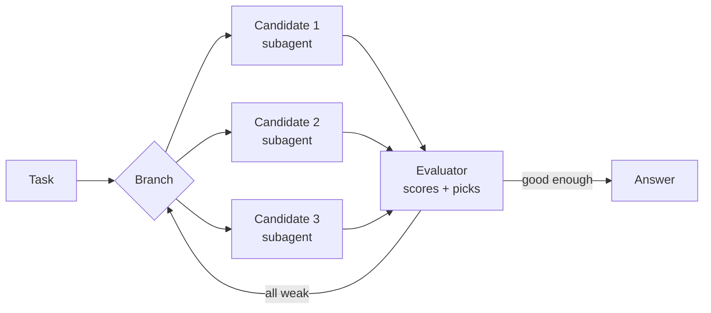
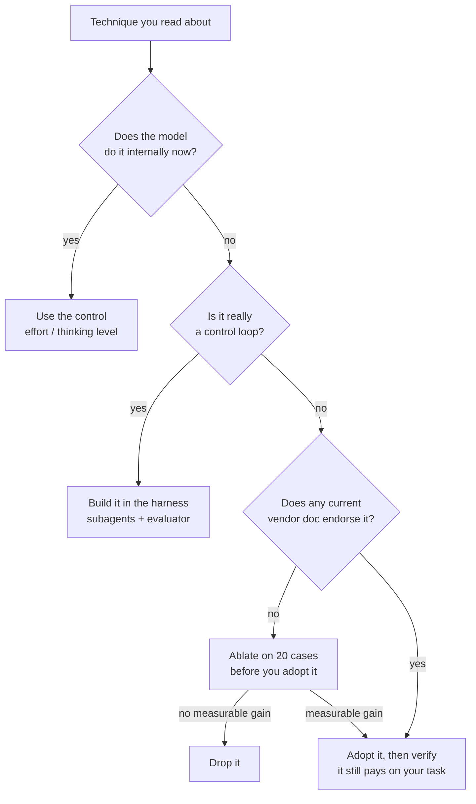

<LevelBadge level="intermediate" />

<Callout type="objectives" items={[
  "Cosa era davvero ciascuna celebre tecnica di prompting, in una riga",
  "Quali il modello ora fa per te, e quali le fa l'harness",
  "Le tre tecniche oggi attivamente sconsigliate dalle linee guida ufficiali dei fornitori",
  "Dove i fornitori sono apertamente in disaccordo — e come risolverlo per il tuo carico di lavoro",
]} />

Apri quasi qualunque guida al prompt engineering e trovi un elenco di tecniche con un nome: Chain-of-Thought, Tree of Thoughts, Self-Consistency, ReAct, Reflexion, Least-to-Most. Quasi tutte sono state pubblicate tra il 2022 e il 2023, per modelli che **non riuscivano a ragionare se non li costringevi tu**.

Quel vincolo non c'è più. I modelli di frontiera di oggi ragionano internamente prima di rispondere, e gli harness agentici iterano sui tool da soli. Quindi la maggior parte di quelle tecniche non è stata smentita — è stata **assorbita**, dentro il modello o dentro l'harness. Alcune oggi sono veri e propri autogol.

Questa pagina nomina ciascuna, dice a cosa serviva, e le assegna un verdetto.

## L'unica cosa che è cambiata

Ogni verdetto qui sotto risale allo stesso spostamento: il ragionamento si è spostato dal tuo prompt al forward pass del modello stesso. Tutti e tre i principali fornitori ora lo dicono nella loro documentazione.

| Fornitore | Cosa dicono le loro linee guida attuali |
|---|---|
| **Anthropic** | Il pensiero esteso "automatizza il ragionamento strutturato" e, quando è disponibile, è "generalmente preferibile al prompting manuale di chain of thought". |
| **OpenAI** | "Evita i prompt di chain-of-thought: poiché questi modelli eseguono il ragionamento internamente, chiedere loro di 'pensare passo per passo' o di 'spiegare il ragionamento' è inutile." |
| **Google** | Se usavi "prompt engineering complesso (come chain of thought) per forzare Gemini 2.5 a ragionare", usa invece il livello di pensiero del modello. |

<VerifyNote lastVerified="2026-10-03" source="https://claude.com/blog/best-practices-for-prompt-engineering">
Citazioni verificate contro le [best practice di prompt engineering per il 2026](https://claude.com/blog/best-practices-for-prompt-engineering) di Anthropic, le [best practice sul ragionamento](https://developers.openai.com/api/docs/guides/reasoning-best-practices) di OpenAI e la [guida per sviluppatori di Gemini 3](https://ai.google.dev/gemini-api/docs/gemini-3) di Google. Le linee guida dei fornitori vengono riviste in modo indipendente e spesso — rileggi la fonte prima di riscrivere un prompt di produzione sulla base di esse.
</VerifyNote>

## La tabella dei verdetti

| Tecnica | Cosa era | Verdetto |
|---|---|---|
| **Istruzione chiara e specifica** | Dichiara obiettivo, pubblico, formato, vincoli | ✅ **Resta tutto il gioco** |
| **Contratto di output** | "Rispondi solo con il JSON" / forma esatta | ✅ **Resta essenziale** |
| **Prompt chaining / scomposizione** | Dividere un compito difficile in più chiamate | ✅ **Resta essenziale** |
| **Permesso di astenersi** | "Di' che non lo sai invece di tirare a indovinare" | ✅ **Resta essenziale** |
| **Contesto + motivazione** | Spiegare *perché* un vincolo conta | ✅ **Ha guadagnato valore** |
| **Meta-prompting / APE** | Far scrivere o migliorare il prompt a un modello | ✅ **Sottovalutata, viva** |
| **Chain-of-Thought** | "Pensa passo per passo" prima di rispondere | 🔁 **Spostata dentro il modello** |
| **Least-to-Most** | Risolvere prima i sotto-problemi facili, in ordine | 🔁 **Spostata dentro il modello** |
| **ReAct** | Alternare `Thought:` / `Action:` / `Observation:` | 🔁 **Spostata dentro l'harness** |
| **Reflexion** | Auto-critica, poi nuovo tentativo tenendo la lezione | 🔁 **Spostata nel livello di memoria** |
| **Tree of Thoughts** | Ramificare, valutare, tornare indietro su risposte parziali | 🔁 **Spostata dentro l'harness** |
| **Esempi few-shot** | Mostrare 3–5 esempi svolti | ⚠️ **Contesa — i fornitori non sono d'accordo** |
| **Ruolo / persona** | "Sei un avvocato tributarista senior con 20 anni…" | ⚠️ **Declassata, tieni la versione snella** |
| **Self-Consistency** | Campionare N risposte, votare a maggioranza | ⚠️ **Situazionale, la paghi N×** |
| **Impalcature XML pesanti** | Marcare con tag ogni parte di ogni prompt | ⚠️ **Ora opzionale, non predefinita** |
| **Graph of Thoughts** | Grafo arbitrario di passi di ragionamento | 🧪 **Ricerca, nessun fornitore la raccomanda** |
| **Taratura della temperature** | Alzare o abbassare la creatività | ⛔ **Respinta del tutto sui modelli attuali** |
| **Pressione emotiva / mancia** | "Questo è molto importante per la mia carriera" | ⛔ **Nessuna guida attuale la sostiene** |
| **Ripetizione dell'istruzione / TUTTO MAIUSCOLO** | Dirlo tre volte, a voce alta | ⛔ **Ritirata** |

Il resto della pagina spiega le righe interessanti.

## Spostate dentro il modello

### Chain-of-Thought

[Wei et al. (2022)](https://arxiv.org/abs/2201.11903) hanno mostrato che un modello a cui si chiede di produrre passi di ragionamento intermedi risolveva molti più problemi di matematica e logica. [Kojima et al. (2022)](https://arxiv.org/abs/2205.11916) hanno poi scoperto che si poteva innescare quasi tutto con cinque parole — "Let's think step by step". Per quattro anni è stato il trucco di prompting con la leva più alta in assoluto.

I modelli di frontiera oggi lo fanno senza che glielo chiedi, e spendono su questo un *budget* che controlli tramite effort o livello di pensiero, non tramite frasi nel tuo prompt. Vedi [Pensiero ed effort](/docs/api/thinking-and-effort) e [Taratura dell'effort](/docs/api/effort-tuning).

Quindi quell'istruzione non è più gratis. Costa token, aggiunge un'istruzione che il modello deve rispettare accanto a quella vera, e su un modello con pensiero può spingere il ragionamento *dentro la risposta visibile* — esattamente dove non lo volevi.

<PromptCard title="Abitudine del 2023 — non riportarla in avanti">{`You are an expert mathematician with 20 years of experience. This is very
important to my career, so please take a deep breath and work through this
step by step, explaining your reasoning carefully before giving the final
answer. Let's think step by step.

Are there infinitely many primes p with p mod 4 == 3?`}</PromptCard>

<PromptCard title="Versione 2026 — stessa domanda, niente sprecato">{`Are there infinitely many primes p with p mod 4 == 3?

Give the proof sketch, then the one-line answer. If the result is open, say so.`}</PromptCard>

Il secondo prompt è più corto, non contiene istruzioni da riconciliare per il modello, e spende il suo budget sulla dimostrazione invece che sul raccontare. La profondità del ragionamento viene dall'impostazione di effort della richiesta, non dalle parole.

**Tieni la Chain-of-Thought manuale quando:** sei su un modello piccolo o locale senza modalità di pensiero (vedi [Eseguire modelli in locale](/docs/models/run-models-locally-ollama)), o ti serve specificamente il ragionamento *nell'output visibile* perché un umano lo controlli.

### Least-to-Most

[Zhou et al. (2022)](https://arxiv.org/abs/2205.10625) — far elencare al modello i sotto-problemi, poi risolverli in ordine. Stessa storia della Chain-of-Thought: è un piano, e pianificare è ormai la prima cosa che un modello con pensiero fa da solo. Resta utile come abitudine *umana* quando scomponi il lavoro su più chiamate, che è semplicemente [prompt chaining](/docs/prompting/pattern-library).

## Spostate dentro l'harness

### ReAct

[Yao et al. (2022)](https://arxiv.org/abs/2210.03629) hanno intrecciato ragionamento e chiamate a tool facendo emettere al modello testo in un formato fisso `Thought:` / `Action:` / `Observation:` che il tuo codice parsava con delle regex.

Rileggi quella descrizione: è un aggiramento via protocollo testuale per un'API che non aveva chiamate a tool. Ora l'API le ha. L'[uso di tool](/docs/api/tool-use) nativo, più il pensiero tra una chiamata e l'altra, *è* ReAct — implementato dal fornitore, type-checked e in streaming. Costruire a mano il protocollo testuale nel 2026 significa reintrodurre un parser che può rompersi su un due punti di troppo.

**L'unica cosa di ReAct che vale la pena tenere:** l'intuizione che il modello debba poter *pensare al risultato di un tool prima di scegliere il tool successivo*. Oggi è una funzionalità di piattaforma, non un prompt.

### Tree of Thoughts

[Yao et al. (2023)](https://arxiv.org/abs/2305.10601) hanno generalizzato la Chain-of-Thought in una ricerca: generare più passi candidati, assegnargli un punteggio, tenere i rami promettenti, tornare indietro dai vicoli ciechi.

Come *prompt* ("esplora tre approcci in parallelo, poi scegli") è debole — un modello in una sola finestra di contesto che interpreta un albero di ricerca produce in genere tre paragrafi simili più una scelta sicura di sé. Come *architettura* prospera, sotto altri nomi:

Questo è Tree of Thoughts con i rami come veri agenti paralleli e il valutatore come vero passo di valutazione. Costruiscilo con i [subagent](/docs/claude-code/subagents) o con i [team di agenti](/docs/api/cowork-and-agent-teams), e valutalo con le [eval](/docs/foundations/evals) — non con un paragrafo furbo.

### Reflexion

[Shinn et al. (2023)](https://arxiv.org/abs/2303.11366) facevano scrivere all'agente un breve post-mortem a parole dopo un tentativo fallito, portando quella nota nel tentativo successivo — imparare senza toccare i pesi.

L'idea era giusta e ha vinto. Ha solo smesso di vivere nel prompt: ora vive nel **livello di memoria**. Vedi [Memoria e context editing](/docs/api/memory-and-context-editing) e [Store di memoria per agenti gestiti](/docs/api/managed-agents-memory-stores). La versione moderna di "rifletti sul tuo fallimento" è un agente che scrive una lezione in uno store durevole che sopravvive alla [compaction](/docs/api/compaction).

**Fai comunque a mano la versione economica:** dopo una run andata male, chiedi al modello cosa nel prompt o nel set di tool l'ha fuorviato, poi sistema *quello*. L'esito di una riflessione va nel tuo system prompt, non nel turno successivo.

### Graph of Thoughts

[Besta et al. (2023)](https://arxiv.org/abs/2308.09687) hanno sostituito l'albero con un grafo arbitrario — unire rami, raffinare nodi sul posto, iterare. Ricerca davvero interessante; nessun fornitore la raccomanda, nessun harness mainstream la implementa, e il costo in token è brutale. Impara il nome; non costruirci sopra finché qualcosa non cambia.

## Contesa: esempi few-shot

Questa è quella onesta. I tre fornitori danno tre risposte diverse, per iscritto, in questo momento:

| Fornitore | Linea guida sugli esempi |
|---|---|
| **OpenAI** | "Prova prima zero shot… I modelli di ragionamento spesso non hanno bisogno di esempi few-shot per produrre buoni risultati." |
| **Anthropic** | "Inizia con un esempio (one-shot). Aggiungi altri esempi (few-shot) solo se l'output ancora non corrisponde alle tue esigenze." |
| **Google** | "I prompt senza esempi few-shot sono probabilmente meno efficaci" — e raccomanda di includerli sempre. |

Non risolverlo scegliendo il fornitore che ti piace. Il disaccordo è reale e riflette differenze reali nel modo in cui questi modelli sono stati addestrati. Risolvilo con un'ablazione sul tuo compito — è un lavoro da 20 minuti e batte i consigli di chiunque, compresi quelli di questa pagina.

<Steps items={[
  {title: "Congela un test set", body: "Raccogli 20 input reali con output noti e corretti. Non 3 — con 3 non distingui una variazione del 15% dal rumore. Vedi /docs/foundations/evals."},
  {title: "Scrivi la versione zero-shot", body: "Istruzione, vincoli, contratto di output. Nessun esempio."},
  {title: "Aggiungi esattamente un esempio", body: "Scegli l'input su cui la tua versione zero-shot ha sbagliato di più, e mostra l'output ideale per quello."},
  {title: "Aggiungine altri tre", body: "Copri le forme su cui il tuo compito varia davvero — non quattro versioni del caso facile."},
  {title: "Valuta tutte e tre le varianti sugli stessi 20 input", body: "Stesso modello, stesse impostazioni, una sola variabile cambiata. Registra i token oltre alla qualità."},
  {title: "Spedisci la variante più economica che supera la tua soglia", body: "Se one-shot pareggia con zero-shot, spedisci zero-shot: meno token, meno pattern-lock, niente da mantenere."},
]} />

La modalità di errore che vale la pena nominare: troppi esempi causano **pattern lock**, dove il modello riproduce la forma superficiale dei tuoi esempi su input che avrebbero richiesto una forma diversa. Se gli output sembrano stranamente uniformi, togli esempi prima di aggiungere istruzioni. Di più in [Few-shot fatto bene](/docs/prompting/few-shot).

## Declassati: ruoli e persona

"Sei un avvocato tributarista senior di livello mondiale con 20 anni di esperienza in uno studio di primo piano" era prassi standard. La linea guida attuale di Anthropic è più diretta: "Ruoli eccessivamente specifici possono limitare l'utilità dell'AI."

La parte utile di un ruolo non è mai stata la biografia — era **lessico e pubblico**. Tieni quello, butta il curriculum:

- ⛔ "Sei un leggendario ingegnere 10x che non scrive mai bug."
- ✅ "Rivedi questo per un servizio Python 3.12 che gira in Lambda. Segnala tutto ciò che fallirebbe con cold start concorrenti."

Il secondo dice al modello qualcosa che non sapeva. Il primo gli dice di essere sicuro di sé, che è l'opposto di ciò che vuoi da un revisore. Vedi [System prompt](/docs/prompting/system-prompts) e [Ruoli](/docs/foundations/roles).

## Situazionale: self-consistency

[Wang et al. (2022)](https://arxiv.org/abs/2203.11171) — campiona la stessa domanda N volte e prendi la risposta di maggioranza. Funziona, e funziona ancora. Il problema è il conto: N× token e N× latenza per una risposta.

Su un modello di frontiera, alzare l'effort o il budget di pensiero su **una** chiamata di solito compra più accuratezza per token di tre chiamate economiche più un voto. La self-consistency è ancora lo strumento giusto quando:

- La risposta è breve e verificabile (un numero, un'etichetta, un sì/no), così il voto è ben definito.
- Sei su un modello economico o locale dove tre chiamate costano ancora meno di una chiamata di frontiera.
- Ti serve un *segnale di confidenza* — un 3–0 e un 2–1 ti dicono cose diverse, e questo è difficile da ottenere in altro modo.

È lo strumento sbagliato per i testi lunghi, per il codice e per tutto ciò in cui "maggioranza" non ha senso.

## Ritirate

- **Taratura della temperature.** Non solo sconsigliata — **respinta**. Sui modelli Claude di frontiera attuali, un `temperature`, `top_p` o `top_k` non predefinito restituisce un errore 400 a ogni richiesta. Google "raccomanda vivamente di mantenere il parametro temperature al suo valore predefinito di `1.0`" per tutti i modelli Gemini 3, avvertendo che abbassarlo "può portare a comportamenti inattesi, come loop o prestazioni degradate". Modella il comportamento con il prompt e con l'impostazione di effort. Quali modelli espongano quali manopole è un bersaglio in movimento — controlla [Modelli e prezzi](/docs/whats-new/models-and-pricing) e [Controlli di sampling](/docs/foundations/sampling-controls).
- **Pressione emotiva.** [Li et al. (2023)](https://arxiv.org/abs/2307.11760) hanno davvero misurato guadagni con "questo è molto importante per la mia carriera" su modelli dell'epoca 2023, e la variante con la mancia offerta ha circolato molto. Nessuna guida attuale di un fornitore raccomanda nessuna delle due. Tratta l'effetto misurato come una proprietà dei modelli su cui è stato misurato, non come una legge del prompting — e nota che nessuno ha pubblicato una replica su modelli di frontiera.
- **Ripetizione dell'istruzione e TUTTO MAIUSCOLO.** Cintura e bretelle per modelli che perdevano le istruzioni dal mezzo dei prompt lunghi. Ribadire la richiesta dopo un documento molto lungo è ancora sensato ([Contesto lungo](/docs/prompting/long-context)); dirlo tre volte in un prompt da 200 token spende solo contesto e crea conflitti da risolvere.
- **Prefill del turno assistant.** Era il modo affidabile per imporre un formato di output a Claude. Ritirato — i modelli attuali restituiscono un 400 su un turno assistant finale precompilato. Usa un contratto di output o l'[output strutturato](/docs/api/structured-output).

## Come decidere per qualsiasi tecnica

Tutta la pagina si comprime in quel diagramma. Una tecnica con un nome è un'ipotesi su dove una capacità debba vivere — nel prompt, nel modello o nell'harness. Quando la capacità si sposta, la casa della tecnica si sposta con lei.

<Flashcards title="Conosci il canone" cards={[
  {front: "Chain-of-Thought (2022)", back: "Chiedere al modello di produrre passi di ragionamento intermedi prima di rispondere. Ora interna ai modelli con pensiero — controllala con l'effort, non con le parole."},
  {front: "Zero-shot CoT", back: "\"Let's think step by step\" — innesca il ragionamento senza esempi. Il prompt più copiato dell'era 2022–2024; ora ridondante sui modelli con pensiero."},
  {front: "Self-Consistency (2022)", back: "Campiona N percorsi di ragionamento, prendi la risposta di maggioranza. Ancora valida; costa N×. Ideale per risposte brevi e verificabili e per segnali di confidenza."},
  {front: "Least-to-Most (2022)", back: "Elenca i sotto-problemi, poi risolvili in ordine. Assorbita nella pianificazione interna; sopravvive come prompt chaining lato umano."},
  {front: "ReAct (2022)", back: "Alternare Thought / Action / Observation come testo da parsare. Sostituita dall'uso nativo dei tool più il pensiero tra le chiamate."},
  {front: "Reflexion (2023)", back: "Auto-critica a parole dopo un fallimento, portata nel tentativo successivo. Spostata nel livello di memoria — scrivi la lezione in un posto durevole."},
  {front: "Tree of Thoughts (2023)", back: "Ramifica, assegna punteggi, torna indietro su soluzioni parziali. Debole come prompt; forte come architettura — subagent paralleli più un valutatore."},
  {front: "Graph of Thoughts (2023)", back: "Grafo arbitrario di passi di ragionamento con unioni e cicli. Solo ricerca; nessun fornitore né harness mainstream la implementa."},
  {front: "Pattern lock", back: "La modalità di errore di troppi esempi few-shot: gli output copiano la forma superficiale degli esempi anche quando l'input richiedeva una forma diversa."},
  {front: "La regola dell'assorbimento", back: "Le tecniche non vengono smentite, vengono assorbite — dentro il modello o dentro l'harness. Chiediti dove vive adesso la capacità."},
]} />

<Quiz title="Verifica te stesso" questions={[
  {q: "Perché aggiungere \"pensa passo per passo\" a un prompt per un modello con pensiero è ora un costo e non un vantaggio?", options: ["Rende il modello più lento a iniziare lo streaming", "Il modello già ragiona internamente, quindi l'istruzione aggiunge token e un'istruzione in più da riconciliare — e può spingere il ragionamento nella risposta visibile", "Disattiva l'uso dei tool", "Alza la temperature"], answer: 1, explain: "I modelli di frontiera ragionano internamente e ne dosano il budget tramite effort o livello di pensiero. L'istruzione spende token, compete con la tua richiesta vera e può spostare il ragionamento nell'output che volevi pulito."},
  {q: "Qual è la casa moderna giusta per Tree of Thoughts?", options: ["Un prompt che chiede al modello di esplorare tre approcci", "Un harness che esegue i rami candidati come subagent paralleli e li valuta con un valutatore", "Un'impostazione di temperature più alta", "Un system prompt più lungo"], answer: 1, explain: "Come prompt produce in genere tre paragrafi simili e una scelta sicura di sé. Come architettura — rami paralleli più un vero passo di valutazione — prospera."},
  {q: "I tre principali fornitori oggi danno consigli scritti diversi sugli esempi few-shot. Cosa raccomanda questa pagina?", options: ["Seguire Google, dato che è il più favorevole agli esempi", "Seguire OpenAI, dato che zero-shot è il più economico", "Fare un'ablazione su 20 casi tuoi e spedire la variante più economica che supera la tua soglia", "Evitare del tutto gli esempi per restare portabile"], answer: 2, explain: "Il disaccordo è reale e riflette differenze di addestramento. Un'ablazione su 20 casi tuoi batte il consiglio generico di qualsiasi fornitore."},
  {q: "Cosa succede se invii una temperature non predefinita a un modello Claude di frontiera attuale?", options: ["Viene ignorata silenziosamente", "La richiesta restituisce un errore 400", "L'output diventa non deterministico", "Il pensiero viene disattivato"], answer: 1, explain: "Sui modelli Claude di frontiera attuali un temperature, top_p o top_k non predefinito restituisce un errore 400 a ogni richiesta. Modella invece il comportamento con il prompt e con l'impostazione di effort."},
]} />

<Callout type="takeaways" items={[
  "Le tecniche con un nome sono ipotesi su dove una capacità debba vivere — nel prompt, nel modello o nell'harness. Quando la capacità si sposta, si sposta anche la tecnica.",
  "Chain-of-Thought manuale e Least-to-Most si sono spostate dentro il modello: usa effort e livello di pensiero invece delle parole.",
  "ReAct e Tree of Thoughts si sono spostate dentro l'harness: uso nativo dei tool, subagent paralleli e un vero valutatore.",
  "Reflexion si è spostata nel livello di memoria: scrivi la lezione in un posto durevole, non nel turno successivo.",
  "Il few-shot è davvero contesa tra i fornitori — fai un'ablazione su 20 casi tuoi invece di fidarti di una guida.",
  "Taratura della temperature e pressione emotiva sono ritirate. Tieni l'inquadramento di ruolo snello: lessico e pubblico, mai il curriculum.",
]} />

## Avanti

- Le basi su cui è costruita ogni tecnica qui sopra → [Le basi del prompting](/docs/prompting/basics)
- Chiudi la questione del few-shot per il tuo compito → [Few-shot fatto bene](/docs/prompting/few-shot)
- Il controllo del ragionamento che ha sostituito "pensa passo per passo" → [Pensiero ed effort](/docs/api/thinking-and-effort)
- Porta un prompt a un altro fornitore senza reimparare tutto questo → [Traduzione di prompt tra AI](/docs/prompting/cross-ai-translation)
