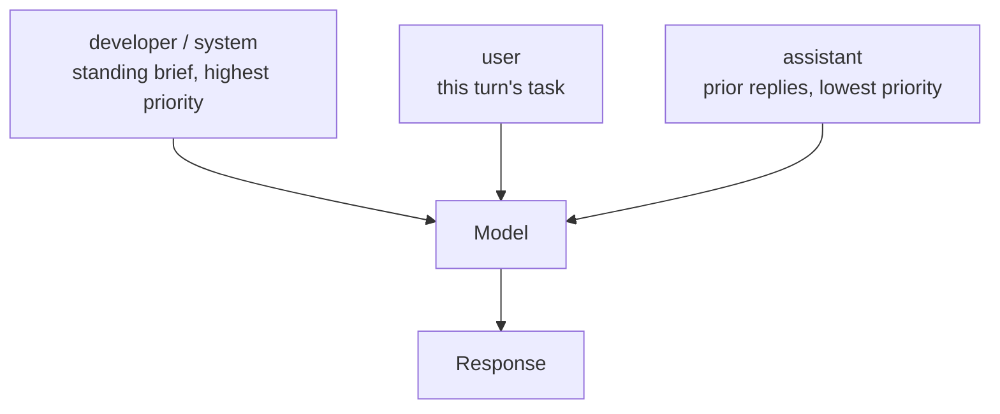

<LevelBadge level="intermediate" />

<Callout type="objectives" items={["Impostare correttamente un prompt di sistema su tutte e quattro le superfici — il parametro system di Anthropic, il ruolo developer di OpenAI, system_instruction di Gemini e i cinque flag di Claude Code", "Sapere cosa appartiene al brief permanente e cosa deve restarne fuori", "Smettere di forzare troppo: perché oggi \"CRITICAL: you MUST\" si ritorce contro i modelli attuali", "Mettere il prompt di sistema dove la cache dei prompt può riutilizzarlo, isolando la parte volatile", "Scegliere tra accodare e sostituire il prompt di default di Claude Code — e capire cosa si perde sostituendolo"]} />

Ogni modello ha un livello che inquadra l'intera conversazione. È la leva più economica che hai — la imposti una volta, si applica a ogni turno — ed è quella che la maggior parte delle persone riempie con il materiale sbagliato. [I ruoli](/docs/foundations/roles) spiegano *perché* conta. Questa lezione è la versione operativa: nomi esatti dei parametri, quanto spingere e dove tutto questo interagisce con la cache.

## Un'idea, quattro superfici

Il concetto è portabile ovunque. L'idraulica no.

| Superficie | Come si imposta | Forma |
|---|---|---|
| **Anthropic Messages API** | `system` — un **parametro di richiesta di primo livello**, non una voce in `messages` | Stringa, oppure un array di blocchi di contenuto |
| **OpenAI Responses API** | il parametro `instructions`, oppure un messaggio con ruolo **`developer`** | Si applica alla richiesta corrente; `instructions` non viene trasportato quando concateni con `previous_response_id` |
| **Google Gemini API** | `system_instruction` nella richiesta (`systemInstruction` in Java, `SystemInstruction` in Go) | Si imposta per interazione |
| **Claude Code** | cinque flag CLI (sotto), più [`CLAUDE.md`](/docs/claude-code/claude-md) e gli [output style](/docs/claude-code/output-styles) | Sostituzione o accodamento |
| **App di chat** | [istruzioni personalizzate](/docs/claude-app/custom-instructions) sul tuo account | Persistenti tra le chat |

<VerifyNote lastVerified="2026-09-30" source="https://platform.claude.com/docs/en/build-with-claude/prompt-engineering/claude-prompting-best-practices">
Nomi dei parametri verificati sul riferimento di prompting best practices di Anthropic, sulla [guida alla generazione di testo di OpenAI](https://developers.openai.com/api/docs/guides/text) (il ruolo `developer` e il parametro `instructions`) e sulla [guida alla generazione di testo di Gemini di Google](https://ai.google.dev/gemini-api/docs/text-generation) (`system_instruction`). Le superfici API dei vendor cambiano — verifica sulla documentazione collegata prima di andare in produzione.
</VerifyNote>

Il bug di portabilità più comune è trattare il `system` di Anthropic come un messaggio. Non lo è: sta accanto a `messages`, non dentro. Nella direzione opposta, la gerarchia di OpenAI è esplicita — **le istruzioni developer contano più di quelle user, che contano più dei turni precedenti dell'assistente.** La loro analogia: il messaggio developer è la definizione della funzione, il messaggio user sono gli argomenti che le passi.

<PromptCard title="Anthropic: system è un parametro di primo livello">{`curl https://api.anthropic.com/v1/messages \\
  -H "content-type: application/json" \\
  -H "x-api-key: $ANTHROPIC_API_KEY" \\
  -H "anthropic-version: 2023-06-01" \\
  -d '{
    "model": "claude-sonnet-5-5",
    "max_tokens": 1024,
    "system": "You are a precise financial analyst. Show your assumptions. Never invent numbers.",
    "messages": [{"role": "user", "content": "Summarize this filing."}]
  }'`}</PromptCard>

## Cosa ci va dentro

Ordina ogni riga del tuo prompt in base a **quanto spesso cambia**. Ciò che è vero per l'intera conversazione sale nel brief permanente. Ciò che cambia a ogni turno resta nel turno user.

<Steps items={[
  {title: "Identità e perimetro — sì", body: "Una frase di ruolo basta a spostare tono e focus. La documentazione di Anthropic è esplicita: anche una sola frase fa la differenza; avverte però di non ipervincolare il ruolo, perché i modelli attuali non hanno bisogno di impalcature di persona pesanti."},
  {title: "Regole ferree e limiti di rifiuto — sì", body: "Cosa il modello non deve mai fare, cosa deve sempre includere, cosa fare quando è incerto. Dagli il permesso esplicito di dire \"non lo so\" — quella singola riga riduce in modo misurabile le risposte inventate."},
  {title: "Contratto di output — sì", body: "La forma di una risposta valida: sezioni, lunghezza, lingua, se è ammesso un preambolo. \"Rispondi direttamente, senza preamboli\" va qui, non in ogni turno user."},
  {title: "Policy sui tool — sì", body: "Quando ricorrere a un tool e quando rispondere direttamente. È qui che si regola l'eagerness (vedi sotto)."},
  {title: "Fatti volatili — no", body: "I dati di oggi, il file corrente, i documenti recuperati, lo stato live. Quelli vanno nel turno user o nel contesto di retrieval. Sepolti nel prompt di sistema invalidano la cache e insegnano al modello fatti obsoleti."},
  {title: "Materiale di riferimento lungo — no", body: "I documenti grandi vanno in cima al turno user, sopra la domanda. Vedi /docs/prompting/long-context."}
]} />

## Quanto spingere

È qui che i prompt scritti per i modelli più vecchi fanno danno attivo. La guidance di Anthropic per la generazione Opus 4.5/4.6 e successive è netta: questi modelli sono **più reattivi al prompt di sistema dei loro predecessori**, quindi prompt irrigiditi contro un modello che *sotto*-attivava i tool ora lo porteranno a *sovra*-attivarli. Il rimedio è abbassare il volume — `Use this tool when…` invece di `CRITICAL: you MUST use this tool when…`.

<Callout type="warning" items={["Il TUTTO MAIUSCOLO, \"CRITICAL\", \"you MUST\" e il framing minaccioso sono un'eredità dei modelli che ignoravano le istruzioni morbide. Sui modelli attuali causano overtriggering e chiamate ai tool troppo aggressive.", "Le persona ipervincolate (\"sei un esperto 10x di livello mondiale che non sbaglia mai\") aggiungono token e non comprano nulla. Chiedi invece la prospettiva che vuoi davvero.", "Livelli contraddittori sono peggio di un brief sottile. Se il prompt di sistema dice \"sii conciso\" e una skill dice \"spiega sempre il tuo ragionamento\", il modello deve tirare a indovinare.", "Impilare tutte le tecniche insieme — ruolo, XML, few-shot, chain-of-thought, schema di output — è la forma più comune di over-engineering. Aggiungine una, misura, tienila solo se ha aiutato."]} />

L'eagerness è una manopola, non un tratto fisso, e il prompt di sistema è il posto dove la imposti. Racchiudi la policy in un tag con un nome, così la ritrovi e la modifichi più tardi:

<PromptCard title="Spingere verso l'azione">{`<default_to_action>
Implement changes rather than only proposing them. If intent is ambiguous, infer the
most useful action and proceed, using tools to find the details you are missing instead
of guessing.
</default_to_action>`}</PromptCard>

<PromptCard title="Spingere verso il chiedere prima">{`<do_not_act_before_instructions>
Do not modify files or start an implementation unless you are clearly asked to. When
intent is ambiguous, research and recommend instead of acting. Make changes only on an
explicit request.
</do_not_act_before_instructions>`}</PromptCard>

<VerifyNote lastVerified="2026-09-30" source="https://platform.claude.com/docs/en/build-with-claude/prompt-engineering/claude-prompting-best-practices">
La guidance sull'overtriggering e i due pattern di eagerness seguono la sezione sull'uso dei tool di Anthropic per la generazione Opus 4.5/4.6 e successive. Il comportamento specifico per modello cambia a ogni release — ricontrolla la guidance model-specific in cima a quella pagina.
</VerifyNote>

## Il prompt di sistema è il tuo prefisso di cache

Questa è la parte che finisce in fattura. Anthropic costruisce il prefisso cacheabile in un ordine fisso — **`tools`, poi `system`, poi `messages`** — e la cache copre tutto fino al blocco che marchi, incluso. Il prompt di sistema si trova quindi nella posizione di cache di valore più alto dell'intera richiesta: stabile, riutilizzato a ogni chiamata e davanti alla conversazione.

Due conseguenze:

- **Tieni il prompt di sistema stabile byte per byte.** Un timestamp, uno username o un session ID interpolati al suo interno cambiano il prefisso e mancano la cache a ogni singola richiesta.
- **Se una parte deve variare, metti prima la parte stabile** e rompi la cache dopo di essa, così l'unica cosa riletta è la coda variabile.

Le lunghezze minime cacheabili variano per modello — alcuni modelli attuali cachano da 512 token, quelli più vecchi arrivano a richiederne 4.096 — e un prompt sotto la soglia viene elaborato senza cache in silenzio, senza alcun errore. Controlla la tabella aggiornata prima di farci affidamento.

<VerifyNote lastVerified="2026-09-30" source="https://platform.claude.com/docs/en/build-with-claude/prompt-caching">
L'ordine del prefisso (`tools`, `system`, `messages`) e le lunghezze minime cacheabili per modello vengono dalla documentazione sul prompt caching di Anthropic; i minimi sono specifici per modello e cambiano a ogni release. Vedi anche [Prompt Caching](/docs/api/prompt-caching) e [Modelli e prezzi](/docs/whats-new/models-and-pricing).
</VerifyNote>

Claude Code offre una versione appositamente pensata di quella separazione. Quando il tuo prompt sostitutivo mescola istruzioni fisse e contesto per singola esecuzione, metti tra le due una riga che contiene solo `__SYSTEM_PROMPT_DYNAMIC_BOUNDARY__`: Claude Code divide alla prima riga di questo tipo e la elimina, mantenendo in cache tutto ciò che la precede mentre la parte sotto cambia (v2.1.275+). Per esecuzioni multi-utente da script, `--exclude-dynamic-system-prompt-sections` sposta il contesto per utente fuori dal prompt e nel primo messaggio user, così più macchine condividono un unico prefisso in cache.

## Claude Code: accodare o sostituire

Cinque flag impostano il prompt. Quattro impostano del testo; il quinto controlla se una conversazione mantiene il testo con cui è iniziata.

| Flag | Cosa fa |
|---|---|
| `--system-prompt` | Sostituisce l'intero prompt di default con il tuo testo |
| `--system-prompt-file` | Lo sostituisce con il contenuto di un file |
| `--append-system-prompt` | Accoda il tuo testo al prompt di default |
| `--append-system-prompt-file` | Accoda il contenuto di un file al prompt di default |
| `--system-prompt-snapshot` | `off` ricostruisce il prompt a ogni richiesta invece di riutilizzare quello registrato alla prima richiesta |

`--system-prompt` e `--system-prompt-file` sono mutuamente esclusivi; entrambi i flag di accodamento possono essere combinati con entrambi i flag di sostituzione.

La regola di decisione riguarda **ciò di cui sei disposto a farti carico**:

<Steps items={[
  {title: "Accoda quando Claude deve restare un assistente di coding", body: "Accodare preserva la guidance di default sui tool, le istruzioni di sicurezza e le convenzioni di coding, così fornisci solo ciò che differisce — regole per singola invocazione, formato di output, contesto di dominio per uno script -p."},
  {title: "Sostituisci quando l'identità o il modello di permessi è davvero diverso", body: "Un agente non di coding in una pipeline non presidiata, per esempio. Sostituire elimina tutto il prompt di default — inclusa la guidance sui tool e le istruzioni di sicurezza — quindi tutto ciò che il tuo task continua a richiedere è ora responsabilità tua."},
  {title: "Usa prima la leva giusta", body: "Le convenzioni di progetto che Claude deve sempre seguire vanno in CLAUDE.md. Una persona che alterni e condividi va in un output style. Un flag serve per una singola invocazione."}
]} />

<PromptCard title="Accodare una regola per una singola esecuzione headless">{`claude -p --append-system-prompt "Cite file:line for every claim." "audit the auth flow"`}</PromptCard>

Un tranello che costa tempo reale di debug: per default Claude Code costruisce il prompt di sistema **una volta sola**, alla prima richiesta di una conversazione, e lo registra. Ogni richiesta successiva in quella conversazione riutilizza il prompt registrato — anche dopo `--resume` o `--continue`. Cambia il testo del flag a un avvio successivo e non succede nulla finché la conversazione non viene compattata o non ne inizi una nuova. Mentre iteri sulla formulazione, passa `--system-prompt-snapshot off` (v2.1.257+) per ricostruirlo a ogni richiesta.

<VerifyNote lastVerified="2026-09-30" source="https://code.claude.com/docs/en/cli-reference">
I cinque flag per il prompt di sistema, la guidance su accodare-vs-sostituire, il marcatore `__SYSTEM_PROMPT_DYNAMIC_BOUNDARY__` (v2.1.275+) e il comportamento di registrazione dello snapshot (v2.1.257+) vengono dal riferimento CLI di Claude Code. Il comportamento vincolato alle versioni cambia spesso — controlla il [changelog](https://code.claude.com/docs/en/changelog).
</VerifyNote>

## Un prima/dopo lavorato

**Prima** — tutto a volume massimo, fatti volatili incastonati, nessun contratto di output:

<PromptCard title="Troppo forzato e ostile alla cache">{`You are THE BEST code reviewer in the world. You are a 10x engineer.
CRITICAL: You MUST ALWAYS use the search tool before answering. NEVER skip this.
IT IS EXTREMELY IMPORTANT that you are thorough.
The current date is 2026-09-30 and the user is reviewing PR #4412 on branch fix/auth-race.`}</PromptCard>

Quattro problemi distinti: i superlativi non comprano nulla, le urla porteranno il modello a chiamare troppo i suoi tool, non c'è una definizione di risposta valida e l'ultima riga cambia a ogni esecuzione, quindi il prefisso non va mai in cache.

**Dopo** — una frase di ruolo, un vero contratto di output, una via d'uscita per l'incertezza, fatti volatili spostati nel turno user:

<PromptCard title="Calmo, contract-first, cacheabile">{`You are a code reviewer for a TypeScript monorepo.

Rules:
- Search the codebase before claiming a symbol is unused.
- If you cannot verify a claim from the diff or the code, say so instead of guessing.

Output: a Summary section, then Risks, then Suggested changes. No preamble.`}</PromptCard>

La data, il numero della PR e il branch vanno nel turno user, dove appartengono. Stesso comportamento, un prefisso di cache stabile e circa un terzo dei token.

## Cosa non usare più

Il prefilling — iniziare tu stesso il turno dell'assistente così che il modello continui nel tuo formato — era il modo di riferimento per forzare il JSON o saltare un preambolo. **Su Claude 4.6 e successivi, un turno finale dell'assistente prefillato restituisce un errore 400.** I sostituti vivono tutti nel prompt di sistema o accanto a esso: un'istruzione diretta "rispondi senza preamboli", gli [structured output](/docs/api/structured-output), oppure un tool con un campo enum per la classificazione. I messaggi dell'assistente *altrove* nella conversazione non sono interessati, quindi gli [esempi few-shot](/docs/prompting/few-shot) funzionano ancora esattamente come prima.

<VerifyNote lastVerified="2026-09-30" source="https://platform.claude.com/docs/en/build-with-claude/prompt-engineering/claude-prompting-best-practices">
Il riferimento di prompting di Anthropic afferma che le risposte prefillate sull'ultimo turno dell'assistente non sono più supportate a partire dai modelli Claude 4.6, che queste richieste restituiscono un errore 400 e che i modelli precedenti accettano ancora i prefill. Vedi anche [Portare i prompt tra i modelli](/docs/models/porting-prompts-across-models).
</VerifyNote>

<Flashcards title="Prompt di sistema: riferimento rapido" cards={[
  {front: "Anthropic: dove va il prompt di sistema?", back: "Nel parametro di richiesta di primo livello `system` — accanto a `messages`, mai dentro. Accetta una stringa o un array di blocchi di contenuto."},
  {front: "OpenAI: nome del ruolo e parametro?", back: "Il ruolo `developer` (non `system`) per i messaggi, oppure il parametro `instructions` sulla Responses API. `instructions` si applica solo alla richiesta corrente."},
  {front: "Gemini: nome del parametro?", back: "`system_instruction` nella richiesta — `systemInstruction` in Java, `SystemInstruction` in Go."},
  {front: "Gerarchia delle istruzioni", back: "Developer/system conta più di user, che conta più dei turni precedenti dell'assistente. L'analogia di OpenAI: messaggio developer = definizione della funzione, messaggio user = argomenti."},
  {front: "Ordine del prefisso di cache", back: "`tools`, poi `system`, poi `messages`. Il prompt di sistema è la posizione di cache di valore più alto della richiesta — tienilo stabile byte per byte."},
  {front: "Accodare vs sostituire in Claude Code", back: "Accodare mantiene la guidance di default sui tool e le istruzioni di sicurezza. Sostituire le elimina tutte, quindi tutto ciò che serve al tuo task diventa responsabilità tua."},
  {front: "Perché \"CRITICAL: you MUST\" si ritorce contro", back: "I modelli attuali sono più reattivi al prompt di sistema di quelli per cui quello stile di prompt era stato scritto, quindi un linguaggio irrigidito ora causa overtriggering. Usa formulazioni normali."},
  {front: "Prefilling del turno finale dell'assistente", back: "Restituisce un 400 su Claude 4.6 e successivi. Usa invece un'istruzione \"senza preamboli\", gli structured output o un tool con un enum."}
]} />

<Callout type="takeaways" items={["Stesso concetto, idraulica diversa: il parametro `system` di Anthropic, il ruolo `developer` / `instructions` di OpenAI, `system_instruction` di Gemini, i cinque flag di Claude Code.", "Ordina per tasso di cambiamento — le regole durevoli vanno nel brief permanente, i fatti volatili nel turno user.", "Abbassa il volume. I modelli attuali sovra-attivano sui prompt irrigiditi per modelli che sotto-attivavano.", "Il prompt di sistema sta nel prefisso di cache (tools → system → messages): tienilo stabile byte per byte e stacca la coda variabile.", "In Claude Code, accodare preserva la guidance di default su sicurezza e tool; sostituire ti scarica addosso tutta la responsabilità.", "I turni finali dell'assistente prefillati danno un 400 su Claude 4.6+ — usa un contratto di output, gli structured output o i tool."]} />

<Quiz title="Mettiti alla prova" questions={[
  {q: "Nella Anthropic Messages API, dove vive il prompt di sistema?", options: ["Come prima voce dell'array `messages` con ruolo `system`", "Come parametro di richiesta di primo livello `system`, accanto a `messages`", "Come messaggio con ruolo `developer`", "Nel parametro `instructions`"], answer: 1, explain: "Il `system` di Anthropic è un parametro di richiesta di primo livello, non un messaggio. Trattarlo come una voce di `messages` è il bug di portabilità più comune."},
  {q: "Il tuo prompt dice \"CRITICAL: You MUST ALWAYS call the search tool.\" Su un modello Claude attuale, quale è l'effetto probabile?", options: ["Nessuno — l'enfasi viene ignorata", "Il modello chiama il tool più spesso di quanto vorresti, perché è più reattivo al prompt di sistema dei modelli più vecchi", "La richiesta viene rifiutata", "Il modello rifiuta il task"], answer: 1, explain: "La guidance di Anthropic per la generazione Opus 4.5/4.6 e successive è di smorzare il linguaggio aggressivo: questi modelli sono più reattivi al prompt di sistema, quindi i prompt scritti contro l'undertriggering oggi provocano overtriggering."},
  {q: "Perché interpolare il timestamp corrente nel prompt di sistema costa denaro?", options: ["I timestamp consumano token di output extra", "Cambia il prefisso cacheabile, quindi ogni richiesta manca la cache dei prompt", "L'API rifiuta i prompt di sistema non statici", "Forza il modello nell'extended thinking"], answer: 1, explain: "Il prefisso di cache è costruito come tools → system → messages. Qualsiasi modifica al testo di system lo invalida, quindi un timestamp per richiesta significa pagare il prezzo pieno di input a ogni chiamata."},
  {q: "In Claude Code passi `--system-prompt` invece di `--append-system-prompt`. A cosa hai appena rinunciato?", options: ["A nulla, i flag sono equivalenti", "Alla guidance sui tool e alle istruzioni di sicurezza del prompt di default, che ora devi fornire tu", "Alla possibilità di usare CLAUDE.md", "Al prompt caching"], answer: 1, explain: "Sostituire elimina tutto il prompt di default, inclusa la guidance sui tool e le istruzioni di sicurezza. Accodare le mantiene e aggiunge solo ciò che differisce."}
]} />

## Prossimi passi

- [Prompting specifico per Claude](/docs/prompting/prompting-claude)
- [Prompting per il long context](/docs/prompting/long-context)
- [Prompt Caching](/docs/api/prompt-caching)
