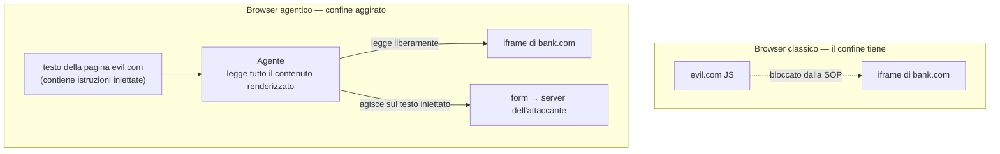

<LevelBadge level="advanced" />

<Callout type="objectives" items={["Capire la same-origin policy — il confine che ti ha silenziosamente protetto per 30 anni — e perché un agente AI si colloca al di sopra di essa", "Vedere quali dei 7 browser agentici sono risultati vulnerabili e la ragione architetturale", "Percorrere passo dopo passo l'attacco di esfiltrazione via iframe cross-origin", "Leggere i numeri del red-team dei vendor onestamente: le mitigazioni dimezzano il tasso di successo degli attacchi, non lo eliminano", "Applicare una postura di rischio pratica invece di un divieto totale"]} />

Il 30 giugno 2026 i ricercatori della University of Washington hanno pubblicato un risultato che riformula i browser AI: **quattro browser agentici su sette testati permettono a un sito malevolo di raggiungere dati appartenenti a un sito diverso.** Non tramite un bug di memory-safety. Tramite l'agente che funziona esattamente come previsto.

<VerifyNote lastVerified="2026-07-20" source="https://agent-security.cs.washington.edu/agentic_browsers_sop.html" />

## Il confine a cui nessuno pensa

Apri la tua banca in una scheda e un forum a caso in un'altra. Il JavaScript del forum non può leggere la pagina della banca, i suoi cookie o la sessione. Quella garanzia è la **same-origin policy (SOP)** — dove un'origine è la tripla `(scheme, host, port)`. È la ragione, come dice Franziska Roesner della UW, per cui navigare quasi ogni sito oggi è sicuro.

La SOP è imposta *dal browser*, sotto la pagina. Nulla di ciò che una pagina può dire riesce a superarla parlando.

Ora aggiungi un agente. Nei design più capaci, l'agente si comporta come un utente umano del browser: vede la pagina renderizzata, legge il DOM, clicca e digita. Un umano che guarda uno schermo non è vincolato dalla SOP — i tuoi occhi possono leggere due schede. Neanche un agente costruito per imitarne uno lo è.

Ecco la frase da tenere a mente: **la SOP non si indebolisce — smette di descrivere la realtà.** Il browser continua a imporla correttamente al livello JavaScript. L'agente semplicemente opera al di sopra di quel livello. Così una garanzia *architetturale* vecchia di decenni si degrada silenziosamente in una garanzia *comportamentale*: "speriamo che il modello non caschi nella prompt injection." Non sono la stessa classe di promessa, e solo una delle due tiene contro un attaccante che ha retry illimitati.

## Cosa è stato testato e cosa si è rotto

Kohlbrenner e Roesner hanno testato sette browser tra fine gennaio e febbraio 2026 e li hanno presentati al workshop Agents in the Wild a Rio de Janeiro il 26 aprile 2026.

| Browser | Precondizioni per il bypass della SOP? | Note |
|---|---|---|
| ChatGPT Atlas (Agent Mode) | **Sì — PoC end-to-end dimostrata** | Furto cross-origin end-to-end riuscito |
| Chrome con Gemini | **Sì** | Precondizioni presenti |
| Claude for Chrome | **Sì** | L'architettura a estensione consente iniezione di JS |
| Perplexity Comet | **Sì** | Precondizioni presenti |
| Brave Leo AI | No | Capacità dell'agente più ristrette |
| Microsoft Edge con Copilot | No | Capacità dell'agente più ristrette |
| Firefox AI Mode (Claude) | No | Il più restrittivo dei sette |

Il pattern è il vero risultato, ed è scomodo: **i browser più sicuri sono stati quelli che potevano fare meno.** Brave, Edge e Firefox non erano più sicuri grazie a classificatori migliori — passano all'agente una fetta limitata e predefinita della pagina invece dell'intera sessione di navigazione. Qui la sicurezza si compra con la capacità, non con l'ingegno. Ogni vendor che rivendica entrambi va letto con attenzione.

## L'attacco, passo dopo passo

<Steps items={[{"title":"L'attaccante costruisce una pagina con un iframe cross-origin","body":"evil.com incorpora un iframe che punta a un'origine sensibile in cui la vittima è loggata — una banca, la webmail, una dashboard interna. Il normale JavaScript su evil.com non può leggere nemmeno un carattere dentro quell'iframe. È comportamento web normale e consentito."},{"title":"La pagina nasconde istruzioni destinate all'agente","body":"Del testo sulla pagina — visivamente nascosto, in un attributo alt, in un campo del DOM che l'utente non vede mai — dice all'agente di includere il contenuto dell'iframe in qualunque cosa produca. Per il modello è solo altro contenuto della pagina, indistinguibile dall'articolo che gli è stato chiesto di leggere."},{"title":"L'utente chiede qualcosa di completamente innocuo","body":"\"Riassumi questa pagina.\" Non viene richiesto alcun permesso pericoloso e nessun avviso scatta, perché dalla prospettiva del browser non sta accadendo nulla di insolito."},{"title":"L'agente legge oltre il confine di origine","body":"Poiché l'agente percepisce la pagina completamente renderizzata, legge anche il contenuto dell'iframe. La same-origin policy non è violata — non è mai stata consultata, perché non è mai stata fatta alcuna chiamata JavaScript cross-origin."},{"title":"L'agente scrive i dati in un form controllato dall'attaccante","body":"L'istruzione iniettata indirizza il riassunto in un campo del form su evil.com. L'agente è utile, seguendo ciò che ha letto."},{"title":"Il form si invia da solo","body":"Dati cross-origin arrivano sul server dell'attaccante. L'utente ha visto comparire un riassunto e nient'altro."}]} />

Nota cosa *manca*: nessun exploit, nessun malware, nessuna CVE non patchata. Ogni passo usa una funzionalità documentata e voluta. È questo che lo rende un problema di architettura invece che di coda di bug.

I ricercatori nominano anche tre fratelli di questo attacco, che vale la pena conoscere per nome:

<Flashcards title="Le quattro classi di attacco cross-origin" cards={[{"front":"Furto di dati cross-origin","back":"L'agente legge contenuto dall'origine B mentre agisce su una pagina dell'origine A, poi lo esfiltra. La PoC dimostrata su ChatGPT Atlas."},{"front":"Forgery di azioni cross-origin","back":"L'agente viene indotto a eseguire un'azione che modifica lo stato sull'origine B (invio, trasferimento, cancellazione) da una pagina sull'origine A — CSRF, ma il confused deputy è l'agente, quindi i token CSRF e i cookie SameSite non aiutano."},{"front":"Avvelenamento della memoria di chat","back":"Testo iniettato viene scritto nella memoria persistente dell'agente, così la compromissione sopravvive alla pagina malevola e scatta in sessioni successive e non correlate."},{"front":"Lettura di input mascherati","back":"L'agente percepisce il valore sottostante di un campo password o altro input mascherato, che l'UI visiva nasconde deliberatamente all'umano."}]} />

L'avvelenamento della memoria è quello che dovrebbe preoccuparti di più. Gli altri tre finiscono quando chiudi la scheda. L'avvelenamento della memoria trasforma una singola pagina malevola in un impianto persistente nel tuo assistente, e attualmente non esiste un equivalente di "cancella i cookie" che la maggior parte degli utenti sappia cercare.

## Leggere i numeri dei vendor con onestà

Anthropic ha pubblicato i risultati del red-team per Claude for Chrome — e a suo merito ha pubblicato anche quelli sfavorevoli. Su 123 casi di test che coprono 29 scenari di attacco:

- Successo degli attacchi in modalità autonoma: **23,6% prima delle mitigazioni → 11,2% dopo**
- Su un set di sfida di quattro tipi di attacco specifici del browser: **35,7% → 0%**

Le mitigazioni includono permessi a livello di sito, prompt di conferma per azioni ad alto rischio, blocco di intere categorie di siti (servizi finanziari, adulti, contenuti piratati), classificatori di injection sia sul contenuto in ingresso sia sulle azioni in uscita e difese specifiche per campi DOM nascosti e injection via URL/titolo scheda. Anthropic riporta separatamente una configurazione che raggiunge **sotto lo 0,08%** contro la sua suite interna a tecniche combinate.

Fermati sul numero di mezzo. **11,2% non è un numero piccolo per un controllo di sicurezza.** Una serratura che si apre a uno sconosciuto su nove non è una serratura. La lettura onesta è che questi sono *riduttori di rischio su un confine che non esiste più*, non un suo sostituto — che è esattamente il punto dei ricercatori sulla necessità di una riprogettazione architetturale invece che di filtri migliori.

Il percorso di distribuzione tramite estensione ha una sua storia: i ricercatori hanno riportato che i permessi per-sito di Claude for Chrome potevano essere bypassati scrivendo direttamente nello store LevelDB su disco dell'estensione, e i lavori successivi ("ClaudeBleed") hanno trovato percorsi da estensione a estensione che potevano ancora spingere l'agente a leggere Gmail. I permessi imposti nello storage lato client sono consultivi contro qualsiasi cosa già in esecuzione con il tuo utente.

Anche la risposta dei vendor alla disclosure UW (60+ giorni di preavviso) varia: Brave, Google e Microsoft si sono impegnati; OpenAI e Firefox hanno rifiutato i report citando prove end-to-end insufficienti; Anthropic non aveva risposto al momento della pubblicazione.

<Callout type="warning" items={["La valutazione di Kohlbrenner è netta: se questi agenti hanno accesso a un browser che contiene le tue credenziali, non trattarli come pronti. Tratta la navigazione agentica come una capacità che concedi deliberatamente, non una che lasci accesa."]} />

## Una postura che puoi davvero mantenere

"Non usare mai un browser AI" è un consiglio che nessuno segue. Usa invece la forma dell'attacco — richiede **contenuto di pagina non fidato** più **una sessione autenticata** più **un percorso di esfiltrazione** nello stesso contesto dell'agente. Rompi una qualsiasi delle gambe.

<Steps items={[{"title":"Separa il profilo, non solo la scheda","body":"Esegui l'agente in un profilo del browser che non sia loggato in nulla di prezioso. Le sessioni sono l'asset; un agente senza cookie da rubare è un confused deputy molto meno interessante. È la singola mossa a più alta leva della lista."},{"title":"Tratta 'riassumi questa pagina' come un'azione privilegiata su pagine non fidate","body":"Leggere contenuto arbitrario scritto da un attaccante è il vettore di iniezione. Riassumere la tua bozza è a basso rischio; riassumere una pagina che uno sconosciuto ti ha linkato è esattamente lo scenario della PoC."},{"title":"Concedi i permessi di sito in modo ristretto e ricontrollali","body":"L'accesso per-sito è l'unico controllo che si mappa sul confine reale. Tieni la allowlist corta. Considera che sia consultivo e non ermetico, dato il finding su LevelDB."},{"title":"Cancella la memoria dell'agente dopo aver navigato qualsiasi cosa non fidata","body":"È l'unica difesa contro l'avvelenamento della memoria che un utente controlla direttamente, e non costa nulla."},{"title":"Non lasciare mai la modalità autonoma attiva per navigazione aperta","body":"Il numero 23,6% è per la modalità autonoma. I prompt di conferma sono deboli, ma convertono una compromissione silenziosa in una che potresti notare."},{"title":"Preferisci l'agente meno capace che fa il tuo lavoro","body":"La classifica UW è ordinata per capacità. Se un summarizer ristretto basta, l'agenzia extra che salti è superficie di attacco che non hai mai dovuto difendere."}]} />

Per il rischio strettamente correlato sul lato coding, vedi [Quando gli agenti di coding vengono weaponizzati](/docs/security/coding-agents-under-attack), la meccanica in [Prompt Injection](/docs/security/prompt-injection) e i trade-off di capacità in [Computer-Use Agents](/docs/models/computer-use-agents).

## Quiz

<Quiz title="Verifica te stesso" questions={[{"q":"Perché un browser agentico aggira la same-origin policy?","options":["L'agente sfrutta un bug di memory-safety nel motore del browser","L'agente percepisce la pagina completamente renderizzata come farebbe un utente, quindi non viene mai fatta una chiamata JavaScript cross-origin che il browser possa bloccare","La same-origin policy è stata rimossa dai browser moderni","L'agente gira con privilegi di root"],"answer":1,"explain":"Non avviene alcuna violazione della SOP — la SOP governa l'accesso JavaScript cross-origin. L'agente legge direttamente il contenuto renderizzato, sopra il livello dove la SOP è imposta, quindi il controllo non viene mai raggiunto."},{"q":"Cosa ha scoperto lo studio UW sul rapporto tra capacità dell'agente e sicurezza?","options":["I browser più capaci erano anche i più sicuri","Capacità e sicurezza non erano correlate","I browser più sicuri sono stati quelli i cui agenti potevano fare meno","Solo i browser open source erano sicuri"],"answer":2,"explain":"Brave Leo, Edge con Copilot e Firefox AI Mode hanno evitato le precondizioni dando agli agenti una fetta limitata e predefinita della pagina invece della piena capacità di navigazione. La sicurezza è stata comprata con la capacità."},{"q":"Il red-teaming di Anthropic ha ridotto il successo degli attacchi in modalità autonoma dal 23,6% all'11,2%. Qual è la lettura corretta?","options":["Il problema è risolto per Claude for Chrome","Una riduzione significativa, ma troppo alta per fungere da confine di sicurezza da sola","I numeri dimostrano che la navigazione agentica è sicura","Le mitigazioni hanno reso il browser meno sicuro"],"answer":1,"explain":"Dimezzare il successo degli attacchi è un progresso reale, ma circa uno su nove attacchi che riesce ancora è un riduttore di rischio, non un confine. Supporta la richiesta dei ricercatori di riprogettazione architetturale invece che di filtri."},{"q":"Quale attacco persiste dopo la chiusura della pagina malevola?","options":["Furto di dati cross-origin","Avvelenamento della memoria di chat","Lettura di input mascherati","Forgery di azioni cross-origin"],"answer":1,"explain":"L'avvelenamento della memoria scrive istruzioni iniettate nella memoria persistente dell'agente, così una singola visita può influenzare sessioni successive e non correlate."},{"q":"Qual è la mitigazione lato utente a più alta leva?","options":["Usare un system prompt più lungo","Eseguire l'agente in un profilo del browser non loggato in account preziosi","Disabilitare JavaScript","Usare la modalità in incognito per tutta la navigazione"],"answer":1,"explain":"L'attacco ha bisogno di una sessione autenticata da rubare. Rimuovere le sessioni preziose dal profilo dell'agente spezza la catena indipendentemente da quanto sia buona l'iniezione."}]} />

## Fonti e approfondimenti

- [Agentic Browsers and the Same-Origin Policy](https://agent-security.cs.washington.edu/agentic_browsers_sop.html) — Franziska Roesner & David Kohlbrenner, UW Allen School (fonte primaria; findings per browser, tassonomia degli attacchi, timeline della disclosure)
- [Some agentic AI browsers come with major cybersecurity risks, UW study finds](https://www.washington.edu/news/2026/06/30/some-agentic-ai-browsers-come-with-major-cybersecurity-risks-uw-study-finds/) — UW News, 30 giugno 2026
- [Piloting Claude in Chrome](https://claude.com/blog/claude-for-chrome) — Anthropic (numeri del red-team: 23,6% → 11,2%, 35,7% → 0%, 123 casi di test / 29 scenari)
- [Use Claude in Chrome safely](https://support.claude.com/en/articles/12902428-use-claude-in-chrome-safely) e [Claude in Chrome permissions guide](https://support.claude.com/en/articles/12902446-claude-in-chrome-permissions-guide) — Anthropic Help Center
- [Chrome extension site permissions can be bypassed via direct LevelDB write](https://github.com/anthropics/claude-code/issues/26779) — issue #26779 di anthropics/claude-code
- [ClaudeBleed Reopened: Browser Extensions Can Still Push Claude for Chrome to Read Your Gmail](https://www.manifold.security/blog/claude-for-chrome-extension-bypass) — Manifold Security
- [Prompt injection still drives most agentic AI security failures in production](https://www.helpnetsecurity.com/2026/06/11/owasp-prompt-injection-ai-security-failures/) — Help Net Security sul OWASP Top 10 per applicazioni agentiche
