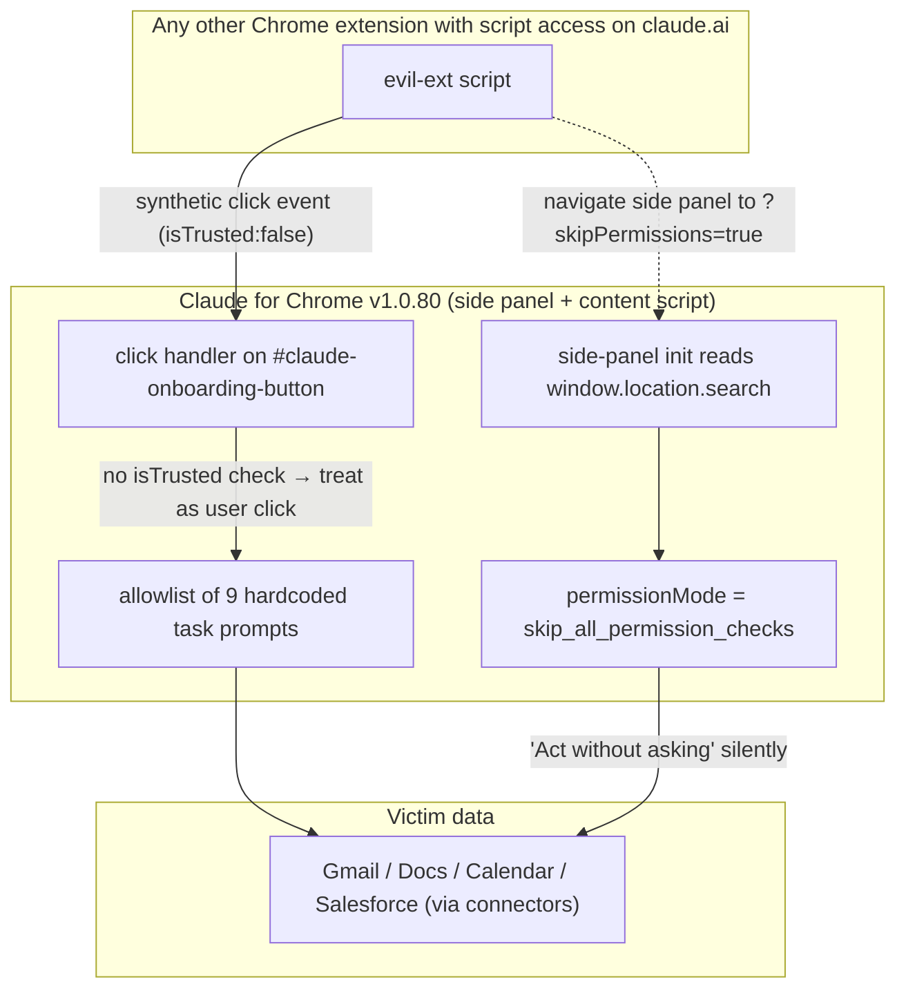

<LevelBadge level="advanced" />

<Callout type="objectives" items={["Capire i due bypass in Claude for Chrome — un controllo event.isTrusted mancante e un parametro URL che auto-eleva il side panel", "Vedere perché il vero punto della storia è che Anthropic ha marcato il tracker \"Risolto\" prima del 9 giugno e poi ha rilasciato altri otto aggiornamenti (v1.0.73 → v1.0.80) senza cambiare il codice", "Imparare il pattern difensivo generale: un'allowlist solo lato client non è un confine di sicurezza se un'altra estensione condivide la tua origine", "Applicare oggi stesso tre mitigazioni concrete in meno di due minuti"]} />

Il **7 luglio 2026** Anthropic ha rilasciato **Claude for Chrome v1.0.80**. Manifold Security lo ha testato lo stesso giorno e ha trovato che le due segnalazioni di bug di maggio erano ancora riproducibili byte per byte come sulla v1.0.72. Qualunque altra estensione del tuo browser con accesso script a `claude.ai` — un permesso richiesto da migliaia di estensioni Chrome — può istruire Claude in silenzio ad aprire Gmail, leggere un messaggio e agire su di esso. Nessuna finestra di approvazione. Nessun gesto dell'utente.

<VerifyNote lastVerified="2026-07-22" source="https://www.manifold.security/blog/claude-for-chrome-extension-bypass" />

La storia non è "un'estensione aveva un bug". Le estensioni Chrome hanno bug in continuazione. La storia è che un prodotto di agentic browsing già in commercio, dopo nove mesi di scrutinio e con alle spalle un incidente pubblico chiamato "ClaudeBleed", applica ancora il proprio modello di permessi in un punto pienamente sotto il controllo dell'attaccante — il client — e chiude il ticket di tracciamento come **Risolto** senza toccare una riga di codice.

## I due difetti in un'immagine

Due bug indipendenti. **Uno solo dei due** basta per innescare tutti i task hardcoded. Insieme, uno fornisce il trigger (il click falso) e l'altro fornisce l'esecuzione silenziosa (auto-elevazione).

## Difetto n. 1 — il controllo `isTrusted` mancante

Ogni evento che il browser distribuisce ha un booleano `isTrusted`. Le azioni reali dell'utente — un click fisico, la pressione di un tasto, un tocco — arrivano con `isTrusted: true`. Tutto ciò che JavaScript sintetizza tramite `dispatchEvent(new MouseEvent(...))` arriva con `isTrusted: false`. È l'unico segnale affidabile *utente-vs-codice* che il browser espone, ed esiste esattamente perché i gestori sensibili alla sicurezza possano distinguerli.

Il content script di Claude for Chrome ascolta i click sull'elemento con id `#claude-onboarding-button` e, se il click corrisponde a uno dei nove task ID in allowlist (`usecase-gmail`, `usecase-gdocs`, `usecase-calendar`, `usecase-salesforce`, più DoorDash, Zillow e tre sfide di onboarding), inoltra il prompt corrispondente al side panel di Claude per l'esecuzione.

Il gestore non verifica mai `event.isTrusted`. Nelle parole dei ricercatori: dal punto di vista dell'estensione, un click falso e uno reale sono indistinguibili.

Questo conta a causa di un punto architetturale facile da mancare: **qualsiasi altra estensione Chrome installata con `content_scripts` che matcha `https://claude.ai/*` condivide, dal punto di vista di Chrome, l'origine di Claude, e può iniettare uno script nella pagina.** Non è un permesso esotico — password manager, note-clipper, strumenti di traduzione, ad blocker e innumerevoli estensioni di "produttività" lo richiedono come cosa normale. Una volta che uno script gira in quella pagina, distribuire un click sintetico su `#claude-onboarding-button` sono circa sei righe di codice. Il report di Manifold sottolinea proprio questa dimensione per farne un punto: la fix è un `if` singolo, e l'exploit è una singola chiamata a `dispatch`.

L'allowlist da nove prompt era la mitigazione *precedente* di Anthropic per ClaudeBleed — l'idea era "anche se un click viene falsificato, si possono eseguire solo task presenti in una lista fissa e sicura". Quel modello si rompe nel momento in cui "esegui l'integrazione Gmail" è in lista. Leggere Gmail e agire su Gmail non è un task sicuro.

<Callout type="tip" items={["La lezione non è \"aggiungete isTrusted\" — è la lezione sottostante: un'allowlist di task \"sicuri\" per un agent è sicura solo quanto il task meno sicuro che contiene. Il consenso utente granulare, per singola integrazione, va messo su tutti quei trigger, non solo su quelli freeform non fidati."]} />

## Difetto n. 2 — `?skipPermissions=true` nell'URL del pannello

I side panel delle estensioni Chrome hanno un URL proprio, e la query string di quell'URL è leggibile dentro il panel via `window.location.search`. Il side panel di Claude legge un parametro `skipPermissions`. Se vale `"true"`, il panel si inizializza con `permissionMode = "skip_all_permission_checks"` — la stessa modalità interna di quando l'utente attiva manualmente *Act without asking*.

È un'escalation di privilegi lato client, autoservita. Il panel sta chiedendo permesso a sé stesso e risponde di sì basandosi su un valore che il panel stesso ha ricevuto nel proprio URL — un valore che qualsiasi cosa in grado di chiamare `chrome.sidePanel.open({...})` o di navigare il panel può fornire.

Manifold valuta lo scenario **CVSS 9.6 Critical**, perché in quella modalità non c'è alcuna finestra di approvazione: i nove prompt in allowlist vengono eseguiti in silenzio. Il difetto del click sintetico da solo (con la normale finestra di approvazione ancora visibile) è valutato 7.7 High, perché in teoria l'utente potrebbe notare il dialogo prima di premere invio.

La forma giusta della fix non è "sanitizzare il parametro URL". È che le transizioni tra modalità di permesso devono richiedere un gesto utente esplicito e `isTrusted` su un vero controllo UI dopo che il panel è stato caricato — mai un valore che il panel legge dal proprio URL, dal proprio storage o da un canale di messaggi su cui qualsiasi altra estensione può postare. È lo stesso vincolo architetturale che i browser già applicano ai permessi di fullscreen, camera e clipboard, per lo stesso motivo.

## Perché "risolto" ≠ patchato — il fallimento di processo

La timeline è ciò che rende questa una storia di governance, non solo di codice:

<Steps items={[
{ "title": "21 maggio 2026 — Manifold segnala entrambi i problemi", "body": "Due bug report distinti aperti verso Anthropic sulla v1.0.72." },
{ "title": "22 maggio — riconosciuti e chiusi", "body": "Anthropic riconosce entrambi. Il report n. 1 viene chiuso come duplicato di un tracker esistente; il report n. 2 viene liquidato come \"informativo\" con l'argomento che il parametro URL è \"usato solo dall'estensione stessa\" — che è esattamente l'assunzione che il bug viola." },
{ "title": "Prima del 9 giugno — il tracker interno passa a \"Risolto\"", "body": "Il ticket ombrello \"ClaudeBleed\" viene spostato a Resolved nel tracking interno di Anthropic — apparentemente sulla forza della mitigazione dell'allowlist da nove prompt, non di una fix sui due bug sottostanti." },
{ "title": "7 luglio — esce la v1.0.80, codice identico byte a byte", "body": "Otto release (v1.0.73 → v1.0.80) tra la segnalazione e oggi. I ricercatori verificano di nuovo: il click handler e l'inizializzazione del panel sono identici alla versione originariamente testata." },
{ "title": "14 luglio — disclosure pubblica", "body": "Nessun CVE. Nessun advisory di Anthropic. Post pubblico sul blog + Hacker News + copertura di stampa di settore. Alla data di questa pagina: ancora non patchato." }
]} />

Due failure mode da interiorizzare, perché sono comuni ben oltre questa storia:

1. **Collasso della mitigazione.** Una mitigazione che cambia la forma dell'exploit ("adesso devi cliccare uno di nove bottoni") viene trattata come una fix. Quando il trigger di quei bottoni è a sua volta falsificabile, la mitigazione non aggiunge sicurezza — cambia solo la ricetta dell'attacco.
2. **Deriva del \"risolto by design\".** Il bug n. 2 viene chiuso sulla teoria che solo l'estensione stessa imposti `skipPermissions`. Quella è una descrizione dell'*intento*, non dell'*applicazione reale del browser*. Qualsiasi cosa con accesso `sidePanel` o un redirect attraverso l'URL del panel può impostarlo lo stesso.

Entrambi i pattern compaiono nelle liste di anti-pattern delle security review per un motivo. Occhio a riconoscerli nel tuo codice.

## Cosa gira e a quali dati arriva

I nove task ID hardcoded, dal report di Manifold:

| Categoria | Task ID | Cosa dice il prompt a Claude (a grandi linee) |
| --- | --- | --- |
| Google | `usecase-gmail`, `usecase-gdocs`, `usecase-calendar` | Leggere Gmail (incl. un flusso "disiscriviti dalle email promozionali" che itera la inbox), leggere i commenti in Google Docs, leggere le disponibilità in Calendar e creare meeting |
| CRM / commerce | `usecase-salesforce`, `usecase-doordash`, `usecase-zillow` | Leggere lead Salesforce e convertirli in opportunità; percorrere i flussi DoorDash / Zillow |
| Onboarding | tre sfide di onboarding | Prompt della tour guidata |

L'ampiezza dipende da quali connector la vittima ha abilitato. Se Gmail è connesso, `usecase-gmail` legge Gmail. Se Salesforce è connesso, `usecase-salesforce` tocca il CRM. Il panel sta facendo ciò che un utente gli ha chiesto — solo non *questo* utente, e non ora.

<Callout type="warning" items={["\"Act without asking\" non è una modalità speciale da developer. È una checkbox nelle impostazioni di Claude for Chrome. Se è attiva, il difetto n. 1 da solo innesca letture reali su Gmail / Docs / Calendar / Salesforce. Se è spenta, il difetto n. 2 (?skipPermissions=true) può riattivarla in silenzio per la durata di vita del panel."]} />

## Tre cose da fare adesso (due minuti)

<Steps items={[
{ "title": "Spegni Act without asking", "body": "Impostazioni di Claude for Chrome → disattiva \"Act without asking\". Le richieste di approvazione sono fastidiose, ma sono l'unico segnale visibile all'utente che il difetto n. 1 da solo ti lascia." },
{ "title": "Verifica quali estensioni possono toccare claude.ai", "body": "chrome://extensions → Dettagli su ognuna → Accesso al sito. Qualunque cosa impostata su Tutti i siti o che elenca claude.ai può iniettare un content script nella pagina di Claude. Retrocedi o rimuovi quelle di cui non ti fidi davvero. Password manager e note-clipper sono le due categorie che vale la pena ricontrollare." },
{ "title": "Pota i connector che non usi", "body": "In Claude → Impostazioni → Connectors, disconnetti le integrazioni Gmail / Docs / Calendar / Salesforce da cui non dipendi. I nove task hardcoded sono pericolosi solo verso connector effettivamente collegati." }
]} />

Se fai girare estensioni agentiche per un intero team, aggiungi una quarta: **osservazione a runtime di cosa gli agent eseguono davvero** — non solo di quali permessi hanno. Entrambi i difetti passano un audit dei permessi e falliscono un'osservazione del comportamento, perché fanno *fare* all'agent cose che l'utente non ha mai chiesto. È in quella lacuna che atterra la raccomandazione di Manifold, e la lezione generalizza ben oltre questo singolo prodotto.

<PromptCard title="Prompt per far auditare le estensioni Chrome da Claude">
{`Here is my current chrome://extensions export (or a list I'll paste): {LIST}.

For each extension:
1. Is its "site access" set to "All sites" or does it match claude.ai? Flag those.
2. From its Chrome Web Store description, what content_scripts permissions does it plausibly require? Is claude.ai a required domain for its stated function?
3. Rate each on a "trust to run a script inside my Claude tab" scale from 1 (dedicated password manager from a known vendor) to 5 (random productivity extension with <10k installs).
4. Give me a two-column recommendation: KEEP AS-IS / RESTRICT TO SPECIFIC SITES / REMOVE — with a one-line reason per row.

Do not soften. If something looks sketchy, say sketchy.`}
</PromptCard>

## Il pattern più ampio — allowlist solo lato client, scope agentico

Alza lo sguardo da Claude for Chrome. La stessa forma si ripresenta in un numero crescente di prodotti agentici:

- Una UI fidata (estensione, app desktop, plugin IDE) espone un agent che può compiere azioni reali sui dati dell'utente.
- Per contenere il rischio, il vendor aggiunge una **allowlist** di task/prompt/tool che l'agent può eseguire senza approvazione.
- Il **trigger** per le voci in allowlist resta *dentro il client* — un click, un URL, un'impostazione salvata, un messaggio su un canale condiviso con altri componenti.
- Qualunque altro codice nella stessa zona di fiducia (stesso host di estensione, stessa origine, stesso bus IPC) può falsificare il trigger.

La lezione che ogni tornata insegna è la stessa. Vedi anche `docs/security/agentic-browsers-same-origin.mdx` (letture dell'agent al di sopra della SOP), `docs/security/coding-agents-under-attack.mdx` (l'auto-approvazione è la nuova superficie di attacco) e `docs/security/prompt-injection.mdx` (il contenuto non fidato diventa istruzioni non fidate). Ognuno di questi è un caso di *il confine viene tracciato dove l'attaccante è già in piedi*.

Due invarianti da appuntare su un post-it:

1. **Un controllo di permesso che l'attaccante può chiamare non è un controllo di permesso.** Se una qualsiasi tra "qualsiasi script su questa pagina", "qualsiasi parametro URL", "qualsiasi valore in storage" o "qualsiasi postMessage da origine ignota" può ribaltare il tuo agent da *chiedi* ad *agisci*, quel ribaltamento va messo dietro un gesto `isTrusted` su un vero elemento DOM che hai renderizzato tu.
2. **Le allowlist non sostituiscono il consenso.** Se anche un solo task in lista sorprenderebbe l'utente se eseguito non richiesto (`leggi la mia Gmail` rientra), l'allowlist riduce la scelta dell'attaccante ma non il suo impatto.

## Verifica rapida

<Quiz questions={[
  {
    "q": "In Claude for Chrome v1.0.80, perché a una normale estensione Chrome con accesso script su claude.ai basta per innescare i nove task in allowlist?",
    "options": [
      "Perché l'estensione può chiamare direttamente le API di Claude usando il session cookie dell'utente.",
      "Perché il click handler su #claude-onboarding-button non verifica event.isTrusted, quindi un click sintetico da qualunque script nella pagina viene trattato come input utente.",
      "Perché Chrome espone la chiave privata dell'estensione agli script same-origin.",
      "Perché Claude carica il codice dell'estensione dell'attaccante dentro il proprio processo."
    ],
    "answer": 1,
    "explain": "Il bug è il controllo isTrusted mancante. Un MouseEvent sintetico distribuito da qualunque script che gira nella pagina di Claude attraversa l'handler come se avesse cliccato l'utente. Nessuna esposizione di API key, nessun attraversamento di processo — basta l'accesso script alla pagina."
  },
  {
    "q": "Qual è il meccanismo reale del bypass ?skipPermissions=true?",
    "options": [
      "Il parametro URL viene inviato al server di Anthropic, che ritorna un admin token.",
      "Il side panel legge lui stesso window.location.search e, se skipPermissions vale \"true\", imposta il proprio permissionMode a skip_all_permission_checks localmente — nessun server è coinvolto.",
      "Disabilita la same-origin policy di Chrome per il panel.",
      "Concede al panel il permesso debugger di Chrome."
    ],
    "answer": 1,
    "explain": "È un'escalation di privilegi tutta lato client, autoservita. Il panel chiede permesso a sé stesso e legge la risposta dal proprio URL — che qualsiasi cosa in grado di aprire o navigare il panel controlla."
  },
  {
    "q": "Anthropic ha marcato il tracker sottostante come \"Risolto\" prima del 9 giugno 2026, eppure la v1.0.80 (7 luglio) è byte-identica alla v1.0.72. Quale failure mode illustra meglio questa situazione?",
    "options": [
      "Una compromissione supply-chain della build pipeline dell'estensione.",
      "Collasso della mitigazione: l'allowlist da nove prompt è stata trattata come fix, ma il trigger che seleziona i prompt è a sua volta falsificabile, quindi l'allowlist cambia la forma dell'exploit senza ridurne l'impatto.",
      "Un bug nel permission model di Chrome manifest v3.",
      "Anthropic che revoca l'accordo di disclosure con Manifold."
    ],
    "answer": 1,
    "explain": "L'allowlist era la mitigazione precedente di Anthropic per ClaudeBleed. Aiuta solo se il trigger che seleziona una voce è affidabile. Il controllo isTrusted mancante rende quel trigger falsificabile, quindi la mitigazione riduce la scelta dell'attaccante, non il suo impatto — ma il tracker è stato chiuso come se fosse una fix."
  },
  {
    "q": "Quale delle seguenti è la mitigazione singola più forte che un utente di Claude for Chrome può applicare adesso?",
    "options": [
      "Disabilitare JavaScript su claude.ai.",
      "Disinstallare Google Chrome.",
      "Disabilitare \"Act without asking\" e verificare quali altre estensioni hanno accesso script su claude.ai.",
      "Ruotare la Anthropic API key."
    ],
    "answer": 2,
    "explain": "Disabilitare \"Act without asking\" ripristina la finestra di approvazione (così il difetto n. 1 da solo diventa visibile all'utente), e potare le estensioni con accesso script su claude.ai rimuove il soggetto che potrebbe distribuire il click sintetico in primo luogo. Ruotare una API key non fa nulla qui — l'attacco cavalca la sessione UI dell'utente, non una credenziale API."
  }
]}/>

<Callout type="takeaways" items={["La v1.0.80 di Claude for Chrome (7 lug 2026) è ancora vulnerabile ai due bug Manifold segnalati per la prima volta sulla v1.0.72 a maggio — bypass a click sintetico dell'allowlist da nove prompt e auto-elevazione via ?skipPermissions=true nell'URL del panel.", "Entrambi i bug sono controlli di permesso solo lato client. \"Risolto\" nel tracker si riferiva a una mitigazione (l'allowlist), non a una fix dei gap di enforcement sottostanti.", "Adesso: spegni Act without asking, verifica quali altre estensioni Chrome possono iniettare script in claude.ai e disconnetti i connector che non usi.", "Regola generale: un controllo di permesso che uno qualsiasi degli script della pagina può chiamare non è un controllo di permesso. Le transizioni di modalità devono cavalcare un gesto isTrusted su un vero elemento UI, non un valore preso da URL / storage / messaggi."]} />

## Fonti e approfondimenti

- Manifold Security — [ClaudeBleed Reopened: browser extensions can still push Claude for Chrome to read your Gmail](https://www.manifold.security/blog/claude-for-chrome-extension-bypass) (write-up tecnico primario; timeline, valutazioni CVSS, l'osservazione del codice identico byte per byte)
- The Hacker News — [Researchers Say Claude for Chrome Flaw Lets Rogue Extensions Trigger Gmail Reads](https://thehackernews.com/2026/07/claude-for-chrome-flaw-lets-other.html) (copertura di settore; risposta pubblica di Anthropic)
- BleepingComputer — [Claude Chrome extension flaw lets malicious extensions trigger AI actions](https://www.bleepingcomputer.com/news/security/claude-chrome-extension-flaw-lets-malicious-extensions-trigger-ai-actions/) (superficie di attacco, requisiti di permessi)
- TechRadar — [The bypass is still six lines of JavaScript](https://www.techradar.com/pro/the-bypass-is-still-six-lines-of-javascript-security-experts-warn-that-claude-for-chrome-browser-extension-could-be-hijacked-despite-it-alerting-anthropic-several-times-that-something-was-wrong) (contesto sul perché la fix è un singolo condizionale)
- Correlati su AILmanac: [Browser agentici oltre la Same-Origin Policy](/docs/security/agentic-browsers-same-origin), [Quando i coding agent vengono armati](/docs/security/coding-agents-under-attack), [Prompt Injection: il modello di sicurezza che non puoi ignorare](/docs/security/prompt-injection)
- OWASP — [Top 10 for LLM Applications](https://genai.owasp.org/llm-top-10/) (LLM01 Prompt Injection e LLM06 Excessive Agency sono le due categorie a cui questi bug rimandano)
