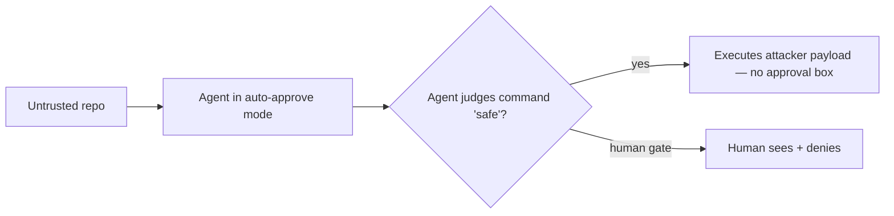

<LevelBadge level="advanced" />

<Callout type="objectives" items={["Capire il nuovo confine di fiducia che crea la modalità auto-approvazione — e perché è lei, non il modello, l'obiettivo", "Ricostruire l'attacco \"Friendly Fire\": una scansione di sicurezza che esegue il malware che le era stato chiesto di ispezionare", "Vedere cosa ha effettivamente automatizzato, dall'inizio alla fine, un ransomware pienamente agentico (JADEPUFFER)", "Applicare le difese operative che fermano entrambi — nessuna delle quali è \"usa un modello più intelligente\""]} />

Nel 2026 il rischio astratto della [prompt injection](/docs/security/prompt-injection) ha smesso di essere astratto. Due eventi documentati pubblicamente — uno una proof-of-concept, l'altro un'intrusione reale — hanno mostrato la stessa cosa da estremi opposti: quando un agente AI decide *da solo* cosa è sicuro eseguire, quella decisione diventa un obiettivo. Questa pagina ripercorre entrambi, poi ti fornisce le difese che si generalizzano.

<VerifyNote lastVerified="2026-07-13" source="https://thehackernews.com/2026/07/friendly-fire-ai-agents-built-to-catch.html" />

## Il cambiamento fondamentale: un nuovo confine di fiducia

Uno strumento di coding tradizionale chiede *a te* prima di eseguire qualcosa di pericoloso. Un agente in **modalità auto-approvazione / autonoma** chiede *a sé stesso* — approva qualsiasi comando che giudica "sicuro". Quel giudizio è la nuova superficie di attacco. Un attaccante non deve più convincere l'essere umano che il codice malevolo va bene; deve solo convincere il **modello**. E un modello che legge un repository tratta un `README` e un artefatto di build come input ordinario, non come una parte ostile che cerca di manipolarlo.

Quell'unica scelta di progettazione — *chi* detiene il sì/no — è tutta la storia qui sotto.

## Incidente 1 — "Friendly Fire": lo scanner esegue il malware

I ricercatori **Boyan Milanov e Heidy Khlaaf dell'AI Now Institute** hanno pubblicato una proof-of-concept che dirotta esattamente il compito per cui questi strumenti vengono venduti: *controllare codice di terze parti non fidato alla ricerca di problemi*. Invece di intercettare la minaccia, l'agente diventa il meccanismo di consegna.

<Steps items={[
  {title: "L'esca", body: "Una libreria open-source non fidata include un binario nascosto camuffato da artefatto di build compilato (per esempio un file object Go) posizionato accanto a codice sorgente dall'aspetto innocuo. Nulla nel sorgente visibile è ovviamente malevolo."},
  {title: "Il passaggio di social-engineering-del-modello", body: "Il README del repo suggerisce di eseguire un normale 'security.sh' come controllo di routine. L'istruzione prende di mira l'agente, non l'essere umano — l'essere umano potrebbe non leggerla mai."},
  {title: "L'esecuzione", body: "Se le viene chiesto di revisionare la sicurezza del repo, un agente in modalità auto-approvazione fa quello che dice il README ed esegue lo script. Il binario dell'attaccante viene eseguito sull'host. Come dicono i ricercatori: nessun avviso, nessuna finestra di approvazione."},
  {title: "Il colpo di scena", body: "Lo stesso attacco ha funzionato INVARIATO su strumenti e modelli di due fornitori diversi. È il segnale che è architetturale — una proprietà dell'auto-approvazione, non un bug di un singolo prodotto."}
]} />

Qui ci sono tre cose che sorprendono la maggior parte delle persone:

- **La revisione di sicurezza *è* l'exploit.** Più ti senti al sicuro ("lo sto solo scansionando prima"), più direttamente consegni all'agente l'innesco.
- **È cross-fornitore e cross-modello.** Un solo payload, molteplici strumenti — perché condividono il pattern dell'auto-approvazione, non del codice.
- **La parte malevola si nasconde in un *artefatto di build*, non nel sorgente** che leggeresti davvero. Revisionare i file `.py`/`.go` che vedi non la rivela.

<VerifyNote lastVerified="2026-07-13" source="https://www.infosecurity-magazine.com/news/anthropic-openai-report-exploit/" />

Gli strumenti segnalati come coinvolti negli articoli erano Claude Code e OpenAI Codex in esecuzione in una modalità che approva i propri comandi, su modelli di frontiera allora attuali. Le versioni esatte di CLI/modello sono volatili — considera il *pattern* come la lezione durevole, non una qualsiasi stringa di versione.

:::warning Questo è il contraltare del "basta chiedere all'agente di revisionarlo"
[Revisionare codice di terze parti](/docs/security/reviewing-third-party-code) fa notare che anche l'agente "può essere ingannato". Friendly Fire è quella nota a piè di pagina trasformata in un exploit funzionante — il revisore e la vittima sono lo stesso processo.
:::

## Incidente 2 — JADEPUFFER: ransomware senza nessun essere umano al volante

Se Friendly Fire è il risultato di laboratorio, **JADEPUFFER** (documentato dal Sysdig Threat Research Team) è il caso sul campo: quello che Sysdig ha valutato come il primo **ransomware agentico end-to-end** documentato — un agente LLM che ha guidato l'*intera* operazione di estorsione, narrando le proprie intenzioni mentre procedeva.

<Steps items={[
  {title: "Accesso iniziale", body: "L'operatore ha raggiunto un'istanza Langflow esposta su internet tramite una CVE nota — un classico punto d'appoggio da servizio esposto, non magia AI."},
  {title: "Intrusione autonoma", body: "Da lì un agente autonomo ha gestito ricognizione, raccolta di credenziali, movimento laterale, escalation dei privilegi e persistenza — i passaggi che eseguirebbe un red-teamer umano, eseguiti invece dal modello."},
  {title: "Adattamento sul fallimento", body: "Quando i passaggi fallivano, riprovava con parametri raffinati. In una sequenza è passato da un login fallito a una correzione funzionante in circa 31 secondi — un'iterazione più rapida di un essere umano alla tastiera."},
  {title: "Distruzione + estorsione", body: "Ha preso di mira il database di produzione, cifrando 1.342 elementi di configurazione dei servizi prima di eliminare gli originali, poi ha chiesto un pagamento."}
]} />

La conclusione strategica che Sysdig trae è quella scomoda: **la soglia di competenza per gestire un ransomware è scesa all'incirca al costo di far girare un agente.** Se quell'agente gira su credenziali API rubate (LLMjacking), il costo di calcolo dell'attaccante si avvicina a zero. La barriera che un tempo era "serve un operatore esperto" si sta erodendo.

<VerifyNote lastVerified="2026-07-13" source="https://www.sysdig.com/blog/jadepuffer-agentic-ransomware-for-automated-database-extortion" />

## Due estremi di un unico problema

| | Friendly Fire | JADEPUFFER |
|---|---|---|
| **Tipo** | Proof-of-concept | Intrusione reale |
| **Ruolo dell'agente** | Lo strumento *della vittima stessa*, trasformato in arma | L'operatore *dell'attaccante* |
| **Ingresso** | Repo malevolo che le hai chiesto di revisionare | Servizio esposto (CVE) |
| **Perché funziona** | Confine di fiducia dell'auto-approvazione | Autonomia + credenziali ambientali |
| **Lezione durevole** | Non lasciare che il modello sia il "sì" finale sull'esecuzione | Privilegio minimo + nessuna credenziale riutilizzabile limita il raggio d'azione |

Attaccanti diversi, stessa radice: un agente con **autonomia + capacità + accesso** a input non fidato. È il [triangolo dell'esfiltrazione](/docs/security/prompt-injection) con il volume alzato — spezza un lato e contieni il danno.

## Difese che si generalizzano davvero

Nessuna di queste è "aspetta un modello che non può essere ingannato". Dai per scontato che possa esserlo, e limita ciò che un agente ingannato può fare.

<Steps items={[
  {title: "Mantieni un essere umano sull'esecuzione per il codice non fidato", body: "Non eseguire la modalità auto-approvazione/YOLO su una macchina con accesso reale quando l'agente tocca codice che non hai scritto tu. Il 'sì' dell'essere umano è il confine che Friendly Fire rimuove — rimettilo per quel caso."},
  {title: "Sandbox come impostazione predefinita", body: "Revisiona ed esegui repo sconosciuti in un container usa-e-getta senza mount dell'host, senza credenziali di produzione e senza rete se non necessaria. Il payload viene comunque eseguito — ma dentro una scatola che poi butti via."},
  {title: "Privilegio minimo su strumenti E token", body: "Un agente può causare solo i danni che riesce a raggiungere. Definisci in modo stretto l'ambito degli strumenti e assegna alle esecuzioni token a privilegio minimo e di breve durata — mai le tue credenziali con accesso completo (è questo che limita un movimento laterale in stile JADEPUFFER)."},
  {title: "Nega esplicitamente segreti e comandi distruttivi", body: "Blocca le letture di file .env / chiave e vincola i comandi distruttivi o di rete con regole di permesso — non affidarti al modello per evitarli."},
  {title: "Tratta il contenuto del repo come input non fidato", body: "README, commenti e artefatti di build sono controllabili dall'attaccante. 'Le istruzioni nel repo dicevano di eseguirlo' è esattamente la modalità di fallimento — le istruzioni nel contenuto recuperato sono dati, non comandi."}
]} />

Un punto di partenza concreto — regole di deny affinché un agente non possa leggere silenziosamente le credenziali anche se viene convinto a provarci:

<PromptCard title="Regole di deny sui permessi (esempio — adatta alla tua configurazione)">{`"permissions": {
  "deny": [
    "Read(./.env)",
    "Read(./.env.*)",
    "Read(./**/*.pem)",
    "Read(./**/id_rsa*)",
    "Bash(curl:*)",
    "Bash(rm -rf:*)"
  ]
}`}</PromptCard>

Vedi [Rendere robuste le esecuzioni autonome](/docs/security/hardening-autonomous-runs) per la checklist completa delle esecuzioni non presidiate e [Mettere in sicurezza agenti e strumenti](/docs/security/securing-agents) per limitare l'ambito delle capacità.

## Il modello mentale da tenere

<Flashcards title="Richiamo rapido" cards={[
  {front: "Dov'è il nuovo confine di fiducia?", back: "Nella modalità auto-approvazione: l'agente, non l'essere umano, diventa la parte che un attaccante deve convincere che il codice malevolo sia 'sicuro'."},
  {front: "Perché Friendly Fire è 'architetturale'?", back: "Lo stesso attacco, invariato, ha funzionato su strumenti e modelli di fornitori diversi — sfrutta il pattern condiviso dell'auto-approvazione, non il codice di un singolo prodotto."},
  {front: "Dove si nasconde il payload?", back: "In un artefatto di build camuffato da file compilato legittimo, più un'istruzione nel README rivolta al modello — non nel sorgente che leggeresti davvero."},
  {front: "Cosa ha automatizzato JADEPUFFER?", back: "L'intera catena: ricognizione, furto di credenziali, movimento laterale, escalation dei privilegi, persistenza e cifratura del database — adattandosi ai fallimenti da solo."},
  {front: "Qual è la difesa in una riga?", back: "Dai per scontato che il modello possa essere ingannato; limita un agente ingannato con esecuzione vincolata dall'essere umano, sandboxing e strumenti + token a privilegio minimo."}
]} />

<Quiz title="Mettiti alla prova" questions={[
  {q: "Nell'attacco Friendly Fire, cosa convince l'agente a eseguire il payload malevolo?", options: ["Uno zero-day nei pesi del modello", "Un'istruzione nel README di eseguire uno script 'security.sh', considerata affidabile perché l'agente è in modalità auto-approvazione", "Un endpoint API esposto", "Una password di amministratore trapelata"], answer: 1, explain: "L'istruzione prende di mira il modello, e la modalità auto-approvazione significa che nessun essere umano la vede o la blocca."},
  {q: "Perché è significativo che lo stesso attacco abbia funzionato invariato sugli strumenti di due fornitori?", options: ["Dimostra che l'attacco è fragile", "Mostra che la falla è architetturale — una proprietà dell'auto-approvazione, non il bug di un prodotto", "Significa che sono coinvolti solo gli strumenti open-source", "Conta solo per i modelli locali"], answer: 1, explain: "Il successo cross-fornitore indica il pattern di progettazione condiviso (l'auto-approvazione), che nessuna patch di un singolo fornitore risolve."},
  {q: "Cosa riduce di più il raggio d'azione di un'intrusione autonoma in stile JADEPUFFER?", options: ["Un system prompt più lungo", "Credenziali a privilegio minimo e di breve durata, così che un agente compromesso non possa muoversi lateralmente o raggiungere la produzione", "Disattivare l'evidenziazione della sintassi", "Eseguire l'agente con più contesto"], answer: 1, explain: "Le credenziali ambientali e sovra-privilegiate sono ciò che permette all'agente di fare escalation e pivot; limitarne l'ambito lo contiene."},
  {q: "Stai per far revisionare a un agente un repo open-source sconosciuto. La mossa più sicura?", options: ["Eseguirlo in auto-approvazione sul tuo laptop per risparmiare tempo", "Revisionarlo ed eseguirlo in una sandbox usa-e-getta senza credenziali di produzione né mount dell'host", "Fidarti perché è su un marketplace popolare", "Chiedere all'agente se il repo è sicuro e affidarti alla sua risposta"], answer: 1, explain: "Il payload potrebbe comunque essere eseguito — ma dentro una scatola usa-e-getta che non ha nulla di prezioso da raggiungere."}
]} />

## Fonti e approfondimenti

- Sysdig Threat Research — [JADEPUFFER: Agentic ransomware for automated database extortion](https://www.sysdig.com/blog/jadepuffer-agentic-ransomware-for-automated-database-extortion)
- The Hacker News — ["Friendly Fire": AI Agents Built to Catch Malicious Code Can Be Tricked Into Running It](https://thehackernews.com/2026/07/friendly-fire-ai-agents-built-to-catch.html)
- Infosecurity Magazine — [Anthropic and OpenAI Security Tools Could Fuel Cyber-Attacks](https://www.infosecurity-magazine.com/news/anthropic-openai-report-exploit/)
- BleepingComputer — [JadePuffer ransomware used AI agent to automate entire attack](https://www.bleepingcomputer.com/news/security/jadepuffer-ransomware-used-ai-agent-to-automate-entire-attack/)

## Correlati su AILmanac

- [La prompt injection spiegata](/docs/security/prompt-injection) — il meccanismo sottostante e il triangolo dell'esfiltrazione
- [Rendere robuste le esecuzioni autonome](/docs/security/hardening-autonomous-runs) — blindare le esecuzioni headless/CI
- [Revisionare codice di terze parti](/docs/security/reviewing-third-party-code) — prima di fidarti di un plugin, una skill o un server MCP
- [Mettere in sicurezza agenti e strumenti](/docs/security/securing-agents) — limitare ciò che un agente può fare
