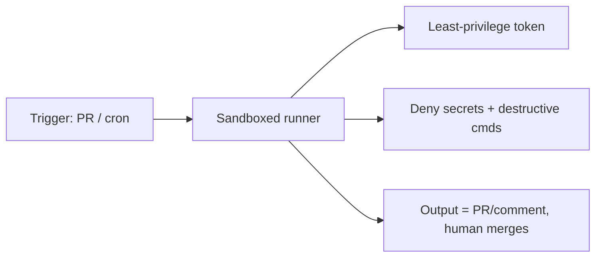

<LevelBadge level="advanced" />

Eseguire Claude in modalità [headless](/docs/claude-code/headless-and-agent-sdk) o su [pianificazione](/docs/claude-code/background-tasks) — in CI, in un cron job, in un hook pre-commit — elimina la persona che normalmente intercetterebbe un'azione errata. Proprio questa comodità è il motivo per cui tali esecuzioni necessitano dei guardrail più stringenti.

## I rischi tipici delle esecuzioni non sorvegliate

- **Nessuno che dica "no"** a una chiamata di strumento rischiosa nel momento giusto.
- **Credenziali ambientali.** La CI spesso dispone di token potenti (deploy, registry dei pacchetti, cloud). Un agente al suo interno li eredita.
- **Input non affidabili.** Un'esecuzione innescata da una PR o da una issue può elaborare contenuti scritti da un attaccante ([injection](/docs/security/prompt-injection)).

## Una checklist per l'irrobustimento

- **Nega esplicitamente i segreti.** Blocca la lettura di `.env`, dei file di chiavi e dei percorsi delle credenziali tramite [regole di negazione dei permessi](/docs/claude-code/permissions). Non affidarti al modello per evitarli.
- **Non usare mai la modalità bypass/yolo su una macchina con accessi reali.** Riserva il "salta tutti i prompt" alle sandbox usa e getta.
- **Limita l'ambito del token.** Assegna all'esecuzione un token a privilegio minimo (in sola lettura ove possibile), non le tue credenziali con accesso completo.
- **Sandbox ed effimerità.** Esegui in un container che viene distrutto al termine; nessun accesso persistente all'ambiente di produzione.
- **Allowlist per comandi e domini.** Consenti i tuoi comandi di test/lint/build; nega quelli di rete o distruttivi.
- **Imposta dei limiti.** Numero massimo di iterazioni, budget di tempo, budget di token/costo — così un loop o un agente manipolato non possono sfuggire al controllo.
- **Rendi gli output revisionabili, non applicati automaticamente.** Preferisci "apri una PR / pubblica un commento" rispetto a "push su main". È un umano a fare il merge.

## Esempio: un revisore CI sicuro

Un bot di revisione delle PR dovrebbe: effettuare il checkout del codice in sola lettura, **non** avere accesso a deploy/segreti, eseguire in un container e **commentare** le proprie osservazioni — senza mai modificare i branch protetti. Vedi la [guida pratica alla revisione delle PR](/docs/walkthroughs/pr-review-action).

## Prossimi passi

- [Permessi e modalità dei permessi](/docs/claude-code/permissions)
- [Mettere in sicurezza agenti e strumenti](/docs/security/securing-agents)
- [Modalità headless e l'Agent SDK](/docs/claude-code/headless-and-agent-sdk)
