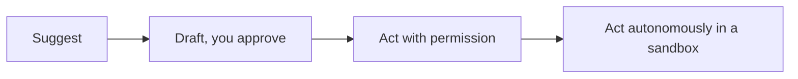

<LevelBadge level="all" />

Ottenere il massimo dall'IA include usarla *in modo responsabile*. Questa pagina è breve, pratica e si rivolge a tutti — dal principiante a chi costruisce.

## La mentalità della verifica

L'abitudine più importante in assoluto: **adatta la tua verifica alla posta in gioco.**

| Posta in gioco | Esempio | Quanto verificare |
|---|---|---|
| Bassa | Brainstorming, bozze grezze | Fidati liberamente, scorri velocemente |
| Media | Un'email di lavoro, un riassunto | Leggilo, fai un controllo di buon senso sui fatti |
| Alta | Statistiche pubblicate, codice che eseguirai, ambito legale/medico/finanziario | Verifica ogni affermazione rispetto a una fonte affidabile |

L'IA è una prima bozza rapida, mai un'autorità definitiva — vedi [Allucinazioni](/docs/foundations/hallucinations).

## La scala dell'autonomia

Concedi all'IA più indipendenza solo man mano che si guadagna la fiducia:

Inizia con "proponi, io approvo" ([modalità Plan](/docs/claude-code/plan-mode)); riserva la piena autonomia al lavoro a basso rischio, in sandbox e reversibile ([Irrobustire le esecuzioni autonome](/docs/security/hardening-autonomous-runs)).

## Privacy e dati

- Non incollare segreti, credenziali o dati personali altrui in uno strumento che non hai verificato.
- Conosci la politica di gestione dei dati e di addestramento del tuo provider prima di condividere materiale sensibile — vedi [Privacy e gestione dei dati](/docs/foundations/privacy).
- Per dati regolamentati o riservati, utilizza le apposite impostazioni enterprise/controllate.

## Bias, equità e limiti

I modelli riflettono i pattern presenti nei loro dati di addestramento, che possono portare con sé dei **bias**. Presta particolare attenzione quando l'output dell'IA influenza decisioni che riguardano le persone (assunzioni, concessione di prestiti, moderazione). Mantieni un umano responsabile delle decisioni importanti, e tratta l'IA come un supporto al giudizio, non come un suo sostituto.

## Non delegare il tuo pensiero

:::tip Usa l'IA per pensare meglio, non per pensare di meno
Gli utenti migliori restano coinvolti — mettono in discussione gli output, ne imparano e si assumono la responsabilità del risultato. Per lo studio, questo significa il [ciclo dello spiegare a ritroso](/docs/playbooks/learning), non il copia-incolla. Sei tu il responsabile di ciò che metti in produzione con l'aiuto dell'IA.
:::

## Sicurezza, in breve

Se l'IA legge contenuti non affidabili (pagine web, email, documenti) o compie azioni, erediti un modello di sicurezza. Leggi [Prompt injection](/docs/security/prompt-injection) e [Mettere in sicurezza gli agenti](/docs/security/securing-agents).

## Prossimi passi

- [La prompt injection spiegata](/docs/security/prompt-injection)
- [Allucinazioni e come ridurle](/docs/foundations/hallucinations)
- [Privacy e gestione dei dati](/docs/foundations/privacy)
