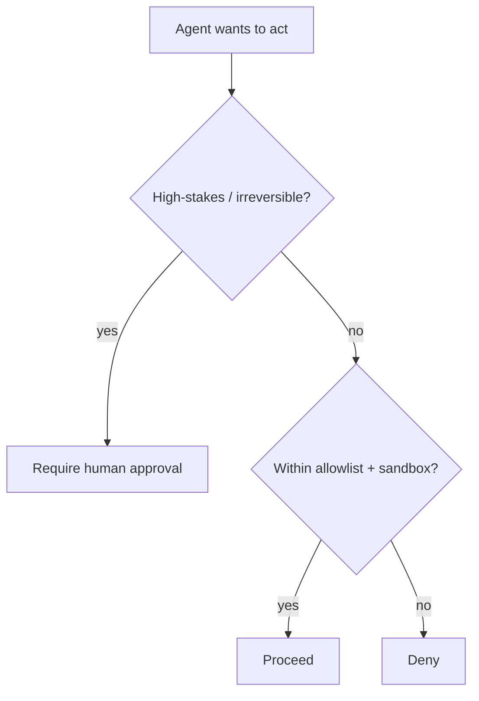

<LevelBadge level="advanced" />

Nel momento in cui un'IA può **compiere azioni** (chiamare strumenti, eseguire codice, contattare API), eredita un modello di sicurezza. L'obiettivo non è rendere il modello impossibile da ingannare — è assicurarsi che **anche se viene ingannato, non possa fare grandi danni**.

## Il principio fondamentale: il privilegio minimo

Concedi a un agente l'accesso **minimo** richiesto dal suo compito, niente di più.

- Un riassuntore di documenti ha bisogno della **lettura**, non della scrittura o della rete.
- Un revisore ha bisogno di leggere il codice e pubblicare un commento — non di fare push o deploy.
- Limita l'ambito di strumenti, chiavi API e accesso ai file per ogni compito. Un agente con un ambito ristretto che subisce un'[injection](/docs/security/prompt-injection) può fare solo danni ristretti.

## Il problema del vicesceriffo confuso

Un agente agisce spesso **con la tua autorità** (i tuoi token, le tue sessioni). Se un input controllato da un attaccante lo manovra, l'attaccante prende in prestito i tuoi privilegi — un "vicesceriffo confuso". Difesa: non concedere all'agente un'autorità ambientale di cui non ha bisogno, e richiedi credenziali esplicite e con ambito ristretto per gli strumenti sensibili.

## Livelli di difesa

1. **Isola in sandbox** l'esecuzione del codice e l'accesso ai file — container, directory effimere, nessun accesso al sistema più ampio o ai segreti.
2. **Allowlist** della superficie pericolosa: quali comandi, quali domini, quali percorsi. Nega il resto. (In Claude Code, sono i [permessi](/docs/claude-code/permissions).)
3. **Human-in-the-loop** per le azioni irreversibili o ad alto rischio: inviare denaro, email, eliminare, fare deploy, modificare la configurazione di produzione.
4. **Separa le zone di fiducia.** Non lasciare che un solo agente detenga contemporaneamente segreti, legga contenuti non affidabili ed effettui chiamate in uscita arbitrarie.
5. **Registra e revisiona** quali strumenti l'agente ha effettivamente chiamato.

## Gli strumenti hanno schemi — convalidali

Gli input degli strumenti prodotti dal modello possono essere errati o manipolati. **Convalida** gli argomenti prima di eseguirli e **restituisci gli errori come risultati**, così che l'agente si riprenda invece di riprovare alla cieca.

## Prossimi passi

- [La prompt injection spiegata](/docs/security/prompt-injection)
- [Irrobustire le esecuzioni autonome](/docs/security/hardening-autonomous-runs)
- [Revisione del codice di terze parti](/docs/security/reviewing-third-party-code)
