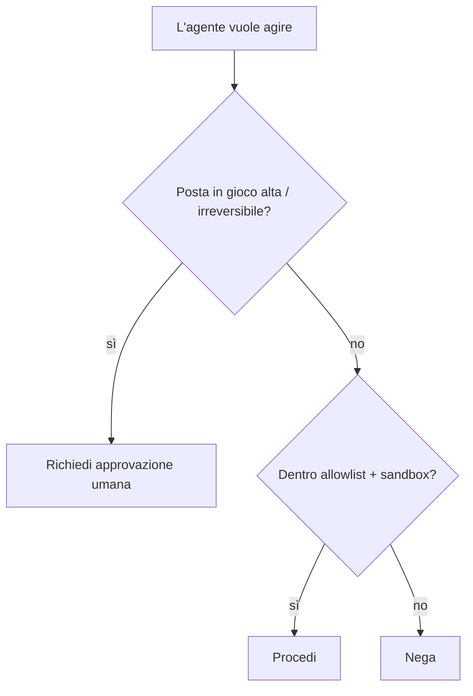

<LevelBadge level="advanced" />

<Callout type="objectives" items={["Applica il privilegio minimo — concedi a un agente solo l'accesso richiesto dal suo compito", "Riconosci il problema del vicesceriffo confuso: un agente prende in prestito la tua autorità", "Sovrapponi le cinque difese che riducono il raggio d'azione quando un agente viene ingannato", "Decidi quali azioni richiedono un human-in-the-loop", "Convalida gli input degli strumenti così che un argomento errato o manipolato non possa essere eseguito"]} />

Nel momento in cui un'IA può **compiere azioni** (chiamare strumenti, eseguire codice, contattare API), eredita un modello di sicurezza. L'obiettivo non è rendere il modello impossibile da ingannare — è assicurarsi che **anche se viene ingannato, non possa fare grandi danni**.

## Il principio fondamentale: il privilegio minimo

Concedi a un agente l'accesso **minimo** richiesto dal suo compito, niente di più.

- Un riassuntore di documenti ha bisogno della **lettura**, non della scrittura o della rete.
- Un revisore ha bisogno di leggere il codice e pubblicare un commento — non di fare push o deploy.
- Limita l'ambito di strumenti, chiavi API e accesso ai file per ogni compito. Un agente con un ambito ristretto che subisce un'[injection](/docs/security/prompt-injection) può fare solo danni ristretti.

## Il problema del vicesceriffo confuso

Un agente agisce spesso **con la tua autorità** (i tuoi token, le tue sessioni). Se un input controllato da un attaccante lo manovra, l'attaccante prende in prestito i tuoi privilegi — un "vicesceriffo confuso". Difesa: non concedere all'agente un'autorità ambientale di cui non ha bisogno, e richiedi credenziali esplicite e con ambito ristretto per gli strumenti sensibili.

## Livelli di difesa

Sovrapponili — nessuno da solo è sufficiente. Ogni livello presuppone che quelli sopra di esso possano fallire.

<Steps items={[
  {title: "Isola in sandbox l'esecuzione e l'accesso ai file", body: "Esegui codice e operazioni sui file in container o directory effimere, senza accesso al sistema più ampio o ai segreti. Se l'agente viene ingannato, gioca dentro una scatola."},
  {title: "Metti in allowlist la superficie pericolosa", body: "Decidi quali comandi, quali domini e quali percorsi sono consentiti — nega il resto. In Claude Code, sono i permessi (/docs/claude-code/permissions)."},
  {title: "Human-in-the-loop per le poste in gioco alte", body: "Richiedi un'approvazione esplicita per azioni irreversibili o sensibili: inviare denaro, inviare email, eliminare, fare deploy o modificare la configurazione di produzione."},
  {title: "Separa le zone di fiducia", body: "Non lasciare che un solo agente detenga contemporaneamente segreti, legga contenuti non affidabili ed effettui chiamate in uscita arbitrarie — quella combinazione è la via dell'esfiltrazione."},
  {title: "Registra e revisiona le chiamate agli strumenti", body: "Registra quali strumenti l'agente ha effettivamente invocato e con quali argomenti, così puoi verificarne il comportamento e cogliere le derive."}
]} />

## Metti l'allowlist per iscritto

"Mettere in allowlist la superficie pericolosa" è facile da approvare con un cenno e facile da saltare. In Claude Code è concreto: un `settings.json` che consente l'insieme ristretto di comandi e domini richiesto dal compito e nega il resto. Parti restrittivo e allarga solo quando un compito reale si blocca.

<PromptCard title="Un blocco di permessi Claude Code a privilegio minimo">{`{
  "permissions": {
    "allow": [
      "Read",
      "Edit",
      "Bash(npm test:*)",
      "Bash(npm run build:*)",
      "Bash(git status)",
      "Bash(git diff:*)"
    ],
    "deny": [
      "Bash(git push:*)",
      "Bash(rm:*)",
      "Bash(curl:*)",
      "Read(./.env)",
      "Read(./secrets/**)"
    ]
  }
}`}</PromptCard>

La lista `deny` prevale su `allow`, quindi il blocco di `.env` e `secrets/**` regge anche se viene concesso un `Read` ampio. Vedi [permessi](/docs/claude-code/permissions) per la sintassi completa delle regole e la precedenza.

## Gli strumenti hanno schemi — convalidali

Gli input degli strumenti prodotti dal modello possono essere errati o manipolati. **Convalida** gli argomenti prima di eseguirli e **restituisci gli errori come risultati**, così che l'agente si riprenda invece di riprovare alla cieca.

<Flashcards title="Ripassa i termini chiave" cards={[{front: "Privilegio minimo", back: "Concedi a un agente solo l'accesso richiesto dal suo compito specifico — niente di più. Un agente con un ambito ristretto che viene ingannato può fare solo danni ristretti."}, {front: "Vicesceriffo confuso", back: "Un agente agisce con la tua autorità (i tuoi token, le tue sessioni). Se un input controllato da un attaccante lo manovra, l'attaccante prende in prestito i tuoi privilegi."}, {front: "Sandbox", back: "Esegui codice e accesso ai file in un container isolato o in una directory effimera, senza alcuna via verso il sistema più ampio o i segreti, così un agente ingannato resta chiuso nella scatola."}, {front: "Zone di fiducia", back: "Tieni segreti, contenuti non affidabili e rete in uscita in agenti separati. Un solo agente che detiene tutti e tre è una via di esfiltrazione."}, {front: "Human-in-the-loop", back: "Un cancello di approvazione umana obbligatorio prima di azioni irreversibili o sensibili — inviare denaro, eliminare, fare deploy, modificare la configurazione di produzione."}]} />

<Quiz title="Mettiti alla prova" questions={[
  {
    q: "Cosa ti chiede di fare il principio del privilegio minimo quando configuri un agente?",
    options: ["Concedergli un accesso ampio così da non bloccarsi mai a metà compito", "Concedergli solo l'accesso richiesto dal suo compito specifico", "Concedergli gli stessi permessi dell'essere umano che lo esegue"],
    answer: 1,
    explain: "Privilegio minimo significa l'accesso minimo richiesto dal compito. Un agente con un ambito ristretto che subisce un'injection può fare solo danni ristretti."
  },
  {
    q: "Perché un agente che agisce con i tuoi token è un rischio da 'vicesceriffo confuso'?",
    options: ["Confonde quale modello chiamare", "Un input controllato da un attaccante può manovrarlo per usare i tuoi privilegi", "Delega ad altri agenti senza chiedere"],
    answer: 1,
    explain: "L'agente detiene la tua autorità. Se un input controllato da un attaccante lo manovra, l'attaccante di fatto prende in prestito i tuoi privilegi — il problema del vicesceriffo confuso."
  },
  {
    q: "In un blocco di permessi Claude Code, quale voce impedisce in modo affidabile all'agente di leggere un file di segreti?",
    options: ["Una voce allow per Read", "Una voce deny per il percorso dei segreti, dato che deny prevale su allow", "Rimuovere lo strumento Bash"],
    answer: 1,
    explain: "Deny ha la precedenza su allow, quindi un deny su secrets/** regge anche quando viene concesso un Read ampio."
  }
]} />

<Callout type="takeaways" items={["Privilegio minimo prima di tutto: limita l'ambito di strumenti, chiavi e accesso ai file per ogni compito così che un agente ingannato possa fare solo danni ristretti", "Un agente agisce con la tua autorità — non concedergli privilegi ambientali di cui non ha bisogno (il problema del vicesceriffo confuso)", "Sovrapponi i cinque livelli: sandbox, allowlist, human-in-the-loop, separare le zone di fiducia, registrare e revisionare", "In Claude Code, le regole deny battono le regole allow — blocca esplicitamente i percorsi .env e secrets", "Convalida gli argomenti degli strumenti prima di eseguirli e restituisci gli errori come risultati, così che l'agente si riprenda invece di riprovare alla cieca"]} />

## Prossimi passi

- [La prompt injection spiegata](/docs/security/prompt-injection)
- [Irrobustire le esecuzioni autonome](/docs/security/hardening-autonomous-runs)
- [Revisione del codice di terze parti](/docs/security/reviewing-third-party-code)
