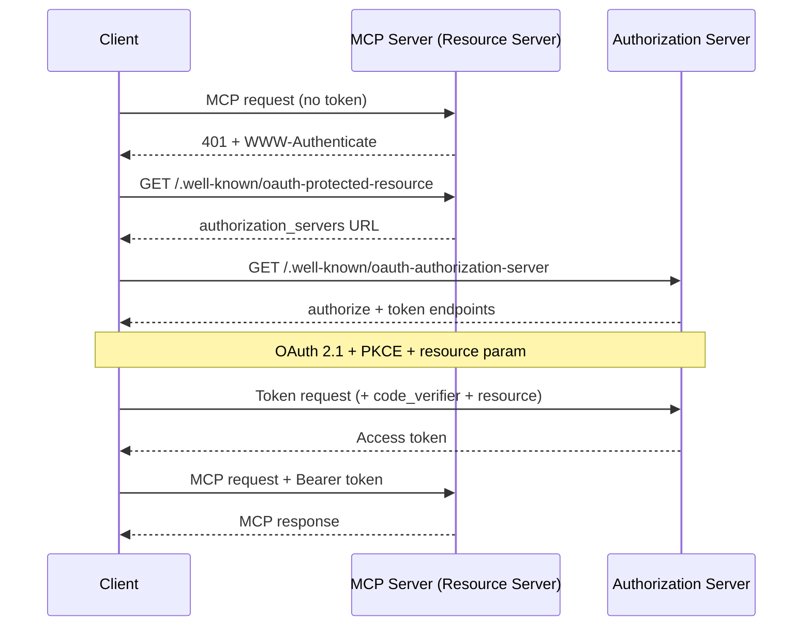
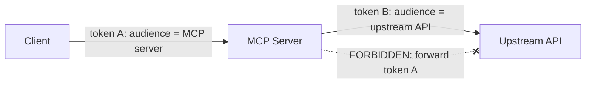

<LevelBadge level="advanced" />

<Callout type="objectives" items={["Capire perché un server MCP remoto (HTTP) è un resource server OAuth 2.1, non un semplice endpoint con API key", "Ripercorrere l'handshake di discovery: 401 → Protected Resource Metadata → Authorization Server Metadata → token", "Spiegare l'audience binding del token (RFC 8707) e perché impedisce che il token di un servizio funzioni su un altro", "Riconoscere la trappola del deputato confuso e l'unica regola che la chiude: non inoltrare mai il token del client a un'API upstream", "Applicare una breve checklist di hardening prima di esporre un server MCP a Internet"]} />

[MCP](/docs/claude-code/mcp) è passato da novità al modo predefinito con cui gli agent raggiungono i tool — il che significa che i server MCP ora si trovano davanti a dati reali e azioni reali. Un server locale che avvii su **STDIO** si fida del suo ambiente: legge le credenziali dalle variabili d'ambiente e non c'è alcun confine di rete da difendere. Nel momento in cui rendi lo stesso server **remoto** (HTTP), chiunque possa raggiungere l'URL può provare a chiamarlo. Questo lo trasforma in un problema di autorizzazione, e la spec MCP risponde con **OAuth 2.1** — non con uno schema ad hoc a base di API key.

Questa pagina riguarda il caso remoto. Se il tuo server è solo STDIO, la spec dice esplicitamente di *non* seguire il flusso OAuth — prendi le credenziali dall'ambiente e prosegui.

<VerifyNote lastVerified="2026-07-07" source="https://modelcontextprotocol.io/specification/2025-06-18/basic/authorization" />

## I tre ruoli

OAuth divide il problema fra tre parti. MCP vi si mappa in modo pulito:

<Flashcards title="Chi è chi in un flusso OAuth di MCP" cards={[{front: "Server MCP = Resource Server", back: "L'oggetto protetto. Accetta richieste che portano un access token, valida il token e restituisce dati — oppure un 401 se il token manca o è errato. NON effettua il login dell'utente."}, {front: "Client MCP = client OAuth", back: "L'host dell'agent (Claude Code, l'app desktop, il tuo codice). Ottiene un token per conto dell'utente e lo allega a ogni richiesta come header Bearer."}, {front: "Authorization Server (AS)", back: "La parte che parla effettivamente con l'utente, ottiene il consenso ed emette i token. Può essere ospitato insieme al server o essere un identity provider separato. Il suo funzionamento interno è fuori dallo scope di MCP."}]} />

Lo spostamento mentale chiave: **il server MCP non gestisce mai il login da sé.** Valida soltanto token emessi da qualcun altro. È questa separazione a permetterti di mettere un identity provider pronto all'uso davanti a un server che hai scritto tu.

## L'handshake di discovery

Un client non dovrebbe dover essere pre-configurato con l'informazione di dove autenticarsi. MCP rende la discovery automatica, guidata da un `401`:

<Steps items={[
  {title: "Il client chiama il server senza token", body: "La primissima richiesta parte nuda. Il server la rifiuta con HTTP 401 Unauthorized e un header WWW-Authenticate che punta al suo URL di resource-metadata."},
  {title: "Il client recupera i Protected Resource Metadata (RFC 9728)", body: "Fa una GET su /.well-known/oauth-protected-resource del server. Il campo authorization_servers del documento indica almeno un Authorization Server che il client può usare."},
  {title: "Il client recupera gli Authorization Server Metadata (RFC 8414)", body: "Fa una GET su /.well-known/oauth-authorization-server dell'AS per conoscere gli endpoint authorize e token e le capability supportate."},
  {title: "Opzionale: Dynamic Client Registration (RFC 7591)", body: "Se il client non ha un client ID per questo AS, può fare una POST su /register per ottenerne uno senza intervento umano — cruciale perché un client non può conoscere in anticipo ogni server MCP."},
  {title: "Autorizzazione OAuth 2.1 con PKCE + resource", body: "Il client genera una coppia verifier/challenge PKCE, apre il browser sull'URL authorize includendo il parametro resource, l'utente dà il consenso e il client scambia il code restituito (con il verifier) per un access token."},
  {title: "Il client riprova con il token", body: "Ora ogni richiesta porta Authorization: Bearer <token>. Il server lo valida e risponde."}
]} />

Nota che **non c'è alcuna configurazione di auth hardcoded** dal lato client — il `401` fa da bootstrap per tutto. È esattamente questo il punto: un agent può connettersi a un server mai visto prima e capire come autenticarsi.

## Audience binding: la regola portante

Ecco la modalità di guasto che l'audience binding esiste per prevenire. Supponi che un utente abbia un token emesso per `calendar.example.com`. Un server MCP malevolo (o semplicemente sciatto) su `evil.example.com` induce il client a inviare *quel* token a sé. Se `evil` lo accetta, può a sua volta chiamare l'API del calendario come l'utente. Il token di un servizio ha funzionato su un altro. Il confine di sicurezza di OAuth è appena crollato.

La correzione sono i **Resource Indicators (RFC 8707)**:

<Steps items={[
  {title: "Il client dichiara il target", body: "Sia nella richiesta di autorizzazione sia in quella di token, il client DEVE includere un parametro resource impostato all'URI canonico del server MCP che intende chiamare — es. resource=https://mcp.example.com. Lo invia anche se non è certo che l'AS lo supporti."},
  {title: "L'AS lega il token a quell'audience", body: "Quando è supportato, l'AS marca il token in modo che sia valido solo per quello specifico resource server."},
  {title: "Il server valida l'audience", body: "Prima di fare qualsiasi lavoro, il server MCP DEVE verificare che il token sia stato emesso per SÉ — controllando la claim audience (RFC 9068). Un token coniato per chiunque altro riceve un 401, punto e basta."}
]} />

<PromptCard title="Parametro resource nella richiesta di autorizzazione (URL-encoded)">{`&resource=https%3A%2F%2Fmcp.example.com`}</PromptCard>

Gli URI canonici sono rigidi: `https://mcp.example.com` e `https://mcp.example.com:8443/mcp` sono validi; `mcp.example.com` (senza schema) e `https://mcp.example.com#frag` (frammento) non lo sono. Preferisci la forma senza slash finale per l'interoperabilità.

## Il deputato confuso: non inoltrare mai il token

Questo è l'errore che trasforma un server MCP ben intenzionato nel proxy di un attaccante. È lo stesso [problema del deputato confuso](/docs/security/securing-agents) della sicurezza degli agent, ridotto a un'unica regola concreta.

Un server MCP spesso ha bisogno di chiamare un'**API upstream** (GitHub, un servizio di database, un altro SaaS). La tentazione è prendere il token che il client ti ha passato e inoltrarlo upstream. **Non farlo.** La spec è netta: il server MCP **NON DEVE** inoltrare il token ricevuto dal client.

Perché è pericoloso: il token del client è stato emesso con *il tuo* server come audience. Se lo inoltri, l'API upstream potrebbe fidarsene come se venisse da te, o presumere che tu l'abbia già validato — e ora un token pensato per un solo hop sta operando a due hop di distanza, fuori dal modello di consenso di chiunque.

<Callout type="warning" items={["Se il tuo server MCP chiama un'API upstream, agisce come un client OAuth SEPARATO verso quell'API e ottiene il PROPRIO token dall'authorization server upstream. Due token indipendenti, due audience indipendenti. Il token del client si ferma alla tua porta."]} />

## Una checklist di hardening pre-volo

Prima che un server MCP remoto tocchi Internet pubblico:

<Steps items={[
  {title: "Servi tutto su HTTPS", body: "Tutti gli endpoint dell'AS DEVONO essere HTTPS. I redirect URI DEVONO essere HTTPS o localhost — nient'altro."},
  {title: "Valida l'audience a ogni richiesta", body: "Rifiuta qualsiasi token non emesso specificamente per questo server. È l'unico controllo che ferma il riuso cross-service del token."},
  {title: "Richiedi PKCE", body: "I client DEVONO usare PKCE così che un authorization code intercettato sia inutile senza il verifier corrispondente."},
  {title: "Fissa redirect URI esatti", body: "L'AS DEVE confrontare i redirect URI in modo esatto con i valori pre-registrati, e i client DOVREBBERO usare e verificare il parametro state — entrambi difendono dal phishing via open-redirect."},
  {title: "Token a vita breve + rotazione dei refresh", body: "Emetti access token a vita breve per limitare il danno di una fuga; per i public client, ruota i refresh token. Conserva i token in modo sicuro e non loggarli mai."},
  {title: "Non mettere mai i token nell'URL", body: "I token vanno nell'header Authorization, mai nella query string, dove finirebbero in log e referrer."},
  {title: "Aggiungi le basi della sicurezza degli agent", body: "L'audience binding è il cancello del trasporto; applica comunque privilegio minimo, sandboxing e human-in-the-loop da /docs/security/securing-agents. L'auth dice CHI — non dice che la richiesta sia sicura."}
]} />

## Mettiti alla prova

<Quiz title="Mettiti alla prova" questions={[
  {
    q: "Un server MCP remoto riceve una richiesta senza access token. Cosa impone la spec di fare per prima cosa?",
    options: [
      "Chiedere all'utente username e password",
      "Restituire HTTP 401 con un header WWW-Authenticate che punta al suo URL di resource-metadata",
      "Inoltrare silenziosamente la richiesta alla sua API upstream",
      "Emettere lui stesso un token per il client"
    ],
    answer: 1,
    explain: "Il server è un resource server, non una pagina di login. Risponde a una richiesta senza token con 401 + WWW-Authenticate, che fa da bootstrap alla discovery dell'authorization server da parte del client."
  },
  {
    q: "Da cosa protegge l'audience binding del token (RFC 8707)?",
    options: [
      "Dalla validazione lenta del token",
      "Dal fatto che un token emesso per un servizio venga accettato e riusato su un servizio diverso",
      "Dagli utenti che dimenticano le password",
      "Dalle context window troppo grandi"
    ],
    answer: 1,
    explain: "Il parametro resource lega un token allo specifico server per cui è stato coniato. Il server valida poi la claim audience e rifiuta qualsiasi token emesso per un altro — chiudendo il buco del riuso cross-service."
  },
  {
    q: "Il tuo server MCP deve chiamare un'API GitHub upstream. Cosa dovrebbe fare con l'access token che il client gli ha inviato?",
    options: [
      "Inoltrare lo stesso token a GitHub per risparmiare un round trip",
      "Niente con GitHub — ottenere il proprio token separato come client OAuth verso GitHub, e non inoltrare mai il token del client",
      "Loggare il token per poterlo riusare in seguito",
      "Mettere il token nell'URL della richiesta a GitHub"
    ],
    answer: 1,
    explain: "Inoltrare il token del client upstream è la trappola del deputato confuso ed è esplicitamente vietato. Il server agisce come proprio client OAuth verso l'API upstream con un token separato legato all'audience di quell'API."
  },
  {
    q: "Per un server MCP STDIO (locale), come dice la spec di gestire le credenziali?",
    options: [
      "Eseguire l'intero flusso OAuth 2.1 nel browser a ogni avvio",
      "Recuperarle dall'ambiente — il flusso di autorizzazione OAuth è per i transport HTTP, non per STDIO",
      "Hardcodarle nel client",
      "Saltare del tutto l'autenticazione per tutti i transport"
    ],
    answer: 1,
    explain: "La spec dice che i transport STDIO NON DOVREBBERO seguire il flusso di autorizzazione HTTP e dovrebbero invece leggere le credenziali dall'ambiente. Qui OAuth è specifico per i server remoti, basati su HTTP."
  }
]} />

## Fonti e approfondimenti

- [Specifica di autorizzazione MCP (2025-06-18)](https://modelcontextprotocol.io/specification/2025-06-18/basic/authorization) — il flusso normativo, i ruoli e i requisiti MUST/SHOULD che questa pagina riassume.
- [MCP Security Best Practices](https://modelcontextprotocol.io/specification/2025-06-18/basic/security_best_practices) — token passthrough, deputato confuso e perché sono vietati.
- [RFC 8707 — Resource Indicators for OAuth 2.0](https://www.rfc-editor.org/rfc/rfc8707.html) — il parametro `resource` e l'audience binding.
- [RFC 9728 — OAuth 2.0 Protected Resource Metadata](https://datatracker.ietf.org/doc/html/rfc9728) — come un resource server annuncia i suoi authorization server.
- [RFC 8414 — OAuth 2.0 Authorization Server Metadata](https://datatracker.ietf.org/doc/html/rfc8414) e [RFC 7591 — Dynamic Client Registration](https://datatracker.ietf.org/doc/html/rfc7591).
- [Draft OAuth 2.1](https://datatracker.ietf.org/doc/html/draft-ietf-oauth-v2-1-13) — PKCE, sicurezza della comunicazione e requisiti di gestione dei token.
- Correlati su AILmanac: [Mettere in sicurezza agent e tool](/docs/security/securing-agents) · [Prompt injection](/docs/security/prompt-injection) · [MCP in Claude Code](/docs/claude-code/mcp).
