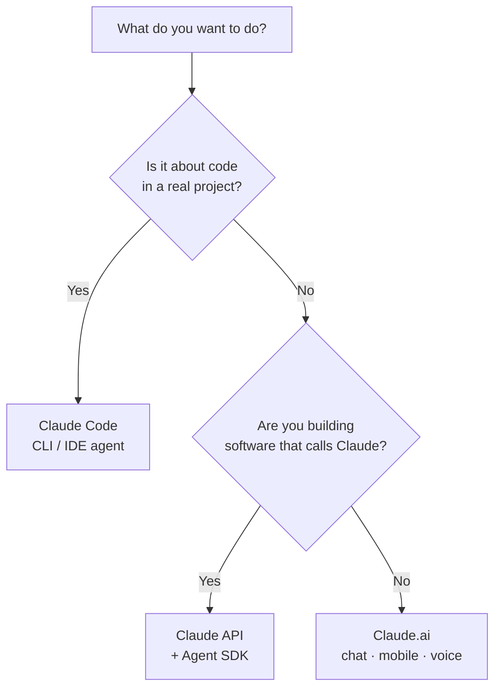

<LevelBadge level="beginner" />

"Claude" esiste in alcune varianti. Scegli in base a **ciò che stai cercando di fare**, non a quella di cui hai sentito parlare.

## La decisione in 30 secondi

## Claude.ai — le app di chat

**Per:** scrittura, ricerca, analisi, apprendimento, pianificazione, domande di tutti i giorni. **Chi:** tutti, senza alcuna configurazione.

Lo ottieni anche su **mobile** ([iOS/Android](/docs/claude-app/mobile)) e tramite **[voce](/docs/claude-app/voice-mode)** — ottimo per catturare idee in movimento. Potenzialo con [Progetti](/docs/claude-app/projects), [istruzioni personalizzate](/docs/claude-app/custom-instructions) e [Artefatti](/docs/claude-app/artifacts). → Inizia da [Primi passi con Claude.ai](/docs/claude-app/getting-started).

## Claude Code — lo strumento di coding agentico

**Per:** lavorare *in una codebase* — leggere, modificare, eseguire comandi, sistemare i test. **Chi:** sviluppatori (e i tecnicamente curiosi). Agisce sui tuoi file con il tuo permesso. → [Che cos'è Claude Code](/docs/claude-code/what-is-claude-code).

## L'API e l'Agent SDK — integra Claude nel tuo software

**Per:** app, automazioni e agenti che chiamano Claude in modo programmatico. **Chi:** sviluppatori che distribuiscono un prodotto o una pipeline. → [La tua prima chiamata API](/docs/api/first-call).

## Lavorano insieme

Non sono prodotti rivali — la maggior parte delle persone passa gradualmente dall'uno all'altro:

| Vuoi… | Usa |
|---|---|
| Scrivere una bozza di email, riassumere un PDF, fare brainstorming | Claude.ai (o voce/mobile) |
| Rifattorizzare un modulo, aggiungere test, sistemare un bug | Claude Code |
| Aggiungere una funzionalità IA alla *tua* app | L'API / Agent SDK |

:::tip Non sei sicuro? Inizia dalla chat
[Claude.ai](/docs/claude-app/getting-started) non richiede alcuna configurazione e ti insegna come "pensa" Claude. Le competenze si trasferiscono ovunque altro.
:::

## Avanti

- [I tuoi primi 5 minuti](/docs/start-here/your-first-5-minutes)
- [Percorsi di apprendimento](/docs/start-here/learning-paths)
- [Scegliere un modello Claude](/docs/api/choosing-a-model) (una volta che inizi a costruire)
