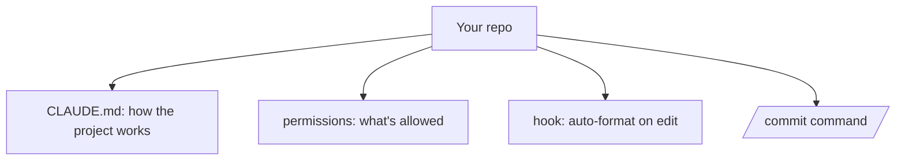

<LevelBadge level="intermediate" />

<Callout type="objectives" items={["Trasformare un checkout appena fatto in una configurazione di Claude Code su misura in circa 20 minuti", "Capire PERCHÉ ognuna delle quattro personalizzazioni si merita il suo posto — CLAUDE.md, permessi, un hook, un comando", "Scrivere regole di permesso che riducono le interruzioni sulle azioni sicure e bloccano nettamente quelle rischiose", "Verificare che ogni pezzo funzioni davvero invece di darlo per scontato"]} />

Trasformiamo un checkout appena fatto in una configurazione di Claude Code che *conosce il tuo progetto e rispetta le tue regole* — in circa 20 minuti. Metteremo insieme le funzionalità principali, spiegando le motivazioni di ciascuna.

## Lo stato finale



## Passo 1 — Genera e snellisci CLAUDE.md

Esegui `/init` per creare una bozza di [CLAUDE.md](/docs/claude-code/claude-md), poi **riducila** a ciò che è vero: stack tecnologico, come eseguire/testare/fare il linting, convenzioni reali e regole di sicurezza ("esegui i test prima di considerare concluso il lavoro", "non toccare `/generated`"). *Perché:* è la personalizzazione con la maggiore resa — Claude la legge a ogni sessione.

Prendi un punto di partenza dai [template di CLAUDE.md](/docs/templates/claude-md).

## Passo 2 — Imposta i permessi

Aggiungi un file `.claude/settings.json` ([riferimento](/docs/claude-code/settings)) che autorizzi in anticipo i comandi sicuri e ripetitivi e neghi quelli pericolosi:

```json
{
  "permissions": {
    "allow": ["Read", "Bash(npm run test:*)", "Bash(npm run lint)", "Bash(git diff:*)"],
    "ask": ["Write", "Bash(npm install:*)"],
    "deny": ["Read(./.env)", "Bash(git push --force:*)"]
  }
}
```

*Perché:* meno interruzioni sulle azioni sicure, blocchi netti su quelle rischiose. Vedi [Permessi](/docs/claude-code/permissions).

## Passo 3 — Aggiungi un hook di formattazione

Formatta automaticamente dopo ogni modifica ([hook](/docs/claude-code/hooks)):

```json
{ "hooks": { "PostToolUse": [ { "matcher": "Edit|Write",
  "hooks": [ { "type": "command", "command": "npx prettier --write \"$CLAUDE_FILE_PATH\" 2>/dev/null || true" } ] } ] } }
```

*Perché:* formattazione coerente, garantita — non un "ricordati per favore".

## Passo 4 — Aggiungi un comando `/commit`

Inserisci la ricetta `/commit` dalla [libreria degli slash command](/docs/templates/slash-commands) in `.claude/commands/`. *Perché:* una sola parola per un flusso di lavoro ripetibile.

## Passo 5 — Usa la modalità Plan per il primo task reale

Assegna un obiettivo concreto in [modalità Plan](/docs/claude-code/plan-mode), rivedi il piano e poi lascia che venga eseguito. *Perché:* costruisci fiducia separando il pensiero dall'azione.

## Verifica che abbia funzionato

Non darlo per scontato — controlla ogni pezzo in modo indipendente. Ogni test isola una personalizzazione, così un fallimento ti dice esattamente quale file sistemare.

<Steps items={[{title: "CLAUDE.md funziona", body: "Avvia una NUOVA sessione e assegna un task normale. Claude dovrebbe fare riferimento alle tue convenzioni spontaneamente, senza che tu gliele incolli."}, {title: "L'hook funziona", body: "Modifica un file e lascia che sia Claude a scriverlo. Dovrebbe tornare formattato — senza alcun promemoria da parte tua."}, {title: "I permessi funzionano", body: "Prova un comando rischioso. Claude dovrebbe chiedere conferma, o rifiutare del tutto, invece di limitarsi a eseguirlo."}, {title: "Il comando funziona", body: "Esegui /commit. Dovresti ottenere un messaggio di Conventional Commit pulito da una sola parola."}]} />

<PromptCard title="Avvia il primo task reale in modalità Plan">{`Add pagination to the users list endpoint. Plan it first — I want to review before you touch anything.`}</PromptCard>

<Callout type="takeaways" items={["CLAUDE.md è la personalizzazione con la maggiore resa perché Claude la legge a ogni sessione — generala con /init, poi riducila a ciò che è davvero vero", "I permessi sono uno strumento a due facce: autorizza in anticipo i comandi sicuri e ripetitivi per ridurre le interruzioni, e nega quelli pericolosi per ottenere blocchi netti", "Un hook rende la formattazione garantita invece che un \"ricordati per favore\" — il comportamento imposto dall'harness batte il comportamento richiesto in un prompt", "Uno slash command trasforma un flusso di lavoro ripetibile in una sola parola", "La modalità Plan separa il pensiero dall'azione, ed è così che costruisci fiducia prima di cedere maggiore autonomia", "Verifica ogni personalizzazione con un test dedicato, così un fallimento punta a un solo file"]} />

<Quiz title="Verifica le tue conoscenze" questions={[{q: "Perché CLAUDE.md viene definita la personalizzazione con la maggiore resa?", options: ["È l'unico file su cui Claude Code può scrivere", "Claude la legge a ogni sessione, quindi plasma ogni task senza che tu debba ripeterti", "Ha la precedenza sulle regole di permesso"], answer: 1, explain: "Claude legge CLAUDE.md a ogni sessione. È lì la resa — stack, comandi, convenzioni e regole di sicurezza finiscono nel contesto automaticamente invece di essere reincollati. Ed è anche il motivo per cui la riduci solo a ciò che è vero."}, {q: "Vuoi che la formattazione automatica sia garantita, non semplicemente richiesta. Qual è il meccanismo giusto?", options: ["Una riga in CLAUDE.md che dice \"formatta sempre dopo aver modificato\"", "Un hook PostToolUse che corrisponde a Edit|Write ed esegue il tuo formatter", "Una regola di permesso allow per il comando del formatter"], answer: 1, explain: "Un hook è imposto dall'harness — viene eseguito che il modello se lo ricordi o no. Un'istruzione in CLAUDE.md è una richiesta che il modello può mancare; una regola di permesso governa solo se un comando è CONSENTITO, non se viene eseguito."}, {q: "Nel settings.json d'esempio, perché alcuni comandi stanno in \"allow\" e altri in \"ask\"?", options: ["I comandi in \"ask\" sono pericolosi e dovrebbero stare piuttosto in \"deny\"", "Autorizzare in anticipo i comandi sicuri e ripetitivi riduce le interruzioni, mentre \"ask\" tiene una persona nel loop per le azioni con effetti collaterali", "\"allow\" è solo per le operazioni di lettura"], answer: 1, explain: "La divisione riguarda il costo dell'interruzione rispetto al rischio. Le cose sicure e ripetitive come Read e l'esecuzione dei test sono autorizzate in anticipo così non ti interrompono mai; quelle con effetti collaterali reali come Write o npm install vanno in \"ask\"; e quelle davvero pericolose come il force-push vanno in \"deny\" come blocco netto."}]} />

## Prossimi passi

- [Scrivi la tua prima Skill](/docs/walkthroughs/first-skill)
- [Ricette per hook e settings.json](/docs/templates/hooks-settings)
- [Coding e sviluppo software](/docs/playbooks/coding)
