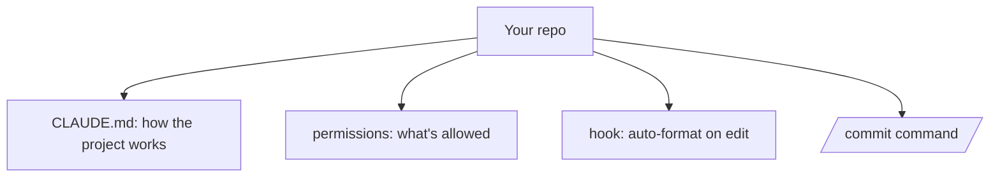

<LevelBadge level="intermediate" />

Trasformiamo un checkout appena fatto in una configurazione di Claude Code che *conosce il tuo progetto e rispetta le tue regole* — in circa 20 minuti. Metteremo insieme le funzionalità principali, spiegando le motivazioni di ciascuna.

## Lo stato finale



## Passo 1 — Genera e snellisci CLAUDE.md

Esegui `/init` per creare una bozza di [CLAUDE.md](/docs/claude-code/claude-md), poi **riducila** a ciò che è vero: stack tecnologico, come eseguire/testare/fare il linting, convenzioni reali e regole di sicurezza ("esegui i test prima di considerare concluso il lavoro", "non toccare `/generated`"). *Perché:* è la personalizzazione con la maggiore resa — Claude la legge a ogni sessione.

Prendi un punto di partenza dai [template di CLAUDE.md](/docs/templates/claude-md).

## Passo 2 — Imposta i permessi

Aggiungi un file `.claude/settings.json` ([riferimento](/docs/claude-code/settings)) che autorizzi in anticipo i comandi sicuri e ripetitivi e neghi quelli pericolosi:

```json
{
  "permissions": {
    "allow": ["Read", "Bash(npm run test:*)", "Bash(npm run lint)", "Bash(git diff:*)"],
    "ask": ["Write", "Bash(npm install:*)"],
    "deny": ["Read(./.env)", "Bash(git push --force:*)"]
  }
}
```

*Perché:* meno interruzioni sulle azioni sicure, blocchi netti su quelle rischiose. Vedi [Permessi](/docs/claude-code/permissions).

## Passo 3 — Aggiungi un hook di formattazione

Formatta automaticamente dopo ogni modifica ([hook](/docs/claude-code/hooks)):

```json
{ "hooks": { "PostToolUse": [ { "matcher": "Edit|Write",
  "hooks": [ { "type": "command", "command": "npx prettier --write \"$CLAUDE_FILE_PATH\" 2>/dev/null || true" } ] } ] } }
```

*Perché:* formattazione coerente, garantita — non un "ricordati per favore".

## Passo 4 — Aggiungi un comando `/commit`

Inserisci la ricetta `/commit` dalla [libreria degli slash command](/docs/templates/slash-commands) in `.claude/commands/`. *Perché:* una sola parola per un flusso di lavoro ripetibile.

## Passo 5 — Usa la modalità Plan per il primo task reale

Assegna un obiettivo concreto in [modalità Plan](/docs/claude-code/plan-mode), rivedi il piano e poi lascia che venga eseguito. *Perché:* costruisci fiducia separando il pensiero dall'azione.

## Verifica che abbia funzionato

- Nuova sessione → Claude fa riferimento alle tue convenzioni senza che glielo chieda (CLAUDE.md funziona).
- Modifica di un file → viene formattato (l'hook funziona).
- Un comando rischioso → chiede conferma o rifiuta (i permessi funzionano).
- `/commit` → un messaggio di Conventional Commit pulito (il comando funziona).

## Prossimi passi

- [Scrivi la tua prima Skill](/docs/walkthroughs/first-skill)
- [Ricette per hook e settings.json](/docs/templates/hooks-settings)
- [Coding e sviluppo software](/docs/playbooks/coding)
