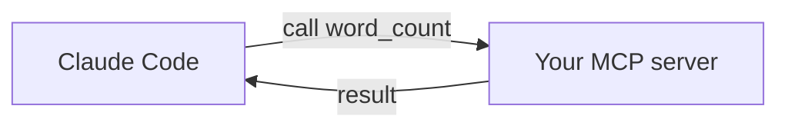

<LevelBadge level="advanced" />

<VerifyNote lastVerified="2026-06-20" source="https://modelcontextprotocol.io">
Le API dell'SDK MCP e la configurazione evolvono — verifica rispetto alla documentazione ufficiale di MCP e alla documentazione MCP di Claude Code.
</VerifyNote>

Esponiamo a Claude uno strumento personalizzato costruendo un piccolo server [MCP](/docs/claude-code/mcp) e collegandolo. Lo terremo minimale in modo che il *collegamento* sia chiaro — poi ci sostituirai la tua logica reale.

## Cosa stiamo costruendo

Un server stdio con un solo strumento, `word_count`, che Claude può richiamare. Lo stesso schema si adatta a "interroga il mio DB", "apri un ticket", ecc.



## Passo 1 — Il server

`server.py` (Python; una versione TypeScript è negli [scaffold MCP](/docs/templates/mcp-config)):

```python
from mcp.server.fastmcp import FastMCP

mcp = FastMCP("text-tools")

@mcp.tool()
def word_count(text: str) -> int:
    """Count the words in a piece of text."""
    return len(text.split())

if __name__ == "__main__":
    mcp.run()  # stdio transport
```

## Passo 2 — Dichiaralo

Aggiungi a `.mcp.json` nella radice del tuo repository:

```json
{ "mcpServers": {
  "text-tools": { "command": "python", "args": ["server.py"] }
} }
```

## Passo 3 — Collega e testa

Avvia Claude Code nel repository. Chiedi: *"Usa il server text-tools per contare le parole in: 'the quick brown fox'."* Claude dovrebbe richiamare `word_count` e riportare `4`. Se non riesce a vedere lo strumento, verifica che il server si avvii correttamente per conto suo e che il percorso in `.mcp.json` sia corretto.

## Passo 4 — Rendilo reale

Sostituisci `word_count` con la tua capacità effettiva — una query su un DB, una chiamata a un'API interna, un'operazione sui file. Aggiungi la validazione dell'input e restituisci gli errori come risultati.

## Checklist di sicurezza

:::warning Un server è codice + accesso
- **Privilegio minimo** — solo i dati/le azioni di cui ha bisogno ([Mettere in sicurezza gli agenti](/docs/security/securing-agents)).
- **Valida gli input** che il modello invia.
- I dati non attendibili che restituisce possono veicolare [prompt injection](/docs/security/prompt-injection).
- **Esamina** qualsiasi server di terze parti prima di collegarlo.
:::

## Prossimi passi

- [Server MCP in Claude Code](/docs/claude-code/mcp)
- [Configurazione MCP e scaffold dei server](/docs/templates/mcp-config)
- [Tool use / Function calling](/docs/api/tool-use)
