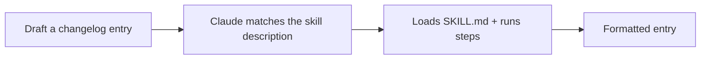

<LevelBadge level="intermediate" />

<Callout type="objectives" items={["Costruire una Skill funzionante da zero e dimostrare che si attiva davvero", "Scrivere una description che scatta al momento giusto — l'unico campo che decide se una skill verrà mai eseguita", "Decidere quando aggiungere uno script di supporto per una raccolta dei dati deterministica", "Diagnosticare una skill che non si attiva mai, e conoscere le tre trappole che lo causano"]} />

<VerifyNote lastVerified="2026-06-20" source="https://code.claude.com/docs/en/skills">
La struttura e il rilevamento delle Skill possono cambiare — verifica rispetto alla documentazione ufficiale delle Skill.
</VerifyNote>

Costruiamo da zero una [Skill](/docs/claude-code/skills) funzionante e dimostriamo che si attiva. Creeremo una piccola skill per le "voci di changelog" — generica e riutilizzabile.

## Passo 1 — Crea la cartella

<PromptCard title="Crea la cartella della skill">{`mkdir -p .claude/skills/changelog-entry`}</PromptCard>

(Usa `~/.claude/skills/…` per una skill personale valida in tutti i progetti.)

## Passo 2 — Scrivi SKILL.md

`.claude/skills/changelog-entry/SKILL.md`:

```markdown
---
name: changelog-entry
description: Use when the user wants to turn recent git commits into a Keep a Changelog entry.
---

# Changelog Entry

When asked for a changelog entry:
1. Run `git log --oneline -20` to see recent commits.
2. Group them into Added / Changed / Fixed / Removed (Keep a Changelog style).
3. Write concise, user-facing bullets (not raw commit messages).
4. Output only the formatted entry.
```

La **`description` è il trigger** — scrivila come "Use when…" così Claude la carica al momento giusto.

## Passo 3 — (Facoltativo) aggiungi uno script di supporto

Le Skill possono includere script. Aggiungi `scripts/recent.sh` e fai riferimento ad esso da SKILL.md se vuoi una raccolta dei dati deterministica:

```bash
#!/usr/bin/env bash
git log --oneline -20
```

## Passo 4 — Dimostra che si attiva

Avvia una sessione e prova il prompt qui sotto. Claude dovrebbe riconoscere l'intento, caricare la skill e seguirne i passaggi. Se non si attiva, probabilmente la tua `description` non è abbastanza specifica su *quando* usarla — affinala.

<PromptCard title="Dimostra che la skill si attiva">{`Draft a changelog entry for recent work.`}</PromptCard>



## Passo 5 — Condividila

Raggruppala (insieme ad altre) in un [plugin](/docs/claude-code/plugins-marketplaces) così il tuo team la installa in un solo passaggio — oppure contribuiscila ai [pacchetti di skill](/docs/templates/skills) di AILmanac.

## Trappole

- **Descrizione vaga** → non si attiva mai (o si attiva sempre). Sii specifico.
- **Troppe cose in una sola skill** → mantienila su un unico compito chiaro.
- **Segreti in una skill condivisa** → mai; vedi [Esaminare codice di terze parti](/docs/security/reviewing-third-party-code).

<Callout type="takeaways" items={["Una skill è una cartella più un SKILL.md — .claude/skills/<nome>/ per il progetto, ~/.claude/skills/ per tutti i progetti", "La description è il trigger. Scrivila come \"Use when…\" così Claude carica la skill al momento giusto", "Le Skill possono includere script — usane uno quando vuoi una raccolta dei dati deterministica invece che Claude improvvisi il comando", "Dimostra che funziona esprimendo l'intento, non nominando la skill. Se non scatta, la description non è abbastanza specifica sul QUANDO", "Tieni una skill su un unico compito chiaro, e non mettere mai segreti in una skill che condividi"]} />

<Quiz title="Verifica le tue conoscenze" questions={[{q: "La tua skill non si attiva mai, qualunque cosa tu chieda. Quale campo è quasi certamente il problema?", options: ["name — deve corrispondere esattamente alla cartella", "description — non è abbastanza specifica su QUANDO usare la skill", "Allo script di supporto manca il bit di eseguibilità"], answer: 1, explain: "La description è il trigger. Scritta come \"Use when…\" e specifica sulla situazione, dice a Claude quando caricare la skill. Le description vaghe non si attivano mai — oppure si attivano di continuo."}, {q: "Vuoi una skill per il changelog disponibile in ogni progetto su cui lavori, non solo in questo. Dove va messa?", options: [".claude/skills/changelog-entry/ in ogni repository", "~/.claude/skills/changelog-entry/", "Deve prima essere pubblicata come plugin"], answer: 1, explain: "Usa ~/.claude/skills/… per una skill personale valida in tutti i progetti. Il percorso .claude/skills/ dentro il repository limita la skill a quel progetto."}, {q: "Perché includere uno script di supporto come scripts/recent.sh in una skill?", options: ["Senza di esso le Skill non possono eseguire comandi shell", "Per una raccolta dei dati deterministica — lo script viene eseguito allo stesso modo ogni volta invece che Claude improvvisi", "Rende il caricamento della skill più veloce"], answer: 1, explain: "Le Skill possono includere script, e farvi riferimento da SKILL.md dà una raccolta dei dati deterministica. È facoltativo — lo aggiungeresti quando vuoi esattamente lo stesso comando a ogni esecuzione invece di lasciarlo al modello."}]} />

## Prossimi passi

- [Skill: competenza on-demand](/docs/claude-code/skills)
- [Template di SKILL.md](/docs/templates/skills)
- [Crea e collega il tuo primo server MCP](/docs/walkthroughs/first-mcp-server)
