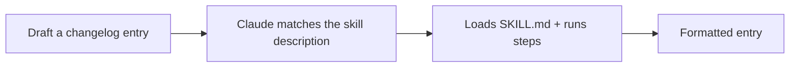

<LevelBadge level="intermediate" />

<VerifyNote lastVerified="2026-06-20" source="https://docs.anthropic.com/en/docs/claude-code/skills">
La struttura e il rilevamento delle Skill possono cambiare — verifica rispetto alla documentazione ufficiale delle Skill.
</VerifyNote>

Costruiamo da zero una [Skill](/docs/claude-code/skills) funzionante e dimostriamo che si attiva. Creeremo una piccola skill per le "voci di changelog" — generica e riutilizzabile.

## Passo 1 — Crea la cartella

```bash
mkdir -p .claude/skills/changelog-entry
```

(Usa `~/.claude/skills/…` per una skill personale valida in tutti i progetti.)

## Passo 2 — Scrivi SKILL.md

`.claude/skills/changelog-entry/SKILL.md`:

```markdown
---
name: changelog-entry
description: Use when the user wants to turn recent git commits into a Keep a Changelog entry.
---

# Changelog Entry

When asked for a changelog entry:
1. Run `git log --oneline -20` to see recent commits.
2. Group them into Added / Changed / Fixed / Removed (Keep a Changelog style).
3. Write concise, user-facing bullets (not raw commit messages).
4. Output only the formatted entry.
```

La **`description` è il trigger** — scrivila come "Use when…" così Claude la carica al momento giusto.

## Passo 3 — (Facoltativo) aggiungi uno script di supporto

Le Skill possono includere script. Aggiungi `scripts/recent.sh` e fai riferimento ad esso da SKILL.md se vuoi una raccolta dei dati deterministica:

```bash
#!/usr/bin/env bash
git log --oneline -20
```

## Passo 4 — Dimostra che si attiva

Avvia una sessione e di': *"Prepara una voce di changelog per il lavoro recente."* Claude dovrebbe riconoscere l'intento, caricare la skill e seguirne i passaggi. Se non si attiva, probabilmente la tua `description` non è abbastanza specifica su *quando* usarla — affinala.



## Passo 5 — Condividila

Raggruppala (insieme ad altre) in un [plugin](/docs/claude-code/plugins-marketplaces) così il tuo team la installa in un solo passaggio — oppure contribuiscila ai [pacchetti di skill](/docs/templates/skills) di AILmanac.

## Trappole

- **Descrizione vaga** → non si attiva mai (o si attiva sempre). Sii specifico.
- **Troppe cose in una sola skill** → mantienila su un unico compito chiaro.
- **Segreti in una skill condivisa** → mai; vedi [Esaminare codice di terze parti](/docs/security/reviewing-third-party-code).

## Prossimi passi

- [Skill: competenza on-demand](/docs/claude-code/skills)
- [Template di SKILL.md](/docs/templates/skills)
- [Crea e collega il tuo primo server MCP](/docs/walkthroughs/first-mcp-server)
