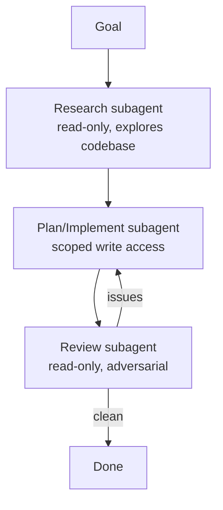

<LevelBadge level="advanced" />

I task di grandi dimensioni vanno meglio quando li suddividi tra [subagent](/docs/claude-code/subagents) focalizzati, invece di stipare tutto in un unico contesto. Progettiamo una pipeline ricerca → implementazione → revisione.

## La forma

Ogni subagent ha il **proprio contesto** e un **set di strumenti su misura** — e solo il *risultato* torna alla sessione principale, mantenendola pulita.

## Passo 1 — Definisci gli agenti

Tramite l'interfaccia `/agents`, definiscine tre, ciascuno con una `description` precisa (così l'agente principale delega correttamente) e strumenti delimitati:

- **researcher** — solo lettura/ricerca. Mappa il codice rilevante e restituisce i risultati.
- **implementer** — può modificare i file ed eseguire i test; riceve in input i risultati del researcher.
- **reviewer** — solo lettura, in chiave avversariale: cerca bug, casi mancanti e violazioni delle convenzioni.

## Passo 2 — Orchestra con i passaggi di consegne

La sessione principale passa l'output di ogni fase alla successiva: ricerca → implementazione (usando la ricerca) → revisione (dell'implementazione). Aggiungi un **gate di revisione**: se il reviewer trova problemi, torna all'implementer prima di concludere.

## Passo 3 — Sapere quando NON farlo

:::warning Il parallelismo/multi-agente non è gratuito
- **Le dipendenze sequenziali** (l'implementazione ha bisogno della ricerca) restano sequenziali — non parallelizzare dove l'ordine conta.
- **Le scritture su file condivisi** possono andare in conflitto — isolale con i [git worktree](/docs/claude-code/worktrees) o serializzale.
- Per i task piccoli, l'overhead di coordinamento supera il beneficio. Usa questo approccio per lavoro **consistente e scomponibile**.
:::

## Passo 4 — Verifica

Una buona esecuzione multi-agente mostra: un contesto principale focalizzato (la lettura pesante è avvenuta nel researcher), un'implementazione che riflette la ricerca e una revisione che ha effettivamente trovato qualcosa (o che ha dato un via libera credibile). Se il reviewer è un timbro automatico, rendi il suo prompt **avversariale** ("prova a trovare cosa c'è che non va").

## Andare oltre

Lo stesso schema, in modo programmatico, è [Costruire agenti con l'API](/docs/api/building-agents) e superfici di prodotto come [Cowork e team di agenti](/docs/api/cowork-and-agent-teams).

## Prossimi passi

- [Subagent e agenti paralleli](/docs/claude-code/subagents)
- [Git worktree](/docs/claude-code/worktrees)
- [Costruire agenti con l'API](/docs/api/building-agents)
