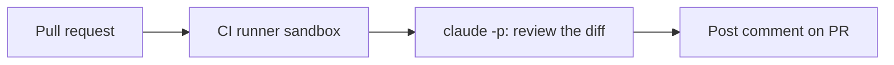

<LevelBadge level="advanced" />

<VerifyNote lastVerified="2026-06-20" source="https://docs.anthropic.com/en/docs/claude-code/sdk">
I flag della modalità headless e i dettagli dell'integrazione CI evolvono — verifica rispetto alla documentazione ufficiale di Claude Code / Agent SDK.
</VerifyNote>

Un classico esempio di automazione ad alto valore: far sì che Claude **revisioni ogni pull request** e pubblichi i suoi rilievi come commento — eseguendo in modalità [headless](/docs/claude-code/headless-and-agent-sdk) nella CI. Ecco la struttura, con le misure di sicurezza che la mantengono sicura.

## Cosa fa

Su ogni PR: effettua il checkout del diff, chiede a Claude di revisionarlo cercando bug/casi limite/problemi di convenzione, e pubblica un commento. Gli umani decidono comunque; Claude fornisce solo un primo passaggio rapido.



## Il workflow (bozza)

```yaml
name: Claude PR review
on: pull_request
permissions:
  contents: read
  pull-requests: write   # to comment — NOT write to code
jobs:
  review:
    runs-on: ubuntu-latest
    steps:
      - uses: actions/checkout@v4
        with: { fetch-depth: 0 }
      - name: Review the diff
        env:
          ANTHROPIC_API_KEY: ${{ secrets.ANTHROPIC_API_KEY }}
        run: |
          git diff origin/${{ github.base_ref }}...HEAD > /tmp/diff.patch
          claude -p "Review this diff for correctness bugs, missing edge cases, and
          security issues. Report ONLY high-confidence findings as a Markdown
          checklist with file:line. Diff:" < /tmp/diff.patch > /tmp/review.md
      # then post /tmp/review.md as a PR comment (e.g. with the gh CLI or an action)
```

(L'invocazione esatta in modalità headless può variare — consulta la documentazione. Il principio è: passa il diff, cattura il Markdown, pubblicalo.)

## Le misure di sicurezza (leggi [Rafforzare le esecuzioni autonome](/docs/security/hardening-autonomous-runs))

:::warning Privilegio minimo nella CI
- **Solo commenti.** Concedi `pull-requests: write`, **non** `contents: write` — il bot non dovrebbe fare push del codice.
- **Limita l'ambito del token**; non esporre mai l'accesso a deploy/segreti a un job che legge contenuti non attendibili di una PR.
- **Tratta il contenuto della PR come non attendibile** — può veicolare [prompt injection](/docs/security/prompt-injection); non lasciare che il job compia azioni con conseguenze.
- **Limita i costi** — i diff di grandi dimensioni costano [token](/docs/api/tokens-and-pricing); valuta di revisionare solo i file modificati.
:::

## Rendilo utile, non rumoroso

- Chiedi **solo rilievi ad alta affidabilità** — un muro di pignolerie viene ignorato.
- Tienilo come **primo passaggio**, con gli umani che decidono se fare il merge.

## Prossimi passi

- [Modalità headless e l'Agent SDK](/docs/claude-code/headless-and-agent-sdk)
- [Rafforzare le esecuzioni autonome](/docs/security/hardening-autonomous-runs)
- [Coding e sviluppo software](/docs/playbooks/coding)
