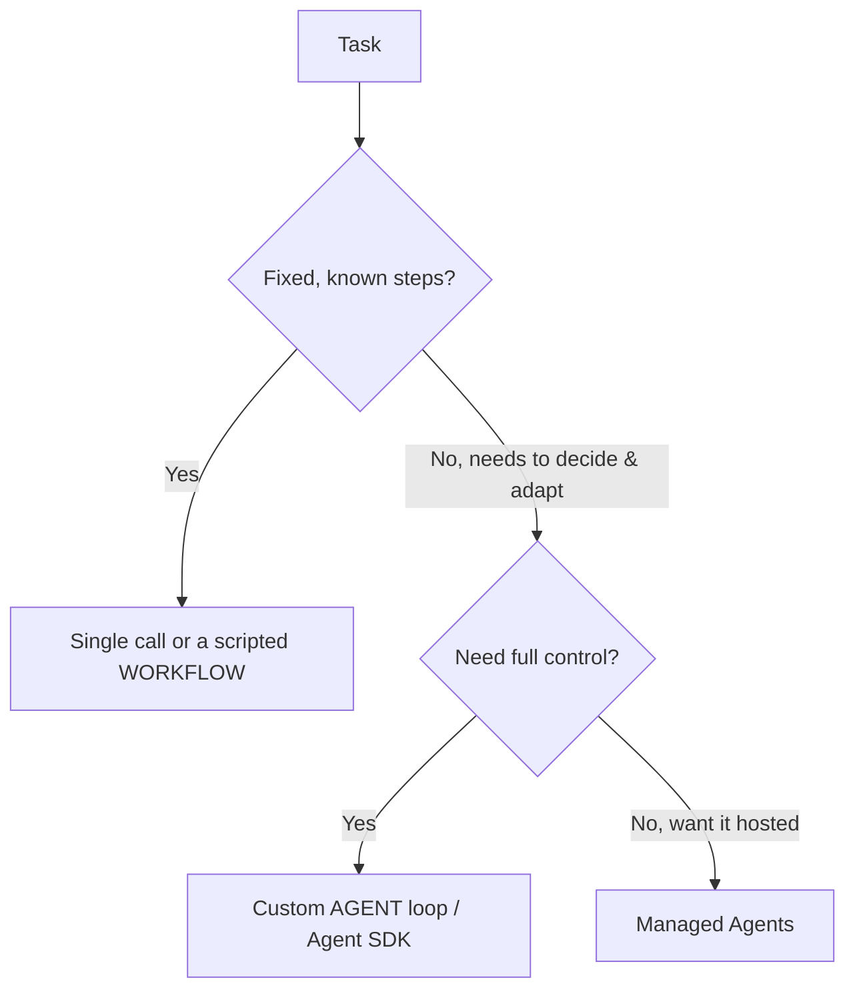

<LevelBadge level="advanced" />

<VerifyNote lastVerified="2026-06-20" source="https://docs.anthropic.com/en/docs/agents-and-tools">
エージェント関連のツール群（Agent SDK、マネージドオプションなど）は急速に進化しています。最新のオプションは公式ドキュメントで確認してください。
</VerifyNote>

**エージェント**とは、ループ内で動作するモデルのことです。[ツール](/docs/api/tool-use)を呼び出し、結果を観察し、完了するまで次のステップを判断しながら、目標を追求します。エージェントを構築する前に、*動作する最もシンプルな手段*を選びましょう。

## 判断のためのテスト（過剰に作り込まない）

- **単一呼び出し** — 1 つのプロンプトで答えが出る。大半のタスクがこれに該当します。最も安価で、最も信頼できます。
- **ワークフロー** — 固定された一連の呼び出しをコードでオーケストレーションします（決定論的な制御フロー）。ステップが既知の場合に使います。
- **エージェント** — モデルが動的にステップを判断します。経路を本当にハードコードできない場合にのみ使います。

> アダプティブであること自体が目的のときにこそエージェントを選びましょう。見栄えがするから、という理由で選んではいけません。自分で制御するワークフローのほうがテストもデバッグも容易です。

## ループを設計する

最小限のカスタムエージェント:

1. **システムプロンプト**: 目標、制約、利用可能なツール。
2. **ループ**: メッセージを送信 → `tool_use` があればツールを実行し、`tool_result` を追加して繰り返す → 最終回答または停止条件に達するまで。
3. **ガードレール**: 最大反復回数の上限、トークン/コストの予算、ツール入力のバリデーション。
4. **コンテキスト管理**: 履歴が増えたら要約・トリミングする（[コンテキスト管理](/docs/claude-code/context-management)と同じ考え方）。

**[Claude Agent SDK](/docs/claude-code/headless-and-agent-sdk)** は、このループ — ツール、権限、コンテキスト処理 — を一式そろえて提供します。自前で組み上げる必要はありません。

## 堅牢にする

- **すべてに上限を設ける**: 反復回数、時間、コスト。エージェントはループに陥り得ます。
- **ツールの失敗を丁寧に扱う**（エラーを結果として返す）。
- リスクのあるアクションには**最小権限 + ヒューマン・イン・ザ・ループ**を — [エージェントのセキュリティ](/docs/security/securing-agents)を参照。
- 信頼する前に実際のケースで**評価する** — [評価（Evals）](/docs/foundations/evals)を参照。

## 次へ

- [ツールの利用](/docs/api/tool-use) · [ヘッドレス & Agent SDK](/docs/claude-code/headless-and-agent-sdk)
- [マネージドエージェント](/docs/api/managed-agents) · [Cowork & エージェントチーム](/docs/api/cowork-and-agent-teams)
- [エージェントとツールのセキュリティ](/docs/security/securing-agents)
