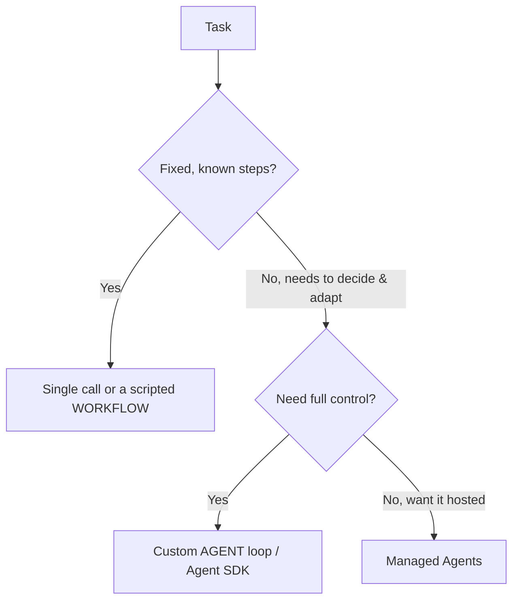

<LevelBadge level="advanced" />

<VerifyNote lastVerified="2026-06-20" source="https://platform.claude.com/docs/en/docs/agents-and-tools">
エージェント関連のツール（Agent SDK、マネージドオプション）は急速に進化します — 現在のオプションは公式ドキュメントで確認してください。
</VerifyNote>

<Callout type="objectives" items={["エージェントとは実際には何か——ループ内で動作するモデル——を定義する", "判断テストを使い、単一呼び出し・ワークフロー・エージェントを選び分ける", "適切なガードレールを備えた最小限のエージェントループを設計する", "自前で実装する代わりに Claude Agent SDK に頼るべきタイミングを知る", "エージェントを堅牢にする：境界を設け、失敗を処理し、権限を制限し、評価する"]} />

**エージェント**とは、ループ内で動作するモデルです。[ツール](/docs/api/tool-use)を呼び出し、結果を観察し、完了するまで次のステップを決定しながら目標を追求します。構築する前に、*動作する最もシンプルな手段*を選びましょう。

## 判断テスト（作り込みすぎない）

すべてのタスクにエージェントが必要なわけではありません。まずこのツリーをたどってください——ほとんどのタスクは一番上で止まります。

3つの選択肢、シンプルな順に：

- **単一呼び出し** — 1つのプロンプトで答えが出ます。ほとんどのタスク。最も安く、最も信頼できます。
- **ワークフロー** — コード内で固定された一連の呼び出しを自分でオーケストレーションします（決定論的な制御フロー）。ステップが既知の場合に使います。
- **エージェント** — モデルが動的にステップを決定します。経路を本当にハードコードできない場合にのみ使います。

<Callout type="warning">
適応性こそが目的であるときにエージェントを選んでください——印象的に聞こえるからではありません。自分で制御するワークフローのほうがテストもデバッグも簡単です。
</Callout>

## ループを設計する

最小限のカスタムエージェントは、4つの可動部品にすぎません。この順番で組み立てましょう：

<Steps items={[
  {title: "システムプロンプト", body: "目標、制約、利用可能なツールを明示します。これはモデルが毎ターン推論の拠り所にするものです。"},
  {title: "ループ", body: "メッセージを送信 → 応答が tool_use なら、ツールを実行し tool_result を追加して繰り返す → 最終回答または停止条件まで続ける。"},
  {title: "ガードレール", body: "最大反復回数の上限、トークン/コストの予算、そして何かが実行される前のツール入力の検証を追加します。"},
  {title: "コンテキスト管理", body: "履歴が増えたら要約または切り詰めます——コンテキスト管理（/docs/claude-code/context-management）で扱ったのと同じ考え方です。"}
]} />

**[Claude Agent SDK](/docs/claude-code/headless-and-agent-sdk)** は、このループ——ツール、権限、コンテキスト処理——を一式そろえて提供するので、自前で実装する必要がありません。

<Callout type="tip">
自分でループを書く前に、Agent SDK がすでにカバーしていないか確認してください。ループ、権限、コンテキスト処理を同梱しているので、ツールと目標に集中できます。
</Callout>

## 堅牢にする

ツールを呼び出せるループは、誤動作もしえます。次の4つの習慣がエージェントを信頼できるものに保ちます：

- **すべてに境界を設ける**：反復回数、時間、コスト。エージェントはループしうる。
- **ツールの失敗を**穏やかに処理する（エラーを結果として返す）。
- リスクのある操作には**最小権限 + 人間の介在（human-in-the-loop）**を — [エージェントのセキュリティ](/docs/security/securing-agents)を参照。
- 信頼する前に実際のケースで**評価する** — [評価](/docs/foundations/evals)を参照。

<Callout type="takeaways" items={["エージェントとは、目標に向けてツールを呼び出すループ内のモデルである——経路をハードコードできない場合にのみ使う", "判断の順序：単一呼び出し → ワークフロー → エージェント → マネージドエージェント；動作する最もシンプルなものを選ぶ", "最小限のループ = システムプロンプト + tool_use/tool_result ループ + ガードレール + コンテキスト管理", "Claude Agent SDK はループ、ツール、権限、コンテキスト処理を一式提供する", "堅牢性 = 反復/時間/コストに境界を設ける、ツールの失敗を処理する、最小権限 + 人間の介在、そして信頼する前に評価する"]} />

## 理解度チェック

<Quiz title="理解度チェック" questions={[
  {
    q: "この文脈でエージェントを最もよく表すのはどれですか？",
    options: [
      "完全な答えを返す単一のプロンプト",
      "ループ内で動作し、ツールを呼び出し、完了するまで次のステップを決定するモデル",
      "コード内で自分がオーケストレーションする固定された一連の API 呼び出し",
      "設定不要のホスト型サービス"
    ],
    answer: 1,
    explain: "エージェントとは、ループ内で動作するモデルです。ツールを呼び出し、結果を観察し、完了するまで次のステップを決定しながら目標を追求します。"
  },
  {
    q: "タスクに固定された既知のステップがあります。何を選ぶべきですか？",
    options: [
      "最大限の制御のため、カスタムエージェントループ",
      "ホストされるよう、マネージドエージェント",
      "単一呼び出し、またはスクリプト化したワークフロー",
      "マルチエージェントチーム"
    ],
    answer: 2,
    explain: "ステップが固定され既知の場合、単一呼び出しまたはスクリプト化したワークフロー（決定論的な制御フロー）が正しく最もシンプルな選択です。"
  },
  {
    q: "カスタムエージェントが実際に正当化されるのはいつですか？",
    options: [
      "ワークフローより印象的に聞こえるときならいつでも",
      "適応性こそが目的であり、経路を本当にハードコードできないとき",
      "複数のツールを呼び出すすべてのタスクで",
      "Agent SDK を使えないときに限る"
    ],
    answer: 1,
    explain: "適応性こそが目的であるときにエージェントを選んでください——印象的に聞こえるからではありません。自分で制御するワークフローのほうがテストもデバッグも簡単です。"
  },
  {
    q: "ループにおいて、モデルが tool_use で応答したとき何が起きますか？",
    options: [
      "ループを止めて部分的な答えを返す",
      "ツールを実行し、tool_result を追加して繰り返す",
      "メッセージを破棄してシステムプロンプトを再送する",
      "履歴をただちに要約する"
    ],
    answer: 1,
    explain: "ループ：メッセージを送信 → tool_use なら、ツールを実行し tool_result を追加して繰り返す → 最終回答または停止条件まで。"
  },
  {
    q: "エージェントを堅牢にするためのガードレールでは「ない」ものはどれですか？",
    options: [
      "最大反復回数の上限とトークン/コストの予算",
      "エラーを結果として返すことでツールの失敗を処理する",
      "ブロックされないようエージェントに完全な権限を付与する",
      "リスクのある操作に対する最小権限と人間の介在"
    ],
    answer: 2,
    explain: "堅牢なエージェントは、リスクのある操作に最小権限と人間の介在を用います——完全な権限を付与することの真逆です。さらに反復/時間/コストに境界を設け、ツールの失敗を穏やかに処理し、信頼する前に評価します。"
  }
]} />

## 次へ

- [ツール利用](/docs/api/tool-use) · [ヘッドレス & Agent SDK](/docs/claude-code/headless-and-agent-sdk)
- [マネージドエージェント](/docs/api/managed-agents) · [Cowork & エージェントチーム](/docs/api/cowork-and-agent-teams)
- [エージェントとツールのセキュリティ](/docs/security/securing-agents)
