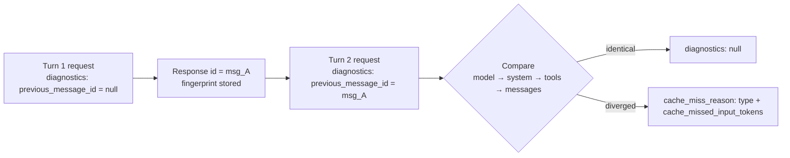

<LevelBadge level="advanced" />

<Callout type="objectives" items={[
  "プロンプトのバイト列を手作業で差分比較するのではなく、API レスポンスからプロンプトキャッシュのミスを診断する",
  "diagnostics オブジェクトをリクエストに組み込み、会話ループ全体に previous_message_id を通す",
  "6 種類の cache_miss_reason をすべて読み解き、それぞれが示す具体的な修正を適用する",
  "diagnostics と usage を組み合わせて、本当のバグとキャッシュエントリの期限切れを区別する",
  "この機能が静かに誤解を招く 3 つのポイントを避ける: 最初の相違点しか報告されないこと、比較が未完了になる場合、そしてトークン数が課金額ではないこと"
]} />

[プロンプトキャッシュ](/docs/api/prompt-caching)を設定して出荷したのに、`cache_read_input_tokens` が**ゼロ**。プレフィックスの何かが変わったのは確かだが、レスポンスは何のヒントもくれない。従来の対処法は過酷だ。連続する 2 つのリクエストをディスクにシリアライズし、バイト単位で差分を取り、半年前に誰かがシステムプロンプトへ埋め込んだタイムスタンプを探し出す。

**キャッシュ診断はそれを置き換える。** 直前のレスポンスの `id` を渡すと、API が 2 つのリクエストを比較し、最初にずれた箇所 — モデル、システムプロンプト、ツール、メッセージ履歴のいずれか — を名指しし、さらにキャッシュ可能なプレフィックスをどれだけ失ったかの推定値を返す。

<VerifyNote lastVerified="2026-09-28" source="https://platform.claude.com/docs/en/build-with-claude/cache-diagnostics">
キャッシュ診断は **2026 年 9 月 23 日に Claude API で一般提供（GA）に到達**した。`cache-diagnosis-2026-04-07` ベータヘッダーはもう必要なく、今も送信しているリクエストはこれまでどおり動作する。提供状況、フィールド名、`cache_miss_reason` のユニオンはいずれも変更される可能性がある — 公式のキャッシュ診断ドキュメントで確認すること。
</VerifyNote>

## メンタルモデル

API は、オプトインしたリクエストごとに小さな**フィンガープリント**を保持し、そのリクエストのレスポンス `id` をキーにする。次のリクエストでその `id` を渡し返すと、API は新しいリクエストのフィンガープリントを作り直して 2 つを比較し、**最初の相違点**を報告する。



この図について、フィールド名より重要なことが 3 つある。

1. **このオブジェクト自体がオプトインである。** API がフィンガープリントを保存するのは、`diagnostics` を含むリクエストに対して*だけ*だ。あるターンで付け忘れると、次のターンの照会は失敗する。
2. **比較の順序はプレフィックスの順序である。** モデル、次にシステム、次にツール、次にメッセージ — キャッシュ自体が構築されるのと同じ左から右への順序だ。
3. **報告するのは構造であって、キャッシュの結果ではない。** 診断が答えるのは*「リクエストは変わったか?」*であり、*「キャッシュはヒットしたか?」*とは別の問いだ。行動するには両方の読みが要る。[usage と組み合わせる](#pair-it-with-usage)を参照。

<Flashcards title="キャッシュ診断の用語" cards={[
  {front:"フィンガープリント", back:"diagnostics オブジェクトを含むリクエストに対して API が保存する軽量な記録。暗号学的ハッシュとトークン数の推定値のみで、生のプロンプトテキストは決して含まない。レスポンス id をキーとし、組織とワークスペースにスコープされ、短期間で失効する。"},
  {front:"previous_message_id", back:"現在のリクエストと比較したいレスポンスの id。最初のターンでは null を渡してオプトインだけ行い、比較対象はまだない状態にする。"},
  {front:"cache_miss_reason", back:"type による判別可能なユニオン。2 つのリクエストが最初にずれた箇所を名指しするか、比較が行われなかった理由を説明する。"},
  {front:"cache_missed_input_tokens", back:"4 つの *_changed 型が持つ値。相違点より後ろにあった入力トークンがどれだけあったか — つまりキャッシュ可能なプレフィックスをどれだけ失ったかの推定値。"},
  {front:"最初の相違点のみ", back:"レスポンスは最初の差分を報告してそこで止まる。後続の相違点はその陰に隠れうるため、デバッグは一発の読み取りではなく、修正して再計測するループになる。"}
]} />

## 会話を計測する

<Steps items={[
  {title: "すべてのターンに diagnostics オブジェクトを付ける", body: "デバッグ中のターンだけでなく、各リクエストに diagnostics を含めること。API がフィンガープリントを保存するのはこのオブジェクトを持つリクエストだけなので、1 ターン抜けるだけで連鎖が切れ、次のターンは previous_message_not_found を報告する。"},
  {title: "最初のターンでは null を渡す", body: "ターン 1 には比較対象がない。previous_message_id を null として送ると、オプトインしてフィンガープリントが登録される。レスポンスの diagnostics フィールドは null になるが、これは想定どおりであって失敗ではない。"},
  {title: "レスポンスの id を次に持ち越す", body: "以降のすべてのターンで、previous_message_id を直前のレスポンスの id に設定する。ループの中では、各呼び出しの後に再代入する変数ひとつで済む。"},
  {title: "レスポンスから diagnostics を読む", body: "非ストリーミング呼び出しでは Message のトップレベルの diagnostics フィールドとして届く。ストリーミング呼び出しでは message_start イベントに乗って届き、蓄積された最終メッセージまで引き継がれる。"},
  {title: "報告された原因を直し、もう一度計測する", body: "報告されるのは最初の相違点だけだ。修正したら再実行すること — 2 つ目の原因が最初の原因の陰にずっと潜んでいたかもしれない。"}
]} />

リクエストの形は小さい。呼び出しの他の部分は何も変わらない。

<PromptCard title="ターン 2 — 直前のレスポンスと比較する">{`curl https://api.anthropic.com/v1/messages \\
  -H "x-api-key: $ANTHROPIC_API_KEY" \\
  -H "anthropic-version: 2023-06-01" \\
  -H "content-type: application/json" \\
  -d '{
    "model": "claude-opus-5-5",
    "max_tokens": 1024,
    "cache_control": {"type": "ephemeral"},
    "system": "You are an AI assistant analyzing a large document. <document>...</document>",
    "messages": [
      {"role": "user", "content": "Summarize section 1."},
      {"role": "assistant", "content": "Section 1 covers..."},
      {"role": "user", "content": "Now summarize section 2."}
    ],
    "diagnostics": {"previous_message_id": "msg_01Xyz..."}
  }' | jq '{id, usage, diagnostics}'`}</PromptCard>

マルチターンのループでは、再代入される変数ひとつに収まる — `prev_id` は `None` で始まり、各呼び出しの後に `r.id` になる。

```python
messages = []
prev_id = None

for turn, user_message in enumerate(prompts, start=1):
    messages.append({"role": "user", "content": user_message})

    r = client.beta.messages.create(
        model="claude-opus-5-5",
        max_tokens=1024,
        cache_control={"type": "ephemeral"},
        system=SYSTEM,
        messages=messages,
        diagnostics={"previous_message_id": prev_id},
    )

    if r.diagnostics is not None and r.diagnostics.cache_miss_reason is not None:
        print(f"Turn {turn} cache_miss_reason: {r.diagnostics.cache_miss_reason.type}")

    messages.append({"role": "assistant", "content": r.content})
    prev_id = r.id
```

## レスポンスを読む

`diagnostics` フィールドが取りうる形は**3 つ**あり、最初の 2 つを混同するのが最もよくある誤読だ。

| 値 | 意味 |
|---|---|
| `null` | `diagnostics` オブジェクトを送らなかったか、`previous_message_id` が `null` だった（最初のターン）か、**あるいは**比較は行われたが相違点がなかった。 |
| `cache_miss_reason` が `null` | レスポンスがシリアライズされた時点で比較がまだ実行中だった — レスポンスが非常に速く始まると起こりうる。結論は出ていないので、次のターンで確認すること。 |
| `cache_miss_reason` がオブジェクト | 相違点、または比較が行われなかった理由の説明。 |

:::caution `null` の曖昧さは意図的なもの
`diagnostics` が `null` は「報告すべきことがない」という意味で、*「プレフィックスは同一だ」*と*「そもそもオプトインしていない」*の両方を含む。どこもかしこも `null` なのに診断結果を期待していたなら、プロンプトが安定していると結論づける前に、**両方の**ターンで実際に `diagnostics` オブジェクトを送っているか確認すること。
:::

値が入ったミスは次のようになる。

```json
{
  "id": "msg_01Xyz...",
  "type": "message",
  "role": "assistant",
  "usage": {
    "input_tokens": 42,
    "cache_read_input_tokens": 0,
    "cache_creation_input_tokens": 41850,
    "output_tokens": 210
  },
  "diagnostics": {
    "cache_miss_reason": {
      "type": "system_changed",
      "cache_missed_input_tokens": 41850
    }
  }
}
```

## 6 つの理由と、実際に変えるべきこと

4 つの型は相違点を名指しする。残る 2 つは、そもそも比較が行われなかったことを意味する — これを「プロンプトが変わった」と読むと、存在しないバグを追いかけることになる。

| `type` | ずれたもの | 対処 |
|---|---|---|
| `model_changed` | `model` が直前のリクエストと異なる。キャッシュはモデル単位なので、会話の途中でモデルを差し替えるルーター、A/B テスト、フォールバックはプレフィックス全体を捨ててしまう。 | キャッシュされた会話の寿命のあいだ、モデルは固定する。フォールバックが必要なら、各モデルをそれぞれ独立したキャッシュ系統として扱う。 |
| `system_changed` | `system` パラメータが異なる — ほとんどの場合、安定しているはずのプロンプトに埋め込まれたタイムスタンプ、リクエスト ID、セッション ID、ユーザー名が原因。 | システムプロンプトはバイト単位で安定した定数にする。動的な値はすべて、キャッシュのブレークポイント**より後ろ**の最初の `user` メッセージへ移す。 |
| `tools_changed` | `tools` 配列が異なる: ツールが追加・削除・並べ替えされたか、`input_schema` の JSON がターン間で非決定的にシリアライズされた。 | 毎ターン同じツールリストを固定された順序で送り、スキーマは決定的にシリアライズする（オブジェクトのキーをソートする）。 |
| `messages_changed` | モデル、システム、ツールはすべて一致しているが、`messages` の前方のエントリが追記ではなく改変・並べ替え・削除された。たいていは履歴の切り詰めか、アシスタントのターンや `tool_result` ブロックが再送時に違う形でシリアライズされたケース。 | 履歴は**追記専用**として扱う。アシスタントの `content` とツールの結果は、再構成せずそのまま逐語的に返す。 |
| `previous_message_not_found` | その `previous_message_id` に対応するフィンガープリントが保存されていない。**これはリクエストが変わった証拠ではない。** 直前のリクエストが `diagnostics` オブジェクトを省いていたか、別のワークスペースで実行されたか、時間が経ちすぎている。 | 毎ターン `diagnostics` を送り、連続するターンの間隔を空けすぎないようにする。 |
| `unavailable` | 診断が出せなかった。異なる 2 つのケースを含む: model/system/tools *以外*のプロンプトに影響するパラメータが異なっていたか、会話が長すぎて相違点が比較の地平線の外にあるか。 | `tool_choice`、`thinking`、`context_management`、`output_config`、`output_format`、そして有効な `anthropic-beta` ヘッダーの集合も固定すること — いずれもプロンプトに影響する。 |

:::tip `unavailable` は誤読されやすい
これは「機能が壊れている」という意味では**ない**。多くの場合、比較対象の 4 つの面はすべて一致していて、それ以外の何かが動いたということだ。ベータヘッダーの集合が定番の犯人で、呼び出し箇所から遠い共有クライアント設定に置かれていることが多く、誰もそれをプロンプトの一部だと思っていないからだ。
:::

<a id="pair-it-with-usage"></a>
## usage と組み合わせる

診断だけでは読みの半分でしかない。もう半分は `usage.cache_read_input_tokens` であり、2 つを合わせて初めて、見ているものがバグなのか物理法則なのかが分かる。

| 診断 | キャッシュ読み取りトークン | 実際の意味 |
|---|---|---|
| `null` | 多い | 設計どおり。プレフィックスは安定し、キャッシュはヒットしている。することはない。 |
| `null` | 少ない、またはゼロ | **あなたのバグではない。** リクエストは一致していて、キャッシュエントリが単に失効していただけ。ターン間の間隔を縮めるか、[1 時間のキャッシュ保持期間](https://platform.claude.com/docs/en/build-with-claude/prompt-caching#1-hour-cache-duration)に移行する。 |
| `*_changed` 型 | 少ない、またはゼロ | **あなたのバグ。** リクエストが変わっている。`type` が名指しする原因を直すこと。 |
| `*_changed` 型 | 多い | まれ。プロンプトの後方で何かが変わったが、より前の `cache_control` ブレークポイントはヒットしている。直す価値はあるが影響は小さい。 |

この表の 2 行目こそ、この機能が存在する価値だ。「キャッシュ読み取りがゼロ」はかつて「プレフィックスのバグがある」と見分けがつかず、答えが前者だったのにチームが何日も後者を追いかけていた。両方を合わせて読むことで、診断は*あなたの*ミスと*キャッシュの*寿命を切り分けてくれる。

この表が当てはまるのは、実際の `previous_message_id` を渡したターンだけだ。最初のターン（`diagnostics` は常に `null` で、キャッシュは書き込み中なので読み取りは通常ゼロ）には当てはまらないし、`cache_miss_reason` が `null`、`previous_message_not_found`、`unavailable` の場合も同様 — いずれも比較が行われていない。

## よくある間違い

- **失敗しているターンだけを計測する。** フィンガープリントは*直前の*リクエストに紐づく。デバッグ対象のターンにだけ `diagnostics` を付けると、確実に `previous_message_not_found` になる。ループ全体を計測すること。
- **`cache_missed_input_tokens` を課金額として扱う。** これは**トークン化前のバイト長**から導かれるので、規模の指標でしかない — 「プレフィックスをおよそ 40k 分失った」であって「41,850 トークン分課金された」ではない。`usage.input_tokens` と食い違うことがあり、ときにはそれを上回ることさえある。
- **1 回直して止める。** 報告されるのは最初の相違点だけだ。`system_changed` を直した途端、ずっとそこにあった `tools_changed` が現れることがある。診断が沈黙するまで、修正のたびに再計測すること。
- **ワークスペースをまたいでデバッグする。** 直前のリクエストは同じ組織*かつ*同じワークスペースで実行されていなければならない。`previous_message_not_found` を信じる前に、両方のレスポンスの `anthropic-workspace-id` ヘッダーを比較すること。
- **Bedrock や Google Cloud で使えると期待する。** キャッシュ診断は **Claude API 限定**だ。マルチクラウドなら、Claude API の経路を計測してそこでプレフィックスを直し、その修正をどこにでも展開する — 診断が使えない環境でも、プレフィックス安定性のルールは同じだ。
- **未完了の比較を「問題なし」と読む。** `cache_miss_reason: null` は、レスポンスがシリアライズされた時点で比較が終わっていなかったという意味だ。合格ではなく、結論が出ていない。

## 常時オンにしておいて安全か?

おおむね安全であり、そのことが使い方を変える。この機能は**設計上ベストエフォート**だ。診断がリクエストをブロックしたり失敗させたりすることはなく、情報が得られないときはエラーではなく `unavailable` か `null` の理由が返る。保存されるフィンガープリントは暗号学的ハッシュとトークン数の推定値だけで、生のプロンプトテキストは含まず、**ZDR 適格（qualified）**だ。

だからこそ、インシデント中に慌てて付け足すのではなく、ステージング環境に `diagnostics` を常設しておくのが理にかなっている — 誰かがシステムプロンプトにタイムスタンプを足し、キャッシュヒット率が 1 週間かけてじわじわ落ちていくタイプの回帰を捕まえられるのは、この方法だけだ。

<Quiz title="理解度チェック" questions={[
  {q:"ターン 2 のレスポンスで diagnostics が null、cache_read_input_tokens がゼロで返ってきた。最も可能性の高い説明は?",options:["何かがひそかにシステムプロンプトを変えた","リクエストは一致していたが、キャッシュエントリがすでに失効していた","このアカウントではキャッシュ診断が利用できない"],answer:1,explain:"diagnostics が null でキャッシュ読み取りが少ないなら、2 つのリクエストは同一だったがキャッシュエントリがもう残っていなかったということだ。これはプレフィックスのバグではなく TTL の問題 — ターン間の間隔を縮めるか、1 時間のキャッシュ保持期間に移行する。"},
  {q:"previous_message_not_found が返ってきた。これはプロンプトについて何を教えてくれるか?",options:["何も — その id に対するフィンガープリントが保存されていないという意味","メッセージ履歴が切り詰められたということ","ターン間でモデルが変わったということ"],answer:0,explain:"previous_message_not_found はリクエストが変わった証拠ではない。その previous_message_id に対応する保存済みフィンガープリントが存在しないという意味で、たいていは直前のリクエストが diagnostics オブジェクトを省いていたか、別のワークスペースで実行されたか、送信が古すぎたからだ。"},
  {q:"報告された system_changed を直したら、次の実行で tools_changed が出た。何が起きたのか?",options:["修正が tools 配列に新しいバグを持ち込んだ","報告されるのは最初の相違点だけなので、ツールの相違がシステムの相違の陰に隠れていた","比較の地平線を超えた"],answer:1,explain:"レスポンスが報告するのは最初の相違点だけだ。最初の原因を直すと、その陰にあったものが表に出る。キャッシュのデバッグが一発の読み取りではなく、修正して再計測するループになるのはこのためだ。"},
  {q:"cache_missed_input_tokens の値はどう扱うべきか?",options:["課金された正確なトークン数として","失われたプレフィックスの規模の指標として","キャッシュのブレークポイントの大きさとして"],answer:1,explain:"この値はトークン化前のバイト長から導かれるので、相違点より後ろにあったキャッシュ可能なプレフィックスがどれだけかを推定するものだ。課金額ではなく規模の指標として扱うこと — usage.input_tokens と食い違うことがあり、ときにはそれを上回る。"}
]} />

<Callout type="takeaways" items={[
  "diagnostics オブジェクトを毎ターン送り、直前のレスポンス id を持ち越すこと — フィンガープリントはオプトインしたリクエストに対してのみ保存される。",
  "diagnostics が答えるのは「リクエストは変わったか?」、usage.cache_read_input_tokens が答えるのは「キャッシュはヒットしたか?」。プレフィックスのバグと失効したエントリを見分けるには両方が要る。",
  "4 つの *_changed 型は相違点を名指しする。previous_message_not_found と unavailable は比較が行われなかったという意味で、変更の証拠ではない。",
  "報告されるのは最初の相違点だけなので、診断が沈黙するまで修正と再計測を繰り返すこと。",
  "cache_missed_input_tokens はバイト長から導かれた規模の推定値であって、課金額ではない。",
  "Claude API 限定 — Amazon Bedrock と Google Cloud にはない — だが、この機能が教えるプレフィックス安定性のルールはどこでも通用する。"
]} />

## 次に読む

- [プロンプトキャッシュとコスト最適化](/docs/api/prompt-caching) — そもそもブレークポイントを正しく置き、診断すべきことを減らす。
- [プロバイダーをまたぐプロンプトキャッシュ](/docs/models/prompt-caching-across-providers) — OpenAI、Gemini、DeepSeek における同じプレフィックスのルールと、キャッシュが損になる損益分岐の計算。
- [トークン、コンテキスト、料金](/docs/api/tokens-and-pricing) — いま無駄にせずに済んだトークンが実際いくらなのか。
