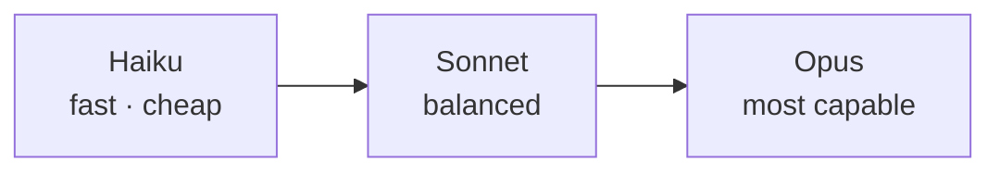

<LevelBadge level="beginner" />

Anthropicは異なる能力/コスト/速度ポイントのモデルファミリーを提供しています。うまく選ぶことは、主にモデルをジョブに合わせること — そして必要のない能力に払いすぎないことです。

<Callout type="objectives" items={[
  "Haiku → Sonnet → Opusのはしごを、能力/コスト/速度のトレードオフとして読む",
  "推測ではなく正しいデフォルトから始め、意図的に上下する",
  "1つのシステム内で階層を混ぜる — ほとんどの人が引かない最大のコストレバー",
  "正確なモデルIDを正しい方法で調べる、アップグレードが1行の変更で済むように",
]} />

## 現在のモデル

<ModelTable />

## 試してみる:どのモデルが合う?

3つの質問に答えて、開始時の推奨を得てください:

<ModelPicker />

## メンタルモデル:能力のはしご

- **Sonnetから始める。** これはデフォルトの働き者 — 適正コストで強力な推論とコーディング。ほとんどのタスクはここから始めるべきです。
- **Opusにアップする**のは、Sonnetが苦戦し、コストより品質が重要なとき(難しい推論、厄介なエージェント、面倒なコード)。
- **Haikuに下げる**のは、大量処理、レイテンシ敏感、または単純な作業(分類、抽出、ルーティング、安価なサブエージェント)。

## 実際にどう選ぶか

<Steps items={[
  {title: "Sonnetをデフォルトにして出荷", body: "これがバランスの取れた働き者。他から始めることは、実際のタスクに関する証拠を得る前に最適化していることを意味します。"},
  {title: "品質の頭打ち?難しいサブセットにのみOpusを試す", body: "ワークロード全体をアップグレードしない。Sonnetが失敗するケースを見つけ、それだけをOpusにルーティング — 全体で払わずに品質を買えます。"},
  {title: "コストやレイテンシが痛い?そのステップにHaikuで十分か見る", body: "分類、抽出、ルーティング、安価なサブエージェントには通常より大きなモデルは不要。仮定せずにテストしてください。"},
  {title: "モデルを混ぜる", body: "安価な前処理/後処理にHaikuを、難しい中核にSonnet/Opusを使う。このモデル階層化は最大級のコストレバーの1つ — コストとレイテンシを参照。"},
]} />

モデル階層化は独立した読み物に値します:[コストとレイテンシ](/docs/foundations/cost-and-latency)。

:::tip ベンチマークだけで選ばない
公開ベンチマークは出発点のヒントであり、*あなた*のタスクに対する判定ではありません。実際の入力を数個使って、2つのモデルで小さな[評価](/docs/foundations/evals)を実行してみてください — 数分で済み、推測より優れています。
:::

## 正確なモデルIDを調べる

常に現在のAPIモデルIDを渡してください(例:`messages.create`呼び出しで)。[上のモデル表](/docs/whats-new/models-and-pricing)または公式モデルページから取得し、多くの場所にハードコードするより設定から読み込むことを優先してください、そうすればモデルのアップグレードが1行の変更になります。

<Quiz title="理解度チェック" questions={[
  {q: "何か新しいものを構築していて、どのモデルが合うかのデータがありません。どこから始めますか?", options: ["Opus、高価すぎればダウングレード", "Sonnet — バランスの取れたデフォルト — その後証拠に基づいて上下", "Haiku、出力が弱く見えたらいつでもアップグレード"], answer: 1, explain: "Sonnetは働き者:適正コストで強力な推論とコーディング。そこから始めて出荷し、実際の失敗がOpusに手を伸ばすかHaikuに下げるかを教えてくれるようにします。"},
  {q: "Sonnetがトラフィックの90%をうまく処理しますが、難しい10%で失敗します。最善の動きは?", options: ["すべてをOpusに移す", "難しいサブセットのみOpusにルーティングし、残りはSonnetのまま", "例をもっと追加して失敗を受け入れる"], answer: 1, explain: "ワークロード全体をアップグレードすると、Sonnetがすでに処理しているケースにもOpusの価格を払うことになります。難しいサブセットのみをルーティングすれば、必要な場所で品質を買えます — モデル階層化の本質です。"},
  {q: "ベンチマークがモデルAがモデルBに勝つと示しています。あなたのアプリに何を結論すべきですか?", options: ["モデルAを使う — ベンチマークが決着させる", "多くはない — 自分の実際の入力で両方の小さな評価を実行する", "ベンチマークは常に不正操作されているのでモデルBを使う"], answer: 1, explain: "公開ベンチマークはあなたのタスクに対する判定ではなくヒントです。実際の入力を数個使う小さな評価は数分で済み、推測より優れています。"},
  {q: "モデルIDをコードベース中にハードコードするのではなく、なぜ設定から読むのですか?", options: ["ハードコードされた文字列は実行時に遅い", "モデルのアップグレードがすべての呼び出しサイトを探し回るのではなく1行の変更で済むから", "APIはリテラルなモデルIDを拒否する"], answer: 1, explain: "モデルIDはラインアップが動くにつれて変わります。現在のIDを設定に保持することでアップグレードは1行に触れるだけになり、値は常にライブのモデル表から調べます。"},
]} />

<Callout type="takeaways" items={[
  "Haiku → Sonnet → Opusは能力/コスト/速度のはしご — 段を選び、モデルを推測しないこと。",
  "Sonnetをデフォルトにして出荷;自分のタスクからの証拠に基づいてのみ上下する。",
  "ワークロード全体ではなく難しいサブセットをアップグレードする — ルーティングは一律アップグレードに勝つ。",
  "1つのシステムで階層を混ぜることは、利用可能な最大のコストレバーの1つ。",
  "ベンチマークはヒント;実際の入力での小さな評価が判定。",
  "モデルIDを設定から読み、ライブのモデル表で調べる — モデル事実を決してハードコードしない。",
]} />

## 次のステップ

- [トークン、コンテキストと価格](/docs/api/tokens-and-pricing)
- [最初のAPI呼び出し](/docs/api/first-call)
- [現在のモデルと価格](/docs/whats-new/models-and-pricing)
