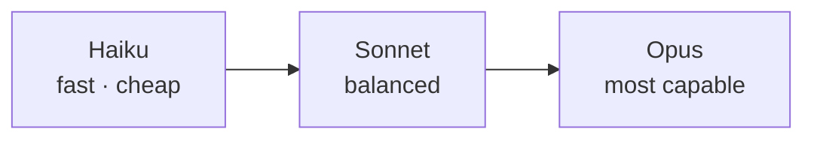

<LevelBadge level="beginner" />

Anthropic は、能力・コスト・速度の異なるモデルのファミリーを提供しています。うまく選ぶコツは、ほとんどがモデルを仕事に合わせること、そして必要のない能力に過剰に支払わないことに尽きます。

## 現在のモデル

<ModelTable />

## 試してみる: どのモデルが合う?

3 つの質問に答えると、出発点となる推奨が得られます:

<ModelPicker />

## メンタルモデル: 能力のはしご

- **Sonnet から始めましょう。** デフォルトの主力です — 妥当なコストで強力な推論とコーディングを提供します。大半のタスクはここから始めるべきです。
- **Opus に上げる**のは、Sonnet が苦戦し、かつコストよりも品質が重要な場合のみです（難しい推論、扱いにくいエージェント、込み入ったコード）。
- **Haiku に下げる**のは、大量処理、レイテンシーに敏感、またはシンプルな作業（分類、抽出、ルーティング、安価なサブエージェント）の場合です。

## 実際の選び方

1. **Sonnet をデフォルト**にして、まず出荷する。
2. **品質の天井にぶつかった?** 難しい部分だけ Opus を試す。
3. **コストやレイテンシーが厳しい?** そのステップに Haiku で十分か確認する。
4. **モデルを組み合わせる。** 安価な前処理・後処理には Haiku を、難しい中核には Sonnet/Opus を使います。この「モデルの階層化」は最大級のコスト削減レバーの 1 つです — [コストとレイテンシー](/docs/foundations/cost-and-latency)を参照。

:::tip ベンチマークだけで選ばない
公開ベンチマークは出発点のヒントであって、*あなたの*タスクに対する結論ではありません。実際の入力をいくつか用意して、2 つのモデルにまたがる小さな[評価（eval）](/docs/foundations/evals)を実行しましょう。数分で済み、推測よりはるかに優れています。
:::

## 正確なモデル ID を調べる

常に最新の API モデル ID を渡してください（例: `messages.create` の呼び出し内）。[上記のモデル表](/docs/whats-new/models-and-pricing)または公式のモデルページから取得します。さらに、多くの場所にハードコードするのではなく設定から読み込むようにすると、モデルのアップグレードが 1 行の変更で済みます。

## 次へ

- [トークン、コンテキスト & 料金](/docs/api/tokens-and-pricing)
- [初めての API 呼び出し](/docs/api/first-call)
- [現行モデル & 料金](/docs/whats-new/models-and-pricing)
