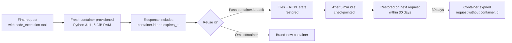

<LevelBadge level="intermediate" />

<Callout type="objectives" items={[
  "1 つのツールブロックでサンドボックスを有効化し、Claude がそこで何をするか理解する — Bash コマンド、ファイル編集、そして(新しいバージョンでは)永続的な Python REPL",
  "適切なツールバージョンを選ぶ — code_execution_20250825 vs 20260120 vs 20260521 — それぞれが何を解放するのか正確に理解する",
  "ファイルを出し入れする — container_upload でアップロードし、OUTPUT_DIR パターンで生成ファイルをキャプチャする",
  "コンテナをリクエスト間で再利用して、最大 30 日間状態を保持する。また、新しいコンテナが安全な場面も知る",
  "料金を正しく読む — 月 1,550 時間無料、それを超えるとコンテナ 1 時間あたり $0.05 — 完全に無料になる唯一の組み合わせも押さえる",
  "自前の Bash ツールとコード実行を併用したときのマルチ環境混乱を避ける"
]} />

<VerifyNote lastVerified="2026-08-25" source="https://platform.claude.com/docs/en/agents-and-tools/tool-use/code-execution-tool">
ツールバージョン文字列、モデル互換性、リソース上限、料金階層は変更されます。特定の数値を前提に設計する前に、必ずフィールド名と無料時間上限を公式リファレンスで再確認してください。
</VerifyNote>

**コード実行ツール**は Anthropic のサーバー側サンドボックスです。`tools` 配列に 1 つの JSON ブロックを追加するだけで、Claude は Bash シェル、ファイルエディタ、Python 3.11 インタプリタを手にし、それらはすべて API がプロビジョニングした Linux コンテナ内で動作します。あなたがコマンドを実行したり `tool_result` ブロックを返送したりする必要は一切ありません — API が各呼び出しを実行し、同じレスポンス内で出力をストリーミングして返します。

これは Anthropic が今後リリースする多くの機能の土台となる基本要素です。[プログラマティックツール呼び出し](/docs/api/programmatic-tool-calling) は同じコンテナ内で Python を実行しますし、新しい [web search](https://platform.claude.com/docs/en/agents-and-tools/tool-use/web-search-tool) と [web fetch](https://platform.claude.com/docs/en/agents-and-tools/tool-use/web-fetch-tool) ツールは動的な結果フィルタリングのためにこれを裏側で使用しています。サンドボックスを理解することは、プラットフォーム全体で活きます。

## いつ手を伸ばすべきか

<Callout type="info" items={[
  "自明でない数学 — 大きな数、多くのステップ、Claude が実行せずに推測してしまうような精度重視の結果",
  "アップロードしたファイル上でのデータ分析 — CSV、Excel、JSON、XML、画像、PDF",
  "人が後でダウンロードする可視化、PDF、スプレッドシートの生成",
  "中間状態を保存して反復する必要のあるマルチステップスクリプト — リクエストをまたぐ永続的な Python REPL",
  "そうしなければ巨大なツール結果をモデルに往復させることになるワークロード全般 — サンドボックスはローカルでフィルタリングする"
]} />

Claude は単純な算術、よく知られた事実、事実的/会話的な質問、基本的な単位変換ではコードを実行しません。境界線上のリクエストなら明示的に頼みましょう — **「これをコードで検証して」**。

## 3 つのツールバージョン — それぞれが追加するもの

現在有効なバージョンは 3 つあります。3 つとも同じブロック形状を返し、いずれも `anthropic-beta` ヘッダは必要ありません。

| バージョン                    | 追加される機能                                                                                                                                                                                                                                              |
| --------------------------- | -------------------------------------------------------------------------------------------------------------------------------------------------------------------------------------------------------------------------------------------------------- |
| `code_execution_20250825`   | Bash コマンドとファイル操作 (`view`、`create`、`str_replace`)。ほとんどの例で使われているのはこれ。                                                                                                                                                     |
| `code_execution_20260120`   | **REPL 状態の永続化**とサンドボックス内からの [プログラマティックツール呼び出し](/docs/api/programmatic-tool-calling) をサポート。Python インタプリタの状態(変数、import)がコンテナを再利用するリクエスト間で保持される。                                                                          |
| `code_execution_20260521`   | ランタイムは `20260120` と同じ。ツール説明にプログラマティックツール呼び出しにおける **Python セルごとの 90 秒の実時間上限**が明示されるようになり、Claude が計算途中で切られる代わりに長時間セルの予算を組めるようになった。                                                              |

**2 つの目安:**

- 現行の web search または web fetch ツール(`web_search_20260209` / `web_fetch_20260209` 以降)を使用する場合は、**必ず** `code_execution_20260120` 以降を使う必要があります — 動的フィルタリングに必須のコード実行バージョンだからです。
- Claude Haiku 4.5 は新しい type 文字列を受け付けますが、実際にはプログラマティックツール呼び出しや REPL 永続化はサポートしません。Haiku 上では新しいバージョンは `code_execution_20250825` と同じ挙動になります。

## 1 リクエストでサンドボックスを起動する

<Steps items={[
  {title: "ツールブロックを追加する", body: "tools に 1 つのエントリを含め、type を使いたいバージョンに、name を code_execution に設定します。他のパラメータはありません — どちらのフィールドも固定値です。"},
  {title: "計算が有効なメッセージを送る", body: "Claude に計算、ファイル解析、チャート生成、シェルコマンド実行を依頼します。実行するかどうかは Claude が判断します。"},
  {title: "インタリーブされたレスポンスを読む", body: "レスポンスは server_tool_use ブロック(Claude が実行したコマンド)と対応する tool_result ブロック(stdout、stderr、return_code、キャプチャされたファイル)を交互に含み、その後に Claude のテキスト回答が続きます。"},
  {title: "オプション: コンテナを再利用する", body: "レスポンスにはトップレベルの container オブジェクト(id 付き)が含まれます。その id を次のリクエストに渡すと、ファイルと(新しいツールバージョンでは)Python 状態を保持できます。"}
]} />

<PromptCard title="最小 cURL リクエスト — 平均と標準偏差">{`curl https://api.anthropic.com/v1/messages \\
  -H "x-api-key: $ANTHROPIC_API_KEY" \\
  -H "anthropic-version: 2023-06-01" \\
  -H "content-type: application/json" \\
  -d '{
    "model": "claude-opus-5",
    "max_tokens": 4096,
    "messages": [{
      "role": "user",
      "content": "Use the code execution tool to calculate the mean and standard deviation of [1, 2, 3, 4, 5, 6, 7, 8, 9, 10]"
    }],
    "tools": [{
      "type": "code_execution_20250825",
      "name": "code_execution"
    }]
  }'`}</PromptCard>

レスポンスは `server_tool_use` ブロックと `bash_code_execution_tool_result` (または `text_editor_code_execution_tool_result`) ブロックを交互に含み、最後に Claude のまとめテキストが続きます。

## 無料でついてくるサブツール

コード実行ツールを追加すると、Claude が任意のターンで選択しうる 2 つのサブツールが暗黙的に解放されます。

- **`bash_code_execution`** — 任意のシェルコマンドを実行する。結果には `stdout`、`stderr`、`return_code`、そしてコマンドが `$OUTPUT_DIR` に残したファイルの `content` リストが含まれる。
- **`text_editor_code_execution`** — ファイル(ソースコードを含む)を表示、作成、編集する。サポートコマンドは `view`、`create`、`str_replace`。差分は unified-diff 形式(`old_start`、`new_start`、`lines`)で返る。

Python インタプリタはそれ自体がサブツールではありません — Claude はファイルエディタで Python を書き、Bash コマンドで実行します。`code_execution_20260120` 以降とプログラマティックツール呼び出しの組み合わせでは、コンテナを再利用するセル間で*インタプリタの状態*が保持されます。

## コンテナにファイルを入れる

[Files API](https://platform.claude.com/docs/en/build-with-claude/files) でファイルをアップロードし、メッセージ内で `container_upload` コンテンツブロックとして参照します。Python 環境は CSV、Excel (`.xlsx`、`.xls`)、JSON、XML、画像(JPEG/PNG/GIF/WebP)、テキストベースのフォーマットを処理できます。

<PromptCard title="CSV をアップロードして Claude に解析させる">{`# 1. Upload the file
FILE_ID=$(curl -sS https://api.anthropic.com/v1/files \\
  -H "x-api-key: $ANTHROPIC_API_KEY" \\
  -H "anthropic-version: 2023-06-01" \\
  -F "file=@data.csv" | jq -r '.id')

# 2. Reference it with a container_upload block
curl https://api.anthropic.com/v1/messages \\
  -H "x-api-key: $ANTHROPIC_API_KEY" \\
  -H "anthropic-version: 2023-06-01" \\
  -H "content-type: application/json" \\
  -d '{
    "model": "claude-opus-5",
    "max_tokens": 4096,
    "messages": [{
      "role": "user",
      "content": [
        {"type": "text", "text": "Analyze this CSV data"},
        {"type": "container_upload", "file_id": "'"$FILE_ID"'"}
      ]
    }],
    "tools": [{"type": "code_execution_20250825", "name": "code_execution"}]
  }'`}</PromptCard>

## ファイルを取り出す — `$OUTPUT_DIR` パターン

これは、痛い目に遭うまで誰も文書化しない落とし穴です: **キャプチャされて `file_id` エントリとして返されるのは `$OUTPUT_DIR` のトップレベルにあるファイルだけです。** すべての `bash_code_execution` 呼び出しは、`$OUTPUT_DIR` として利用可能な新しい空ディレクトリを取得します。Claude がコンテナ内の他の場所に書いたものはそこに残り、クライアントには返されません。

アプリが特定のファイルを受け取ることに依存する場合は、プロンプトで明示し、同じツール結果内で `ls` がキャプチャを確認できるように次のようなコマンドパターンを使いましょう:

```bash
python /tmp/make_report.py && cp /tmp/report.pdf "$OUTPUT_DIR/" && ls "$OUTPUT_DIR"
```

Claude はレスポンスの `content` リストを見ていません — プロンプトと自分の stdout しか見ていません — なので `ls` の行がコピー成功を Claude に伝える手段になります。

一度キャプチャされれば、ファイルは Files API 経由でダウンロード可能です(`client.files.download(file_id)`)。コード実行が Files API 経由で*作成した*ファイルは、30 日のコンテナ有効期限とは独立して、削除するまで残ります。

## コンテナのライフサイクル



- **コンテナは作成から 30 日間有効です。** 各レスポンスの `expires_at` タイムスタンプは短い*ローリング*値であり、30 日のハード上限は反映しません。
- **約 5 分の非アクティブ後**、コンテナはチェックポイントされます。30 日以内にその ID を含むリクエストを送るとリストアされます。
- **有効期限切れのコンテナは再利用できません。** その ID を参照するリクエストはエラーを返します — `container` パラメータなしで再送して新しいものを取得してください。

## ランタイム仕様 — サンドボックスの実体

| プロパティ         | 値                                                                                                          |
| ------------------ | ----------------------------------------------------------------------------------------------------------- |
| Python バージョン  | 3.11                                                                                                        |
| OS                 | Linux (x86_64 / AMD64)                                                                                      |
| メモリ             | 5 GiB RAM                                                                                                   |
| ディスク           | 5 GiB のワークスペース                                                                                      |
| CPU                | 1                                                                                                            |
| 実行時間           | API がツール呼び出し全体の上限を強制。プログラマティックツール呼び出しでは、REPL セルごとに 90 秒の実時間上限が加わる |
| インターネット     | **完全に無効** — 外向きのネットワークリクエストなし                                                          |
| サンドボックス隔離 | ホストおよび他のコンテナから完全に隔離                                                                       |
| ワークスペーススコープ | コンテナは API キーのワークスペースにスコープされる                                                          |

プリインストールされたライブラリには、通常のデータサイエンススタック(pandas、numpy、scipy、scikit-learn、statsmodels)、可視化(matplotlib、seaborn)、ファイル処理(pyarrow、openpyxl、xlsxwriter、xlrd、pillow、python-pptx、python-docx、pypdf、pdfplumber、pypdfium2、pdf2image、pdfkit、tabula-py、reportlab、Img2pdf)、数学(sympy、mpmath)、ユーティリティ(tqdm、python-dateutil、pytz、joblib)に加え、コマンドラインツール(`unzip`、`unrar`、`7zip`、`bc`、`rg`、`fd`、`sqlite`)が含まれます。

**`pip install` はできません。** インターネットがオフのため、Claude はランタイムに追加パッケージを取得できません。既にあるものを前提に設計してください。

## 料金 — 無料になる唯一の組み合わせ

<VerifyNote lastVerified="2026-08-25" source="https://platform.claude.com/docs/en/agents-and-tools/tool-use/code-execution-tool#usage-and-pricing">
無料時間の上限と 1 時間あたりの料金は変わることがあります — これらの数値に予算アラートを組む前に、必ず公式ドキュメントの現在の料金セクションを再確認してください。
</VerifyNote>

**リクエストに web search または web fetch も含まれる場合、コード実行は無料になります**(`web_search_20260209` 以降、`web_fetch_20260209` 以降)。それらのリクエストではコード実行ツール呼び出しに対して標準のトークン料金以外の追加課金はありません — これは Anthropic が裏側で走らせている動的フィルタリングと、Claude が直接書く任意のコードの両方をカバーします。

これらのツールがない場合、コード実行は実行時間で課金されます:

- コンテナあたりの最低課金実行時間は **5 分**。
- 各組織には毎月 **1,550 時間の無料枠**があります。
- 無料枠を超えた分は **1 時間、1 コンテナあたり $0.05**。
- リクエストにファイルが添付されると、コンテナがプリロードされます — Claude がツールを一度も呼ばなくても実行時間は課金されます。

使用量はレスポンスの `usage.server_tool_use.code_execution_requests` カウントで追跡します。

## マルチ環境の罠

自前の [Bash tool](https://platform.claude.com/docs/en/agents-and-tools/tool-use/bash-tool) やカスタム REPL も公開すると、Claude は*2 つの*実行環境を目の前にすることになります: Anthropic のサンドボックスコンテナと、あなたのローカル環境です。両者の状態は共有されません — Claude はときどきこれを忘れて、間違ったほうに手を伸ばします。

両方が共存する場合は、システムプロンプトに明示的なガイダンスを追加してください:

<PromptCard title="マルチ環境セットアップ用のシステムプロンプト補足">{`When multiple code execution environments are available, be aware that:
- Variables, files, and state do NOT persist between different execution environments.
- Use the code_execution tool for general-purpose computation in Anthropic's sandboxed environment.
- Use client-provided execution tools (e.g., bash) when you need access to the user's local system, files, or data.
- If you need to pass results between environments, explicitly include outputs in subsequent tool calls rather than assuming shared state.`}</PromptCard>

同じ罠は、あなたが自前のシェルツールと一緒に web search や web fetch を有効化したときにも静かに発火します: 動的フィルタリングのために自動でプロビジョニングされるコード実行が*2 番目の*環境としてカウントされるからです — たとえあなたが `tools` に追加していなくてもです。

## 実際に見かけるエラー

| ツール      | エラーコード              | 意味                                                                       |
| ----------- | ------------------------- | -------------------------------------------------------------------------- |
| すべて      | `unavailable`             | ツールが一時的に利用不可 — バックオフしてリトライ                           |
| すべて      | `execution_time_exceeded` | ツール呼び出し全体が最大時間を超えた — コマンドを短くする                    |
| すべて      | `invalid_tool_input`      | パラメータが不正                                                             |
| すべて      | `too_many_requests`       | レート制限 — リトライ前にバックオフ                                          |
| bash        | `output_file_too_large`   | コマンド出力が上限を超えた — 分割するかファイルにリダイレクト                |
| text_editor | `file_not_found`          | 表示または編集対象が存在しない                                              |

有効期限切れのコンテナ参照はエラーを返します — 新しいコンテナは返りません。`container` パラメータを省略してリトライしてください。

長時間のレスポンスは `pause_turn` の stop reason を含むことがあります。そのままレスポンスを返送すれば Claude が再開しますし、編集して中断もできます。

## 旧 Python 専用ツールからの移行

まだレガシーの `code_execution_20250522` (Python 専用、`code-execution-2025-05-22` ベータヘッダが必要)を使っているなら、アップグレードは 1 行差分です:

```diff
- "type": "code_execution_20250522"
+ "type": "code_execution_20250825"
```

新しいバージョンはレガシーツールがやっていたことに加えて Bash とファイル操作を追加します — ベータヘッダは不要です。プログラム的にレスポンスをパースしている場合、ブロック type が `code_execution_result` から `bash_code_execution_result` と `text_editor_code_execution_*_result` の形状に変わります。

## 理解度チェック

<Quiz questions={[
  {
    q: "同じリクエストで code_execution_20250825 と web_search_20260209 を提供します。料金はどうなりますか?",
    options: [
      "web search 従量課金 + コード実行のコンテナ時間従量課金",
      "コード実行は無料(web search が含まれるため)。標準の入出力トークンは通常どおり課金",
      "コード実行とペアにすると web search が無料",
      "両方無料 — Anthropic がペアをバンドルする"
    ],
    answer: 1,
    explain: "リクエストに web_search_20260209 (以降) または web_fetch_20260209 (以降) が含まれる場合、コード実行ツール呼び出しは標準のトークン料金を超える追加課金がありません — これは動的フィルタリングと Claude が直接実行する任意のコードの両方をカバーします。"
  },
  {
    q: "bash_code_execution 呼び出し中に Claude が /tmp/report.pdf を書きます。あなたのクライアントはレスポンスからファイル ID を抽出しますが — PDF が出てきません。なぜ?",
    options: [
      "API がキャプチャするのは $OUTPUT_DIR のトップレベルのファイルだけ — /tmp はコンテナ内にあるが返されない",
      "PDF は Files API を別途有効化する必要がある",
      "生成ファイルはコンテナエンドポイントをポーリングして取得する必要がある",
      "Bash では PDF を生成できない — text editor サブツールを使う"
    ],
    answer: 0,
    explain: "各 bash_code_execution 呼び出しは $OUTPUT_DIR としてアクセスできる空ディレクトリを取得します。そのディレクトリのトップレベルのファイルだけがキャプチャされて返されます。/tmp に書いたファイルはまだコンテナ内にあります — コンテナを再利用して Claude に $OUTPUT_DIR へ cp するよう頼めます。"
  },
  {
    q: "リクエスト間で REPL 状態(変数バインディング)を保持したい。どのツールバージョンを設定しますか?",
    options: [
      "code_execution_20250522 (レガシー)",
      "code_execution_20250825 — REPL は常に永続的",
      "code_execution_20260120 以降、そして後続の各リクエストで container.id を渡し返す",
      "任意のバージョン。anthropic-beta: code-execution-repl ヘッダを設定していれば OK"
    ],
    answer: 2,
    explain: "REPL 状態の永続化とプログラマティックツール呼び出しは code_execution_20260120 で登場し、_20260521 でも継続しています。永続化は次のリクエストで container.id を渡し返してコンテナを再利用することも必要です。ベータヘッダは不要です。"
  }
]} />

## 用語集

<Flashcards title="コード実行の用語集" cards={[
  {front: "$OUTPUT_DIR", back: "コマンドごとの空ディレクトリで、そのトップレベルにあるファイルが自動的にキャプチャされ、ツール結果内の file_id エントリとして返される。コンテナ内の他の場所に書かれたファイルはコンテナ内に残る。"},
  {front: "container_upload", back: "Files API のファイル ID を参照するコンテンツブロック。そのターンの間だけサンドボックス内でファイルを利用可能にする。"},
  {front: "container.id", back: "コード実行を使ったあらゆるレスポンスに付いてくるトップレベルの識別子。次のリクエストで渡し返せば、最大 30 日間ファイルを(新しいツールバージョンでは Python REPL 状態も)保持できる。"},
  {front: "server_tool_use", back: "レスポンス内のブロック type で、Claude が API に実行を依頼したコマンドを示す — 対応する bash_code_execution_tool_result または text_editor_code_execution_tool_result ブロックとペアになる。"},
  {front: "pause_turn", back: "API が長時間ターンを一時停止したことを示す stop reason。そのまま返送すれば Claude が続行し、編集すれば中断できる。"},
  {front: "Dynamic filtering", back: "web search / web fetch の裏側でコード実行が自動的に使われ、結果をコンテキストに入る前に縮小・変換すること。API がプロビジョニングする — このためにツールを追加する必要はない。"}
]} />

## 要点

<Callout type="takeaways" items={[
  "1 つのツールブロック、1 つの name — 通常は code_execution_20250825、REPL 永続化やプログラマティックツール呼び出しが必要なら 20260120 か 20260521",
  "コンテナ再利用が乗数になる — container.id を渡し返して、最大 30 日間ファイルと状態を保持する",
  "ファイル in: Files API の id を含む container_upload。ファイル out: キャプチャされるのは $OUTPUT_DIR トップレベルのファイルだけ",
  "web search や web fetch とペアリングして、トークン料金を超えるコード実行を無料にする",
  "インターネットなし、pip install なし — プリロード済みライブラリセットを前提に設計する",
  "自前の Bash ツールも公開する場合は必ずシステムプロンプトにマルチ環境ガイダンスを追加する"
]} />

## 次に

- [プログラマティックツール呼び出し](/docs/api/programmatic-tool-calling) — 同じコンテナ内の Python から独自ツールを呼び出す
- [Task budgets](/docs/api/task-budgets) — エージェンティックループ全体の総トークン支出に上限を設けて長時間コードの暴走を防ぐ
- [Prompt caching](/docs/api/prompt-caching) — 安定したプレフィックスを再利用して繰り返し呼び出しのコストを抑える
- [Advisor tool](/docs/api/advisor-tool) — 高速な実行役と、より知能の高いアドバイザーをペアにする
