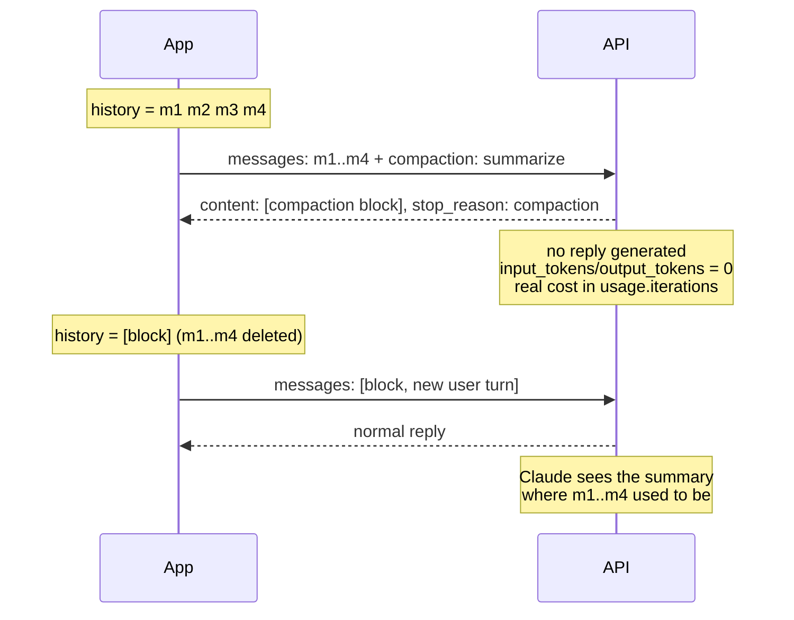

<LevelBadge level="advanced" />

<Callout type="objectives" items={[
  "コンテキストを縮める 4 種類の手法を区別する — コンテキスト編集、オンデマンドのコンパクション、keep-tail、バックグラウンド、しきい値 — そして正しいものを選ぶ",
  "コンパクションのリクエストを送り、返信の代わりに返ってくる署名付きコンパクションブロックを読む",
  "差し替えを正しく行う: ブロックを先頭に、要約済みメッセージは削除、以降のすべてのリクエストにベータヘッダー",
  "HTTP 200 を返しながら会話を静かに壊す 2 つの差し替えミスを見抜く",
  "要約が返ってこないケースに対処する — 5 つの停止理由と、それぞれ異なる対処法",
  "コンパクションの実際のコストを数える（トップレベルのトークンフィールドではなく usage.iterations）",
  "要約が決して引き継げないものを知る: 画像、ドキュメント、アップロード、取得した URL、そしてそれ以前のシステム指示"
]} />

<VerifyNote lastVerified="2026-10-02" source="https://platform.claude.com/docs/en/build-with-claude/compaction-on-demand">
オンデマンドのコンパクションは `compact-2026-09-04` ヘッダーの背後にある **パブリックベータ** で、2026 年 9 月 14 日に公開されました。しきい値コンパクションは別のベータ（`compact-2026-01-12`）です。ベータヘッダー、フィールド名、エラーコード、プラットフォームの提供状況は公式リファレンスから引用したもので、機能がベータの間は変わり得ます — 本番投入前に再確認してください。執筆時点での提供状況: Claude API、AWS 上の Claude Platform、Google Cloud、Microsoft Foundry（すべてベータ）。**Amazon Bedrock では利用できません**。モデルのサポートは固定リストではなくモデルごとのケイパビリティです — [実行時にサポートを確認する](#実行時にサポートを確認する) と [モデルと価格](/docs/whats-new/models-and-pricing) を参照してください。
</VerifyNote>

長時間動くエージェントはいずれ同じ壁にぶつかります: 会話が膨らみ、次のリクエストが収まらなくなるのです。正直な選択肢は 2 つ — 古いコンテキストを捨てるか、*圧縮* するか。コンパクションは圧縮側の選択肢で、モデルがサーバー側で行います: パラメータを 1 つ追加して会話を送ると、返信の代わりに **署名付きの要約ブロック** が返り、それを置き換えた元のメッセージの代わりに送り返します。

面白いのは署名の部分です。このブロックはあなたが書いて差し込んだ文字列ではなく、API が生成し、API が検証するコンテンツです。要約テキストを 1 文字でも書き換えれば、次のリクエストは `compaction_signature_invalid` で失敗します。

## どの縮小ツールがどれなのか

ここでは 4 つの機能が重なり合っていて、チームは絶えず混同します。それぞれ役割が違います:

| 機能 | 誰が決めるか | 何をするか | ブロックが置かれる場所 |
| --- | --- | --- | --- |
| **コンテキスト編集** (`clear_tool_uses_20250919`) | あなたが宣言的に | 古いツール結果を **そのまま削除** — 要約なし | ブロックなし。[メモリとコンテキスト編集](/docs/api/memory-and-context-editing) を参照 |
| **オンデマンドのコンパクション** (`compaction`) | あなたがリクエストごとに | 送ったメッセージを、返信を返さない別の呼び出しで要約する | ブロックを **先頭** に置き、置き換えた分を削除する |
| **keep-tail コンパクション** | あなたが切れ目を選んで | オンデマンドと同じだが、直近の数ターンは一字一句そのまま残る | ブロックを先頭、残したターンはその後ろ |
| **バックグラウンドのコンパクション** | あなたが非同期で | オンデマンドと同じだが、要約が書かれている間も会話は進み続ける | ブロックは送ったメッセージをちょうどそのまま置き換える。以降のターンは残る |
| **しきい値コンパクション** (`compact_20260112`) | API が、トークンのトリガーで | *通常のリクエストの途中で* 古いコンテキストを要約する | ブロックは要約されたメッセージの **後ろ** に続き、API が代わりにそれらを落とす |

コードを書く前に覚えておく価値のあるルールが 2 つあります:

- **コンテキスト編集は削除し、コンパクションは要約する。** 非常に長い実行では両方を重ねられます — ただし `compaction` と同じリクエストでは不可（[制限](#制限と相互作用) を参照）。
- **オンデマンドとしきい値のコンパクションは、ブロックを逆方向に渡し返す。** オンデマンド: ブロックが先頭に来て、古いメッセージはあなたが削除する。しきい値: ブロックが最後に来て、API が削除する。これを逆にするのが最もよくあるエラーです。

## 差し替えの仕組み



コンパクションのリクエストは **会話の経路の外** にあります: 履歴を運び、要約を返し、アシスタントのターンを一切生成しません。会話を続けるのは、その次の本来のリクエストです。

## 実行時にサポートを確認する

コンパクションのモデルサポートはケイパビリティフラグであり、ハードコードするものではありません。ベータヘッダーを付けて Models API を呼び、各モデルの `capabilities.compaction` を読んでください。コピーしたリストでは不可能な形で、モデルの登場や廃止に耐えられます。

## 最初のコンパクションリクエストを撃つ

<Steps items={[
  {title: "ベータヘッダーを追加する", body: "コンパクションのリクエストに、そして返ってきたブロックを運ぶ以降のすべてのリクエストに anthropic-beta: compact-2026-09-04 を送ります。以降のリクエストで忘れると、compaction は想定されるコンテンツブロックの型ではないという紛らわしいバリデーションエラーが返ります — メッセージはヘッダーについて一切触れません。"},
  {title: "会話を現状のまま、プラス compaction パラメータを送る", body: "トップレベル: type を 「summarize」 にした compaction。API はリクエスト内のすべてのメッセージをちょうど一度だけ要約し、ブロックだけを返します。"},
  {title: "会話の残りで使うのと同じシステムプロンプトとツールを送る", body: "要約器はそれらを読みます。ツールを実行することは決してありません。thinking が保持されるモデルでは、ブロックの後に残したターンの thinking は system と tools が一致する場合にのみ有効なままです。"},
  {title: "max_tokens に本当の余裕を与える", body: "max_tokens は要約呼び出し全体に上限をかけ、モデルが要約を書く前に行う thinking も含みます。数千トークンが妥当な桁で — Anthropic 自身のサンプルでは 4096 です。"},
  {title: "ウィンドウを使い切る前にコンパクションする", body: "コンパクションのリクエスト自体がモデルのコンテキストウィンドウに収まらなければなりません。すでに送るには大きすぎる会話は、コンパクションするにも大きすぎます。"},
  {title: "ブロックを探す前に stop_reason を確認する", body: "成功したコンパクションは stop_reason 「compaction」 で終わります。それ以外の停止理由は要約が生成されなかったことを意味します — それでもレスポンスは中身が空の 200 です。"}
]} />

<PromptCard title="curl — ここまでの会話の要約を求める">{`curl https://api.anthropic.com/v1/messages \\
  -H "x-api-key: $ANTHROPIC_API_KEY" \\
  -H "anthropic-version: 2023-06-01" \\
  -H "anthropic-beta: compact-2026-09-04" \\
  -H "content-type: application/json" \\
  -d '{
    "model": "claude-opus-5-5",
    "max_tokens": 4096,
    "messages": [
      {"role": "user", "content": "I am building a recipe app. Name the main entities."},
      {"role": "assistant", "content": "Recipe, Ingredient, Step, and a RecipeIngredient entry holding quantity and unit."},
      {"role": "user", "content": "Good. Now suggest field names for Recipe."}
    ],
    "compaction": {"type": "summarize"}
  }'`}</PromptCard>

返ってくるのは 1 つのコンテンツブロックと、特徴的な停止理由です:

```json
{
  "content": [
    {
      "type": "compaction",
      "content": "Summary of the conversation: the user is designing the data model for a recipe app...",
      "signature": "EuYBCkQY..."
    }
  ],
  "stop_reason": "compaction",
  "usage": {
    "input_tokens": 0,
    "output_tokens": 0,
    "iterations": [{"type": "compaction", "input_tokens": 144, "output_tokens": 276}]
  }
}
```

ゼロに注目してください。トップレベルのトークンフィールドがゼロなのは *返信が生成されなかったから* です — 実際のコストは `usage.iterations` にあります。コストのダッシュボードがトップレベルのフィールドだけを合計しているなら、コンパクションは無料に見え、請求書はそれに同意しません。

ストリーミングも動きますが、ストリームするものはありません: 完全なブロックを運ぶ `content_block_start` が 1 つ来て、それから `content_block_stop` が来るだけで、その間にデルタイベントはありません（前後に `ping` イベントが届くことはあります）。

## 要約から続ける

送ったメッセージを、返ってきたアシスタントメッセージで置き換えます。ブロックは API が返したまま **バイト単位で同一** に保ちます — `content`、`signature`、それ以外は何も足さない。

<PromptCard title="次のリクエスト — ブロックが先頭、古いメッセージは消えている">{`{
  "model": "claude-opus-5-5",
  "max_tokens": 2048,
  "messages": [
    {
      "role": "assistant",
      "content": [
        {
          "type": "compaction",
          "content": "Summary of the conversation: the user is designing the data model...",
          "signature": "EuYBCkQY..."
        }
      ]
    },
    {"role": "user", "content": "Now do the same for Ingredient."}
  ]
}`}</PromptCard>

差し替えを支配するルールは 3 つです:

1. **ブロックは `messages` の先頭に来る** — それ自体を 1 つの `assistant` メッセージとするか、最初のメッセージ（`user` でも `assistant` でもどちらでも可）の最初のコンテンツブロックとするか。
2. **要約されたメッセージは削除する。** そのいずれかがブロックの *前に* 残っていると、`compaction_block_misplaced` 付きの 400 が返ります。
3. **リクエストごとに `compaction` ブロックはちょうど 1 つ**、以降のすべてのリクエストで、ベータヘッダー付きで。

ここでは `assistant` メッセージが 2 つ連続しても問題ありません — 要約が書かれている間に返信が届いたなら、それは単にブロックの後ろに続きます。

### エラーを出さない 2 つのミス

<Callout type="warning" items={[
  "要約済みメッセージをブロックの後ろに残す: エラーなし。API はそれらを喜んで Claude にもう一度送るので、要約の代金と、それが置き換えるはずだった履歴の代金の両方を払うことになります。",
  "以降のリクエストでブロックを省く: エラーなし。Claude はただ要約を受け取らず、会話は差し替え前のすべてを静かに失います。",
  "どちらの失敗も HTTP 200 を返します。レスポンスのどこにも間違いだとは書かれていません — テストではステータスコードではなく、履歴の形に対してアサートしてください。"
]} />

### もう一度コンパクションする

すでにブロックで始まっている会話をコンパクションするには、`compaction` をもう一度送ります。新しいブロックは古い要約 *と* その後のすべてを要約します。それ以降は、最新のブロックだけを送ってください。

## ループの中でコンパクションする

*いつ* 行うかの判断はあなたのものです。「次のリクエストはどれくらい大きくなるか」の安価な見積もりは、直前のレスポンスの `input_tokens + output_tokens` です — 次のリクエストはその返信を再送するので、それも数に入ります。[プロンプトキャッシュ](/docs/api/prompt-caching) を有効にしている場合、`input_tokens` は最後のキャッシュブレークポイント以降のトークンだけを含むので、`cache_read_input_tokens` と `cache_creation_input_tokens` も足してください。あるいは同じメッセージをトークンカウントのエンドポイントに送ります。

<PromptCard title="Python — 次のリクエストが大きくなりすぎるときにコンパクションする">{`from anthropic.types.beta import BetaMessageParam

client = anthropic.Anthropic()
COMPACT_AT_TOKENS = 120_000   # set this near your real input budget
SYSTEM = "You help design a recipe app's data model. Keep answers short."
QUESTIONS = [...]             # your stream of user turns

history: list[BetaMessageParam] = []
for turn, question in enumerate(QUESTIONS, start=1):
    history.append({"role": "user", "content": question})
    response = client.beta.messages.create(
        model="claude-opus-5-5",
        max_tokens=8192,
        system=SYSTEM,
        betas=["compact-2026-09-04"],
        messages=history,
    )
    history.append({"role": "assistant", "content": response.content})

    # The next request resends this reply too, so count it.
    conversation_tokens = response.usage.input_tokens + response.usage.output_tokens
    if conversation_tokens > COMPACT_AT_TOKENS and turn < len(QUESTIONS):
        summary = client.beta.messages.create(
            model="claude-opus-5-5",
            max_tokens=4096,
            system=SYSTEM,                      # same system prompt and tools
            betas=["compact-2026-09-04"],
            messages=history,
            compaction={"type": "summarize"},
        )
        if summary.stop_reason == "compaction":  # check BEFORE reading content
            history = [{"role": "assistant", "content": summary.content}]`}</PromptCard>

差し替えの形に注目してください: 履歴は追記されるのではなく **置き換えられます**。そして `stop_reason` のチェックが先に来ます — 要約が返ってこなかったとき、このループは履歴をすべて保ったまま次のターンの後に再試行します。それがまさに正しいフォールバックです。

Python では `client.beta.messages` を使ってください。`client.messages` を呼んでブロックを自分でシリアライズするなら、`to_dict()` か `model_dump(exclude_none=True)` を使ってください — 素の `model_dump()` はブロックに `citations: null` と `text: null` を足し、API は返していないフィールドを拒否します。

SDK のツールランナーがこれを代わりにやってくれます: `compact_before_next_turn()`（TypeScript、Java、PHP では `compactBeforeNextTurn()`、C# と Go では `CompactBeforeNextTurn()`）を呼べば、現在のターンとそのツール呼び出しが終わった時点でコンパクションのリクエストを送ります。ランナーは `compact-2026-09-04` ベータを付けて作成してください — ランナーが自分で追加することはありません。

## 直近の数ターンを一字一句残す

これには **パラメータがなく**、それが人を驚かせます。keep-tail コンパクションは、リクエストに何を入れるかという判断です: 切れ目を選び、古いメッセージだけを要約のために送り、返ってきたブロックを残したターンの前に置きます。

<Steps items={[
  {title: "切れ目を選ぶ", body: "それより前のメッセージはコンパクションのリクエストに入れ、そこから後のメッセージは完全な長さで残します。残すほど、空く余裕は少なくなります。"},
  {title: "ツール呼び出しとその結果を決して分断しない", body: "各ツール呼び出しとその結果は同じ側に来なければなりません。送るメッセージが、まだ結果のないツール呼び出しを含むアシスタントのターンで終わっている場合、API はコンパクションのリクエストを拒否します。"},
  {title: "返信と次のユーザーメッセージの間で切る", body: "その境界は、残したターンで保持された thinking を有効に保つ条件も満たします。すでに行ったリクエストの末尾で切るのも有効です: ちょうどそのリクエストのメッセージをコンパクションし、それ以降すべてを残します。"},
  {title: "履歴をブロック + 残したターンとして再構成する", body: "上の差し替えルールはすべてそのまま当てはまります — ブロックが先頭、要約済みメッセージは消去、すべてのリクエストにベータヘッダー。"}
]} />

## バックグラウンドでコンパクションする

バックグラウンド（または非同期）のコンパクションは、ループの中で 2 つのことを変えます: コンパクションのリクエストは、会話が **完全な** 履歴の上で進み続ける間に走り、差し替えはブロックの到着を待ちます。

<Steps items={[
  {title: "送ったメッセージ数を記録する", body: "履歴のコピーに対してコンパクションのリクエストを送り、その件数を覚えておきます — それがまさにブロックが置き換えるものです。"},
  {title: "完全な履歴の上で話し続ける", body: "新しいターンを追記し、履歴にすでにあるものは何も編集せず、1 つが保留中の間に 2 つ目のコンパクションのリクエストを始めないこと。"},
  {title: "到着したら、先頭から置き換える", body: "レスポンスが stop_reason 「compaction」 で返ってきたら、先頭からちょうどその N 件のメッセージを落とし、返ってきたメッセージをその場所に置きます。それ以降に追記したものはすべてその後ろに残ります。"},
  {title: "差し替えた履歴をその次のリクエストで必ず送る", body: "そうすることで、要約が書かれている間に生成された thinking が有効なままになります。"},
  {title: "止める前に保留中のリクエストを捌き切る", body: "ループが終わるときにコンパクションのリクエストがまだ飛んでいるなら、それを待って差し替えを行ってください — そうしないと、すでに支払った要約が失われます。"}
]} />

そのリクエストが走っている間は同時に 2 つのリクエストが開いていて、コンパクションのリクエストも他と同じようにレートリミットにカウントされます。だから、その間に届くターンの分の余裕がウィンドウにまだあるうちに始めてください。

## しきい値コンパクション: API に決めさせる

しきい値コンパクションは自動方式です。通常のリクエストで `context_management` の編集として一度設定しておけば、入力トークンがあなたのトリガーを越えたときに、API がリクエストの途中で古いコンテキストを要約します。

| フィールド | 意味 |
| --- | --- |
| `type` | `"compact_20260112"` |
| `trigger` | `{"type": "input_tokens", "value": N}` — `input_tokens` が唯一のトリガー型。`value` は少なくとも 50,000（デフォルト 150,000） |
| `pause_after_compaction` | デフォルトは `false` — 応答を続ける代わりに要約生成後に一時停止させたい場合に設定 |
| `instructions` | 任意のカスタム要約プロンプト。指定すると既定のプロンプトを完全に置き換える |

ブロックを渡し返すのは簡単な部分で、オンデマンドの逆です: レスポンスのコンテンツ全体をブロックごと追記すれば、API が以降のリクエストでその *前* のブロックを落とします。ベータヘッダーは `compact-2026-01-12` です。

「もう二度と考えない」挙動が欲しいときはしきい値コンパクションを選んでください。トークン数ではなく *意味的な* 境界 — サブタスクの終わり、計画が合意された後、新しいファイルを開く前 — でコンパクションを起こしたいときはオンデマンドを選んでください。そしてリクエストごとに 1 つだけ選ぶこと: `compaction` と `context_management` は一緒に送れず、しきい値コンパクションは署名付きのオンデマンドブロックを運ぶリクエストでは動かず、ツールランナーはその `context_management` にコンパクションの編集が入っている間はコンパクションを拒否します。

## 自分の要約プロンプトを書く

`instructions` がなければ、API は自前の要約プロンプトを使います。空でない `instructions` 文字列（最大 16,384 文字）は **そのプロンプトを完全に置き換えます** — 追記されるのではありません。

<PromptCard title="instructions — 何が残らなければならないかを言い、ツール呼び出しを禁じる">{`{
  "compaction": {
    "type": "summarize",
    "instructions": "Summarize this design conversation. Preserve every entity and field name agreed so far, every decision marked FINAL, and the user's latest open request. Do not call tools; respond with the summary text only."
  }
}`}</PromptCard>

カスタムの `instructions` すべてに置く価値があるものは 2 つです: 保持されなければならないものの明示的なリストと、「ツールを呼ぶな」。ツールを呼ぶ要約器は要約をまったく生成しません（次のセクションを参照）。

## 要約が返ってこないとき

要約が生成されるのは、要約呼び出しがテキストを伴い、ツール呼び出しなしで正常に終わったときだけです。そうでなければ **`content` が空の 200** が返ります — だから `stop_reason` が分岐の対象なのです。呼び出しはどちらにしても課金され、`usage.iterations` に報告されます（呼び出しが一切行えなかった場合は使用量ゼロ）。いずれの場合も、要約なしで続行して後からコンパクションできます。

| `stop_reason` | 原因 | 対処 |
| --- | --- | --- |
| `"max_tokens"` | 要約が途中で切れた | より大きな `max_tokens` で再送する |
| `"model_context_window_exceeded"` | 要約プロンプトの余地がなかった | より短い `instructions` か、より少ないメッセージで再送する |
| `"tool_use"` | モデルが要約せずにツールを呼んだ | ツール呼び出しを禁じる `instructions` を付けて再送する |
| `"refusal"` | リクエストが拒否された — `stop_details` がポリシーのカテゴリを示す | 要約なしで続行する |
| `"end_turn"` | 呼び出しがテキストを返さなかった | 要約なしで続行する |

## エラー

ほとんどの 400 は、何を取り除くか再送するかを伝えるメッセージを含みます。一部は `compaction_` で始まる `error.details.error_code` も含みます。

| エラー | 原因 | 対処 |
| --- | --- | --- |
| 529 `overloaded_error` + `compaction_unavailable` | ブロックの生成または読み取りにおける一時的なサーバー問題 | リトライする |
| 400 `compaction_block_misplaced` | 要約済みメッセージがブロックの前に残っている | ブロックが先頭に来るように取り除く |
| 400 `compaction_signature_invalid` / `compaction_content_mismatch` | ブロックの `signature` または `content` が返却後に変更された | ブロックを返ってきたとおりそのまま送る |
| 400 `compaction_nothing_to_summarize` | `messages` に `user` も `assistant` のコンテンツもない | 少なくとも 1 件のメッセージを送る |
| 400（メッセージのみ） | リクエスト内に `compaction` ブロックが 2 つ以上ある | ちょうど 1 つ — 最新のもの — を送る |
| 400（メッセージのみ） | 最後の `assistant` ターンが結果のないツール呼び出しで終わっている | そのターンのツール結果を送ってから、コンパクションする |
| 400（メッセージのみ） | コンパクションのリクエストに `stop_sequences`、構造化出力の `output_config.format`、または型が `any`/`tool` の `tool_choice` を送った | 取り除く — 要約呼び出しでは何の効果もない |
| 400 余分なフィールドを指すバリデーションエラー、例: `compaction.citations: Extra inputs are not permitted` | API が返していないフィールドを付けてブロックを再シリアライズした | `to_dict()` / `model_dump(exclude_none=True)` でシリアライズする |
| 400 「`compaction` requires `anthropic-beta: compact-2026-09-04`」 | コンパクションのリクエストにベータヘッダーがない | ヘッダーを追加する |
| 400 `compaction` は想定されるコンテンツブロックの型ではないというバリデーションエラー | ブロックを運ぶ *以降の* リクエストにベータヘッダーがない — メッセージはヘッダーについて触れない | ブロックを運ぶすべてのリクエストにヘッダーを追加する |

## 制限と相互作用

- **リクエストごとに縮小の仕組みは 1 つ。** `compaction` と `context_management` は組み合わせられません。
- **タスク予算。** `output_config.task_budget.remaining` を `compaction` と一緒に、またはブロックを運ぶリクエストで送らないでください — 400 が返ります。[タスク予算](/docs/api/task-budgets) を参照。
- **プロンプトキャッシュ。** ブロックへの `cache_control` は要約の直後にブレークポイントを置きます — 要約はいまや安定した接頭辞なので、通常はまさに置きたい場所です。以降のリクエストでブロックを送り返すこと自体にコンパクションのコストはかかりません。
- **トークンカウント** は `compaction` パラメータを完全に無視します。
- **それ以前のシステムメッセージは溶けて消える。** 要約範囲の中にある会話中途の `role: "system"` メッセージは他と同じように要約されるので、ブロックがそれを置き換えた時点でその指示は効かなくなります。まだ重要な指示があるなら、次の新しい `user` ターンの直後に新しい `role: "system"` メッセージで言い直し、それ以降は履歴に保ち続けてください。
- **要約をまったく生き延びられないコンテンツもある。** 要約されたメッセージの中にある画像、ドキュメント、`container_upload` ブロック、取得した URL は **消えます** — 要約はテキストです。後のターンでまだ必要なものは言い直すか再アップロードしてください。

<Callout type="tip" items={["コンパクションの境界を、後から推論できるチェックポイントとして扱ってください: ブロックの要約テキストを、それが置き換えたメッセージ数と一緒にログに残します。後になってエージェントが何かを忘れたように振る舞ったとき、そのログを一目見れば、その事実が要約で消えたのか、そもそも捕まえられていなかったのかが分かります。","コンパクションはコンテキストウィンドウのツールであって、コストのツールではありません。以降のターンごとに再送するトークンは減りますが、要約呼び出し自体は課金されます — 短い会話では、節約より簡単に多く使ってしまえます。","クライアント側のトリミングも併用するなら、どの層がどのコンテンツを所有するかを決めてください: 古くなったツール結果にはコンテキスト編集、物語にはコンパクション。2 つの仕組みが同じメッセージを取り合うと、要約がモデルにもう見えないものを記述する羽目になります。"]} />

## よくあるミス

- **`stop_reason` を確認する前に `content[0]` を読む。** 5 つの異なる停止理由が、空の `content` と 200 を返します。コンパクションのコードにおける `IndexError` の第 1 位の原因です。
- **トップレベルのトークンフィールドを合計する。** コンパクションのレスポンスではゼロです。コストは `usage.iterations` にあります。
- **ブロックを再シリアライズする。** API が返していないフィールドを足せば（`citations: null` が定番）拒否されます。
- **コンパクションが遅すぎる。** コンパクションのリクエスト自体がコンテキストウィンドウに収まらなければなりません。「リクエストが失敗したらコンパクションする」は戦略ではありません。
- **ツール呼び出しとその結果を分断する末尾を残す。** 即座に拒否されます — 切れ目はユーザーメッセージの境界で選んでください。
- **画像が生き残ると思い込む。** 生き残りません。アップロードも取得したページも同じです。

## 理解度チェック

<Quiz questions={[
  {
    q: "コンパクションのリクエストが HTTP 200 を返したのに、response.content が空のリストです。何が起きたのでしょう？",
    options: [
      "会話が短すぎて要約できなかった — することはない",
      "要約は生成されなかった。stop_reason が 5 つの原因のどれだったかを教えてくれ、要約なしで続行できる",
      "ベータヘッダーが欠けていた",
      "署名の検証に失敗した"
    ],
    answer: 1,
    explain: "要約が生成されるのは、要約呼び出しがテキストを伴い、ツール呼び出しなしで正常に終わったときだけです。そうでなければレスポンスはそれでも中身が空の 200 で、stop_reason は max_tokens、model_context_window_exceeded、tool_use、refusal、end_turn のいずれかになります。content を読む前に、必ず stop_reason で分岐してください。"
  },
  {
    q: "オンデマンドのコンパクションの後、ブロックは messages のどこに置き、要約されたメッセージはどうなりますか？",
    options: [
      "最後に置き、要約されたメッセージは API が代わりに落としてくれる",
      "先頭に置き、要約されたメッセージは自分で取り除かなければならない",
      "ブロックがちょうど 1 つであれば、どこでもよい",
      "先頭に置き、監査可能性のために要約されたメッセージは残しておくべき"
    ],
    answer: 1,
    explain: "オンデマンドのコンパクション: ブロックが先頭に来て、置き換えた分はあなたが削除します — 要約済みメッセージをその前に残せば 400 compaction_block_misplaced が返り、後ろに残せば静かに Claude へ再送されます。逆向きに動くのはしきい値コンパクションのほうです: そのブロックは要約されたメッセージの後ろに続き、API が代わりにそれらを落とします。"
  },
  {
    q: "会話にはエージェントが何度も参照しているスクリーンショットが含まれていました。あなたはコンパクションします。コードは何をしなければなりませんか？",
    options: [
      "何も — 要約が画像を十分よく説明している",
      "何も — 画像ブロックはコンパクションを越えて保持される",
      "画像を再アップロードするか言い直す。画像、ドキュメント、container_upload ブロック、取得した URL は要約を生き延びないため",
      "画像の内容を保持するよう instructions を設定する"
    ],
    answer: 2,
    explain: "コンパクションブロックはテキストと署名です。要約されたメッセージの中にある画像、ドキュメント、container_upload ブロック、取得した URL は、ブロックがそれらを置き換えた時点で消えます — 後のターンでまだ必要なものは言い直すか再アップロードしてください。どんな instructions 文字列もそれを変えません。"
  }
]} />

## 用語

<Flashcards title="コンパクション用語集" cards={[
  {front: "compaction ブロック", back: "API が返信の代わりに返すコンテンツブロック。重要なフィールドは 2 つ: content（要約テキスト、人が読める）と signature（以降のすべてのリクエストで検証される）。バイト単位で同一のまま送り返すこと。"},
  {front: "stop_reason: compaction", back: "要約が生成されたことを意味する唯一の停止理由。content を読む前に確認すること — 他の 5 つの停止理由は中身が空の 200 を返します。"},
  {front: "compact-2026-09-04", back: "オンデマンドのコンパクション用のベータヘッダー。コンパクションのリクエストに、そしてブロックを運ぶ以降のすべてのリクエストに必須。"},
  {front: "compact_20260112", back: "しきい値コンパクション用の context_management 編集型（ヘッダーは compact-2026-01-12）。input_tokens でトリガーし、最小 50,000、デフォルト 150,000。"},
  {front: "usage.iterations", back: "コンパクション呼び出しの実際のコストが 「compaction」 エントリとして報告される場所。返信が生成されないため、トップレベルの input_tokens と output_tokens はゼロです。"},
  {front: "compaction_block_misplaced", back: "400 エラー: 要約済みメッセージがまだブロックの前にある。ブロックは messages の先頭に来なければなりません。"},
  {front: "keep-tail コンパクション", back: "パラメータはなし — 切れ目を選び、古いメッセージだけを要約のために送り、残したターンの前にブロックを置きます。ツール呼び出しとその結果を決して分断しないこと。"},
  {front: "バックグラウンドのコンパクション", back: "会話が完全な履歴の上で進み続ける間、スナップショットに対してコンパクションのリクエストを走らせ、その後、送ったメッセージをちょうどそのまま置き換え、それ以降に追記したものはすべて保ちます。"}
]} />

## 要点

<Callout type="takeaways" items={[
  "コンパクションは要約呼び出し 1 回と引き換えに履歴を短くする — API は送ったメッセージを要約し、その代わりに使う署名付きブロックを 1 つ返す",
  "オンデマンド: ブロックが先頭、置き換えた分はあなたが削除。しきい値: ブロックが最後、API が削除。これを混同するのが最もよくあるバグ",
  "HTTP ステータスではなく stop_reason で分岐する — 失敗した要約は中身が空の 200 で、差し替えの 2 つのミスも同じ",
  "コストは usage.iterations にあり、トップレベルのトークンフィールドはゼロ。コンパクションが節約するのは再送トークンで、必ずしもお金ではない",
  "ウィンドウが満杯になる前にコンパクションする — コンパクションのリクエストも収まらなければならない",
  "画像、ドキュメント、アップロード、取得した URL、それ以前のシステム指示は要約を生き延びない。まだ重要なものは言い直すこと",
  "リクエストごとに仕組みは 1 つ: compaction と context_management は組み合わせられず、署名付きブロックはしきい値コンパクションを阻む"
]} />

## 次へ

- [メモリとコンテキスト編集](/docs/api/memory-and-context-editing) — 削除ベースの兄弟機能と、コンパクションとの重ね方
- [タスク予算](/docs/api/task-budgets) — エージェントループ全体に、コンパクションを越えてまで及ぶ助言的なトークン上限
- [プロンプトキャッシュ](/docs/api/prompt-caching) — コンパクションブロックがなぜ異例に優れたキャッシュブレークポイントになるのか
- [コンテキストエンジニアリング](/docs/frontiers/context-engineering) — コンパクション、ノートテイキング、ジャストインタイム検索を一つの規律として
