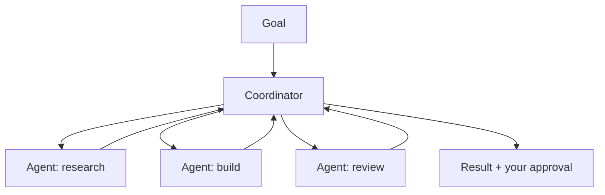

<LevelBadge level="advanced" />

<VerifyNote lastVerified="2026-06-20" source="https://docs.anthropic.com">
Cowork とエージェントチームは動きの速い 2026 年の領域です — 名称、提供状況、機能は頻繁に変わります。最新の詳細は公式の Anthropic ドキュメント/告知で確認してください。
</VerifyNote>

単一のエージェントを超えて、Anthropic はエージェントに持続的で協調的な作業を行わせるための**製品レベル**の領域を提供してきました: **Cowork**（エージェント型のデスクトップワークスペース）と**エージェントチーム**（複数のエージェントが協調する仕組み）です。このページは概観のマップです — これらは急速に進化するため、具体的な内容は公式ドキュメントで確認してください。

## Claude Cowork

これは、**エージェントがあなたと並んで実際の複数ステップの作業を行うワークスペース**と考えてください — 単一のチャットターンよりも長いスパンで、あなたが監督しながら、ファイルやツールを操作します。API でエージェントを構築するものの、消費者/プロ向けの従兄弟のような存在です。ループは用意されており、あなたは目標を指示します。

## エージェントチーム

1 つのエージェントでは足りない場合、**複数のエージェントが協調します** — 目標を分担し、それぞれが役割とツールを持ち、結果に向けて連携します。概念的には Claude Code の[サブエージェント](/docs/claude-code/subagents)を反映していますが、単一の委任サブタスクではなく、持続的なマルチエージェント協調のための製品領域です。

## サイトの他の部分との関係

- 自分でプログラム的に構築する → [エージェントの構築](/docs/api/building-agents) + [Agent SDK](/docs/claude-code/headless-and-agent-sdk)。
- コーディングセッション内での委任 → [サブエージェント](/docs/claude-code/subagents)。
- ホスト型のループ/状態/スケジューリング → [マネージドエージェント](/docs/api/managed-agents)。

## 変わらないもの: 監督

:::warning 自律性が高まるほど、注意も必要
マルチエージェントで長スパンの作業は、価値*も*リスク*も*増幅します。重大なアクションには人間を関与させ、ツールアクセスを厳格にスコープし、出力を検証してください — [責任ある利用](/docs/security/responsible-use)と[エージェントのセキュリティ](/docs/security/securing-agents)を参照。
:::

## 次へ

- [サブエージェント & 並列エージェント](/docs/claude-code/subagents)
- [マネージドエージェント](/docs/api/managed-agents)
- [責任ある利用、倫理 & 検証](/docs/security/responsible-use)
