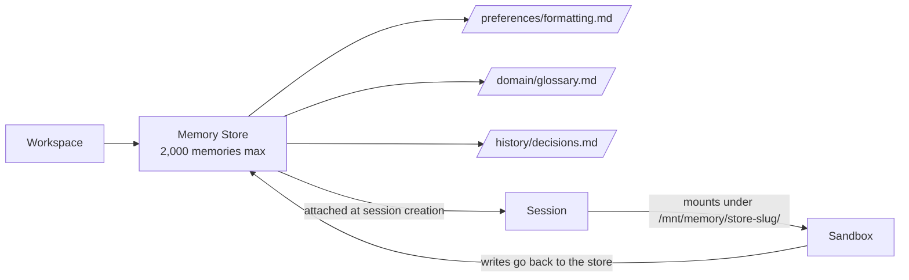

<LevelBadge level="advanced" />

<Callout type="objectives" items={["Memory Store とは何か — そして古いクライアントサイドの memory tool とどう違うか", "ストアがセッションサンドボックスの /mnt/memory/ にどうマウントされ、エージェントがそれをどう使うか", "人がよくつまずくベータヘッダのルール(agent-memory-2026-07-22 vs managed-agents-2026-04-01)", "完全なライフサイクル:作成 → シード → アタッチ → 読み書き → バージョン監査 → リダクト", "具体的な制限:セッションあたり8ストア、ストアあたり2,000メモリ、メモリあたり100 kB"]} />

<VerifyNote lastVerified="2026-07-30" source="https://platform.claude.com/docs/en/managed-agents/memory">
Memory Stores は 2026年7月22日時点で **パブリックベータ** です。エンドポイント、ヘッダ文字列、制限はベータ期間中に変わります — 出荷前に公式リファレンスで確認してください。
</VerifyNote>

[Managed Agents](/docs/api/managed-agents) で構築したことがあれば、各セッションがデフォルトで新鮮なコンテキストから始まることを知っているでしょう。セッションが終わると、エージェントが学んだものは一緒に消えます。**Memory Stores** はファーストパーティの解決策です:セッション間で永続する、サーバーサイドでバージョン管理されたテキストドキュメントのコレクションで、エージェントのサンドボックスに、ファイルツールで読み書きできる普通のディレクトリとしてマウントされます。

## Memory Stores vs クライアントサイドの memory tool

現在、Claude プラットフォームには **2つの異なる「メモリ」プリミティブ** があります。混同しないでください。

| | **Memory Stores**(このページ) | **クライアントサイド memory tool**([別ページ](/docs/api/memory-and-context-editing)) |
|---|---|---|
| **メモリの保管場所** | Anthropic ホスト、ワークスペーススコープ | 自身のストレージ(Redis、Postgres、ファイル…) |
| **ループを実行するのは誰** | Managed Agents | あなた(Messages API + tool ループ) |
| **ベータヘッダ** | `agent-memory-2026-07-22` | `context-management-2025-06-27`(memory tool) |
| **エージェントの読み方** | `/mnt/memory/` にファイルとしてマウント | ツール呼び出し(`view`、`str_replace`、`create`…) |
| **監査証跡** | 不変バージョン、redact エンドポイント | 自分で構築するもの |

同じ *アイデア*(永続状態);異なる *プリミティブ*。以下すべては **Memory Stores** の話です — Managed Agents 専用のサーバーサイドのもの。

## メンタルモデル

ストアは小さな Markdown/テキストファイル(メモリ)のフォルダで、ワークスペースにスコープされます。セッションにアタッチすると、サンドボックス内にマウントとして現れ、Claude は標準の[エージェントツールセット](https://platform.claude.com/docs/en/managed-agents/tools) で読み書きします — ファイルシステムの他の部分に使うのと同じツールです。

2つの重要な系:

- 各マウントに関する **注記**(名前、マウントパス、アクセスモード、説明、およびセッションごとの `instructions`)が自動的にシステムプロンプトに挿入されます。エージェントは伝えなくてもマウントが存在することを知っています。
- マウントパスの **外**(`/mnt/memory/` の他の場所)への書き込みは、コンテナローカルのスクラッチに落ち、セッション終了時に失われます。マウントパスへの書き込みだけが永続します。

## ベータヘッダのルール(落とし穴)

ここで人は20分を失います。

<Callout type="warning" items={["メモリストアのエンドポイントは anthropic-beta: agent-memory-2026-07-22 を使う — それだけ。", "セッションエンドポイント(メモリストアをセッションにアタッチすることを含む)は依然として managed-agents-2026-04-01 を使う。", "メモリストアリクエストに両方送ると HTTP 400 が返る。コードがベータヘッダを明示的に設定するなら、追加ではなく置換すること。"]} />

公式SDKを使えばヘッダは自動的に正しく設定されます。生のHTTPなら、呼び出し部を分けてください:

| 呼び出し | ヘッダ |
|---|---|
| `POST /v1/memory_stores`(作成) | `agent-memory-2026-07-22` |
| `POST /v1/memory_stores/{id}/memories`(メモリの作成/リスト/更新/削除) | `agent-memory-2026-07-22` |
| `POST /v1/memory_stores/{id}/memory_versions/…/redact` | `agent-memory-2026-07-22` |
| `POST /v1/sessions` — `resources[]` にストアをアタッチ | `managed-agents-2026-04-01` |

## ライフサイクル

<Steps items={[{title: "1. ストアを作成", body: "POST /v1/memory_stores で name と description を指定。description はエージェントに渡されるので、ブリーフのように書くこと:「ユーザーごとの好みとプロジェクトコンテキスト」。"}, {title: "2. シード(オプション)", body: "memories.create で /formatting_standards.md のようなパスに参照資料を事前ロード。すべてのセッションが見るべき共有の読み取り専用知識に最適。"}, {title: "3. セッション作成時にアタッチ", body: "POST /v1/sessions で resources[] エントリに type: memory_store、memory_store_id、access、オプションで instructions を含める。ストアはセッション作成時にのみアタッチできる — セッション途中で追加または削除は不可。"}, {title: "4. エージェントに読み書きさせる", body: "ストアは /mnt/memory/[store-slug]/ にマウントされる(正確な mount_path はレスポンスから読む)。エージェントの通常のファイルツールが残りを行い、その呼び出しはストリーム内で agent.tool_use/agent.tool_result イベントとして表示される。"}, {title: "5. 監査とリダクト", body: "書き込みごとに不変なメモリバージョンが作成される。memory_versions で履歴を検査し、前のコンテンツを書き戻してロールバックし、redact エンドポイントで機密コンテンツを履歴から消す。"}]} />

## ストアと最初のメモリを作成

ストアの name と description はエージェントが見るもの — フォルダのREADMEのように書いてください。

<PromptCard title="ストア作成(curl、生HTTP)">{`curl -s https://api.anthropic.com/v1/memory_stores \\
  -H "x-api-key: $ANTHROPIC_API_KEY" \\
  -H "anthropic-version: 2023-06-01" \\
  -H "anthropic-beta: agent-memory-2026-07-22" \\
  -H "content-type: application/json" \\
  -d '{"name": "User Preferences", "description": "Per-user preferences and project context."}'
# -> {"id": "memstore_01Hx...", ...}`}</PromptCard>

<PromptCard title="メモリをシード">{`curl -s "https://api.anthropic.com/v1/memory_stores/$store_id/memories" \\
  -H "x-api-key: $ANTHROPIC_API_KEY" \\
  -H "anthropic-version: 2023-06-01" \\
  -H "anthropic-beta: agent-memory-2026-07-22" \\
  -H "content-type: application/json" \\
  -d '{"path": "/formatting_standards.md", "content": "All reports use GAAP formatting. Dates are ISO-8601."}'`}</PromptCard>

## ストアをセッションにアタッチ

ヘッダが `managed-agents-2026-04-01` に戻ることに注意 — セッションエンドポイント(アタッチを含む)は Managed Agents ヘッダを使います。

<PromptCard title="セッション作成時にアタッチ(read_write)">{`curl -s https://api.anthropic.com/v1/sessions \\
  -H "x-api-key: $ANTHROPIC_API_KEY" \\
  -H "anthropic-version: 2023-06-01" \\
  -H "anthropic-beta: managed-agents-2026-04-01" \\
  -H "content-type: application/json" \\
  -d '{
    "agent": "$AGENT_ID",
    "environment_id": "$ENVIRONMENT_ID",
    "resources": [{
      "type": "memory_store",
      "memory_store_id": "$STORE_ID",
      "access": "read_write",
      "instructions": "User preferences and project context. Check before starting any task."
    }]
  }'`}</PromptCard>

`instructions` フィールドは 4,096 文字が上限で、ストアの `name` と `description` と一緒にエージェントに表示されます。

## アクセスモードとインジェクションリスク

`access` はデフォルトで `read_write`。エージェントがセッションから *学ぶ* べきときはこれが正しい選択です。誰も(何も)変更してほしくないストアには **間違った** 選択です。

<Callout type="warning" items={["read_write ストアは、セッションのプロンプトインジェクションリスクの下流にある。エージェントが信頼できない入力(ユーザープロンプト、フェッチしたページ、サードパーティのツール出力)を処理する場合、成功したインジェクションはストアに悪意あるコンテンツを書き込める。後のセッションはそれを信頼できるメモリとして読む。", "経験則:共有参照資料(標準、用語集、ドメインドキュメント)は read_only でアタッチ。増える必要のあるユーザーごとまたはセッションごとの状態だけ read_write でアタッチ。", "必要なら両方アタッチ:1つの read_only 参照ストア + 1つの read_write スクラッチストア。セッションあたり最大8。"]} />

## 具体的な制限

すべて公式ドキュメントから、すべて覚える価値あり:

| 制限 | 値 |
|---|---|
| セッションあたりメモリストア | **8** |
| ストアあたりメモリ | **2,000** |
| メモリあたりバイト | **100 kB**(約25kトークン) |
| `instructions` 長(アタッチごと) | **4,096 文字** |
| バージョン保持 | **30日**(最近のバージョンは常に保持) |

ストアが2,000メモリに達すると、以降の書き込み — 直接API呼び出し *と* エージェント自身のファイル書き込み — が失敗し始めます。ドキュメント推奨の解決策は「1つの巨大ストア」ではなく、**多くの小さくフォーカスされたストア**(ユーザーごとに1つ、共有参照に1つ、プロジェクトごとに1つ)を使い、`memories.delete` で古いエントリを剪定するか、[dreaming セッション](https://platform.claude.com/docs/en/managed-agents/dreams) を実行して統合することです。

## 監査証跡、バージョン、ロールバック

メモリへの書き込みごとに不変な **メモリバージョン**(`memver_...`)が作成されます。バージョンはメモリではなくストアに属するので、メモリ自体が削除された後も残ります — 監査証跡は完全なまま。

便利なパターン:

- **時点検査:** `GET /v1/memory_stores/{id}/memory_versions?memory_id=…` で誰が何を変えたかを新しい順に確認。
- **ロールバック:** 専用の restore エンドポイントはない。欲しいバージョンを取得し、その `content` を `memories.update` で書き戻す(親メモリが消えていれば `memories.create`)。
- **安全な並行編集:** `memories.update` に `content_sha256` プレコンディションを渡す。head ハッシュがもう一致しなければ更新は拒否され、再読して再試行 — 古典的な楽観的並行性。

## コンプライアンス:バージョンをリダクト

PII、秘密、またはユーザー削除リクエストのためにコンテンツを *履歴から消す* 必要があるとき、redact を使ってください。コンテンツをスクラブしつつ監査証跡(いつ誰が何をしたか)を保持します。

<Callout type="tip" items={["ライブメモリの現在の head はリダクトできない。まず新しいバージョンを書く(またはメモリを削除する)、次に古いバージョンをリダクト。", "バージョンは親メモリより長生きなので、メモリ削除は自動的に履歴を消さない — 依然としてバージョンごとにリダクトする。", "バージョン保持は最低30日。コンプライアンスのためにより長い保持が必要なら、期限切れになる前にAPI経由でバージョンをエクスポート。"]} />

## よくある間違い

<Callout type="tip" items={["メモリストア呼び出しに両方のベータヘッダを送る — HTTP 400 が返る。追加ではなく置換。", "実行中セッションにストアを追加または削除しようとする — サポートされていない。アタッチはセッション作成時のみ、以上。", "共有参照ストアを read_write でアタッチ — 1回のインジェクションで、あなたの標準が将来のすべてのセッションで破損する。", "多くのフォーカスされたストアではなく1つの巨大ストア — 2,000上限に達し、以降の書き込みがロックアウトされる。", "永続を期待して /mnt/memory/scratch/ に書き込む — マウントパス外はすべてコンテナローカルで、セッション終了時に蒸発する。"]} />

## 自分でチェック

<Quiz title="自分でチェック" questions={[{q: "anthropic-beta: agent-memory-2026-07-22 と anthropic-beta: managed-agents-2026-04-01 の両方でメモリストア作成リクエストを送りました。何が起きますか?", options: ["両方のヘッダが受け入れられる", "リクエストは HTTP 400 を返す — メモリストアエンドポイントは agent-memory-2026-07-22 単独を使う必要がある", "新しいヘッダが静かに勝つ", "SDK は生HTTPでも古いヘッダを自動的に取り除く"], answer: 1, explain: "ドキュメントは明示的:メモリストアエンドポイントで2つを組み合わせない — 両方送ると 400 が返る。セッションエンドポイント(アタッチを含む)は依然として managed-agents-2026-04-01 を使う。"}, {q: "セッションサンドボックス内でメモリストアはどこに現れますか?", options: ["/etc/memory/[store-id]", "/mnt/memory/[store-slug]/、store-slug は表示名をサニタイズしたもの", "/tmp/memory-[store-id]", "現れない — エージェントは読むためにAPI呼び出しをする必要がある"], answer: 1, explain: "ストアはストア名のスラッグで /mnt/memory/ の下にマウントされる。構築するのではなく、セッションのメモリストアリソースから正確な mount_path を常に読むこと。"}, {q: "エージェントが外部ユーザーからのメールを処理します。共有の「標準と用語集」ストアに最も安全なアクセスモードは?", options: ["read_write、エージェントが用語集を時間とともに改善できるように", "read_only、そうしないとプロンプトインジェクションが共有参照資料を汚染しうるから", "厳格なシステムプロンプト付きの read_write", "関係ない — アクセスモードは助言的"], answer: 1, explain: "アクセスはファイルシステムレベルで強制される。read_only ストアは成功したプロンプトインジェクション下でも書き込みを拒否し、共有参照を将来のセッションのために汚染から守る。"}, {q: "漏洩した秘密を履歴から削除する必要があります。どの順序が機能しますか?", options: ["メモリを削除 — 履歴も一緒に削除される", "ライブメモリの現在の head バージョンを直接リダクト", "新しいバージョンを書く(またはメモリを削除する)、次に古いバージョンをリダクト", "ストアをアーカイブ"], answer: 2, explain: "ライブメモリの現在の head はリダクトできない。まず新しいバージョンを書く(またはメモリを削除する)、次に古いバージョンで redact を呼び出す — バージョンは親より長生き。"}, {q: "メモリあたりのサイズ上限とストアあたりのメモリ数は?", options: ["メモリあたり 10 kB、ストアあたり 200 メモリ", "メモリあたり 100 kB、ストアあたり 2,000 メモリ", "メモリあたり 1 MB、ストアあたり 500 メモリ", "ベータ中は明示的な制限なし"], answer: 1, explain: "メモリあたり 100 kB(約25kトークン)、ストアあたり 2,000 メモリ。ドキュメントは少数の大きなファイルではなく、多くの小さなフォーカスされたファイルを推奨。"}]} />

<Callout type="takeaways" items={["Memory Stores は Managed Agents 用のサーバーサイド永続メモリプリミティブ — クライアントサイドの memory tool とは異なる。", "ヘッダのルール:メモリストアエンドポイントには agent-memory-2026-07-22、セッションエンドポイントには managed-agents-2026-04-01。決して両方ではない。", "ストアはセッション作成時にアタッチし、/mnt/memory/[store-slug]/ にマウントされる;セッション途中の追加/削除はサポートされない。", "共有参照にはデフォルトで read_only;ユーザーごとまたはセッションごとの成長だけ read_write にする。", "書き込みごとに不変バージョンが作成される;ロールバックは「取得 + 書き戻し」;redact はコンプライアンスのために履歴をスクラブする。"]} />

## 次へ

- [Managed Agents](/docs/api/managed-agents) — 親コンセプト:エージェント、セッション、環境、vault、デプロイメント
- [APIでエージェントを構築する](/docs/api/building-agents) — 自分でループを回すなら
- [Memory Tool と Context Editing(クライアントサイド)](/docs/api/memory-and-context-editing) — *もう一つ* のメモリプリミティブ
- [プロンプトインジェクション](/docs/security/prompt-injection) — 共有ストアで `read_only` が重要な理由
- [エージェントメモリアーキテクチャ](/docs/frontiers/agent-memory-architectures) — 永続メモリシステムの背後にある設計パターン
