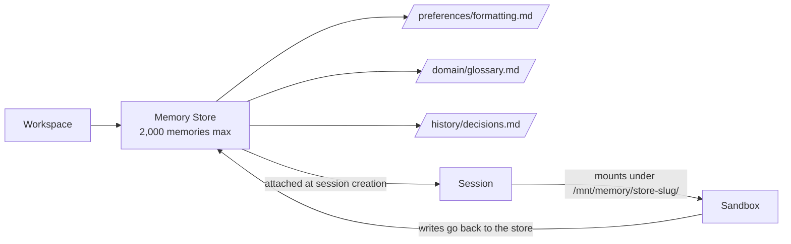

<LevelBadge level="advanced" />

<Callout type="objectives" items={["メモリストアとは何か — そして古いクライアントサイドの memory ツールとどう違うのか", "ストアがセッションサンドボックス内の /mnt/memory/ にどのようにマウントされ、エージェントがそれをどう使うのか", "多くの人がつまずくベータヘッダーのルール（agent-memory-2026-07-22 と managed-agents-2026-04-01）", "ライフサイクル全体：作成 → 初期投入 → アタッチ → 読み書き → バージョン監査 → 秘匿化", "具体的な上限：セッションあたり8ストア、ストアあたり2,000メモリ、メモリあたり100 kB"]} />

<VerifyNote lastVerified="2026-07-30" source="https://platform.claude.com/docs/en/managed-agents/memory">
メモリストアは2026年7月22日時点で**パブリックベータ**です。エンドポイント、ヘッダー文字列、上限はベータ期間中に変更されます — 本番投入前に公式リファレンスで確認してください。
</VerifyNote>

[Managed Agents](/docs/api/managed-agents) で開発したことがあるなら、各セッションがデフォルトで真新しいコンテキストから始まることをご存じでしょう。セッションが終了すると、エージェントが学んだことは失われます。**メモリストア**はこの問題に対するファーストパーティの解決策です — サーバーサイドで、バージョニングされたテキストドキュメントのコレクションで、セッションを越えて永続化し、エージェントのサンドボックスに通常のディレクトリとしてマウントされ、ファイルツールで読み書きできます。

## メモリストア vs クライアントサイドの memory ツール

Claude プラットフォームには現在**2つの異なる「メモリ」プリミティブ**が存在します。混同しないでください。

| | **メモリストア**（このページ） | **クライアントサイドの memory ツール**（[別ページ](/docs/api/memory-and-context-editing)） |
|---|---|---|
| **メモリの保管場所** | Anthropic ホスト、ワークスペーススコープ | 独自のストレージ（Redis、Postgres、ファイル…） |
| **ループを回す主体** | Managed Agents | あなた（Messages API + ツールループ） |
| **ベータヘッダー** | `agent-memory-2026-07-22` | `context-management-2025-06-27`（memory ツール） |
| **エージェントの読み取り方法** | `/mnt/memory/` にファイルとしてマウント | ツール呼び出し（`view`、`str_replace`、`create` …） |
| **監査証跡** | イミュータブルなバージョン、redact エンドポイント | 自分で構築するもの |

同じ *アイデア*（永続状態）ですが、*プリミティブ*は異なります。以下はすべて**メモリストア** — Managed Agents 専用のサーバーサイド版 — に関する内容です。

## メンタルモデル

ストアは小さな Markdown / テキストファイル（メモリ）のフォルダで、ワークスペースにスコープされます。セッションにアタッチすると、サンドボックス内にマウントとして現れ、Claude は標準の [エージェントツールセット](https://platform.claude.com/docs/en/managed-agents/tools) — ファイルシステムの他の部分に使うのと同じツール — で読み書きします。

2つの重要な帰結があります：

- 各マウントに関する**メモ**（名前、マウントパス、アクセスモード、説明、およびセッション固有の `instructions`）が自動的にシステムプロンプトに挿入されます。あなたが伝えなくてもエージェントはマウントの存在を知っています。
- マウントパスの**外**への書き込み — `/mnt/memory/` 配下のそれ以外の場所 — はコンテナローカルのスクラッチに書き込まれ、セッション終了時に失われます。マウントパスへの書き込みだけが永続化します。

## ベータヘッダーのルール（落とし穴）

ここで人は20分を失います。

<Callout type="warning" items={["メモリストアのエンドポイントは anthropic-beta: agent-memory-2026-07-22 のみを使う — それ以外は不可。", "セッションのエンドポイント（セッションにメモリストアをアタッチする場合を含む）は依然として managed-agents-2026-04-01 を使う。", "メモリストアのリクエストで両方を送ると HTTP 400 が返る。ベータヘッダーを明示的に設定するコードの場合、追加するのではなく置き換えること。"]} />

公式 SDK を使えば正しいヘッダーが自動設定されます。生の HTTP を使う場合は、呼び出し箇所を分けてください：

| 呼び出し | ヘッダー |
|---|---|
| `POST /v1/memory_stores`（作成） | `agent-memory-2026-07-22` |
| `POST /v1/memory_stores/{id}/memories`（メモリの作成 / 一覧 / 更新 / 削除） | `agent-memory-2026-07-22` |
| `POST /v1/memory_stores/{id}/memory_versions/…/redact` | `agent-memory-2026-07-22` |
| `POST /v1/sessions` — `resources[]` にストアをアタッチ | `managed-agents-2026-04-01` |

## ライフサイクル

<Steps items={[{title: "1. ストアを作成する", body: "POST /v1/memory_stores に name と description を渡します。description はエージェントに渡されるので、ブリーフのように書くべきです：「ユーザーごとの設定とプロジェクトコンテキスト」。"}, {title: "2. 初期投入する（任意）", body: "memories.create で /formatting_standards.md のようなパスに参照資料を事前ロードします。すべてのセッションが見るべき共有の読み取り専用知識に最適です。"}, {title: "3. セッション作成時にアタッチする", body: "POST /v1/sessions に type: memory_store、memory_store_id、access、および任意の instructions を含む resources[] エントリを付けます。ストアはセッション作成時にのみアタッチでき、セッション途中で追加や削除はできません。"}, {title: "4. エージェントに読み書きさせる", body: "ストアは /mnt/memory/[store-slug]/ にマウントされます（正確な mount_path はレスポンスから読み取ってください）。エージェントの通常のファイルツールが残りをこなし、その呼び出しはストリームに agent.tool_use / agent.tool_result イベントとして現れます。"}, {title: "5. 監査と秘匿化", body: "書き込みのたびにイミュータブルな memory version が作成されます。memory_versions で履歴を確認し、以前の content を書き戻してロールバックしたり、redact エンドポイントで機密内容を履歴から消去したりできます。"}]} />

## ストアと最初のメモリを作成する

ストアの name と description はエージェントが見るものです — フォルダの README を書くように書きましょう。

<PromptCard title="ストアを作成する（curl、生の HTTP）">{`curl -s https://api.anthropic.com/v1/memory_stores \\
  -H "x-api-key: $ANTHROPIC_API_KEY" \\
  -H "anthropic-version: 2023-06-01" \\
  -H "anthropic-beta: agent-memory-2026-07-22" \\
  -H "content-type: application/json" \\
  -d '{"name": "User Preferences", "description": "Per-user preferences and project context."}'
# -> {"id": "memstore_01Hx...", ...}`}</PromptCard>

<PromptCard title="メモリを初期投入する">{`curl -s "https://api.anthropic.com/v1/memory_stores/$store_id/memories" \\
  -H "x-api-key: $ANTHROPIC_API_KEY" \\
  -H "anthropic-version: 2023-06-01" \\
  -H "anthropic-beta: agent-memory-2026-07-22" \\
  -H "content-type: application/json" \\
  -d '{"path": "/formatting_standards.md", "content": "All reports use GAAP formatting. Dates are ISO-8601."}'`}</PromptCard>

## ストアをセッションにアタッチする

ヘッダーが `managed-agents-2026-04-01` に戻ることに注意してください — セッションのエンドポイント（アタッチを含む）は Managed Agents のヘッダーを使います。

<PromptCard title="セッション作成時にアタッチする（read_write）">{`curl -s https://api.anthropic.com/v1/sessions \\
  -H "x-api-key: $ANTHROPIC_API_KEY" \\
  -H "anthropic-version: 2023-06-01" \\
  -H "anthropic-beta: managed-agents-2026-04-01" \\
  -H "content-type: application/json" \\
  -d '{
    "agent": "$AGENT_ID",
    "environment_id": "$ENVIRONMENT_ID",
    "resources": [{
      "type": "memory_store",
      "memory_store_id": "$STORE_ID",
      "access": "read_write",
      "instructions": "User preferences and project context. Check before starting any task."
    }]
  }'`}</PromptCard>

`instructions` フィールドは4,096文字が上限で、ストアの `name` および `description` と並んでエージェントに提示されます。

## アクセスモードとインジェクションのリスク

`access` のデフォルトは `read_write` です。これはエージェントにセッションから *学ばせたい* 場合の正しい選択です。誰にも（何にも）変更されたくないストアには**間違った**選択です。

<Callout type="warning" items={["read_write ストアはセッション内のプロンプトインジェクションリスクの下流にあります。エージェントが信頼できない入力（ユーザープロンプト、取得したページ、サードパーティのツール出力）を処理する場合、インジェクションが成功するとストアに悪意のあるコンテンツが書き込まれる可能性があります。その後のセッションはそれを信頼されたメモリとして読み取ります。", "経験則：共有の参照資料（規格、用語集、ドメイン文書）は read_only でアタッチする。増えていく必要があるユーザー単位・セッション単位の状態だけを read_write でアタッチする。", "必要ならば両方アタッチする：1つの read_only 参照ストア＋1つの read_write スクラッチストア。セッションあたり最大8つ。"]} />

## 具体的な上限

すべて公式ドキュメントより、すべて覚えておく価値があります：

| 上限 | 値 |
|---|---|
| セッションあたりのメモリストア数 | **8** |
| ストアあたりのメモリ数 | **2,000** |
| メモリあたりのバイト数 | **100 kB**（〜25kトークン） |
| `instructions` の長さ（アタッチごと） | **4,096文字** |
| バージョン保持期間 | **30日**（直近のバージョンは常に保持） |

ストアが2,000メモリに達すると、それ以降の書き込み — 直接の API 呼び出し *および* エージェント自身のファイル書き込み — は失敗し始めます。ドキュメントの推奨する解決策は「1つの巨大なストア」ではなく、**多数の小さな焦点を絞ったストアを使う**（ユーザーごとに1つ、共有参照用に1つ、プロジェクトごとに1つ）、`memories.delete` で古いエントリを刈り込む、または [dreaming セッション](https://platform.claude.com/docs/en/managed-agents/dreams) を実行して統合するというものです。

## 監査証跡、バージョン、ロールバック

メモリへの書き込みごとにイミュータブルな **memory version**（`memver_...`）が作成されます。バージョンはメモリではなくストアに属するため、メモリ自体が削除されても残ります — 監査証跡は完全に維持されます。

便利なパターン：

- **時点調査：** `GET /v1/memory_stores/{id}/memory_versions?memory_id=…` で、誰が何をいつ変更したかを新しい順に確認。
- **ロールバック：** 専用の復元エンドポイントはありません。欲しいバージョンを取得し、その `content` を `memories.update`（親メモリが失われていれば `memories.create`）で書き戻します。
- **安全な同時編集：** `memories.update` に `content_sha256` 前提条件を渡します。head ハッシュがもう一致しなければ更新は拒否され、再読み込みしてから再試行します — 古典的な楽観的並行性制御です。

## コンプライアンス：バージョンを秘匿化する

PII、シークレット、またはユーザー削除リクエストで内容を *履歴から消し去る* 必要があるときは、redact を使います。監査証跡（誰が何をいつしたか）は保持したまま内容を消去します。

<Callout type="tip" items={["生きているメモリの現在の head は秘匿化できません。まず新しいバージョンを書き込む（またはメモリを削除する）、それから古いバージョンを秘匿化します。", "バージョンは親メモリより長生きするため、メモリを削除しても履歴は自動的に消えません — バージョンごとに秘匿化する必要があります。", "バージョン保持期間は最低30日です。コンプライアンス上より長い保持が必要なら、期限切れになる前に API 経由でバージョンをエクスポートしてください。"]} />

## よくある間違い

<Callout type="tip" items={["メモリストアの呼び出しで両方のベータヘッダーを送る — HTTP 400 が返ります。追加ではなく置き換えを。", "実行中のセッションからストアを追加・削除しようとする — サポートされていません。アタッチはセッション作成時、それだけです。", "共有の参照ストアを read_write でアタッチする — 1回のインジェクションで、以後すべてのセッションで規格が汚染されます。", "多数の焦点を絞ったストアではなく1つの巨大なストアにする — 2,000の上限に達し、それ以上の書き込みができなくなります。", "/mnt/memory/scratch/ に書いて永続すると期待する — マウントパスの外はすべてコンテナローカルで、セッション終了時に消えます。"]} />

## 自分でチェック

<Quiz title="Check yourself" questions={[{q: "メモリストアの作成リクエストに anthropic-beta: agent-memory-2026-07-22 と anthropic-beta: managed-agents-2026-04-01 の両方を付けて送信します。何が起こりますか？", options: ["両方のヘッダーが受け入れられる", "リクエストは HTTP 400 を返す — メモリストアのエンドポイントは agent-memory-2026-07-22 のみを使う必要がある", "新しいヘッダーが黙って優先される", "SDK は生の HTTP でも古いヘッダーを自動的に取り除く"], answer: 1, explain: "ドキュメントは明示的です：メモリストアのエンドポイントで両方を組み合わせないでください — 両方送ると 400 が返ります。セッションのエンドポイント（アタッチを含む）は依然として managed-agents-2026-04-01 を使います。"}, {q: "メモリストアはセッションサンドボックス内のどこに現れますか？", options: ["/etc/memory/[store-id]", "/mnt/memory/[store-slug]/ で、store-slug はサニタイズされた表示名", "/tmp/memory-[store-id]", "現れない — エージェントは読み取るために API を呼ぶ必要がある"], answer: 1, explain: "ストアは /mnt/memory/ 配下にストア名のスラッグでマウントされます。組み立てずに、セッションの memory-store リソースから正確な mount_path を常に読み取ってください。"}, {q: "あなたのエージェントは外部ユーザーからのメールを処理します。共有の「規格 & 用語集」ストアに最も安全なアクセスモードはどれですか？", options: ["read_write — エージェントが時間とともに用語集を改善できるように", "read_only — さもなくばプロンプトインジェクションが共有の参照資料を汚染する可能性があるから", "厳格なシステムプロンプト付きの read_write", "問題ではない — アクセスモードは助言的なもの"], answer: 1, explain: "アクセスはファイルシステムレベルで強制されます。read_only ストアはインジェクションが成功しても書き込みを拒否し、共有の参照が今後のセッションで汚染されるのを防ぎます。"}, {q: "漏洩したシークレットを履歴から削除する必要があります。どの手順が有効ですか？", options: ["メモリを削除する — 履歴も一緒に削除される", "現在の head バージョンを直接秘匿化する", "新しいバージョンを書き込む（またはメモリを削除する）、それから古いバージョンを秘匿化する", "ストアをアーカイブする"], answer: 2, explain: "生きているメモリの現在の head は秘匿化できません。まず新しいバージョンを書き込む（またはメモリを削除する）、それから古いバージョンで redact を呼ぶ — バージョンは親より長生きします。"}, {q: "メモリあたりのサイズ上限とストアあたりのメモリ数はいくつですか？", options: ["メモリあたり10 kB、ストアあたり200メモリ", "メモリあたり100 kB、ストアあたり2,000メモリ", "メモリあたり1 MB、ストアあたり500メモリ", "ベータ期間中は明示的な上限はない"], answer: 1, explain: "メモリあたり100 kB（〜25kトークン）、ストアあたり2,000メモリ。ドキュメントは数個の大きなファイルではなく、多数の小さな焦点を絞ったファイルを推奨しています。"}]} />

<Callout type="takeaways" items={["メモリストアは Managed Agents 向けのサーバーサイドの永続メモリプリミティブ — クライアントサイドの memory ツールとは別物。", "ヘッダーのルール：メモリストアのエンドポイントには agent-memory-2026-07-22、セッションのエンドポイントには managed-agents-2026-04-01。両方は絶対にダメ。", "ストアはセッション作成時にアタッチされ、/mnt/memory/[store-slug]/ にマウントされる。途中での追加・削除はサポートされない。", "共有参照にはデフォルトで read_only を使う。ユーザー単位・セッション単位で増えていくものだけを read_write にする。", "書き込みのたびにイミュータブルなバージョンが作成される。ロールバックは「取得して書き戻す」。redact はコンプライアンスのために履歴を消去する。"]} />

## 次へ

- [Managed Agents](/docs/api/managed-agents) — 親概念：エージェント、セッション、環境、Vault、デプロイメント
- [Managed Agents Session Budgets](/docs/api/managed-agents-session-budgets) — 2026年8月の兄弟ベータ：セッション支出のハード USD 上限
- [Building Agents on the API](/docs/api/building-agents) — 独自のループを回すなら
- [Memory Tool & Context Editing (client-side)](/docs/api/memory-and-context-editing) — *もう1つ* のメモリプリミティブ
- [Prompt Injection](/docs/security/prompt-injection) — なぜ共有ストアで `read_only` が重要なのか
- [Agent Memory Architectures](/docs/frontiers/agent-memory-architectures) — 永続メモリシステムの背後にある設計パターン
