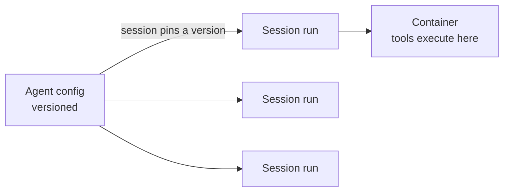

<LevelBadge level="advanced" />

<VerifyNote lastVerified="2026-06-26" source="https://platform.claude.com/docs/en/docs/agents-and-tools">
マネージドエージェントの機能と提供状況は変化します。この API はベータ版です。これを土台に構築する前に、公式ドキュメントでエンドポイント、フィールド名、アクセス可否を確認してください。
</VerifyNote>

<Callout type="objectives" items={["マネージド (Anthropic ホスト型) のエージェントループが何を肩代わりしてくれるのかを理解する", "2つのコアオブジェクトを区別する: バージョン管理された Agent と、実行ごとの Session", "Vault でシークレットを安全に注入する — モデルにそれを一切見せることなく", "Scheduled Deployments でエージェントを cron スケジュールに乗せる — ホストすべきスケジューラは不要", "マネージドがカスタムループに勝るのはどんなときか、そして依然として適用されるガードレールを知る"]} />

[独自のエージェントループを構築する](/docs/api/building-agents)ことが、自分で所有したいインフラ以上のものになってしまう場合、**マネージド** (Anthropic ホスト型) のエージェントがループを代わりに実行してくれます。これにより、セッションの配線、リトライ、状態管理、スケジューリングではなく、エージェントの*仕事*そのものに集中できます。

## 2つのオブジェクト: Agent と Session

これが、他のすべてが結びつくメンタルモデルです。両者は意図的に分離されています。

- **Agent** は*永続化された、バージョン管理された構成*です — モデル、システムプロンプト、ツール、MCP サーバー、スキル。一度作成すれば済みます。更新するたびに、新しいイミュータブルなバージョンが作成されます。
- **Session** は*ランタイムインスタンス*です — ID を介してエージェントを指す1回の実行です。構成はエージェント側に存在し、セッション側には決して存在しません。

<Callout type="tip">
Session は、作成時に使われたエージェントのバージョンに**ピン留め**されます: 実行中のセッションは自分のバージョンを保持し、新しいセッションは最新を取得します。これが、進行中の作業を壊すことなく構成変更をリリースする方法です。
</Callout>

## 「マネージド」が得られるもの

ループを手作業で組み立ててホストする代わりに、ホスト型のビルディングブロックが手に入ります:

- **Sessions** — 実行ごとに作成して再開できる永続的な実行。SSE 上でイベントをストリーミングします。
- **Environments** — コンテナインフラ。`cloud` (Anthropic ホスト型) または `self_hosted` (ツールが自分の VPC 内で実行される) のいずれか。セッションごとに1つのコンテナがエージェントのワークスペースになります。
- **Memory stores** — セッションをまたぐ永続的な状態。バージョン管理と編集 (リダクション) を備え、データベースを自分で配線する必要はありません。
- **Vaults** — MCP 認証やその他のサービス向けのシークレット。
- **Scheduled deployments** — cron スケジュールで無人実行されるエージェント。

<PromptCard title="エージェント (バージョン管理された構成) を作成し、それに対してセッションを実行する">{`# 1. Create the agent once
POST /v1/agents        -> returns $AGENT_ID
# 2. Each execution is a session pinned to that agent
POST /v1/sessions      { "agent": "$AGENT_ID" }`}</PromptCard>

## Vault: モデルが決して見ないシークレット

自律エージェントはしばしば API キーを必要とします — しかし*モデル*はそれを決して読むべきではありません。Vault のクレデンシャル (`mcp_oauth`、`static_bearer`、`environment_variable`) は egress 時に置換されます: `environment_variable` クレデンシャルは実行時にサンドボックスへ注入され、モデルからは*決して見えません*。

<Callout type="warning">
これが、エージェントに強力なアクセス権を与えるための安全なパターンです。キーをシステムプロンプトやメッセージに貼り付けないでください — それらはモデル (そしてあなたのログ) が見られるコンテキストの一部になってしまいます。Vault に入れてください。
</Callout>

## Scheduled deployments: cron 上のエージェント

**deployment** は、エージェントに cron スケジュールを取り付けます。スケジュールが発火すると、新しいセッションを開始してタスクを完了します — あなたが構築・ホストすべきスケジューラはありません。夜間のデータ同期、週次のコンプライアンススキャン、日次のダイジェストに最適です。

<Steps items={[
  {title: "スケジュールを定義する", body: "POST /v1/deployments に agent、environment_id、initial_events (user.message を含む必要があります)、そして schedule を渡します: schedule は POSIX cron 式に IANA タイムゾーンを加えたものです。"},
  {title: "各発火 = 1回の実行", body: "トリガー試行のたびに run レコード (drun_ プレフィックス) が作成されます。成功時は session_id を、失敗時は error.type (例: environment_archived、session_rate_limited) を持ちます。GET /v1/deployment_runs?deployment_id=... で実行を一覧できます。"},
  {title: "ライフサイクルを制御する", body: "Pause は今後のトリガーを抑制します (手動実行は引き続き機能します)。unpause は次回の発生時に再開し、見逃したトリガーをバックフィルしません。archive は終端状態です。"},
  {title: "オンデマンドでトリガーする", body: "POST /v1/deployments/{id}/run は、たとえ一時停止中でも、即座にセッションを開始します — trigger_context.type: manual として。"}
]} />

<PromptCard title="毎週金曜のニューヨーク時間 20:00 に実行する週次コンプライアンススキャン">{`POST /v1/deployments
{
  "name": "Weekly compliance scan",
  "agent": "$AGENT_ID",
  "environment_id": "$ENVIRONMENT_ID",
  "initial_events": [
    {"type": "user.message", "content": [{"type": "text", "text": "Run the compliance scan and summarize findings."}]}
  ],
  "schedule": {"type": "cron", "expression": "0 20 * * 5", "timezone": "America/New_York"}
}`}</PromptCard>

<Callout type="tip">
cron は `minute hour day-of-month month day-of-week` で、分単位の粒度です。DST は壁時計のセマンティクスを使います: 春の繰り上げ (spring-forward) で存在しない時刻はスキップされ、秋の繰り下げ (fall-back) で2回発生する時刻は2回発火します。重要なものについては、これらの境界を避けるタイムゾーンと時刻を選んでください。
</Callout>

## マネージドとカスタムのどちらを選ぶか

| **マネージド** を選ぶのは… | **カスタムループ / SDK** を選ぶのは… |
|---|---|
| ホスティング、状態、スケジューリング、シークレットを任せたいとき | ループとツールを完全に制御する必要があるとき |
| 素早くプロトタイピングしているとき | 厳格なカスタムインフラ/コンプライアンス要件があるとき |
| 制御よりも運用のシンプルさが重要なとき | 自分のスタックに深く埋め込んでいるとき |

これはスペクトラムです — 単一呼び出し → ワークフロー → カスタムエージェント (SDK) → マネージド。タスクが許す限りシンプルに始め、必要になったときだけ上に移ってください。

## 同じガードレールが適用される

ホスト型であろうとなかろうと、自律エージェントは依然としてアクションを実行します。**最小権限**、**コスト/反復回数の制限**、そして**リスクのあるステップには人間の承認**を維持してください — [エージェントのセキュリティ確保](/docs/security/securing-agents)と[自律実行のハードニング](/docs/security/hardening-autonomous-runs)を参照してください。

<Callout type="takeaways" items={["マネージドエージェントは、ループ、セッション、環境、メモリ、Vault、スケジューリングを肩代わりしてくれるので、あなたは仕事そのものに集中できる", "Agent はバージョン管理された構成、Session はバージョンにピン留めされる1回の実行 — 構成はエージェント側に存在し、セッション側には存在しない", "Vault の environment_variable クレデンシャルは実行時に注入され、モデルからは決して見えない — エージェントにシークレットを与える安全な方法", "scheduled deployment は cron 式 + IANA タイムゾーンであり、各発火が1回の実行を作成し、unpause は見逃したトリガーをバックフィルしない", "マネージドは「単一呼び出し → ワークフロー → カスタム → マネージド」のホスト型の端に位置する。自律性のガードレールは依然として適用される"]} />

## 理解度チェック

<Quiz title="理解度チェック" questions={[
  {
    q: "Agent と Session の違いは何ですか?",
    options: [
      "両者は同じオブジェクトの2つの名前である",
      "Agent はバージョン管理された構成であり、Session はエージェントのバージョンにピン留めされる1回のランタイム実行である",
      "Session がモデルとシステムプロンプトを保持し、Agent は単なる ID である",
      "Agent がツールを実行し、Session がシークレットを保存する"
    ],
    answer: 1,
    explain: "Agent は永続化された、バージョン管理された構成 (モデル、プロンプト、ツール、MCP、スキル) です。Session は実行ごとのインスタンスであり、エージェントを参照し、作成時にそのバージョンへピン留めされます。"
  },
  {
    q: "マネージドエージェントに必要な API キーを、どのように与えるべきですか?",
    options: [
      "エージェントが読めるようにシステムプロンプトに入れる",
      "セッションの最初のユーザーメッセージで渡す",
      "Vault クレデンシャルとして保存する。実行時に注入され、モデルからは決して見えない",
      "ツール定義にハードコードする"
    ],
    answer: 2,
    explain: "Vault クレデンシャル (例: environment_variable タイプ) は egress 時に置換され、モデルからは決して見えません — プロンプトやメッセージ内のキーは、見えるコンテキストの一部になってしまいます。"
  },
  {
    q: "scheduled deployment が2日間一時停止され、その後 unpause されました。一時停止中に発火していたはずのトリガーはどうなりますか?",
    options: [
      "バックフィルされる — 見逃したすべての実行が unpause 時に実行される",
      "バックフィルされない。deployment は単に次回のスケジュール発生時に再開する",
      "deployment が自動的に archive される",
      "見逃したすべての実行がキューに入り、1分間隔で実行される"
    ],
    answer: 1,
    explain: "unpause は次回の発生時に再開し、見逃したトリガーをバックフィルしません。(一時停止中であっても、手動トリガーでいつでも実行を強制できます。)"
  }
]} />

## 次へ

- [API でエージェントを構築する](/docs/api/building-agents)
- [Cowork とエージェントチーム](/docs/api/cowork-and-agent-teams)
- [ヘッドレスモードと Agent SDK](/docs/claude-code/headless-and-agent-sdk)
- [エージェントのセキュリティ確保](/docs/security/securing-agents)
